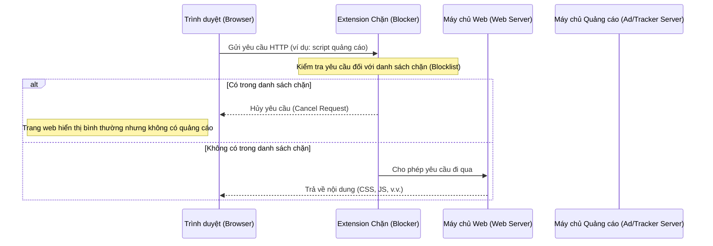

# Chương 1: Browser Extension là gì? (What Are Browser Extensions?)

Browser extension (Tiện ích mở rộng trình duyệt) là những "vật ký sinh" vừa kỳ lạ vừa mạnh mẽ. Chúng được gọi là vật ký sinh vì cư ngụ ở một góc bất thường trong thế giới phần mềm: chúng chạy trên các trang web nhưng hoàn toàn độc lập với bất kỳ trang web hoặc máy chủ nào. Browser extension mạnh mẽ vì chúng được cấp một mức độ chủ động (agency) cao: một số extension có thể xem và sửa đổi mọi thứ bạn thấy trên trình duyệt, một số có thể xem mọi yêu cầu HTTP mà trình duyệt gửi đi, và số khác có thể quản lý ví tiền điện tử của bạn. Browser extension cũng rất kỳ lạ vì chúng có khả năng đối đầu trực tiếp với chính các công ty hỗ trợ chúng: uBlock Origin, một trong những extension phổ biến nhất trên Google Chrome, tồn tại chỉ để ngăn chặn các quảng cáo – vốn là nguồn thu nhập chính của Google.

Dù kỳ lạ và mạnh mẽ đến đâu, browser extension chắc chắn là một công cụ hữu ích. Chúng mang lại cho người dùng cuối khả năng kiểm soát trải nghiệm lướt web mà không cách nào khác có thể làm được. Các extension phổ biến nhất có hàng chục triệu lượt cài đặt, và tính năng đến năm 2022, Cửa hàng trực tuyến Chrome (Chrome Web Store) đã có hơn 180.000 extension được xuất bản. Nhận thấy sự phổ biến và tiện ích to lớn này, vào năm 2021, W3C đã thành lập Nhóm Cộng đồng WebExtensions (WebExtensions Community Group) để "khám phá cách các nhà sản xuất trình duyệt và các bên liên quan khác có thể hợp tác để thúc đẩy một nền tảng browser extension chung."

Dù tương lai của browser extension ra sao, có vẻ như chúng sẽ không sớm biến mất.

## Lịch sử của Browser Extension

Giống như cách các nhà sinh học tiến hóa tìm hiểu về các thực thể sống hiện đại thông qua nghiên cứu hóa thạch, chúng ta có thể hiểu rõ hơn về browser extension bằng cách xem xét các tiền thân phần mềm của chúng.

### Tùy chỉnh phần mềm bằng Plugin (Customizing Software with Plugins)

Việc hỗ trợ các **plugin** (phần mềm thành phần thay đổi hành vi của một chương trình máy tính hiện có) lần đầu tiên được thực hiện vào những năm 1970 trên máy tính mainframe UNIVAC Series 90 (Hình 1-1). EDT, một trình soạn thảo văn bản chạy trên hệ điều hành Unisys VS/9 của máy tính mainframe, cho phép các chương trình khác "cắm vào" (plug in) và truy cập bộ nhớ đệm trong bộ nhớ (in-memory buffer) của nó, cũng như gửi các lệnh ngược lại để xử lý. Nhờ những khả năng này, các chương trình plugin có thể thay đổi luồng hoạt động của các chương trình khác hoặc gọi các lệnh soạn thảo văn bản bằng mã nguồn (programmatically) – những tác vụ trước đây thường được thực hiện thông qua nhập liệu trực tiếp của người dùng.

*Hình 1-1: Máy tính mainframe UNIVAC Series 90*

### Lịch sử của trình duyệt Web

Các nguyên tắc cơ bản trong hành vi của trình duyệt web là yếu tố chính góp phần vào sự bùng nổ của Internet. Không giống như mô hình phân phối phần mềm truyền thống là phân phối các tệp thực thi (executable) – các chương trình nhị phân khó kiểm tra hoặc thay đổi – phần mềm được phân phối qua giao thức HTTP là mã nguồn mở (open source). Bất kỳ ai nhận được một trang HTML đều có khả năng làm bất cứ điều gì họ muốn với nó: xem mã nguồn (view source), sửa đổi nội dung và kiểu dáng hiện có, hoặc sao chép và tái sử dụng cho nhu cầu của riêng họ. Những ý tưởng hay có thể lan truyền nhanh chóng vì việc đảo ngược kỹ thuật (reverse engineer) cách một trang web đạt được một tính năng là rất dễ dàng.

Việc phát hành JavaScript vào năm 1995 đã tiếp nối ý tưởng này. Vì JavaScript là một ngôn ngữ thông dịch (interpreted language), các tập lệnh (scripts) được gửi đến trình duyệt qua HTTP đều là mã nguồn mở. Hơn nữa, một phần hữu ích của JavaScript là Mô hình Đối tượng Tài liệu (Document Object Model - DOM), cho phép các tập lệnh sử dụng một API để kiểm tra và sửa đổi nội dung mà trình duyệt đang hiển thị cho người dùng bằng mã nguồn. Ngay cả sau nhiều thập kỷ, sự thật là mọi trang web trên thế giới đều có thể được kiểm tra và sửa đổi bằng JavaScript thông qua cùng một bộ API trình duyệt.

### Plugin trình duyệt gốc (Native Browser Plugins)

Cùng lúc JavaScript đang dần phát triển, các công ty phần mềm đã tung ra những cách thức mới để phần mềm có thể chạy trong trình duyệt. Phần mềm này dưới dạng "browser plugins", là các mô-đun mã đóng có khả năng chạy các chương trình nguyên bẩn (natively) trên máy tính chủ từ bên trong trình duyệt. Các ví dụ điển hình là Java applets, Adobe Flash, Microsoft Silverlight, ActiveX và Apple QuickTime. Vào thời điểm đó, JavaScript khá chậm và hạn chế về tính năng, vì vậy việc chuyển bớt tính toán sang hệ thống máy chủ cho phép trình duyệt tận dụng nhiều bộ nhớ hệ thống, lưu trữ ổn định và API đồ họa mà nếu không thì sẽ nằm ngoài tâm với. Vì các plugin này sống trong một ngữ cảnh thực thi hoàn toàn khác, chúng phần lớn được cách ly (sandboxed) khỏi trang web xung quanh.

Các plugin này được áp dụng do nhu cầu thực tế, nhưng chúng lại đầy rẫy vấn đề. Plugin rườm rà khi cài đặt và sử dụng, và vì chúng được cấp quyền truy cập ưu tiên vào hệ thống máy chủ, chúng đã gây ra nhiều lỗi trình duyệt và lỗ hổng bảo mật. Khi trình duyệt ngày càng mạnh mẽ hơn với HTML5, CSS3 và các đặc tả ECMAScript đầy đủ tính năng hơn, các plugin này dần mất đi mục đích, và hệ quả là các trình duyệt hiện đại đã loại bỏ hỗ trợ cho chúng gần như hoàn toàn.

### Từ Add-on trình duyệt đến Extension (From Browser Add-ons to Extensions)

Ngay từ năm 1999, Internet Explorer và Firefox đã hỗ trợ các "**add-on**" (tiện ích bổ sung) có khả năng tùy chỉnh trình duyệt, nhưng chúng sử dụng các tích hợp độc quyền và do đó bị giới hạn trong một trình duyệt duy nhất và phụ thuộc vào API add-on của nhà cung cấp đó. Phải cho đến tháng 9 năm 2009, các browser extension hiện đại đầu tiên mới xuất hiện trên Google Chrome. Không giống như add-on cho các trình duyệt khác, các Chrome extension này có thể được xây dựng bằng HTML, CSS và JavaScript. Chúng tương tác với trình duyệt bằng một API tiện ích JavaScript (JavaScript extension API), và các nhà phát triển có thể xuất bản extension của họ lên Chrome Web Store.

Đến tháng 6 năm 2012, Chrome đã vượt qua Internet Explorer để trở thành trình duyệt web phổ biến nhất, và Chrome Web Store đạt 750 triệu lượt cài đặt. Trong những năm tiếp theo, các trình duyệt đối thủ bắt đầu dần dần áp dụng các API và mô hình extension mà Google Chrome đã tiên phong.

## Toàn cảnh Browser Extension (The Browser Extension Landscape)

Sau nhiều năm thử sai, browser extension ngày nay đã trở thành một sản phẩm phần mềm trưởng thành. Chúng được các nhà phát triển và người tiêu dùng áp dụng rộng rãi, có các API và tài liệu được định nghĩa rõ ràng, và có thể dễ dàng tiếp cận người dùng cuối thông qua hệ thống cửa hàng ứng dụng mạnh mẽ. Trong phần này, chúng ta sẽ khám phá cách tư duy về browser extension, nơi người dùng cài đặt chúng và các danh mục browser extension khác nhau.

### So sánh Ứng dụng di động và Browser Extension

Ở nhiều khía cạnh, browser extension hiện đại giống như các ứng dụng di động (mobile apps). Cả hai đều khai báo rõ ràng các quyền (permissions) cần thiết từ hệ thống máy chủ, bị hạn chế bởi các mô hình bảo mật được định nghĩa chặt chẽ và sử dụng một tập hợp các API rộng lớn để tương tác với máy chủ đó. Cả hai đều được đóng gói thành các phiên bản phát hành và triển khai thông qua cửa hàng ứng dụng dành riêng cho nhà cung cấp. Cả bản phát hành ứng dụng di động và browser extension đều trải qua quá trình đánh giá (review), các bản cập nhật được tự động tải xuống và cài đặt thông qua hệ thống máy chủ.

Trong khi ứng dụng di động thường tồn tại dưới dạng giao diện người dùng độc lập, các extension thường được xây dựng để chạy trên một hoặc nhiều trang web với một giao diện người dùng bổ trợ. Khác với ứng dụng di động, browser extension không nhất thiết phải có giao diện người dùng; nhiều extension phổ biến không gì khác hơn là một đoạn mã JavaScript chạy ngầm (background) để thực thi một trình xử lý khi có sự kiện nào đó xảy ra.

### Cửa hàng Browser Extension (Browser Extension Stores)

Tất cả các trình duyệt chính đều cung cấp một cửa hàng nơi các extension có thể được xuất bản và tải xuống:

* **Google Chrome**: Extension có thể được cài đặt từ Chrome Web Store ([https://chrome.google.com/webstore](https://chrome.google.com/webstore)). Đây là cửa hàng extension lớn nhất và phổ biến nhất.
* **Safari**: Extension chỉ có thể được tải xuống từ Apple App Store.
* **Mozilla Firefox**: Extension có thể được cài đặt từ thị trường Add-ons ([https://addons.mozilla.org/](https://addons.mozilla.org/)). Đáng chú ý, Firefox là trình duyệt duy nhất cho phép sử dụng extension trên cả thiết bị máy tính và di động.
* **Microsoft Edge**: Extension có thể được cài đặt từ thị trường Edge Add-ons ([https://microsoftedge.microsoft.com/addons/Microsoft-Edge-Extensions-Home](https://microsoftedge.microsoft.com/addons/Microsoft-Edge-Extensions-Home)). Việc trình duyệt Edge gần đây áp dụng công cụ kết xuất Chromium có nghĩa là các extension của Chrome Web Store có thể được cài đặt trên trình duyệt Edge bằng cách bật cài đặt "Cho phép tiện ích từ các cửa hàng khác".
* **Opera**: Extension có thể được tải xuống từ thị trường Opera Addons ([https://addons.opera.com/](https://addons.opera.com/)). Giống như trình duyệt Edge, Opera là trình duyệt dựa trên Chromium và có thể được cấu hình để cài đặt extension từ Chrome Web Store.

### Các loại Browser Extension (Types of Browser Extensions)

Nhờ bộ API rộng lớn, các nhà phát triển có khả năng xây dựng browser extension để thực hiện một loạt các nhiệm vụ đáng chú ý. Tuy nhiên, cũng giống như các chương trình Unix được kỳ vọng "chỉ làm một việc và làm thật tốt", các browser extension thường hướng tới việc trở nên nhỏ gọn và tập trung hơn vào phạm vi hoạt động của chúng.

#### Công cụ chặn Quảng cáo và Theo dõi (Ad and Tracking Blockers)

Dễ thấy nhất là loại extension chặn quảng cáo và theo dõi (blockers), chúng phục vụ một mục đích rất đơn giản: chặn nội dung không mong muốn. Các trang web hiện đại được xây dựng từ một chuỗi các yêu cầu (requests) cho từng mẩu nội dung riêng lẻ. Hầu hết các yêu cầu này là cho các thành phần thiết yếu như CSS và JavaScript để hiển thị trang, nhưng nhiều yêu cầu khác là dành cho các tập lệnh hiển thị quảng cáo, thu thập phân tích hoặc theo dõi người dùng.

Chiến lược cốt lõi mà các extension chặn này sử dụng rất đơn giản:

Khi được cài đặt, một extension chặn sẽ được cấp khả năng kiểm tra và quản lý tất cả các yêu cầu HTTP mà một trang thực hiện. Extension cũng đi kèm với một danh sách các tên miền (domains) và biểu thức chính quy (regular expressions) đã biết là chuyên phục vụ quảng cáo hoặc nội dung theo dõi. Khi mỗi yêu cầu trang được gửi đi, extension sẽ kiểm tra nó đối với danh sách này và hủy bỏ yêu cầu nếu có sự trùng khớp.

Từ góc nhìn của trang web, yêu cầu sẽ có vẻ như đơn giản là bị lỗi – một điều hoàn toàn bình thường khi gửi yêu cầu đến một tài nguyên từ xa. Từ góc nhìn của người dùng, trang web thường vẫn được hiển thị chính xác nhưng các quảng cáo và tập lệnh theo dõi đã bị loại bỏ. Từ góc nhìn của máy chủ quảng cáo hoặc trình theo dõi, họ không hề biết người dùng đã truy cập trang, vì yêu cầu gửi đi không bao giờ đến được máy chủ.

Tất nhiên, loại extension này gây ra rắc rối cho các thực thể phụ thuộc vào nội dung bị chặn để tạo thông tin hoặc doanh thu. Để đáp trả, ngành quảng cáo và theo dõi đã bắt đầu triển khai các biện pháp đối phó. Một số trang hiện nay chỉ hiển thị nội dung nếu các tập lệnh quảng cáo và theo dõi được tải; họ mặc định rằng một yêu cầu thất bại luôn là do extension chặn đã hủy bỏ nó. Một số máy chủ quảng cáo và theo dõi sử dụng kỹ thuật "CNAME cloaking", nơi yêu cầu tập lệnh quảng cáo hoặc theo dõi giả vờ là nội dung thông thường được tải từ tên miền của chính trang web đó. Hơn nữa, Google Chrome đang sử dụng thị phần extension thống trị của mình để thúc đẩy quá trình chuyển đổi sang định dạng manifest mới, **Manifest V3**, điều này sẽ làm giảm đáng kể khả năng của các extension trong việc chặn hiệu quả các yêu cầu quảng cáo và theo dõi.

> [!NOTE]
> Các API được extension sử dụng để quản lý yêu cầu mạng sẽ được đề cập chi tiết hơn trong chương *Networking*. Việc chuyển đổi sang Manifest V3 sẽ được thảo luận kỹ trong chương *Extension Manifests*.

#### Trình quản lý Mật khẩu (Password Managers)

Extension có thể quản lý một môi trường thực thi JavaScript hoàn toàn tách biệt với bất kỳ trang web nào. Môi trường cách ly (sandboxed) này lý tưởng để tải và lưu trữ thông tin bí mật, nơi nó có thể được chuyển an toàn đến và đi từ các trang web theo yêu cầu. Các trình quản lý mật khẩu tận dụng điều này để ghi lại các cặp tên đăng nhập/mật khẩu, lưu trữ chúng cục bộ hoặc từ xa và tự động điền (autofill) cho người dùng.

Một trình quản lý mật khẩu cho phép người dùng đăng nhập vào dịch vụ quản lý mật khẩu bên trong giao diện extension được cách ly. Sau khi xác thực, chúng sẽ tải các mật khẩu đã mã hóa của người dùng từ một máy chủ từ xa và giải mã chúng cục bộ. Với các mật khẩu hiện có trong bộ nhớ, trình quản lý extension được cấp các quyền cho phép nó quản lý mật khẩu của người dùng một cách hiệu quả:

* Xem và quản lý DOM của trang để tự động phát hiện các ô nhập tên đăng nhập và mật khẩu, tự động điền chúng và hiển thị thêm nội dung trên trang để quản lý thông tin đăng nhập của người dùng.
* Xem và quản lý các yêu cầu gửi đi để tự động phát hiện các yêu cầu chứa thông tin đăng nhập.

Có lẽ khía cạnh quan trọng nhất của việc sử dụng trình quản lý mật khẩu là khả năng bẩm sinh của chúng trong việc ngăn chặn gần như hoàn toàn các nỗ lực lừa đảo (phishing). Trình quản lý mật khẩu có thể liên kết chính xác thông tin đăng nhập của người dùng với các tên miền mà chúng nên được sử dụng. Ví dụ, thông tin đăng nhập của người dùng trên `realsite.com` chỉ nên được điền khi trình duyệt đang ở trên `realsite.com`. Giả sử người dùng nhận được một email lừa đảo và bị lừa nhấp vào một liên kết đưa họ đến `fakesite.com` (giả mạo `realsite.com`). Ngay cả khi `fakesite.com` có vẻ ngoài giống hệt `realsite.com`, extension quản lý mật khẩu sẽ thấy URL không phải là `realsite.com` và nó sẽ từ chối điền thông tin đăng nhập. Điều này tất nhiên không ngăn được người dùng nhập mật khẩu thủ công, nhưng tính năng khớp URL vẫn là một điểm phòng thủ vững chắc chống lại loại tấn công này.

#### Công cụ quản lý Viết thông minh (Smart Writing Management Tools)

Extension có thể được cấp toàn quyền truy cập vào DOM của trang, và kết quả là chúng có khả năng xem và quản lý nội dung trang – bao gồm các ô nhập văn bản và nội dung văn bản của chúng. Các browser extension lắng nghe các sự kiện bàn phím và nhấp chuột sẽ nhận được một luồng dữ liệu thời gian thực về chính xác những gì người dùng đang gõ. Nội dung văn bản này có thể được chuyển hướng đến bất kỳ công cụ quản lý văn bản nào, chẳng hạn như trình kiểm tra chính tả, kiểm tra ngữ pháp và các trợ lý viết thông minh. Các extension này sau đó có thể định dạng lại văn bản và chèn các hộp thoại (popup) vào trang để cung cấp cho người dùng giao diện tương tác theo yêu cầu nhằm quản lý các công cụ viết thông minh ngay bên cạnh các ô nhập liệu HTML thực tế.

#### Công cụ hỗ trợ Tiếp cận (Accessibility Tools)

Cách chính để tiêu thụ nội dung trên Internet là qua văn bản, và không phải ai cũng dễ dàng đọc trên màn hình máy tính. Giống như các extension quản lý viết thông minh có thể đọc và thay đổi văn bản nhập vào, các extension hỗ trợ tiếp cận (accessibility extensions) có thể lấy văn bản hiện có của trang và định dạng lại theo cách dễ tiếp cận hơn cho người dùng. Điều này có thể dưới dạng tự động dịch văn bản trang, chuyển hướng văn bản trang sang phần mềm đọc màn hình, định dạng lại văn bản để dễ đọc hơn (bằng cách tăng kích thước, độ tương phản hoặc chọn các phông chữ thay thế), hoặc cung cấp quyền truy cập nhanh vào từ điển.

#### Công cụ tổng hợp Nội dung và Liên kết (Content and Link Aggregators)

Nhiều người dùng web có nhu cầu lưu nhanh các URL trang web hoặc một phần nội dung của các trang đó. Các extension tổng hợp có thể thêm giao diện người dùng để nhanh chóng lấy URL hoặc các phần HTML của trang và lưu chúng, cục bộ hoặc trên máy chủ của bên thứ ba. Extension cũng có quyền truy cập vào Bookmark API, cho phép chúng xem và quản lý các trang web đã đánh dấu của trình duyệt.

#### Công cụ quản lý Thẻ (Tab Management Tools)

Browser extension có quyền truy cập vào một API quản lý thẻ (tab management API) sâu rộng, cho phép chúng thực hiện một loạt các hành động tập trung vào thẻ mà nếu không thì người dùng sẽ phải thực hiện thủ công. Tùy chỉnh hành vi thẻ mới, sắp xếp lại các thẻ hiện có, loại bỏ các thẻ cũ không dùng tới và truy cập nhanh các thẻ thường dùng chỉ là một vài trong số các tính năng tiềm năng mà các loại extension này cung cấp.

#### Công cụ quay màn hình (Screen Recording Tools)

Browser extension không chỉ có khả năng xem DOM của trang, chúng còn có thể sử dụng các API HTML5 để *thực sự* thấy trang trình duyệt của bạn trông như thế nào. Điều này hữu ích cho các công cụ như quay màn hình (screen recording), chia sẻ màn hình và chụp ảnh màn hình.

> [!NOTE]
> Các extension sử dụng các API HTML5 này vẫn yêu cầu người dùng cấp quyền rõ ràng. Các API được bảo vệ bằng quyền truy cập như Screen Capture API vẫn sẽ tạo ra một hộp thoại trình duyệt yêu cầu người dùng cấp quyền truy cập khi extension yêu cầu.

#### Tích hợp cho các nền tảng phần mềm (Integrations for Software Platforms)

Nhiều nền tảng phần mềm có API công khai đã xuất bản các browser extension để có thể kết nối trực tiếp với API đó. Điều này đặc biệt hữu ích khi nội dung được gửi đến các API đó được lấy từ một trang web người dùng đang xem. Gửi nội dung đến bộ lưu trữ tệp từ xa, tự động truy cập vào lịch của người dùng và truy cập API ghi chú của bên thứ ba là một vài trong số những cách mà browser extension sử dụng sự tích hợp chặt chẽ với trang web để cải thiện trải nghiệm người dùng.

#### Ví tiền điện tử (Digital Currency Wallets)

Thế giới tiền điện tử ngày càng phổ biến mang theo một cách thức mới mà người dùng phải quản lý thanh toán. Các chi tiết khác nhau tùy thuộc vào nền tảng và loại tiền tệ, nhưng các nhiệm vụ mà người dùng tiền điện tử phải thực hiện thường rơi vào một trong các loại sau:

* **Người dùng phải đọc một chuỗi ký tự dài:** Đây có thể là địa chỉ tiền điện tử mà họ muốn gửi hoặc nhận tiền. Những chuỗi này thường là hàng chục ký tự ngẫu nhiên, vì vậy việc gõ hoặc viết lại chúng mà không sai sót là điều không thực tế.
* **Người dùng phải thực hiện "bắt tay" (handshake) với một nền tảng:** Điều này có nhiều hình thức khác nhau tùy thuộc vào công nghệ liên quan, nhưng các nền tảng tiền điện tử thường hỗ trợ một số hình thức "kết nối" với ví của bạn để cho phép gửi thanh toán hoặc ký/xác nhận các hành động một cách rõ ràng.

Browser extension rất phù hợp cho cả hai nhiệm vụ này. Khách năng tự động đọc nội dung trang giúp các chuỗi ký tự dài trở nên dễ quản lý. Hơn nữa, ngữ cảnh thực thi tách biệt của chúng là một nơi rất an toàn để các nhà phát triển lưu trữ ví kỹ thuật số.

#### Công cụ dành cho nhà phát triển (Developer Tools)

Phát triển web hiện đại sẽ không thể thành công nếu thiếu các browser extension dành cho nhà phát triển. Trong những ngày đầu của web, các lập trình viên khao khát những cách dễ dàng hơn để gỡ lỗi (debug) các trang web họ đang phát triển. Một trong những giải pháp sớm nhất cho vấn đề này là một tiện ích bổ sung của Firefox được phát hành vào năm 2006 có tên là **Firebug**, cho phép các nhà phát triển xem và phân tích trang web họ đang truy cập (Hình 1-2). Điều này đơn giản hóa đáng kể quá trình gỡ lỗi cho HTML, JavaScript và CSS, vốn nếu không có tiện ích bổ sung sẽ phải sử dụng các lệnh in (print statements) và xem mã nguồn thô của trang một cách chắp vá.

*Hình 1-2: Giao diện người dùng Firebug*

Các trình duyệt nhanh chóng nhận ra nhu cầu lớn đối với loại công cụ này và họ bắt đầu triển khai các phiên bản debugger gốc có tính năng tương đương với Firebug. Trở nên dư thừa, extension Firebug đã bị đóng cửa vào năm 2017.

Với sự áp dụng rộng rãi của các ứng dụng trang đơn (Single Page Applications - SPA) như **React**, nhu cầu về các công cụ dành cho nhà phát triển cũng tăng theo. Trình debugger gốc của trình duyệt không phù hợp để gỡ lỗi các loại ứng dụng này, vì logic và kiến trúc điều khiển cách trang hiển thị nằm trong các khối mã JavaScript khổng lồ của bên thứ ba vốn rất khó gỡ lỗi.

Để giải quyết vấn đề này, nhiều nhóm làm việc trên các khung ứng dụng trang đơn này cũng phát hành một browser extension đi kèm. Browser extension hiểu rõ nội bộ cách một ứng dụng trang đơn cụ thể hoạt động và được trang bị một bộ công cụ rộng lớn cho phép nhà phát triển nhìn sâu vào khung làm việc (framework) để hiểu nó đang làm gì. Điều này giúp các nhà phát triển có cái nhìn phong phú hơn về những gì đang xảy ra trên trang – và quan trọng hơn là cách khắc phục lỗi.

Hơn nữa, các browser extension đã phát triển để hỗ trợ tích hợp trực tiếp vào công cụ dành cho nhà phát triển (Developer Tools) của trình duyệt. Extension có thể chèn một **devtools page** (trang công cụ phát triển) tùy chỉnh vào giao diện debug của trình duyệt, tương tác với trang đang được kiểm tra và gỡ lỗi các yêu cầu mạng. Chúng cũng có quyền truy cập vào một DevTools API tùy chỉnh. Giao diện người dùng React Developer Tools được nhúng bên trong công cụ dành cho nhà phát triển của trình duyệt được hiển thị trong Hình 1-3.

*Hình 1-3: Giao diện người dùng React Developer Tools*

## Tóm tắt

Browser extension đã thầm lặng trở thành một thành phần thiết yếu của tin học hiện đại. Từ những ngày đầu khiêm tốn của máy tính mainframe, chúng đã phát triển qua nhiều thập kỷ để trở thành một "con dao đa năng Thụy Sĩ" thực thụ cho trình duyệt hiện đại.

Sức mạnh của browser extension được thể hiện rõ nét qua phạm vi rộng lớn của các công cụ mà chúng hỗ trợ. Từ các công cụ bảo mật và quyền riêng tư mạnh mẽ như trình chặn quảng cáo và trình quản lý mật khẩu, đến một bộ công cụ hỗ trợ viết ngay trong trình duyệt, và một tập hợp rộng lớn các công cụ cho nhà phát triển ứng dụng trang đơn, browser extension kích hoạt và tăng cường trải nghiệm web hiện đại nhiều hơn những gì hầu hết mọi người có thể nhận ra.

Chương tiếp theo sẽ khám phá tất cả các mảnh ghép cấu thành nên một browser extension.
