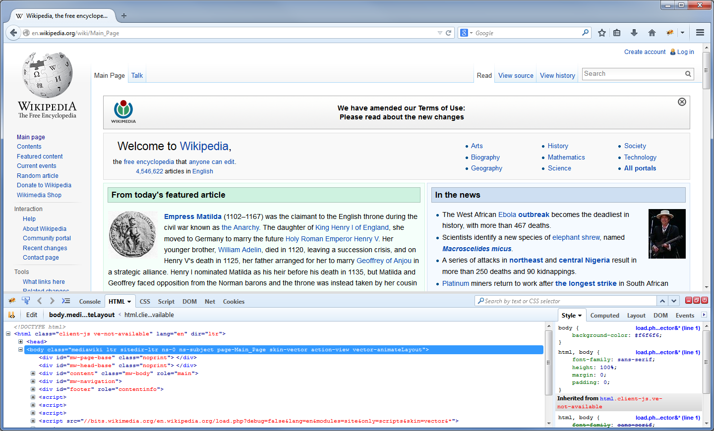
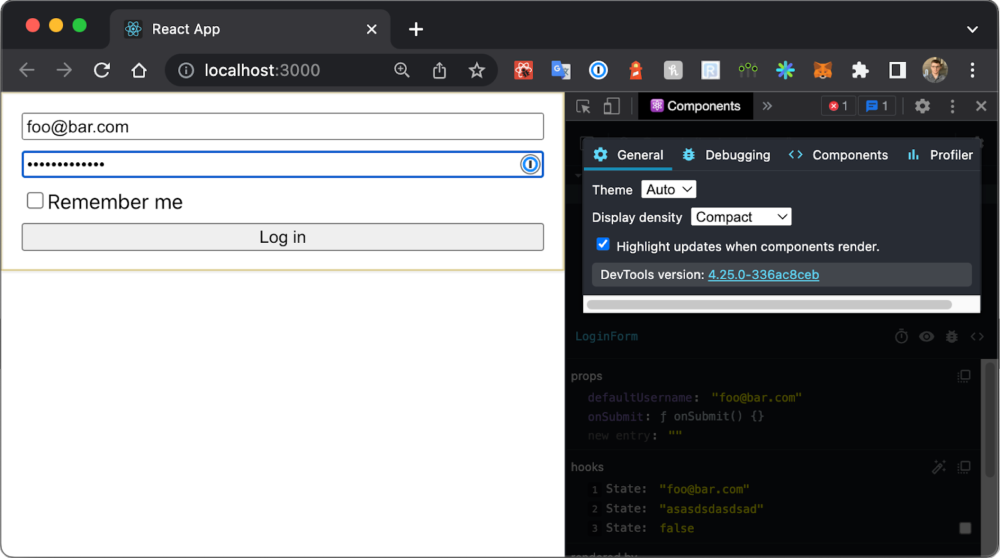

# Chương 1: Tiện ích mở rộng trình duyệt là gì?

Tiện ích mở rộng trình duyệt (browser extensions) là những "ký sinh trùng" lạ lùng và mạnh mẽ.

Ký sinh trùng, bởi vì chúng cư trú ở một góc bất thường trong thế giới phần mềm: chúng chạy trên các trang web nhưng hoàn toàn độc lập với bất kỳ trang web hay máy chủ nào. Mạnh mẽ, bởi vì chúng được ban cho một mức độ tự chủ khác thường: tiện ích mở rộng có thể xem và sửa đổi mọi thứ bạn thấy trên trình duyệt, kiểm tra và quản lý mọi yêu cầu HTTP mà trình duyệt gửi đi, cũng như ghi lại và lưu trữ thông tin đăng nhập cho tất cả các tài khoản kỹ thuật số của bạn. Lạ lùng, bởi vì chúng trực tiếp đối đầu với chính các công ty hỗ trợ chúng: các trình chặn quảng cáo (ad blockers), một trong những loại tiện ích được cài đặt phổ biến nhất trên Google Chrome, tồn tại chỉ để ngăn chặn việc hiển thị chính những quảng cáo tạo nên nguồn doanh thu chính của Google.

Tiện ích mở rộng trình duyệt mang lại cho người dùng cuối một mức độ kiểm soát đối với trải nghiệm duyệt web mà không có cách nào khác thực hiện được. Những tiện ích phổ biến nhất có hàng chục triệu lượt cài đặt và Cửa hàng Chrome trực tuyến (Chrome Web Store) có hơn 100.000 tiện ích đã được xuất bản. Nhận thấy sự chấp nhận và tiện ích rộng rãi này, vào năm 2021, W3C đã thành lập Nhóm cộng đồng WebExtensions để "khám phá cách các nhà cung cấp trình duyệt và các bên liên quan khác có thể hợp tác để thúc đẩy một nền tảng tiện ích mở rộng trình duyệt chung."

## Lịch sử của Tiện ích mở rộng trình duyệt

Khả năng mở rộng (extensibility) không phải là một khái niệm mới đối với trình duyệt, nhưng "tiện ích mở rộng trình duyệt" hiện đại với các API JavaScript tiêu chuẩn hóa là kết quả của nhiều thập kỷ phát triển.

### Tùy chỉnh phần mềm bằng Plug-ins

Cùng thời điểm JavaScript bắt đầu hình thành, các công ty phần mềm đã ra mắt những cách thức mới để phần mềm có thể chạy trong trình duyệt. Những phần mềm này dưới dạng "plug-ins trình duyệt", vốn là các mô-đun mã nguồn đóng có khả năng chạy các chương trình gốc (native) trên máy tính vật chủ từ bên trong trình duyệt. Ví dụ về các loại này bao gồm Java applets, Adobe Flash, Microsoft Silverlight và ActiveX, cùng Apple QuickTime.

JavaScript vào thời điểm đó khá chậm và giới hạn về tính năng, vì vậy việc đẩy bớt gánh nặng tính toán sang hệ thống vật chủ cho phép trình duyệt tận dụng nhiều bộ nhớ hệ thống, lưu trữ vĩnh viễn và các API đồ họa vốn sẽ không thể tiếp cận được. Vì các plug-in này sống trong một ngữ cảnh thực thi hoàn toàn khác, chúng phần lớn được đóng gói (sandboxed) tách biệt khỏi trang web xung quanh.

Tuy nhiên, các plug-in này đầy rẫy vấn đề. Chúng lỉnh kỉnh khi cài đặt và sử dụng, và vì được cấp quyền truy cập đặc quyền vào hệ thống vật chủ, chúng gây ra các lỗi trình duyệt và lỗ hổng bảo mật. Khi trình duyệt ngày càng mạnh mẽ hơn với HTML5, CSS3 và các đặc tả ECMAScript đầy đủ tính năng hơn, các plug-in này dần mất đi mục đích, và hệ quả là các trình duyệt hiện đại đã loại bỏ hỗ trợ cho chúng gần như hoàn toàn.

### Nguồn gốc của Tùy chỉnh Trình duyệt

Các phiên bản đầu tiên của Internet Explorer và Firefox đã hỗ trợ "add-ons" có khả năng tùy chỉnh trình duyệt. Tuy nhiên, chúng dựa trên các tích hợp độc quyền, giới hạn trong một trình duyệt duy nhất và các API đặc thù của nhà cung cấp.

- Vào năm 1999, Internet Explorer 4 đã giới thiệu hỗ trợ cho "Explorer Bars" và các mục tùy chỉnh trong menu ngữ cảnh, cho phép sửa đổi giao diện một cách hạn chế.
- Vào năm 2004, Firefox mới ra mắt đã giới thiệu một hệ thống tùy chỉnh linh hoạt hơn sử dụng XUL (XML User Interface Language), cho phép các nhà phát triển sửa đổi các phần cốt lõi của giao diện người dùng trình duyệt, chẳng hạn như thanh công cụ và menu.
- Trình quản lý userscript đầu tiên, Greasemonkey, được phát hành cho Firefox vào năm 2005. Nó cho phép người dùng chèn các đoạn mã JavaScript nhỏ, có thể tùy chỉnh vào các trang web, sửa đổi hành vi mà không cần phát triển một tiện ích mở rộng trình duyệt đầy đủ.

Những giải pháp này không phải không có vấn đề. Mặc dù mạnh mẽ, XUL cuối cùng đã bộc lộ những rắc rối do lỗ hổng bảo mật và sự mất ổn định gây ra bởi các tiện ích xung đột nhau. Userscripts thiếu sự tích hợp sâu của tiện ích mở rộng và đưa vào các rủi ro bảo mật, đặc biệt là khi các đoạn mã có thể được chia sẽ một cách không chính thức, bỏ qua các quy trình kiểm duyệt bảo mật của trình duyệt.

### Sự xuất hiện của Tiện ích mở rộng Hiện đại

Mãi đến tháng 9 năm 2009, các tiện ích mở rộng trình duyệt hiện đại đầu tiên mới xuất hiện trên Google Chrome. Không giống như add-ons của các trình duyệt khác, các tiện ích Chrome này có thể được xây dựng bằng HTML, CSS và JavaScript. Chúng tương tác với trình duyệt bằng cách sử dụng một API mở rộng JavaScript, và các nhà phát triển có thể xuất bản tiện ích của họ lên Cửa hàng Chrome trực tuyến.

Đến tháng 6 năm 2012, Chrome đã vượt qua Internet Explorer để trở thành trình duyệt web phổ biến nhất, và Cửa hàng Chrome trực tuyến đã đạt tổng cộng 750 triệu lượt cài đặt. Trong những năm sau đó, các trình duyệt đối thủ bắt đầu dần dần áp dụng các API và mô hình tiện ích mở rộng mà Google Chrome đã tiên phong.

## Bối cảnh Tiện ích mở rộng Trình duyệt

Sau nhiều năm thử nghiệm và sai sót, các tiện ích mở rộng trình duyệt ngày nay là một nền tảng phần mềm trưởng thành. Chúng được các nhà phát triển và người tiêu dùng chấp nhận rộng rãi, có các API và tài liệu được xác định rõ ràng, và có thể dễ dàng tiếp cận người dùng cuối thông qua một quy trình cửa hàng ứng dụng mạnh mẽ.

### So sánh Ứng dụng Di động và Tiện ích mở rộng Trình duyệt

Trong nhiều khía cạnh, tiện ích mở rộng trình duyệt hiện đại giống như các ứng dụng di động. Cả hai đều khai báo rõ ràng các quyền mà chúng cần từ hệ thống vật chủ, bị giới hạn bởi các mô hình bảo mật được xác định rõ và sử dụng một bộ sưu tập API rộng lớn để tương tác với hệ thống đó. Cả hai đều được đóng gói thành các phiên bản phát hành và triển khai thông qua một cửa hàng ứng dụng đặc thù của nhà cung cấp. Cả bản phát hành ứng dụng di động và tiện ích mở rộng trình duyệt đều trải qua quá trình kiểm duyệt, và các bản cập nhật được tự động tải xuống và cài đặt thông qua hệ thống vật chủ.

Trong khi các ứng dụng di động thường tồn tại dưới dạng một giao diện người dùng độc lập, các tiện ích mở rộng thường được xây dựng để chạy trên một hoặc nhiều trang web với một giao diện người dùng bổ sung. Không giống như ứng dụng di động, tiện ích mở rộng trình duyệt không nhất thiết phải có giao diện người dùng; nhiều tiện ích phổ biến chỉ là một đoạn mã JavaScript chạy ngầm để thực thi một trình xử lý (handler) khi có sự kiện nào đó xảy ra.

### Thị trường Tiện ích mở rộng Trình duyệt

Tất cả các nhà cung cấp trình duyệt lớn đều cung cấp một thị trường nơi các tiện ích có thể được xuất bản và tải xuống:

- **Chrome extensions**: Có thể được cài đặt từ Chrome Web Store ([chromewebstore.google.com](https://chromewebstore.google.com)). Đây là cửa hàng tiện ích lớn nhất và phổ biến nhất.
- **Safari extensions**: Chỉ có thể được tải xuống từ Apple App Store.
- **Mozilla Firefox extensions**: Có thể được cài đặt từ thị trường Add-ons ([addons.mozilla.org](https://addons.mozilla.org)).
- **Microsoft Edge extensions**: Có thể được cài đặt từ thị trường Edge Add-ons ([microsoftedge.microsoft.com](https://microsoftedge.microsoft.com)). Trình duyệt Edge sử dụng công cụ kết xuất Chromium, vì vậy các tiện ích từ Chrome Web Store có thể được cài đặt trên Edge bằng cách bật cài đặt "Cho phép tiện ích từ các cửa hàng khác".
- **Opera extensions**: Có thể được tải xuống từ thị trường Opera Addons ([addons.opera.com](https://addons.opera.com)). Giống như Edge, Opera là trình duyệt dựa trên Chromium và có thể được cấu hình để cài đặt tiện ích từ Chrome Web Store.

## Các loại Tiện ích mở rộng Trình duyệt

Nhờ có API rộng lớn theo ý mình, các nhà phát triển có thể xây dựng các tiện ích mở rộng trình duyệt có khả năng thực hiện một phạm vi nhiệm vụ đáng kinh ngạc. Tuy nhiên, giống như các chương trình Unix được kỳ vọng sẽ "làm một việc và làm tốt việc đó", các tiện ích mở rộng trình duyệt thường hướng tới việc nhỏ gọn và tập trung hơn vào mục tiêu của chúng.

### Trình chặn Quảng cáo và Theo dõi (Ad and Tracking Blockers)

Dễ dàng là loại tiện ích phổ biến nhất, các trình chặn quảng cáo và theo dõi phục vụ một mục đích rất đơn giản: chặn nội dung không mong muốn. Các trang web hiện đại được xây dựng từ một chuỗi các yêu cầu (requests) cho từng phần nội dung riêng lẻ. Hầu hết các yêu cầu này dành cho các phần thiết yếu như CSS và JavaScript để kết xuất trang, nhưng nhiều yêu cầu dành cho các tập lệnh hiển thị quảng cáo, thu thập phân tích hoặc theo dõi người dùng.

Chiến lược cốt lõi mà các tiện ích chặn này sử dụng rất đơn giản. Khi được cài đặt, một tiện ích chặn được cấp khả năng kiểm tra và quản lý tất cả các yêu cầu HTTP mà một trang web thực hiện. Tiện ích này cũng đi kèm với một danh sách các tên miền URL và các biểu thức chính quy (regular expressions) được biết là cung cấp quảng cáo hoặc nội dung theo dõi. Khi mỗi yêu cầu trang được gửi đi, tiện ích sẽ kiểm tra nó đối với danh sách và hủy bỏ yêu cầu nếu có sự khớp nối.

Từ góc độ của trang web, có vẻ như yêu cầu chỉ đơn giản là bị lỗi - một điều hoàn toàn bình thường khi gửi yêu cầu đến một tài nguyên từ xa. Từ góc độ người dùng, trang web thường sẽ được kết xuất chính xác với các quảng cáo và tập lệnh theo dõi đã bị loại bỏ. Từ góc độ của máy chủ quảng cáo hoặc theo dõi, họ không hề biết rằng người dùng đã truy cập trang web, vì yêu cầu gửi đi không bao giờ đến được máy chủ.

Tất nhiên, loại tiện ích này gây rắc rối cho các thực thể phụ thuộc vào nội dung bị chặn để tạo ra thông tin hoặc doanh thu. Để phản hồi, các ngành công nghiệp quảng cáo và theo dõi đã bắt đầu triển khai các biện pháp đối phó để giải quyết việc sử dụng rộng rãi các tiện ích chặn. Một số trang web hiện nay sẽ chỉ kết xuất nội dung nếu các tập lệnh quảng cáo và theo dõi được tải; họ giả định rằng một yêu cầu không thành công luôn là do tiện ích chặn đã hủy bỏ yêu cầu đó. Một số máy chủ quảng cáo và theo dõi cung cấp tập lệnh của họ bằng cách sử dụng "ẩn nấp CNAME" (CNAME cloaking), nơi yêu cầu tập lệnh quảng cáo hoặc theo dõi giả vờ là nội dung thông thường được tải từ tên miền của trang web.

### Tiện ích mở rộng cho Năng suất và Tiện ích

Bên cạnh việc chặn nội dung, tiện ích mở rộng trình duyệt có thể được sử dụng để tăng cường và hỗ trợ trải nghiệm duyệt web của người dùng. Một số loại khả thi bao gồm:

- **Trình quản lý Mật khẩu (Password Managers)**: Tiện ích quản lý mật khẩu có thể đọc và thay đổi văn bản nhập vào, giúp điền thông tin đăng nhập một cách tự động và bảo mật.
- **Hỗ trợ Tiếp cận (Accessibility)**: Các tiện ích này có thể lấy văn bản hiện có của trang và định dạng lại theo cách giúp người dùng dễ tiếp cận hơn. Điều này có thể dưới dạng tự động dịch văn bản trang, chuyển văn bản trang sang phần mềm đọc màn hình, định dạng lại văn bản trang để dễ đọc hơn (bằng cách tăng kích thước, độ tương phản hoặc chọn phông chữ thay thế), hoặc cung cấp khả năng truy cập nhanh vào từ điển.

### Công cụ Tổng hợp Nội dung và Liên kết (Content and Link Aggregators)

Nhiều người dùng web có nhu cầu lưu nhanh và dễ dàng các URL trang web hoặc một phần nội dung của các trang đó. Các tiện ích tổng hợp có thể thêm vào một giao diện người dùng để nhanh chóng lấy các URL hoặc các phần HTML của trang và lưu chúng, cục bộ hoặc trên máy chủ của bên thứ ba. Các tiện ích cũng có quyền truy cập vào Bookmark API, cho phép chúng xem và quản lý các trang đã được đánh dấu của trình duyệt.

### Công cụ Quản lý Tab (Tab Management Tools)

Tiện ích mở rộng trình duyệt có quyền truy cập vào một API quản lý tab sâu rộng, cho phép chúng thực hiện một loạt các hành động tập trung vào tab mà bình thường sẽ yêu cầu hành động của người dùng. Tùy chỉnh hành vi tab mới, sắp xếp lại các tab hiện có, loại bỏ các tab cũ và truy cập nhanh vào các tab thường dùng chỉ là một vài trong số các tính năng khả thi mà các loại tiện ích này cung cấp.

### Công cụ Quay màn hình (Screen Recording Tools)

Tiện ích mở rộng trình duyệt không chỉ có khả năng xem DOM của trang, chúng còn có thể sử dụng các API HTML5 để thực sự "thấy" trang trình duyệt của bạn trông như thế nào. Điều này hữu ích cho các công cụ như quay màn hình, chia sẻ màn hình và chụp ảnh màn hình.

> [!NOTE]
> Các tiện ích sử dụng những API HTML5 này vẫn yêu cầu người dùng cấp quyền rõ ràng. Các API bị giới hạn quyền như Screen Capture API sẽ tạo ra một hộp thoại trình duyệt yêu cầu người dùng cấp quyền truy cập khi tiện ích mở rộng trình duyệt yêu cầu.

### Tích hợp cho các Nền tảng Phần mềm

Nhiều nền tảng phần mềm có API công khai đã thấy phù hợp để xuất bản các tiện ích mở rộng trình duyệt có thể kết nối trực tiếp đến API đó. Điều này đặc biệt hữu ích khi nội dung gửi đến các API đó được trích xuất từ một trang web mà người dùng đang xem. Gửi nội dung đến bộ lưu trữ tệp từ xa, tự động truy cập vào lịch của người dùng và truy cập API ghi chú của bên thứ ba chỉ là một vài cách mà tiện ích mở rộng sử dụng sử tích hợp chặt chẽ với trang web để cải thiện trải nghiệm người dùng.

### Trợ lý AI (AI Assistants)

Trí tuệ nhân tạo, đặc biệt là các mô hình ngôn ngữ lớn (LLMs), đã nhanh chóng tìm thấy "ngôi nhà" của mình trong các tiện ích mở rộng trình duyệt. LLMs rất phù hợp để tiếp nhận lượng lớn văn bản không cấu trúc, các trang web chứa các khối văn bản phong phú, và tiện ích mở rộng trình duyệt là một đường dẫn lý tưởng để trích xuất văn bản trang.

Hình thức của các trợ lý này rất đa dạng, nhưng quy trình cơ bản là giống nhau: các API tiện ích web được sử dụng để đọc văn bản từ trang, nội dung được chuyển qua và xử lý bởi LLM, và tiện ích sẽ đưa phản hồi của LLM vào trình duyệt. Dưới đây là một vài ví dụ về các nhiệm vụ trợ lý AI phổ biến được thực hiện thông qua tiện ích mở rộng trình duyệt và LLM:

- Người dùng tạo tóm tắt các ý chính của một bài báo tin tức.
- Người dùng đặt câu hỏi về cách viết mã dựa trên tài liệu phần mềm.
- Người dùng tạo ra vài lựa chọn để trả lời một bình luận dựa trên các câu trả lời trước đó.
- Người dùng yêu cầu phân tích bản nháp email quan trọng mà họ đang soạn thảo.
- Người dùng yêu cầu tóm tắt một video YouTube dựa trên bản ghi (transcript).

### Ví điện tử kỹ thuật số (Digital Currency Wallets)

Thế giới tiền kỹ thuật số mang theo những cách quản lý thanh toán độc đáo. Các chi tiết khác nhau tùy theo nền tảng và loại tiền tệ, nhưng các nhiệm vụ mà người dùng tiền kỹ thuật số phải thực hiện thường rơi vào một trong các nhóm sau:

- Người dùng phải đọc một chuỗi ký tự dài được hiển thị cho họ. Đây có thể là địa chỉ tiền điện tử mà họ muốn gửi tiền đến hoặc nhận tiền từ đó. Những chuỗi này thường là hàng chục ký tự ngẫu nhiên, vì vậy việc nhập hoặc viết chúng ra mà không mắc lỗi là điều không khả thi.
- Người dùng phải thực hiện một "cú bắt tay" kỹ thuật số với một nền tảng. Điều này có các hình thức khác nhau tùy thuộc vào công nghệ liên quan, nhưng các nền tảng tiền kỹ thuật số thường hỗ trợ một số hình thức "kết nối" với ví của bạn để cho phép gửi thanh toán hoặc ký/ủy quyền rõ ràng cho các hành động.

Tiện ích mở rộng trình duyệt rất phù hợp cho cả hai nhiệm vụ này. Khả năng tự động đọc nội dung trang của chúng giúp việc quản lý các chuỗi ký tự dài trở nên đơn giản. Hơn nữa, ngữ cảnh thực thi riêng biệt của chúng là một nơi rất an toàn để các nhà phát triển lưu trữ ví kỹ thuật số.

### Công cụ dành cho Nhà phát triển (Developer Tools)

Phát triển web hiện đại sẽ không thể diễn ra nếu thiếu các tiện ích mở rộng trình duyệt dành cho nhà phát triển. Trong những ngày đầu của Web, các nhà phát triển khao khát những cách để gỡ lỗi (debug) các trang web họ đang xây dựng dễ dàng hơn. Một trong những giải pháp sớm nhất cho việc này là một add-on Firefox được phát hành vào năm 2006 gọi là **Firebug**, cho phép các nhà phát triển kiểm tra và mổ xẻ trang web họ đang xem. Điều này đã đơn giản hóa đáng kể quá trình gỡ lỗi HTML, JavaScript và CSS, vốn nếu không có add-on sẽ là một mớ hỗn độn khi phải sử dụng các lệnh in (print statements) và xem mã nguồn trang thô.

Các trình duyệt đã nhanh chóng nhận ra nhu cầu cực lớn đối với loại công cụ này, và họ bắt đầu tung ra các phiên bản trình gỡ lỗi tích hợp sẵn (native) khớp với các tính năng của Firebug. Tiện ích Firebug trở nên dư thừa và đã bị ngừng hoạt động vào năm 2017.

Với việc áp dụng rộng rãi các ứng dụng đơn trang (single page applications) như React, nhu cầu về công cụ cho nhà phát triển cũng theo đó mà tăng lên. Trình gỡ lỗi tích hợp sẵn của trình duyệt không phù hợp lắm để gỡ lỗi loại ứng dụng này, vì logic và kiến trúc điều khiển cách trang kết xuất bị cô lập trong các khối mã JavaScript lớn của bên thứ ba, vốn dĩ rất khó hiểu.

Để giải quyết vấn đề này, nhiều nhóm phát triển khung phần mềm (framework) ứng dụng đơn trang cũng phát hành một tiện ích mở rộng trình duyệt đi kèm. Tiện ích này hiểu rất rõ các nội tại về cách một ứng dụng đơn trang cụ thể hoạt động và được trang bị một bộ công cụ rộng lớn cho phép nhà phát triển nhìn sâu vào khung phần mềm và hiểu nó đang làm gì. Điều này mang lại cho nhà phát triển cái nhìn phong phú hơn về những gì đang xảy ra trên trang – và quan trọng hơn là cách để sửa lỗi.

Hơn nữa, các tiện ích mở rộng trình duyệt đã phát triển để hỗ trợ tích hợp trực tiếp vào công cụ dành cho nhà phát triển của trình duyệt. Các tiện ích có thể chèn một trang devtools tùy chỉnh vào giao diện gỡ lỗi của trình duyệt, tương tác với trang đang kiểm tra và gỡ lỗi các yêu cầu mạng. Chúng cũng có quyền truy cập vào một DevTools API tùy chỉnh.

## Tóm tắt

Tiện ích mở rộng trình duyệt là một thành phần thiết yếu của điện toán hiện đại. Từ những khởi đầu khiêm tốn của máy tính mainframe, chúng đã phát triển qua nhiều thập kỷ thành một "con dao quân đội Thụy Sĩ" thực thụ cho trình duyệt hiện đại.

Sức mạnh của tiện ích mở rộng trình duyệt được thể hiện rõ nét trong phạm vi rộng lớn các công cụ mà chúng hỗ trợ. Từ các công cụ bảo mật và quyền riêng tư mạnh mẽ như trình chặn quảng cáo và trình quản lý mật khẩu, đến một bộ công cụ hỗ trợ viết lách trong trình duyệt, đến một loạt các công cụ phát triển ứng dụng đơn trang, tiện ích mở rộng trình duyệt cho phép và tăng cường nhiều trải nghiệm web hiện đại hơn hầu hết mọi người nhận ra.

Trong chương tiếp theo, chúng ta sẽ tìm hiểu các yếu tố cơ bản tạo nên một tiện ích mở rộng trình duyệt và cách thức hoạt động của từng yếu tố trong trình duyệt. Chúng ta sẽ xem xét vai trò của tệp manifest, các bản lệnh nền (background scripts), bản lệnh nội dung (content scripts), các trang popup, trang tùy chọn (options pages), bảng điều khiển bên (side panels) và giao diện devtools, cùng với cách chúng tương tác với các tab trình duyệt, tên miền và các API nội bộ.
