# Chương 2: Các Thành phần Cơ bản của Browser Extension (Fundamental Elements of Browser Extensions)

Giống như hầu hết các nền tảng phần mềm, browser extension có thể được chia bản chất thành một số phần rời rạc. Các nhà phát triển mới làm quen với thế giới browser extension có thể thấy những đặc điểm riêng biệt của các thành phần này hơi khó để nắm bắt, vì một số hành vi có vẻ thừa thãi hoặc không trực quan. Hiểu rõ cách các mảnh ghép của browser extension kết hợp với nhau là điều then chốt để trở thành một chuyên gia phát triển extension.

> [!NOTE]
> Chương này sẽ trình bày sơ lược từng thành phần của browser extension ở mức độ tổng quát mà không đi quá sâu vào code. Các chương tiếp theo sẽ đi sâu vào chi tiết từng thành phần này.

## Mô hình Trình duyệt (The Browser Model)

Trước khi tìm hiểu các yếu tố khác nhau của browser extension, hãy bắt đầu bằng việc xem xét hành vi mặc định của một trình duyệt. Hãy quan sát sơ đồ dưới đây về một trình duyệt web với một tab đang mở (Hình 2-1).

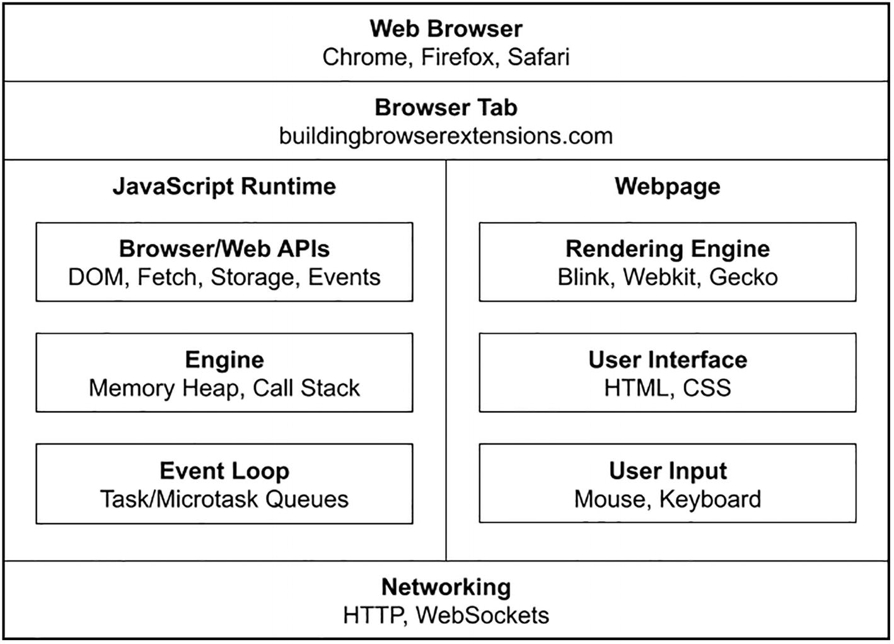
*Hình 2-1: Mô hình đơn giản hóa của trình duyệt web*

> [!IMPORTANT]
> Hiểu biết cơ bản về cách một trang web được hiển thị (render), cách JavaScript thực thi và cách trình duyệt thực hiện các yêu cầu mạng là điều kiện tiên quyết để phát triển browser extension. Nếu bạn chưa quen với các chủ đề này, bạn có thể tìm thấy danh sách tài nguyên tuyệt vời tại: [https://developer.mozilla.org/en-US/docs/Web/Guide/Introduction_to_Web_development](https://developer.mozilla.org/en-US/docs/Web/Guide/Introduction_to_Web_development)

Sơ đồ này minh họa các khái niệm cấp cao khi một trình duyệt web có một tab duy nhất trỏ đến một URL. Trang web hiển thị trong giao diện người dùng chính của trình duyệt và có môi trường thực thi JavaScript (`runtime`) riêng. Cả bản thân trang web và các script bên trong nó đều thực hiện các yêu cầu mạng tiếp theo sau khi HTML ban đầu được tải: phần đầu trang (head) sẽ tải các tài nguyên như CSS, hình ảnh và các script bổ sung, và các script có thể thực thi các yêu cầu bổ sung để tải tài nguyên cũng như gửi và nhận dữ liệu.

### Các Tab Trình duyệt (Browser Tabs)

Hãy mở rộng sơ đồ trước đó để hiển thị khi có nhiều tab (`tabs`) đang mở trong trình duyệt (Hình 2-2).

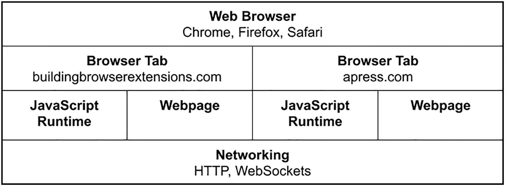
*Hình 2-2: Trình duyệt web với nhiều tab*

Các trình duyệt thực hiện cơ chế cô lập (`sandbox`) các tab khác nhau một cách hiệu quả, cung cấp cho mỗi tab đối tượng document, môi trường thực thi JavaScript, bộ nhớ riêng và tùy thuộc vào trình duyệt, có thể là luồng (thread) và quy trình (process) hệ thống riêng. Tất nhiên, có vô số cân nhắc quan trọng khi nói đến việc khớp nguồn gốc (`origins`). Mặc dù mỗi tab được cung cấp các runtime riêng biệt, hai tab riêng biệt có nguồn gốc khớp nhau có thể chia sẻ tài nguyên. Có thể kể tên một số tài nguyên như:

- Cookies
- LocalStorage
- IndexedDB
- Shared Workers
- Service Workers
- HTTP Cache

### Chính sách Cùng Nguồn gốc (Same-Origin Policy)

Nguồn gốc cũng là một yếu tố cần cân nhắc khi áp dụng Chính sách Cùng Nguồn gốc (`Same-Origin Policy` - SOP). Nói tóm gọn, SOP là một tập hợp các chính sách bảo mật được triển khai bởi tất cả các trình duyệt nhằm kiểm soát việc truy cập dữ liệu giữa các ứng dụng web. Khi hai ứng dụng web có nguồn gốc khác nhau, trình duyệt sẽ tự động áp dụng một tập hợp các hạn chế để bảo vệ thông tin nhạy cảm tiềm ẩn khỏi một nguồn gốc không đáng tin cậy. Các nhà phát triển web thường gặp SOP ở ba nơi: khi gửi yêu cầu mạng đến các nguồn gốc bên ngoài, khi thực thi các script từ một nguồn gốc khác và khi truy cập các API lưu trữ từ các nguồn gốc khác nhau.

## Mô hình Browser Extension (The Browser Extension Model)

Từ quan điểm của một trang web, browser extension có thể được coi là một thực thể bổ sung vô hình. Chúng thực thi JavaScript trong môi trường thực thi riêng, hiển thị các trang trong các ngữ cảnh sandbox riêng và có quyền truy cập vào bộ API riêng biệt. Trang web sẽ không hề hay biết rằng browser extension đã được cài đặt hoặc chúng đang làm gì.

> [!NOTE]
> Content script là một ngoại lệ quan trọng đối với điều này, vì chúng cho phép cả trang web và extension đều có thể truy cập vào DOM và một số tài nguyên dùng chung. Tuy nhiên, như bạn sẽ thấy trong chương *Content Scripts*, chúng cũng phải chịu một số quy chế sandbox đặc thù của extension.

Hãy xem xét sơ đồ của một trình duyệt đã cài đặt extension như trong Hình 2-3.

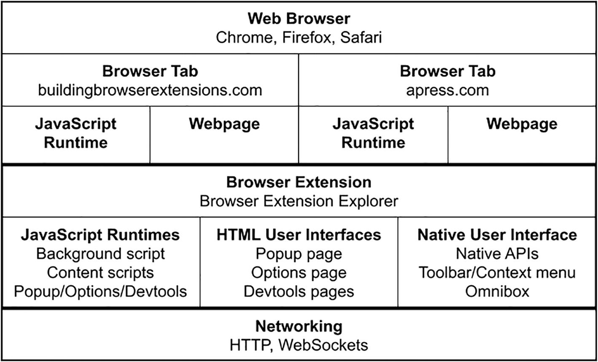
*Hình 2-3: Trình duyệt web với nhiều tab và một extension đã được cài đặt*

Hãy cùng kiểm tra từng khái niệm quan trọng được hiển thị trong sơ đồ này.

### Các Trang JavaScript và Runtime Độc lập (Independent JavaScript Pages and Runtimes)

Sau khi được cài đặt, browser extension có thể cung cấp nhiều giao diện người dùng HTML tùy chỉnh ở một số nơi: trang popup (`popup page`), trang tùy chọn (`options page`) và các trang công cụ nhà phát triển (`devtools pages`). Những trang này hoạt động giống như các trang web thông thường về hầu hết mọi mặt:

- Mỗi trang được hiển thị (`rendered`) theo cùng một cách như một trang web bình thường, với các sự kiện tải (load events) và đối tượng document truyền thống.
- Mỗi trang được cung cấp một container trình duyệt gốc (native browser container) chuyên biệt và hoàn toàn tách biệt với tất cả các trang web khác.
- Mỗi giao diện được cung cấp môi trường thực thi JavaScript riêng.

Background script và content script được cung cấp runtime riêng, nhưng chúng không tồn tại dưới dạng một giao diện người dùng độc lập.

> [!NOTE]
> Thông tin chi tiết về popup, options, devtools, background script và content script sẽ được trình bày ở phần sau của chương này.

### Các Native API và Giao diện Người dùng (Native APIs and User Interfaces)

Browser extension có quyền truy cập vào một bộ các API trình duyệt gốc cho phép chúng kiểm soát hành vi, giao diện và dữ liệu của trình duyệt. Một vài ví dụ:

- Tabs API
- Bookmarks API
- Downloads API
- Browser History API
- Browsing Data API

> [!NOTE]
> Các API này sẽ được trình bày chuyên sâu trong chương *Extension and Browser APIs*.

Hơn nữa, browser extension còn được cung cấp một số cách để tích hợp trực tiếp với giao diện người dùng của chính trình duyệt. Điều này bao gồm khả năng quản lý cách biểu tượng thanh công cụ (toolbar icon) xuất hiện và hoạt động, chỉ định hành vi cho giao diện thanh địa chỉ (URL bar omnibox), và xác định nội dung sẽ xuất hiện trong menu ngữ cảnh của extension khi nó được mở.

### Quyền truy cập Tab và Tên miền (Tab and Domain Access)

Browser extension không bị giới hạn trong một tên miền hoặc một tab duy nhất – chúng sống ngay trong chính trình duyệt. Khi được cấp các quyền phù hợp, browser extension có khả năng tương tác với nhiều tab trên nhiều tên miền khác nhau. Điều này có nghĩa là một browser extension có thể kiểm tra và quản lý một phần hoặc toàn bộ các trang đang mở của trình duyệt.

Browser extension cũng không nhất thiết phải sử dụng một trang web. Các extension được trang bị đầy đủ để tồn tại như các phần mềm độc lập chỉ sống trong trình duyệt. Tất nhiên, một số khía cạnh của browser extension như content script và giao diện devtools chỉ có tác dụng khi thao tác trên các trang web.

### Theo dõi và Chặn các Yêu cầu Mạng (Observing and Intercepting Network Requests)

Thông thường, các yêu cầu mạng (`network requests`) được gửi đi từ một trang web sẽ được chuyển giao trực tiếp cho trình duyệt. Browser extension có thể được cấp quyền để hoạt động như một lớp đệm (shim) cho yêu cầu mạng, nơi các yêu cầu được gửi đến trang sẽ được extension xử lý trước khi được chuyển tiếp cho trình duyệt. Điều này có nghĩa là extension có thể thêm các quy tắc để sửa đổi yêu cầu có điều kiện, hoặc thậm chí chặn đứng chúng hoàn toàn. Nó cũng có nghĩa là extension có thể quan sát luồng lưu lượng truy cập ra vào trang web trong thời gian thực.

> [!NOTE]
> Các cơ chế sửa đổi yêu cầu mạng đang được thay đổi đáng kể giữa Manifest v2 và v3. Điều này được trình bày chuyên sâu trong chương *Networking*.

## Các Thành phần của Browser Extension (Elements of Browser Extensions)

Phần trước đã đề cập đến browser extension như một thực thể toàn diện. Điều này hữu ích khi cố gắng nắm bắt khái niệm một cách tổng thể. Tuy nhiên, như đã ám chỉ trong phần giới thiệu chương này, browser extension tồn tại như một tập hợp các thành phần bán độc lập. Phần này sẽ xem xét từng thành phần đó ở mức độ tổng quát.

### Manifest của Extension (Extension Manifest)

`Manifest` là cuốn sách quy tắc của browser extension. Mọi extension đều được yêu cầu cung cấp manifest này dưới dạng dữ liệu JSON trong tệp `manifest.json`. Một số ví dụ về những gì có trong manifest:

- Thông tin công khai như tên extension, mô tả, phiên bản, biểu tượng và tác giả.
- Các con trỏ dẫn đến các tệp điểm đầu vào (entrypoint) cho background script, trang popup, trang tùy chọn, trang devtools và content script.
- Các yêu cầu và cấu hình mà extension cần để hoạt động bình thường, chẳng hạn như quyền (permissions), chính sách bảo mật nội dung (CSP), chính sách chéo nguồn gốc và phiên bản trình duyệt tối thiểu.
- Các bộ quy tắc khớp mẫu (pattern-match rule sets) để quản lý yêu cầu mạng, các tên miền được phép và tài nguyên mà extension muốn chèn vào trang thông qua content script.
- Các tùy chọn linh tinh khác dành riêng cho extension như cho phép chế độ ngoại tuyến (offline), ẩn danh (incognito) và các phím tắt.

> [!NOTE]
> Chi tiết về cách viết tệp `manifest.json` có thể được tìm thấy trong chương *Extension Manifests*.

#### Manifest v2 và v3

Thế giới browser extension hiện đang trong giai đoạn chuyển giao giữa hai phiên bản của tệp `manifest.json`: phiên bản 2 (v2) và phiên bản 3 (v3). Manifest v3 mới thay đổi đáng kể cách các extension thực thi và thay đổi các API mà chúng có thể truy cập. Google Chrome đang dẫn đầu quá trình chuyển đổi sang Manifest v3; do vị thế thống trị thị trường của họ, các nhà cung cấp trình duyệt khác hầu hết cũng đang nối bước theo sau.

Việc chuyển đổi sang Manifest v3 sẽ là một chủ đề chính trong cuốn sách này. Những thay đổi mà nó mang lại gây ra nhiều tranh cãi trong cộng đồng nhà phát triển browser extension và chúng tác động rộng rãi đến một số lượng lớn các browser extension cực kỳ phổ biến.

### Background Scripts

Mục đích chính của `background scripts` là xử lý các sự kiện của trình duyệt. Những sự kiện này có thể là các sự kiện vòng đời của extension như cài đặt hoặc gỡ cài đặt, hoặc có thể là các sự kiện của trình duyệt như điều hướng đến một trang web hoặc thêm một bookmark mới. Background script có thể được định nghĩa trong các tệp JavaScript, hoặc dưới dạng một tệp HTML duy nhất chạy các background script thông qua một hoặc nhiều thẻ `<script>` trong một trang không hiển thị (headless page).

> [!TIP]
> Hầu hết các browser extension đơn giản đều hoạt động tốt chỉ với một background script duy nhất.

Mặc dù background script được cung cấp runtime JavaScript riêng, chúng không tồn tại biệt lập. Chúng có thể truy cập các `WebExtensions API` và do đó có khả năng thực hiện các hành động như trao đổi thông báo với các phần khác của extension, trao đổi thông báo với các extension khác, hoặc lập trình chèn content script vào một trang web.

Background script trải qua một sự thay đổi đáng kể giữa Manifest v2 và Manifest v3. Trong Manifest v2, background script có tùy chọn là "kiên định" (persistent) - nghĩa là được khởi tạo đúng một lần và tồn tại trong bộ nhớ cho đến khi trình duyệt đóng lại, hoặc "không kiên định" (nonpersistent) - nơi background script tồn tại như một "trang sự kiện" (event page) được khởi tạo theo yêu cầu bất cứ khi nào có sự kiện trình duyệt liên quan xảy ra. Trong Manifest v3, background script tồn tại dưới dạng service worker, phần lớn mô phỏng hành vi của background script không kiên định trong Manifest v2.

> [!NOTE]
> Chương *Background Scripts* bao gồm nhiều chi tiết hơn về background script.

### Trang Popup (The Popup Page)

Trang `popup` là một container trình duyệt gốc mà browser extension có thể sử dụng để hiển thị giao diện người dùng tùy chỉnh. Trang popup hoạt động như một hộp thoại "bật lên" đè lên trang web khi người dùng nhấp vào nút thanh công cụ của extension. Trang popup sẽ luôn xuất hiện trực tiếp bên dưới thanh công cụ (`toolbar`). Vì nó có thể được truy cập nhanh chóng và có thể hiển thị trên bất kỳ trang web nào, trang popup thường chứa nội dung mà người dùng cần truy cập dễ dàng. Một ví dụ về trang popup được hiển thị trong Hình 2-4.

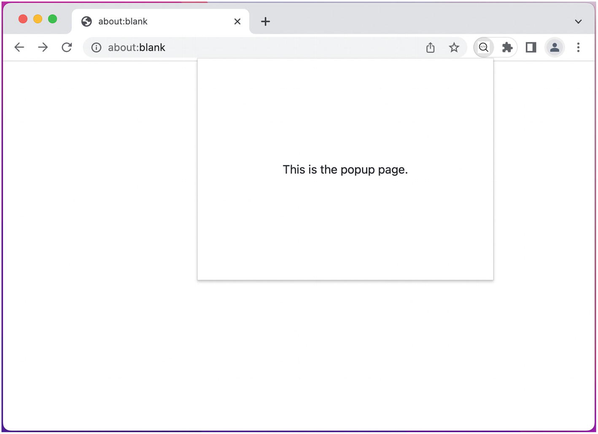
*Hình 2-4: Trang popup đơn giản*

Các trang popup được hiển thị giống như các trang web thông thường, nhưng bản chất giống hộp thoại của chúng có nghĩa là chúng "dùng xong rồi bỏ" (disposable): popup sẽ được hiển thị mới mỗi khi người dùng mở nó và bị dỡ bỏ (unloaded) khi popup đóng lại. Giống như background script, các trang popup có thể truy cập WebExtensions API, nghĩa là chúng có cùng một bộ các khả năng.

> [!NOTE]
> Trang popup không thể được mở bằng code (programmatically), nó phải được kích hoạt bởi một cú nhấp chuột trên thanh công cụ hoặc hành động trình duyệt có đặc quyền tương đương. Điều này là để ngăn chặn các extension lạm dụng khả năng này và thường xuyên hoặc cơ hội mở trang popup của chúng, gây phiền hà cho trải nghiệm người dùng.

### Trang Tùy chọn (The Options Page)

Trang `options` là một container trình duyệt gốc mà browser extension có thể sử dụng để hiển thị giao diện người dùng tùy chỉnh. Trang tùy chọn hoạt động như một trang web độc lập mở ra khi người dùng nhấp vào "Tùy chọn" (Options) trong menu ngữ cảnh của thanh công cụ extension. Ví dụ về việc mở trang tùy chọn được hiển thị trong Hình 2-5 và Hình 2-6.

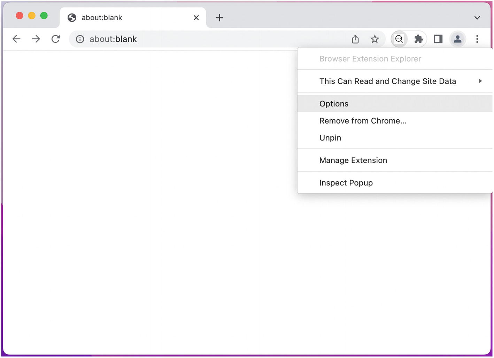
*Hình 2-5: Chọn “Options” từ menu ngữ cảnh của extension*

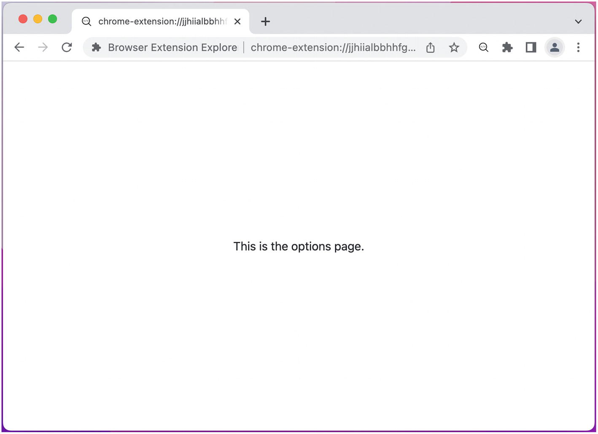
*Hình 2-6: Trang tùy chọn đơn giản*

Cái tên "options" có thể gây hiểu lầm: trang này không bị giới hạn chỉ để hiển thị các tùy chọn cho extension. Giống như trang popup, đây là một trang web đầy đủ tính năng với quyền truy cập vào WebExtensions API, có nghĩa là bạn có thể sử dụng nó như một ứng dụng web đầy đủ.

> [!NOTE]
> Tham khảo chương *Popup and Options Pages* để biết thêm chi tiết về cách các trang này hoạt động và cách sử dụng chúng.

### Content Scripts

Thuật ngữ *content script* ám chỉ rộng rãi bất kỳ nội dung nào được chèn vào một trang web. JavaScript có thể được chèn theo hình thức khai báo (declaratively) trong manifest, hoặc bằng code (programmatically) từ một trang extension hoặc background script thông qua WebExtensions API. Nội dung này có thể là JavaScript, CSS hoặc cả hai. JavaScript được sandbox trong runtime riêng biệt của nó, nghĩa là nó không thể đọc các biến hoặc thuộc tính JavaScript trong runtime của trang web chính, nhưng nó vẫn chia sẻ quyền truy cập vào cùng một DOM như chính trang web đó. Điều này có nghĩa là content script hoàn toàn có khả năng đọc và ghi vào trang, cho phép thực hiện những việc như tạo các tiện ích trong trang (in-page widgets) hoặc tích hợp hoàn toàn với trang web.

Content script có quyền truy cập hạn chế vào WebExtensions API, vì vậy chúng không thể thực hiện nhiều hành động có thể làm được trong trang popup, trang tùy chọn hoặc background script. Tuy nhiên, chúng có thể trao đổi tin nhắn với các thành phần extension khác như background script. Do đó, content script vẫn có thể sử dụng gián tiếp WebExtensions API bằng cách ủy nhiệm các hành động cho background script.

> [!NOTE]
> Tham khảo chương *Content Scripts* để biết thêm chi tiết về cách content script hoạt động và cách sử dụng chúng.

### Các bảng điều khiển và Thanh bên Devtools (Devtools Panels and Sidebars)

Các bảng điều khiển (panel) và trang thanh bên (sidebar) của `devtools` là các container trình duyệt gốc mà browser extension có thể sử dụng để hiển thị giao diện người dùng tùy chỉnh. Các giao diện devtools hoạt động như các ngăn (panes) được lồng trong công cụ dành cho nhà phát triển của trình duyệt gốc khi người dùng chọn các tab tương ứng của chúng trong giao diện công cụ dành cho nhà phát triển, được hiển thị trong Hình 2-7 và Hình 2-8.

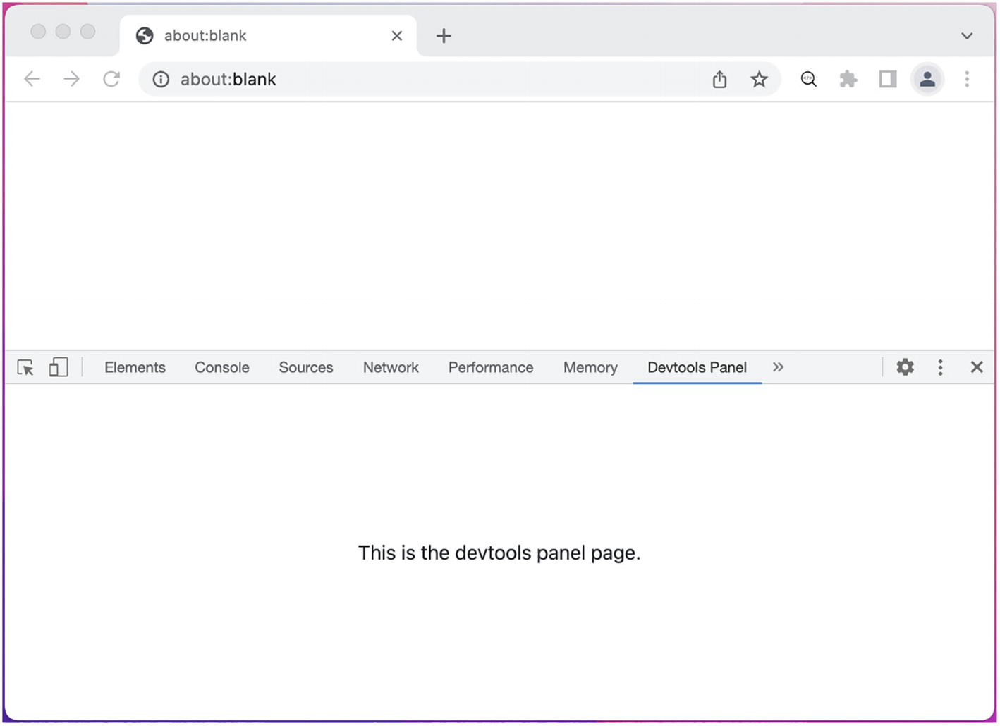
*Hình 2-7: Trang bảng điều khiển devtools đơn giản*

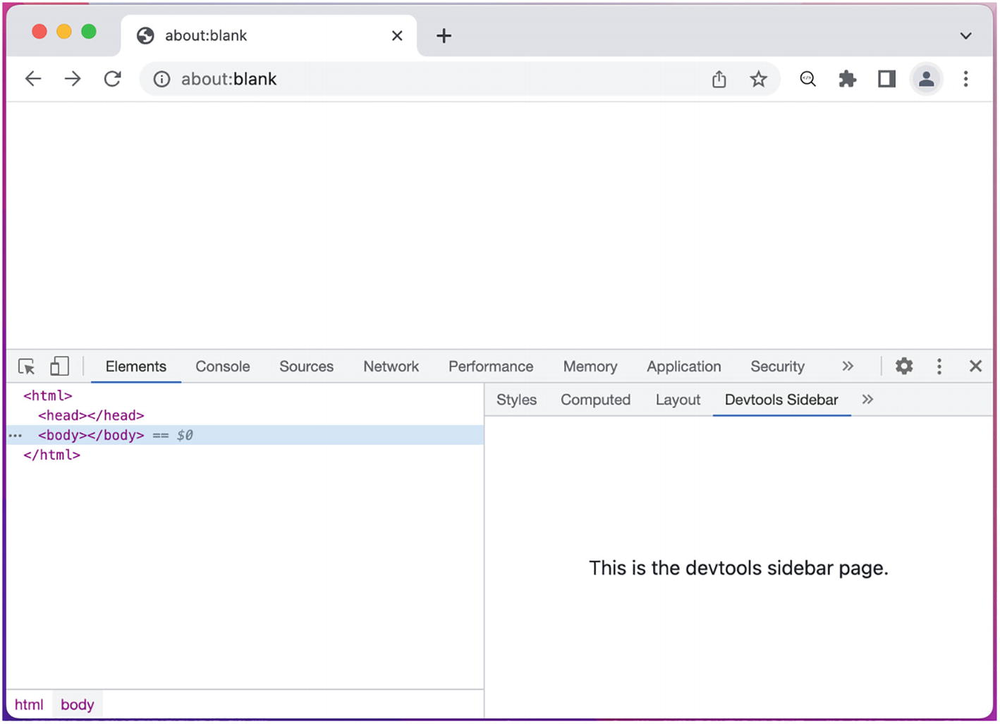
*Hình 2-8: Trang thanh bên devtools đơn giản*

Giống như trang popup, đây là một trang web đầy đủ tính năng, nhưng giống như content script, nó có quyền truy cập hạn chế vào WebExtensions API. Tuy nhiên, nó được cung cấp quyền truy cập vào `Devtools API` bổ sung, có thể được sử dụng để thực hiện các hành động như kiểm tra trang và quan sát lưu lượng mạng của trang.

> [!NOTE]
> Tham khảo chương *Devtools Pages* để biết thêm chi tiết về cách các trang này hoạt động và cách sử dụng chúng.

## Các Thành phần Extension trong Thực tế (Extension Elements in Action)

Để giúp bạn hiểu rõ hơn về cách tất cả các thành phần này kết hợp với nhau, hãy cùng xem xét cách chúng được áp dụng trong một số browser extension phổ biến. Dựa trên những gì chúng ta đã biết về hành vi của các thành phần khác nhau, chúng ta có thể hiểu cách extension thực hiện các giao diện người dùng này ngay cả khi không có quyền truy cập vào mã nguồn của chúng.

### Honey

Honey là một browser extension có thể phát hiện khi người dùng đang thanh toán trên một website thương mại điện tử và tự động áp dụng các mã giảm giá (Hình 2-9).

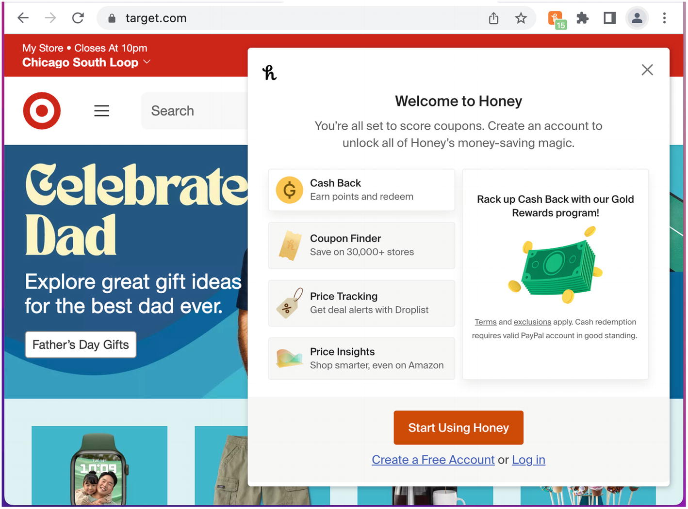
*Hình 2-9: Honey browser extension hiển thị widget content script và biểu tượng thanh công cụ với badge*

Ở đây, Honey đang hiển thị một widget đè lên trang web bằng cách sử dụng content script. Nó cũng sử dụng content script để tự động gửi mã giảm giá khi người dùng đang trong quy trình thanh toán.

Hơn nữa, hãy lưu ý rằng biểu tượng thanh công cụ (`toolbar icon`) đang hiển thị một biểu tượng phụ (badge) chứa số "15", tức là Honey đang báo cho chúng ta biết có 15 mã giảm giá tiềm năng có thể thử trên tên miền này. Honey biết điều này vì nó có thể đánh giá tên miền mà người dùng đang truy cập và kiểm tra nó với cơ sở dữ liệu mã giảm giá phù hợp của Honey. Sau đó, extension có thể sử dụng khả năng thiết lập động nội dung hiển thị của biểu tượng thanh công cụ để render logo Honey cùng với badge "15" (Hình 2-10).

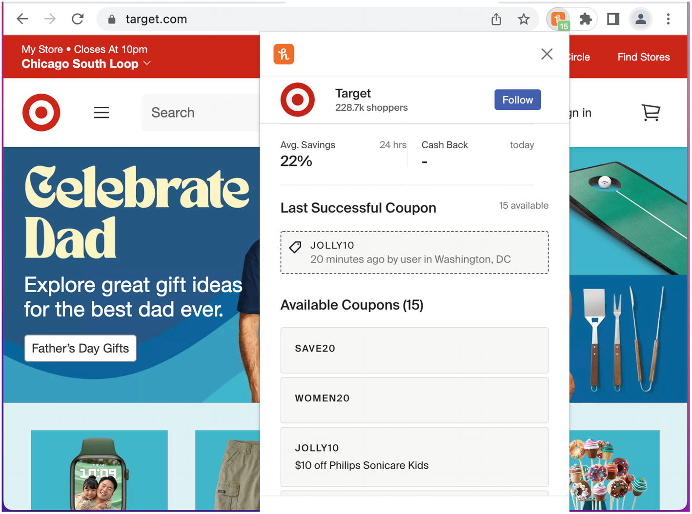
*Hình 2-10: Honey browser extension hiển thị trang popup*

Ảnh chụp màn hình bên trên cho thấy chế độ xem popup của Honey. Honey không coi đây là giao diện người dùng chính, vì không thể mở cửa sổ popup bằng code. Extension cần tự động hiển thị nội dung cho người dùng khi phát hiện thấy nó có thể gửi mã giảm giá, và extension dựa vào các widget được hỗ trợ bởi content script để thực hiện việc này.

### LastPass

LastPass là một browser extension có thể lưu trữ và tự động điền mật khẩu của người dùng một cách bảo mật, cũng như ghi lại các mật khẩu mới khi chúng được gửi đi (Hình 2-11).

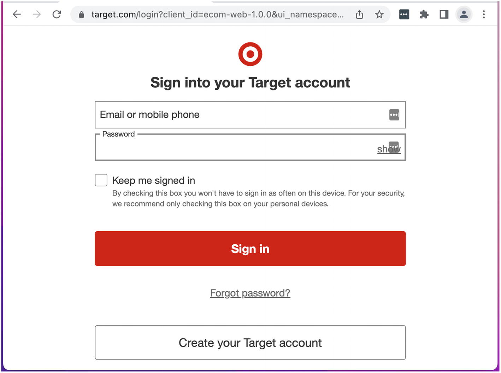
*Hình 2-11: LastPass browser extension với các nút bấm widget content script*

LastPass sử dụng content script để tìm và điền vào các trường biểu mẫu xác thực, cũng như để hiển thị các widget quản lý mật khẩu từ bên trong các trường biểu mẫu đó. LastPass cũng theo dõi lưu lượng truy cập ra vào trình duyệt để tìm các yêu cầu thiết lập hoặc cập nhật mật khẩu và ghi lại dữ liệu yêu cầu vào danh sách thông tin xác thực tài khoản được mã hóa của bạn (Hình 2-12).

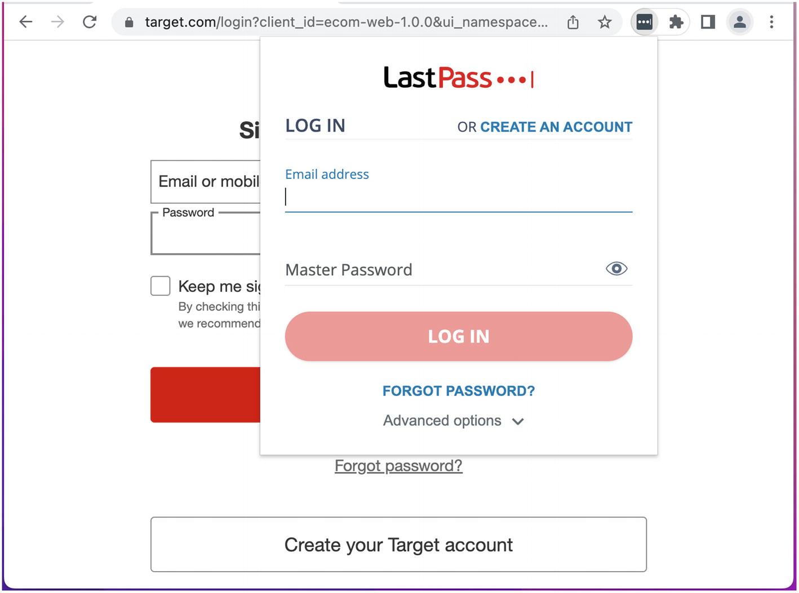
*Hình 2-12: LastPass browser extension hiển thị trang popup*

Tất nhiên, việc phát hiện biểu mẫu sẽ không bao giờ là hoàn hảo, vì vậy LastPass cung cấp tất cả các tiện ích mật khẩu tương tự từ cửa sổ popup để dự phòng cho các trường hợp widget content script không hiển thị (Hình 2-13).

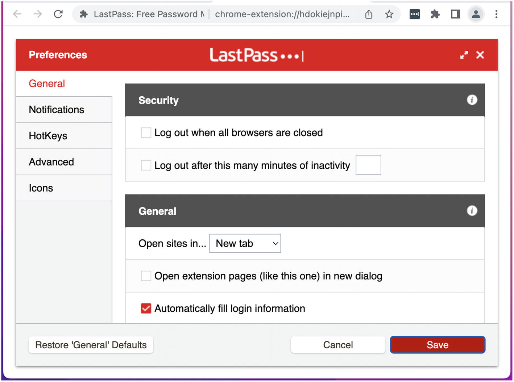
*Hình 2-13: LastPass browser extension hiển thị trang tùy chọn*

Ngoài việc quản lý mật khẩu, LastPass còn có một bộ công cụ bảo mật rộng lớn và cho phép tùy chỉnh phức tạp các hành vi của nó. Browser extension hiển thị các cài đặt này trong trang tùy chọn (`options page`) của extension, như được hiển thị ở trên.

### Grammarly

Grammarly là một browser extension theo dõi văn bản người dùng nhập vào trình duyệt và tự động đưa ra các gợi ý về cách sửa lỗi hoặc cải thiện văn bản đó (Hình 2-14 và Hình 2-15).

*Hình 2-14: Grammarly browser extension hiển thị widget content script*

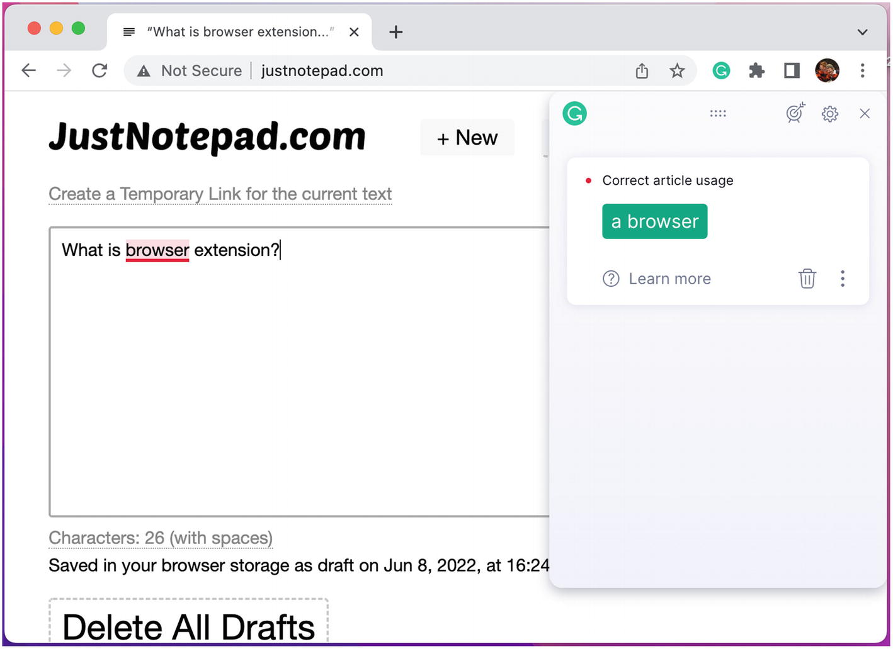
*Hình 2-15: Grammarly browser extension hiển thị widget content script đã được tổng hợp*

Tương tự như cách LastPass phát hiện các trường biểu mẫu xác thực, Grammarly sử dụng content script để phát hiện một cách thông minh khi người dùng đang nhập nội dung vào trang, phân tích nội dung đó và hiển thị các gợi ý đè lên nội dung đó. Extension cũng có khả năng tổng hợp tất cả các gợi ý đang hoạt động vào một widget content script hợp nhất (Hình 2-16).

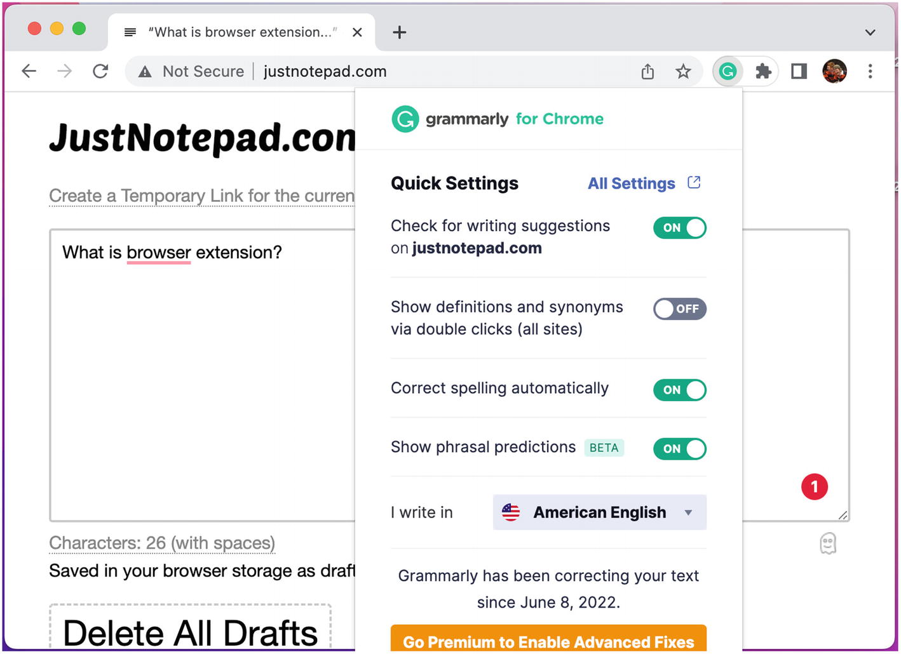
*Hình 2-16: Grammarly browser extension hiển thị trang popup*

Grammarly cũng cung cấp các nút gạt cho các cài đặt extension trong trang popup.

### React Developer Tools

React Developer Tools là một browser extension cho phép người dùng hiểu cách một ứng dụng React đang được render trong trang (Hình 2-17).

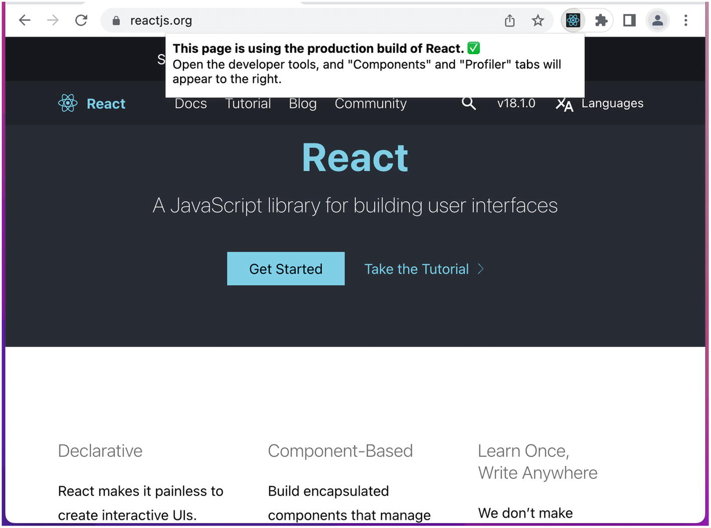
*Hình 2-17: React Developer Tools browser extension hiển thị widget popup*

Browser extension có thể phân tích trang web để phát hiện xem đó có phải là một ứng dụng React hay không. Nếu đúng, biểu tượng thanh công cụ sẽ cho biết điều đó, và trang popup sẽ thông báo cho người dùng loại ứng dụng React nào đang hiện diện (Hình 2-18).

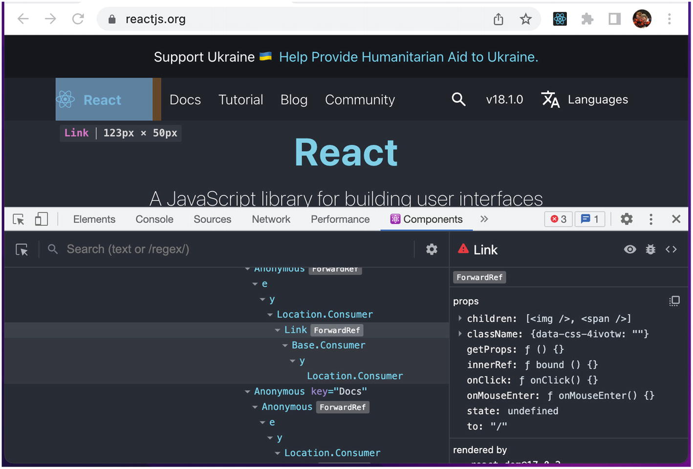
*Hình 2-18: React Developer Tools browser extension hiển thị trang bảng điều khiển devtools với một phần tử được làm nổi bật*

Extension sử dụng `Devtools API` để tạo một bảng điều khiển tùy chỉnh trong giao diện công cụ dành cho nhà phát triển của trình duyệt. Nó phân tích nội dung trang và "mở gói" (unpacks) nó thành một cây thành phần (component tree) có thể duyệt được bên trong trang bảng điều khiển.

## Tóm tắt (Summary)

Đúng như tên gọi (extension - phần mở rộng), browser extension thiên về việc mở rộng trình duyệt hơn là mở rộng trang web. WebExtensions API cho phép extension thực hiện các hành động mà các trang web thông thường không thể thực hiện được.

Browser extension được cấu thành từ một tập hợp các thành phần. Thành phần bắt buộc duy nhất là manifest. Các thành phần tùy chọn bao gồm background script, trang popup, trang tùy chọn, các trang devtools và content script.

Chương tiếp theo sẽ đưa bạn tham gia một khóa học cấp tốc bao gồm cách xây dựng và cài đặt một browser extension cơ bản.
