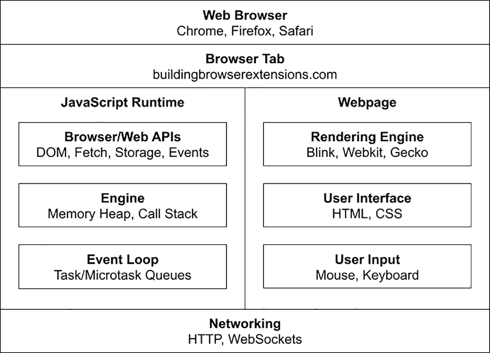
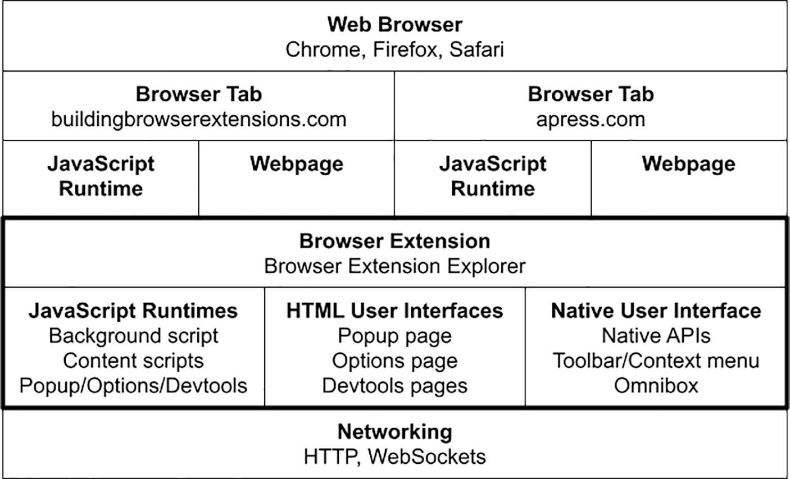
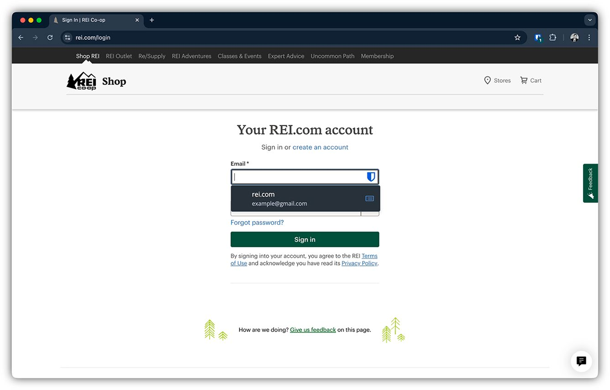
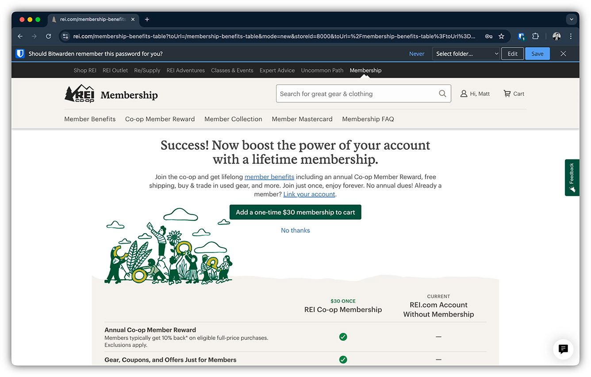
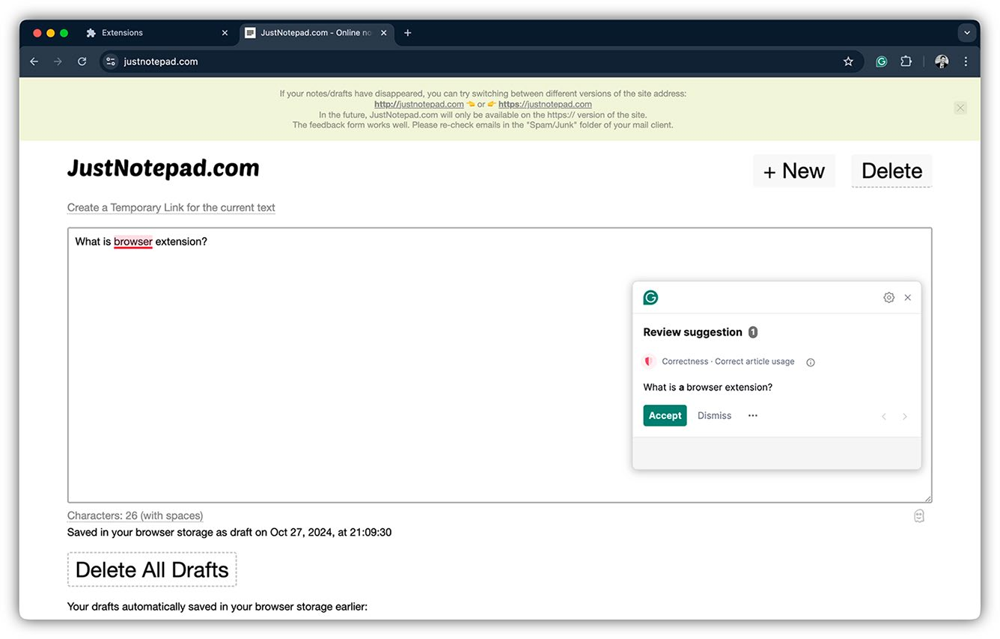
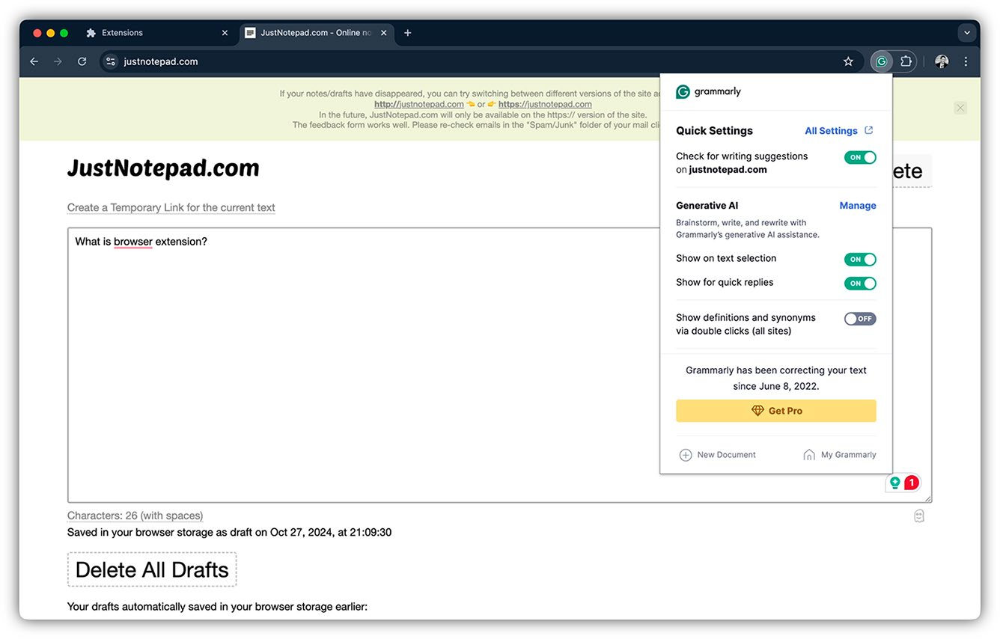
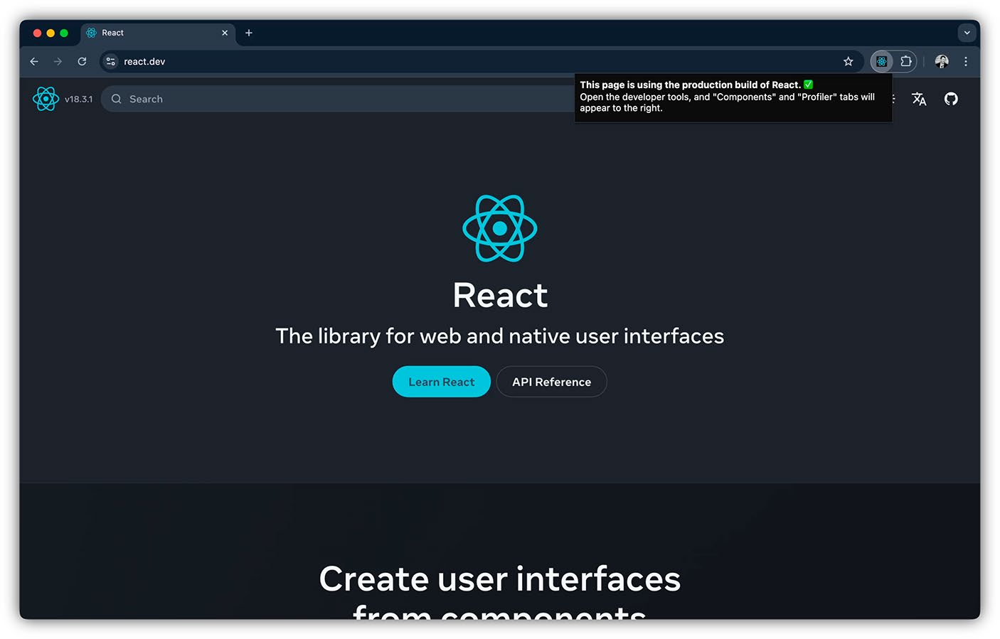
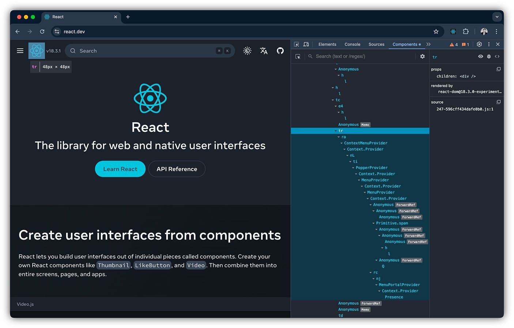
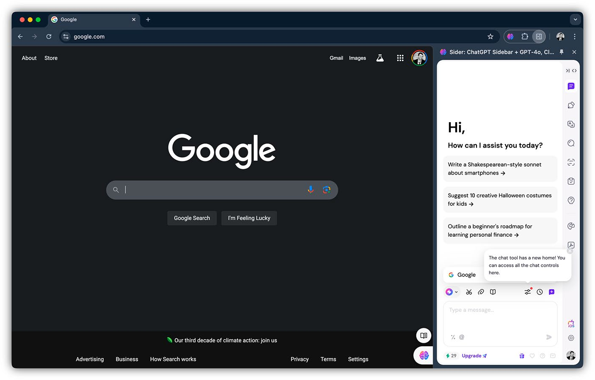
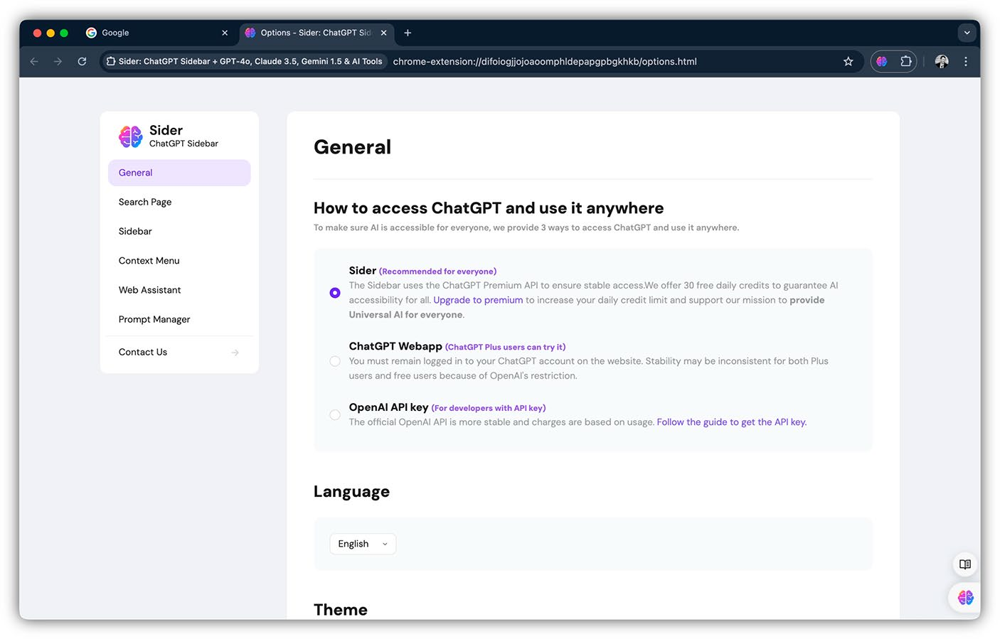

# Chương 2: Các Yếu tố Cơ bản của Tiện ích mở rộng Trình duyệt

Giống như hầu hết các nền tảng phần mềm, tiện ích mở rộng trình duyệt có thể được chia thành một vài phần riêng biệt về mặt khái niệm. Các nhà phát triển mới làm quen với thế giới tiện ích mở rộng có thể thấy các đặc điểm riêng của những phần này khá khó để lĩnh hội, vì một số hành vi có vẻ dư thừa hoặc không trực quan. Việc hiểu cách các phần của tiện ích mở rộng ăn khớp với nhau là cực kỳ quan trọng để trở thành một chuyên gia phát triển tiện ích mở rộng trình duyệt.

> [!NOTE]
> Chương này sẽ giới thiệu sơ lược về từng phần của tiện ích mở rộng trình duyệt mà không đi sâu vào quá nhiều mã nguồn. Các chương tiếp theo sẽ đi sâu vào từng phần này.

## Mô hình Trình duyệt

Trước khi khám phá các yếu tố khác nhau của tiện ích mở rộng trình duyệt, trước tiên chúng ta hãy bắt đầu bằng việc xem xét hành vi mặc định của một trình duyệt. Hãy xem xét sơ đồ của một trình duyệt web với một tab đang mở (Hình 2-1).

*Hình 2-1: Sơ đồ mô hình trình duyệt web cơ bản với một tab đang mở, bao gồm các thành phần Tab, Địa chỉ URL và Nội dung trang.*

Dưới đây là sơ đồ mở rộng của một trình duyệt web với nhiều tab đang mở (Hình 2-2).

*Hình 2-2: Sơ đồ mở rộng của trình duyệt web với nhiều tab đang mở, mỗi tab có địa chỉ URL và nội dung trang riêng biệt.*

Khi một extension được cài đặt, thì sơ đồ của một trình duyệt sẽ trông như này (Hình 2-3)

*Hình 2-3: Sơ đồ trình duyệt với nhiều tab và một tiện ích mở rộng được cài đặt, cho thấy cách tiện ích tích hợp vào môi trường trình duyệt.*

### Quan sát và Chặn các Yêu cầu Mạng

Thông thường, các yêu cầu mạng được gửi từ một trang web sẽ được trình duyệt xử lý trực tiếp. Tiện ích mở rộng trình duyệt có thể được cấp quyền để hoạt động như một "miếng đệm" (shim) cho các yêu cầu mạng, nơi các yêu cầu được gửi đến trang sẽ được tiện ích xử lý trước khi được chuyển đến trình duyệt. Điều này có nghĩa là tiện ích có thể thêm các quy tắc để sửa đổi các yêu cầu có điều kiện, hoặc thậm chí chặn chúng hoàn toàn. Nó cũng có nghĩa là tiện ích có thể nhìn thấy một luồng lưu lượng truy cập vào và ra khỏi trang theo thời gian thực.

## Các Yếu tố của Tiện ích mở rộng Trình duyệt

Phần trước đã đề cập đến tiện ích mở rộng trình duyệt như một thực thể tổng thể. Điều này hữu ích khi cố gắng nắm bắt khái niệm một cách toàn diện. Tuy nhiên, như đã ám chỉ ở phần giới thiệu chương này, tiện ích mở rộng trình duyệt tồn tại như một bộ sưu tập các yếu tố bán độc lập. Phần này sẽ xem xét từng yếu tố này ở mức độ cao.

### Tệp Manifest của Tiện ích mở rộng

Tệp manifest là "cuốn sách quy tắc" cho tiện ích mở rộng trình duyệt. Mọi tiện ích đều bắt buộc phải cung cấp tệp manifest này dưới dạng dữ liệu JSON trong tệp `manifest.json`. Một số ví dụ về những gì có trong manifest:

- Thông tin công khai như tên tiện ích, mô tả, phiên bản semantic, biểu tượng và tác giả.
- Các con trỏ đến các tệp điểm đầu vào (entrypoint) cho các tập lệnh nền (background scripts), trang popup, trang tùy chọn (options pages), trang bảng điều khiển bên (side panel pages), trang devtools và các bản lệnh nội dung (content scripts).
- Các yêu cầu và cấu hình tiện ích cần để hoạt động bình thường, chẳng hạn như các quyền (permissions), chính sách bảo mật nội dung (CSP), chính sách nguồn gốc chéo (cross-origin policies) và các phiên bản trình duyệt tối thiểu.
- Các bộ quy tắc khớp mẫu (pattern-match) để quản lý yêu cầu mạng, các tên miền được kích hoạt và các tài nguyên mà tiện ích muốn đưa vào trang thông qua bản lệnh nội dung.
- Các tùy chọn linh tinh đặc thù khác của tiện ích như cho phép chế độ ngoại tuyến, chế độ ẩn danh và các phím tắt bàn phím.

> [!NOTE]
> Các chi tiết cụ thể về cách viết tệp `manifest.json` có thể được tìm thấy trong Chương 5.

### Manifest V2 và V3

Thế giới tiện ích mở rộng trình duyệt đang ở những giai đoạn cuối cùng của một giai đoạn chuyển đổi kéo dài nhiều năm giữa hai phiên bản của tệp `manifest.json`: phiên bản 2 (v2) và phiên bản 3 (v3). Manifest V3 mới (thường được gọi là "MV3") thay đổi đáng kể cách các tiện ích thực thi và thay đổi các API mà chúng có thể truy cập.

> [!NOTE]
> Tại thời điểm viết cuốn sách này, các trình duyệt Chromium đã loại bỏ một cách hiệu quả hoàn toàn các tiện ích Manifest V2. Dù tốt hay xấu, Manifest V3 hiện là hình thức tiện ích mở rộng thống trị. Do đó, ấn bản này của cuốn sách *Building Browser Extensions* chỉ cung cấp thông tin tối thiểu về các khái niệm Manifest V2.

### Bản lệnh nền (Background Scripts)

Mục đích chính của các bản lệnh nền là xử lý các sự kiện trình duyệt. Những sự kiện này có thể là các sự kiện vòng đời của tiện ích như cài đặt hoặc gỡ cài đặt, hoặc chúng có thể là các sự kiện trình duyệt như điều hướng đến một trang web hoặc thêm một dấu trang mới.

Mặc dù các bản lệnh nền được cung cấp môi trường chạy JavaScript riêng, chúng không tồn tại tách biệt. Chúng có thể truy cập các WebExtensions API và do đó có khả năng thực hiện các hành động như trao đổi tin nhắn với các phần khác của tiện ích, trao đổi tin nhắn với các tiện ích khác, hoặc lập trình chèn các bản lệnh nội dung vào một trang web.

Các bản lệnh nền đã thay đổi đáng kể giữa Manifest V2 và Manifest V3. Trong Manifest V2, bản lệnh nền có tùy chọn là "kiên trì" (persistent), nghĩa là bản lệnh nền được khởi tạo đúng một lần và nằm trong bộ nhớ cho đến khi trình duyệt đóng lại, hoặc "không kiên trì" (nonpersistent), nơi bản lệnh nền tồn tại dưới dạng một "trang sự kiện" (event page) được khởi tạo theo yêu cầu bất cứ khi nào có sự kiện trình duyệt liên quan xảy ra. Trong Manifest V3, các bản lệnh nền tồn tại dưới dạng **Service Workers**, phần lớn mô phỏng hành vi của các bản lệnh nền không kiên trì trong Manifest V2.

> [!NOTE]
> Chương 6 bao gồm thêm chi tiết về các bản lệnh nền.

### Các trang Giao diện người dùng của Tiện ích (Extension UI Pages)

Các trang giao diện người dùng của tiện ích là các yếu tố giao diện tùy chỉnh cho phép tiện ích mở rộng trình duyệt tương tác với người dùng. Mặc dù được viết và kết xuất như các trang web, chúng được tích hợp trực tiếp vào trình duyệt. Các trang này cung cấp chức năng mở rộng thông qua WebExtensions API, cho phép các tiện ích quản lý cài đặt, tương tác với nội dung web và hiển thị thông tin ngữ cảnh vượt ra ngoài các trang web tiêu chuẩn.

#### Trang Popup (The Popup Page)

Trang popup là một vùng chứa trình duyệt gốc mà các tiện ích mở rộng có thể sử dụng để hiển thị một giao diện người dùng tùy chỉnh. Trang popup hoạt động như một hộp thoại "bật lên" trên trang web khi người dùng nhấp vào nút tiện ích trên thanh công cụ. Trang popup sẽ luôn xuất hiện ngay bên dưới thanh công cụ. Vì nó có thể được truy cập nhanh chóng và có thể hiển thị trên bất kỳ trang web nào, trang popup thường chứa nội dung mà người dùng cần truy cập dễ dàng.

Các trang popup được kết xuất giống như các trang web thông thường, nhưng tính chất giống hộp thoại của chúng đồng nghĩa với việc chúng "dùng một lần": trang popup sẽ được kết xuất mới mỗi khi được mở và được giải phóng (unloaded) khi đóng lại. Giống như các bản lệnh nền, trang popup có thể truy cập WebExtensions API, nghĩa là chúng có những khả năng không có sẵn cho các trang web thông thường.

#### Trang Tùy chọn (The Options Page)

Trang tùy chọn là một vùng chứa trình duyệt gốc mà các tiện ích mở rộng có thể sử dụng để hiển thị một giao diện người dùng tùy chỉnh. Trang tùy chọn hoạt động như một trang web độc lập mở ra khi người dùng nhấp vào "Tùy chọn" (Options) trong menu ngữ cảnh của tiện ích trên thanh công cụ.

Cái tên "tùy chọn" có chút gây hiểu lầm: trang này không bị giới hạn ở việc chỉ hiển thị các tùy chọn cho tiện ích. Giống như trang popup, đây là một trang web đầy đủ tính năng với quyền truy cập vào WebExtensions API, nghĩa là bạn có khả năng sử dụng nó như một ứng dụng web hoàn chỉnh.

> [!NOTE]
> Tham khảo Chương 7 để biết thêm chi tiết về cách các trang này hoạt động và cách sử dụng chúng.

#### Bảng điều khiển bên (The Side Panel)

Bảng điều khiển bên là một vùng chứa trình duyệt gốc mà các tiện ích Chromium có thể sử dụng để hiển thị một giao diện người dùng tùy chỉnh trong một thanh bên (sidebar) song song với nội dung chính của trang web. Bảng điều khiển bên hoạt động như một không gian dọc, có thể thay đổi kích thước, mở ra ở bên cạnh cửa sổ trình duyệt, thường là ở bên phải hoặc bên trái, cung cấp cho người dùng quyền truy cập liên tục vào các công cụ và thông tin khi họ điều hướng.

Bảng điều khiển bên rất lý tưởng cho nội dung mà người dùng cần tham khảo hoặc tương tác thường xuyên khi duyệt web, chẳng hạn như ghi chú, danh sách việc cần làm hoặc thông tin ngữ cảnh liên quan đến trang web đang mở. Không giống như các trang popup, bảng điều khiển bên tồn tại xuyên suốt nhiều trang và có thể mở cho đến khi người dùng đóng thủ công. Tương tự như trang tùy chọn và trang popup, bảng điều khiển bên có quyền truy cập vào WebExtensions API, cho phép các nhà phát triển tận dụng các khả năng nâng cao không có sẵn cho các trang web tiêu chuẩn.

> [!NOTE]
> Các tiện ích Chromium sử dụng `side panels`, trong khi các tiện ích Firefox sử dụng `sidebars`. Các yếu tố này được định nghĩa khác nhau trong các bản manifest tương ứng nhưng gần như giống hệt nhau về cả hình thức và hành vi.

### Bản lệnh nội dung (Content Scripts)

Thuật ngữ "bản lệnh nội dung" (content script) dùng để chỉ bất kỳ tập lệnh (script) hoặc kiểu dáng (style) nào được tiện ích mở rộng trình duyệt đưa vào một trang web. JavaScript có thể được chèn một cách khai báo thông qua bản manifest hoặc lập trình từ một trang tiện ích hoặc bản lệnh nền bằng WebExtensions API. Bản lệnh nội dung có thể bao gồm JavaScript, CSS hoặc cả hai.

JavaScript được chèn chạy trong một trong hai môi trường. Theo mặc định, nó hoạt động trong một ngữ cảnh thực thi riêng biệt, tách biệt khỏi các tập lệnh riêng của trang web. Trong thiết lập này, tập lệnh có thể tương tác đầy đủ với DOM nhưng không thể truy cập các biến hoặc hàm JavaScript do trang web định nghĩa. Ngược lại, các tiện ích có thể chèn các tập lệnh vào cùng một ngữ cảnh thực thi với chính trang web đó, cho phép truy cập trực tiếp vào các biến và chức năng của nó. Chế độ này cho phép tích hợp sâu hơn, chẳng hạn như sửa đổi hành vi của trang hoặc can thiệp vào logic bên trong trang.

Trong khi các bản lệnh nội dung có thể thao tác đầy đủ với DOM và triển khai các tính năng như các widget trong trang, chúng bị hạn chế quyền truy cập vào WebExtensions API. Ví dụ, chúng không thể truy cập các API đặc quyền vốn có sẵn cho popup, trang tùy chọn hoặc bản lệnh nền. Tuy nhiên, chúng có thể giao tiếp với các thành phần đặc quyền này thông qua hệ thống gửi tin nhắn (messaging), cho phép chúng ủy quyền thực hiện các hành động bị hạn chế.

> [!NOTE]
> Tham khảo Chương 8 để biết thêm chi tiết về cách thức hoạt động và cách sử dụng các bản lệnh nội dung.

#### Bảng điều khiển và Thanh bên DevTools (Devtools Panels and Sidebars)

Các trang bảng điều khiển và thanh bên devtools là các vùng chứa trình duyệt gốc mà các tiện ích mở rộng có thể sử dụng để hiển thị một giao diện người dùng tùy chỉnh. Các giao diện devtools hoạt động như các bảng được lồng trong công cụ dành cho nhà phát triển gốc của trình duyệt khi người dùng chọn các tab tương ứng của chúng trong giao diện công cụ dành cho nhà phát triển.

Giống như các trang UI của tiện ích, đây là một trang web đầy đủ tính năng, nhưng giống như các bản lệnh nội dung, nó bị hạn chế quyền truy cập vào WebExtensions API. Tuy nhiên, nó được cung cấp quyền truy cập vào Devtools API bổ sung, có thể được sử dụng để thực hiện các hành động như kiểm tra trang và quan sát lưu lượng mạng của trang.

> [!NOTE]
> Tham khảo Chương 9 để biết thêm chi tiết về cách các trang này hoạt động và cách sử dụng chúng.

## Các Yếu tố của Tiện ích trong Thực tế

Để giúp hiểu cách tất cả các yếu tố này kết hợp với nhau, hãy cùng xem xét cách các mảnh ghép này được đưa vào một vài tiện ích mở rộng trình duyệt phổ biến. Dựa trên những gì chúng ta biết về cách hoạt động của các yếu tố khác nhau, chúng ta có thể hiểu cách tiện ích thực hiện các giao diện người dùng này ngay cả khi không có quyền truy cập vào mã nguồn của chúng.

### Bitwarden

Bitwarden là một tiện ích mở rộng trình duyệt có thể lưu trữ và tự động điền mật khẩu của người dùng một cách an toàn, cũng như ghi lại các mật khẩu mới khi chúng được gửi đi. Giao diện của nó bao gồm một menu popup từ thanh công cụ trình duyệt để truy cập nhanh vào các thông tin đăng nhập đã lưu, một chế độ xem kho lưu trữ (vault) để quản lý tất cả mật khẩu và công cụ tạo mật khẩu để tạo ra các mật khẩu mạnh và duy nhất. Bitwarden cũng có các nút tự động điền nội dòng (inline) xuất hiện trực tiếp trong các trường đăng nhập, cho phép người dùng điền thông tin mà không cần rời khỏi trang web.

Bitwarden sử dụng một **bản lệnh nội dung** để tìm và điền các trường biểu mẫu xác thực, cũng như để kết xuất các widget quản lý mật khẩu từ bên trong các trường biểu mẫu (Hình 2-4). Bitwarden cũng theo dõi lưu lượng truy cập vào và ra khỏi trình duyệt để tìm các yêu cầu đặt hoặc cập nhật mật khẩu, sau đó ghi lại dữ liệu yêu cầu vào danh sách thông tin tài khoản đã mã hóa của bạn. Ngoài ra, Bitwarden thêm các tùy chọn vào menu chuột phải (Hình 2-6) bằng cách sử dụng Context Menu API.

*Hình 2-4: Giao diện Bitwarden tự động điền thông tin đăng nhập vào các trường biểu mẫu trên trang web thông qua bản lệnh nội dung.*

*Hình 2-5: Bitwarden phát hiện yêu cầu mạng để signup thông qua bản lệnh nội dung.*

*Hình 2-6: Menu ngữ cảnh của Bitwarden.*

### Grammarly

Grammarly là một tiện ích mở rộng trình duyệt theo dõi văn bản người dùng nhập vào trình duyệt và tự động đưa ra các gợi ý về cách sửa lỗi hoặc cải thiện nó. Giao diện của nó bao gồm một thẻ popup trực tiếp trên các trường văn bản, hiển thị các gợi ý nhanh về chính tả, ngữ pháp và cải thiện phong cách. Grammarly cũng tích hợp một trình phát hiện giọng điệu (tone detector) xuất hiện theo thời gian thực để gợi ý các điều chỉnh về độ rõ ràng, mức độ thu hút và tính trang trọng, đồng thời cung cấp một bảng thông tin chi tiết để theo dõi hiệu suất viết lách trên nhiều nội dung khác nhau.

Tương tự như cách Bitwarden phát hiện các trường biểu mẫu xác thực, Grammarly sử dụng một **bản lệnh nội dung** để phát hiện một cách thông minh khi người dùng đang nhập nội dung vào trang, phân tích nội dung đó và kết xuất các gợi ý lên trên nội dung đó (Hình 2-7). Tiện ích này cũng có khả năng tổng hợp tất cả các gợi ý đang hoạt động vào một widget bản lệnh nội dung hợp nhất (Hình 2-8). Grammarly cũng cung cấp các nút chuyển đổi cài đặt tiện ích trong trang popup (Hình 2-9).

*Hình 2-7: Grammarly sử dụng bản lệnh nội dung để phát hiện và kết xuất các gợi ý sửa lỗi ngữ pháp trực tiếp trên nội dung trang web.*

*Hình 2-8: Widget bản lệnh nội dung của Grammarly tổng hợp tất cả các gợi ý đang hoạt động ở góc trường nhập văn bản.*

*Hình 2-9: Trang popup của Grammarly với các nút chuyển đổi cài đặt tiện ích.*

### React Developer Tools

React Developer Tools là một tiện ích mở rộng trình duyệt cho phép người dùng hiểu cách một ứng dụng React đang kết xuất trong trang. Tiện ích này có thể phân tích trang web để phát hiện xem nó có phải là một ứng dụng React hay không. Nếu có, biểu tượng trên thanh công cụ sẽ hiển thị thông báo, và trang popup sẽ thông tin cho người dùng biết loại ứng dụng React nào đang hiện diện (Hình 2-10). Tiện ích sử dụng **Devtools API** để tạo một bảng điều khiển tùy chỉnh trong giao diện công cụ dành cho nhà phát triển của trình duyệt. Nó phân tích nội dung trang và giải nén nó thành một cây thành phần (component tree) có thể duyệt được bên trong trang bảng điều khiển (Hình 2-11).

*Hình 2-10: Trang popup của React Developer Tools thông báo cho người dùng biết loại ứng dụng React nào đang hiện diện trên trang web.*

*Hình 2-11: Bảng điều khiển tùy chỉnh của React Developer Tools trong giao diện công cụ dành cho nhà phát triển, hiển thị cây thành phần (component tree) có thể duyệt được.*

### Sider.ai

Sider.ai là một tiện ích mở rộng trình duyệt tăng cường trải nghiệm duyệt web bằng cách cung cấp các thông tin chi tiết và ngữ cảnh được hỗ trợ bởi AI bên cạnh nội dung người dùng xem. Giao diện của nó bao gồm một **bảng điều khiển bên (side panel)** phản hồi linh hoạt mà người dùng có thể mở để truy cập các bản tóm tắt, giải thích và tài nguyên liên quan cho bất kỳ trang web nào, giúp việc nghiên cứu và khám phá nội dung trở nên lý tưởng. Trang tùy chọn của tiện ích cung cấp các cài đặt tùy chỉnh, cho phép người dùng kiểm soát loại thông tin chi tiết nào được hiển thị, điều chỉnh tùy chọn ngôn ngữ và cá nhân hóa giao diện để phù hợp hơn với thói quen nghiên cứu hoặc đọc sách của họ.

*Hình 2-12: Bảng điều khiển bên (side panel) của Sider.ai cung cấp giao diện chat AI để truy cập các bản tóm tắt, giải thích và tài nguyên liên quan cho trang web đang xem.*

*Hình 2-13: Trang tùy chọn của Sider.ai cho phép người dùng cấu hình hành vi tổng thể của tiện ích, bao gồm loại thông tin chi tiết được hiển thị, tùy chọn ngôn ngữ và cá nhân hóa giao diện.*

## Tóm tắt

Trong chương này, chúng ta đã xem xét các thành phần cơ bản tạo nên một tiện ích mở rộng trình duyệt, bao gồm mô hình thực thi của các trình duyệt hiện đại và cách các tiện ích tích hợp vào môi trường đó. Chúng ta đã xem xét cách các tiện ích hoạt động độc lập với các trang web, với môi trường chạy (runtime) riêng, bề mặt giao diện người dùng và quyền truy cập vào các API trình duyệt đặc quyền.

Chúng ta đã giới thiệu từng yếu tố chính của tiện ích mở rộng, như bản manifest, các bản lệnh nền, trang popup, bảng điều khiển bên, trang tùy chọn, giao diện devtools và các bản lệnh nội dung. Sau đó, chúng ta đã giải thích cách các yếu tố này tương tác với cả nội dung web và chính trình duyệt. Chúng ta cũng đã so sánh các ngữ cảnh thực thi, mô hình quyền và các triển khai thực tế được tìm thấy trong các tiện ích phổ biến.

Chương tiếp theo sẽ đưa bạn đi sâu vào một khóa học cấp tốc (crash course) về cách xây dựng và cài đặt một tiện ích mở rộng trình duyệt cơ bản.
