# Chương 3: Khóa học cấp tốc về Browser Extension (Browser Extension Crash Course)

Các chương sau trong cuốn sách này sẽ đề giải chi tiết về các khía cạnh khác nhau của browser extension. Ngược lại, chương này sẽ hướng dẫn bạn cách nhanh nhất để bắt đầu và chạy thử browser extension. Khóa học cấp tốc này sẽ bao gồm việc xây dựng một browser extension đơn giản từ đầu. Nó sẽ *không* sử dụng bất kỳ thư viện hoặc phụ thuộc bên thứ ba nào, chỉ dùng HTML, CSS và JavaScript thuần tùy (vanilla).

Chương này dành cho các nhà phát triển chưa từng xây dựng extension trước đây; tuy nhiên, ngay cả khi bạn đã khá quen thuộc với việc phát triển extension, chương này vẫn có thể hữu ích vì nó đề cập đến một số khía cạnh của lĩnh vực này mà bạn có thể chưa từng thử nghiệm trước đây.

> [!IMPORTANT]
> Để đơn giản, khóa học cấp tốc này sẽ chỉ tập trung vào việc phát triển browser extension sử dụng **Manifest v3** cho **Google Chrome**. Việc tạo browser extension sử dụng Manifest v2, hoặc hỗ trợ các trình duyệt khác, yêu cầu các bước không được đề cập trong khóa học cấp tốc này.

## Tạo Manifest (Creating the Manifest)

Như đã mô tả ở chương trước, **manifest** của extension chủ yếu xác định những điều sau:

1. Extension được phép làm gì.
2. Các tệp tin của nó nằm ở đâu.

Bắt đầu bằng cách tạo một thư mục trống mới có tên `extension-crash-course`. Tất cả các tệp chúng ta tạo trong khóa học cấp tốc này sẽ được tạo bên trong thư mục đó:

```text
extension-crash-course/
└─ manifest.json
```

Bên trong thư mục này, hãy tạo tệp `manifest.json` đơn giản nhất có thể. Cấu trúc tệp được hiển thị ở đây:

**Tệp:** `manifest.json`

```json
{
  "name": "Extension Crash Course",
  "description": "Browser extension created from scratch",
  "version": "1.0",
  "manifest_version": 3
}
```

Các trường này xác định chuỗi tên chính thức của browser extension là `Extension Crash Course`, và chuỗi mô tả là `Browser extension created from scratch`. Các chuỗi này sẽ được phản ánh cả bên trong chính trình duyệt khi extension được cài đặt, cũng như trong **Chrome Web Store** khi extension được xuất bản. Tệp này cũng xác định phiên bản ngữ nghĩa (semantic version) `1.0`, cho biết phiên bản của gói extension. Nó cũng xác định chuỗi phiên bản manifest là `3`, cho trình duyệt biết tệp `manifest.json` nên được phân tích như thế nào.

## Extension Tối giản (Minimum Viable Extension)

Ngoài tệp manifest, tất cả các thành phần của browser extension đều là tùy chọn. Do đó, tệp `manifest.json` đơn lẻ này với một lượng nhỏ mã mẫu (boilerplate) chính là một browser extension tối giản. Extension này không có tính năng hay giao diện người dùng nào, và nó hầu như không gây ra chi phí vận hành (overhead) cho trình duyệt. Về cơ bản, nó tương đương với một lệnh `NOOP` trong browser extension. Tuy nhiên, Google Chrome vẫn sẽ vui vẻ cài đặt tệp đơn lẻ này như một browser extension mới giống như bất kỳ extension nào khác.

## Cài đặt Extension (Installing Your Extension)

Cách nhanh nhất để cài đặt và kiểm tra extension là tải nó vào Google Chrome bằng cách bật chế độ nhà phát triển (developer mode). Chế độ này có thể được bật trên trang Tiện ích (Chrome Extensions) của trình duyệt. Có hai cách để truy cập trang này:

* **⋮** > **Công cụ khác (More Tools)** > **Tiện ích (Extensions)** (Hình 3-1)
* Truy cập địa chỉ `chrome://extensions` trên trình duyệt.

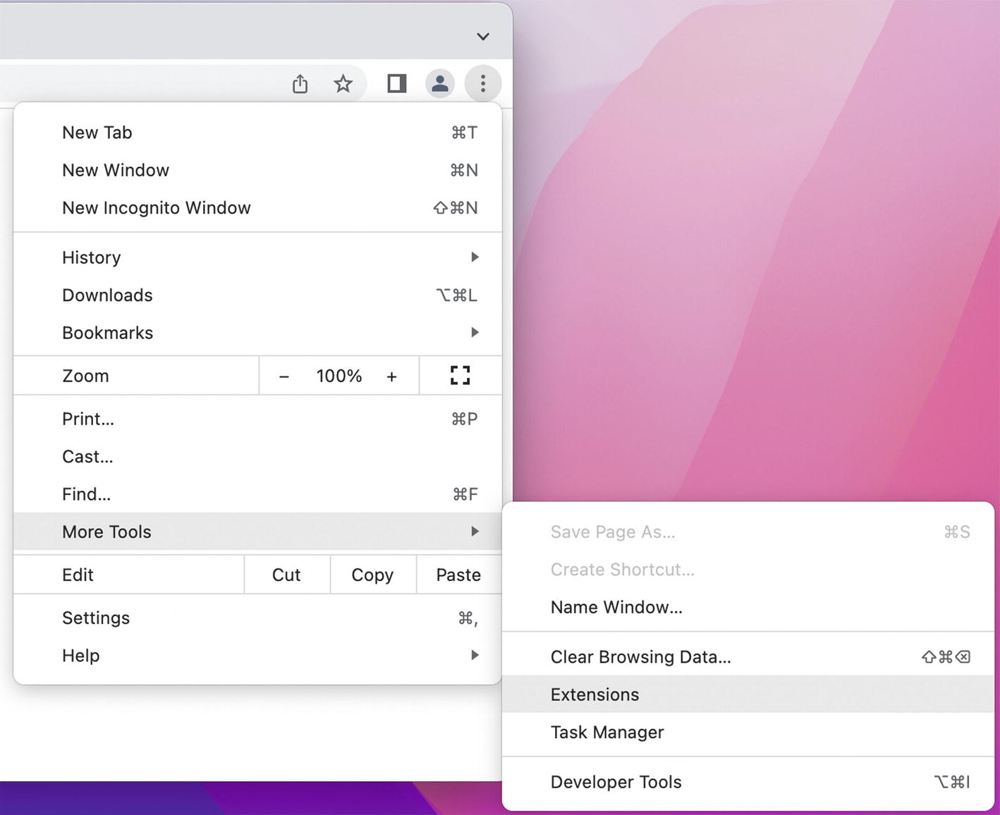
*Hình 3-1: Mở trang Chrome Extensions thông qua menu trình duyệt*

Hành vi mặc định của Google Chrome là không cho phép tải các extension từ hệ thống tệp cục bộ. Để cho phép điều này, trên trang Chrome Extensions, bạn cần bật công tắc **Chế độ nhà phát triển (Developer mode)**, được hiển thị trong Hình 3-2 và Hình 3-3.

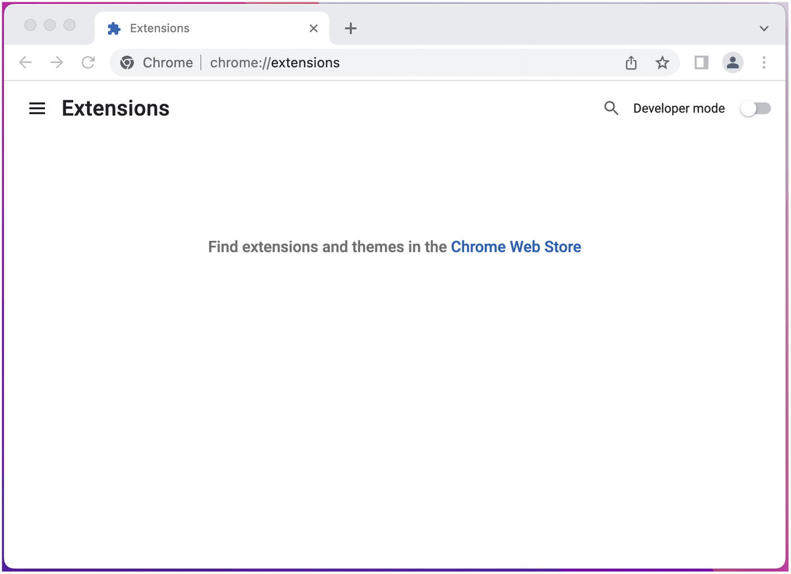
*Hình 3-2: Trang Chrome Extensions khi Chế độ nhà phát triển bị tắt*

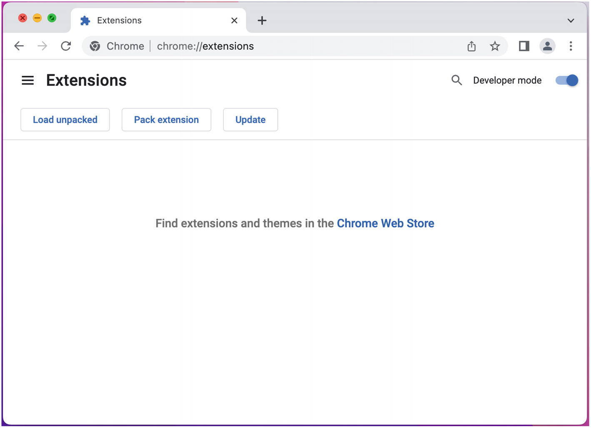
*Hình 3-3: Trang Chrome Extensions khi Chế độ nhà phát triển được bật*

Khi Chế độ nhà phát triển đã được bật, bạn có thể tải extension bằng cách nhấp vào "Tải tiện ích đã giải nén" (Load unpacked) và chọn thư mục `extension-crash-course` có chứa tệp `manifest.json` (Hình 3-4).

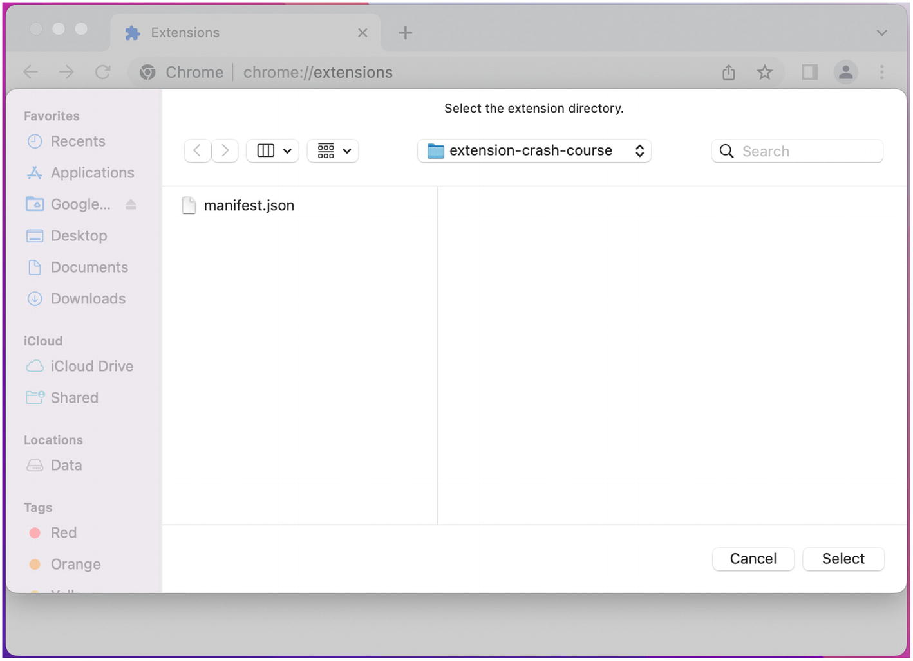
*Hình 3-4: Chọn thư mục để tải tiện ích đã giải nén*

Sau khi chọn thư mục, extension của bạn sẽ được cài đặt vào trình duyệt và trang Chrome Extensions sẽ phản ánh điều này bằng cách thêm một thẻ cho extension mới (Hình 3-5).

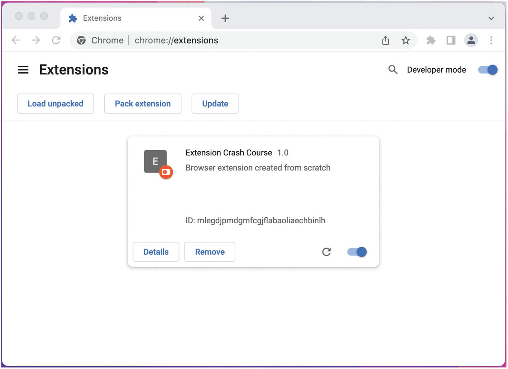
*Hình 3-5: Google Chrome với extension crash course vừa mới được cài đặt*

> [!NOTE]
> Để dễ dàng truy cập, bạn nên ghim biểu tượng thanh công cụ của extension để nó luôn hiển thị. Nhấp vào biểu tượng mảnh ghép (extension icon), sau đó nhấp vào nút ghim (pin button).

## Reload lại Extension (Reloading Your Extension)

Khi thực hiện thay đổi đối với mã nguồn của extension, việc hiểu khi nào những thay đổi đó sẽ xuất hiện có thể gặp khó khăn. Các phần khác nhau của extension sẽ được reload vào những thời điểm khác nhau. Thêm vào đó, việc có nhiều tab và cửa sổ mở đồng nghĩa với việc bạn có thể có nhiều phiên bản của một extension đang chạy cùng một lúc!

Có một số thời điểm khác nhau mà các phần của extension được reload:

* **Reload extension**: Lấy một bản sao mới của `manifest.json`, cập nhật background service worker, và đóng bất kỳ popup hoặc trang tùy chọn cũ nào đang mở. Điều này là bắt buộc khi tệp `manifest.json` thay đổi.
* **Reload trang extension (extension page reload)**: Là việc làm mới bất kỳ trang nào sử dụng giao thức extension `chrome-extension://`. Điều này là bắt buộc để phản ánh các thay đổi trong HTML, JS, CSS và hình ảnh trong các trang popup và options.
* **Reload trang web (web page reload)**: Là việc làm mới bất kỳ trang web nào có tiêm content script. Điều này là bắt buộc để phản ánh các thay đổi trong các content script đã được tiêm.
* **Reload devtools**: Là việc đóng và mở lại giao diện công cụ dành cho nhà phát triển của trình duyệt. Điều này là bắt buộc để phản ánh các thay đổi trong các trang devtools.

Có ba cách để ép buộc reload extension:

1. Gỡ cài đặt và cài đặt lại extension.
2. Nhấp vào biểu tượng reload ↺ trong thẻ tương ứng trên trang Chrome Extensions.
3. Reload extension bằng mã lệnh (programmatically) bằng cách sử dụng `chrome.runtime.reload()` hoặc `chrome.management.setEnabled()`.

> [!NOTE]
> Việc reload extension bằng mã lệnh sẽ được đề cập kỹ hơn trong chương *Phát triển và Triển khai Extension*.

Khi gửi tin nhắn (messages) bằng WebExtensions API, thỉnh thoảng bạn sẽ thấy một lỗi tương tự như sau:

```text
Uncaught (in promise) Error: Could not establish connection. Receiving end does not exist.
```

Trình duyệt hiểu rằng các phiên bản khác nhau của extension có thể đang chạy cùng một lúc, vì vậy chúng rõ ràng không cho phép gửi tin nhắn giữa các phần của extension thuộc các phiên bản khác nhau. Việc thấy lỗi này thường cho biết rằng một phần của extension cần được reload.

> [!NOTE]
> Với mục đích của khóa học cấp tốc này, việc reload extension *và* trang extension là đủ để phản ánh bất kỳ thay đổi nào bạn đã thực hiện.

## Thêm Background Script (Adding a Background Script)

Tiếp theo, hãy thêm một **background script** đơn giản và xác nhận rằng nó đang chạy. Trong cùng thư mục với `manifest.json`, hãy tạo tệp `background.js`:

```text
extension-crash-course/
├─ manifest.json
└─ background.js
```

Nội dung tệp như sau:

**Tệp:** `background.js`

```javascript
console.log('Hello from the background script!');
```

Manifest vẫn chưa biết tệp này tồn tại, vì vậy hãy cập nhật nó để tải tệp script này dưới dạng một background **service worker**:

**Tệp:** `manifest.json`

```json
{
  "name": "Extension Crash Course",
  "description": "Browser extension created from scratch",
  "version": "1.0",
  "manifest_version": 3,
  "background": {
    "service_worker": "background.js"
  }
}
```

Sau khi reload extension, bạn sẽ nhận thấy rằng thẻ trên trang Chrome Extensions hiển thị một liên kết đến service worker (Hình 3-6):

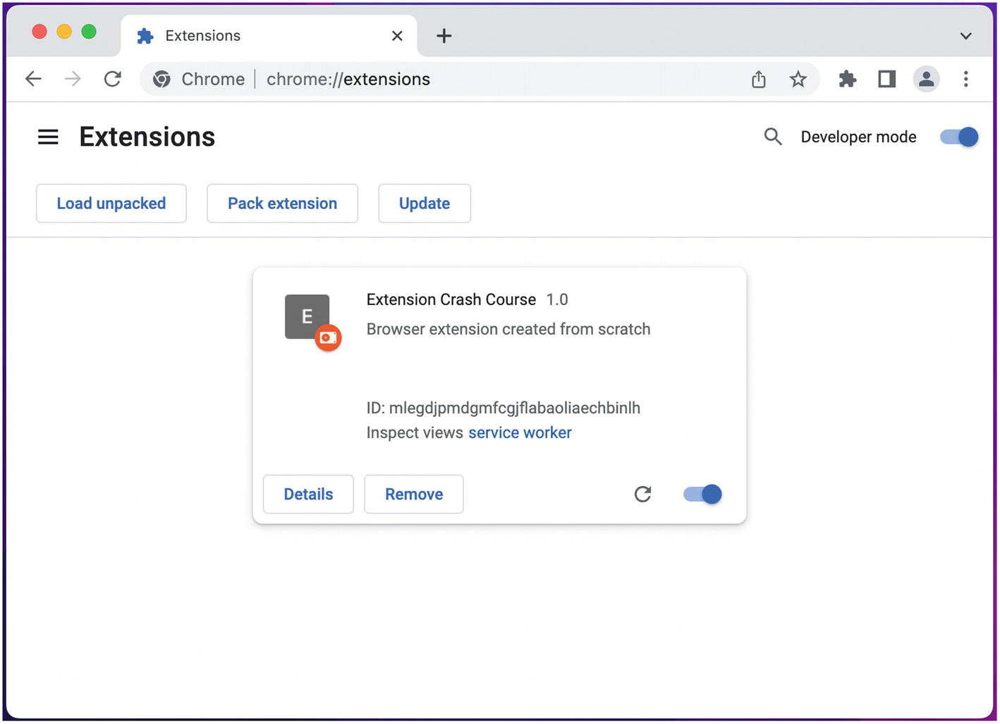
*Hình 3-6: Extension với liên kết đến service worker*

Liên kết này sẽ mở một bảng điều khiển công cụ dành cho nhà phát triển (developer tools console) cho background service worker, nơi bạn sẽ thấy kết quả của lệnh `console.log` (Hình 3-7).

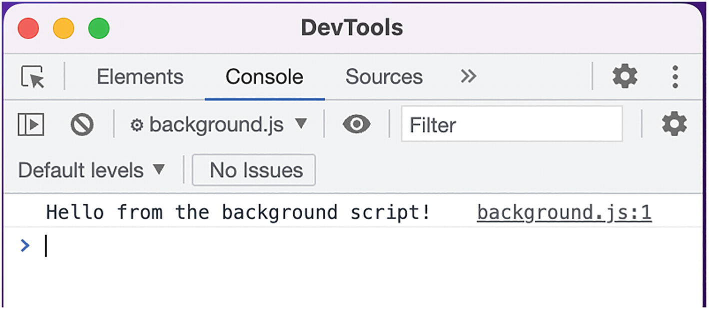
*Hình 3-7: Console cho background service worker*

Bây giờ script background đang hoạt động bình thường, hãy cấu hình nó để ghi log (log) các tin nhắn sự kiện (event messages) mà nó nhận được thông qua WebExtensions API:

**Tệp:** `background.js`

```javascript
console.log('Hello from the background script!');

chrome.runtime.onMessage.addListener((msg) => {
  console.log(msg.text);
});
```

> [!NOTE]
> Trình lắng nghe (listener) này sẽ không in ra bất cứ thứ gì cho đến khi một tin nhắn được gửi từ một nơi khác trong trình duyệt.

Bạn sẽ lưu ý rằng thẻ trong trang Chrome Extension có thể hiển thị service worker là *không hoạt động* (inactive) sau một khoảng thời gian. Vì mục đích giải phóng tài nguyên hệ thống không sử dụng, Google Chrome quyết định rằng service worker đang rảnh rỗi và tự động hủy bỏ (unload) nó. Worker sẽ được reload khi cần thiết, chẳng hạn như khi một tin nhắn extension được gửi đi.

> [!NOTE]
> Việc unload và reload các service worker là một khái niệm quan trọng. Nó sẽ được đề cập chi tiết hơn trong chương *Background Scripts*.

## Thêm trang Popup (Adding a Popup Page)

Tiếp theo, hãy thêm giao diện người dùng đầu tiên cho extension. Tạo một thư mục `popup` mới trong cùng thư mục với `manifest.json`. Bên trong thư mục mới, tạo ba tệp mới: `popup.html`, `popup.css` và `popup.js`:

```text
extension-crash-course/
├─ manifest.json
├─ background.js
└─ popup/
   ├─ popup.html
   ├─ popup.css
   └─ popup.js
```

Nội dung các tệp này như sau:

**Tệp:** `popup/popup.html`

```html
<!DOCTYPE html>
<html>
  <head>
    <link href="popup.css" rel="stylesheet" />
  </head>
  <body>
    <h1>This is the popup page!</h1>
    <script src="popup.js"></script>
  </body>
</html>
```

**Tệp:** `popup/popup.css`

```css
body {
  width: 400px;
  margin: 2rem;
}
```

**Tệp:** `popup/popup.js`

```javascript
console.log('Hello from the popup!');
```

Manifest cần được chỉ định khi nào cần render mã HTML này, vì vậy hãy cập nhật nó để mở trang popup khi nút trên thanh công cụ được nhấp vào:

**Tệp:** `manifest.json`

```json
{
  "name": "Extension Crash Course",
  "description": "Browser extension created from scratch",
  "version": "1.0",
  "manifest_version": 3,
  "background": {
    "service_worker": "background.js"
  },
  "action": {
    "default_popup": "popup/popup.html"
  }
}
```

Sau khi reload extension, hãy nhấp vào biểu tượng extension trên thanh công cụ để mở trang popup (Hình 3-8).

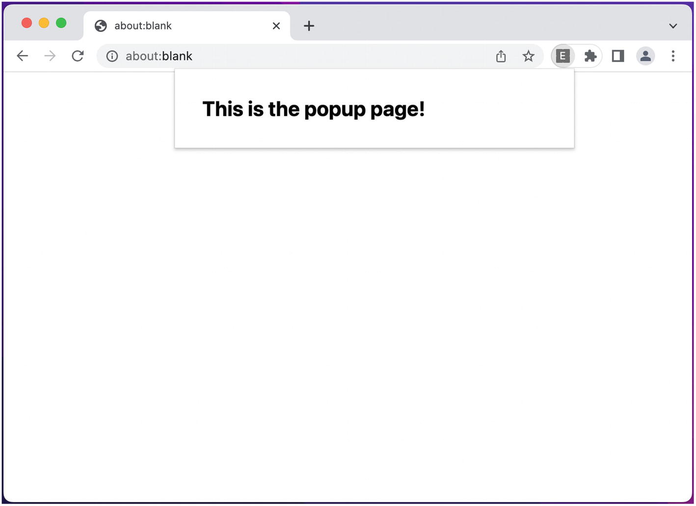
*Hình 3-8: Trang popup đã mở*

> [!NOTE]
> Vì bạn chưa xác định biểu tượng extension, Google Chrome sẽ tự động tạo một biểu tượng từ tên của extension. Như được hiển thị ở đây, mặc định là chữ cái đầu tiên của tên extension, chữ E, trên nền xám.

Tiếp theo, hãy gửi một tin nhắn từ popup đến background script. Cập nhật các tệp sau:

**Tệp:** `popup/popup.html`

```html
<!DOCTYPE html>
<html>
  <head>
    <link href="popup.css" rel="stylesheet" />
  </head>
  <body>
    <h1>This is the popup page!</h1>
    <button id="btn">Send popup message</button>
    <script src="popup.js"></script>
  </body>
</html>
```

**Tệp:** `popup/popup.js`

```javascript
console.log('Hello from the popup!');

document.querySelector("#btn").addEventListener('click', () => {
  chrome.runtime.sendMessage({ text: "Popup" });
});

chrome.runtime.onMessage.addListener((msg) => {
  document.body.innerHTML += `<div>${msg.text}</div>`;
});
```

Đoạn mã mới này thêm một nút vào popup để gửi tin nhắn đến phần còn lại của extension. Nó cũng thêm một trình lắng nghe (listener) cho các tin nhắn đến. Reload extension, nhấp vào nút mới trong popup, và kiểm tra background script để thấy tin nhắn được ghi log (Hình 3-9).

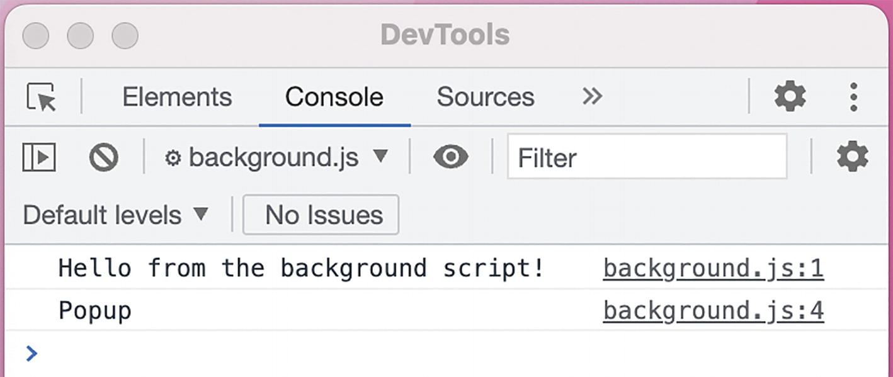
*Hình 3-9: Background script ghi log tin nhắn từ trang popup*

Lưu ý rằng, mặc dù chúng ta đã thiết lập một trình lắng nghe tin nhắn trong trang popup, nó không xử lý tin nhắn đến. Mặc dù hạ tầng tin nhắn của extension hoạt động như một hình thức phát sóng (broadcast), nguồn gửi tin nhắn sẽ không nhận lại chính tin nhắn đó.

## Thêm trang Tùy chọn (Adding an Options Page)

Tiếp theo, hãy thêm một **trang tùy chọn** (options page) với cấu trúc tương tự như trang popup:

```text
extension-crash-course/
├─ manifest.json
├─ background.js
├─ popup/
│  ├─ popup.html
│  ├─ popup.css
│  └─ popup.js
└─ options/
   ├─ options.html
   ├─ options.css
   └─ options.js
```

Nội dung các tệp như sau:

**Tệp:** `options/options.html`

```html
<!DOCTYPE html>
<html>
  <head>
    <link href="options.css" rel="stylesheet" />
  </head>
  <body>
    <h1>This is the options page!</h1>
    <button id="btn">Send options message</button>
    <script src="options.js"></script>
  </body>
</html>
```

**Tệp:** `options/options.css`

```css
body {
  margin: 2rem;
}
```

**Tệp:** `options/options.js`

```javascript
console.log('Hello from options!');

document.querySelector("#btn").addEventListener('click', () => {
  chrome.runtime.sendMessage({ text: "Options" });
});

chrome.runtime.onMessage.addListener((msg) => {
  document.body.innerHTML += `<div>${msg.text}</div>`;
});
```

Manifest cần được cấu hình để sử dụng tệp HTML này làm trang tùy chọn:

**Tệp:** `manifest.json`

```json
{
  "name": "Extension Crash Course",
  "description": "Browser extension created from scratch",
  "version": "1.0",
  "manifest_version": 3,
  "background": {
    "service_worker": "background.js"
  },
  "action": {
    "default_popup": "popup/popup.html"
  },
  "options_page": "options/options.html"
}
```

Reload extension, và mở trang tùy chọn của extension bằng cách nhấp chuột phải vào biểu tượng trên thanh công cụ và chọn "Tùy chọn" (Options) (Hình 3-10).

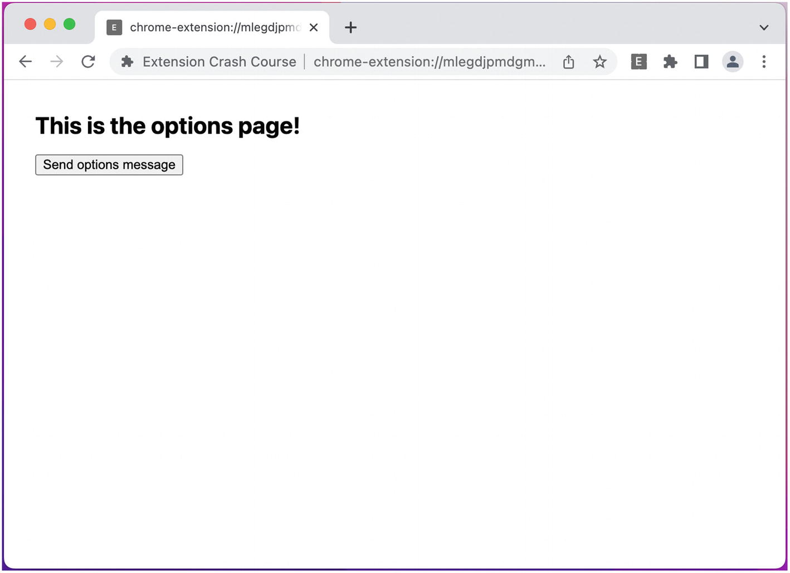
*Hình 3-10: Trang tùy chọn của extension*

Để kiểm tra hệ thống tin nhắn giữa các thành phần extension, hãy mở trang popup và nhấp vào nút của nó. Trình xử lý tin nhắn trên trang tùy chọn sẽ thêm tin nhắn vào trang (Hình 3-11).

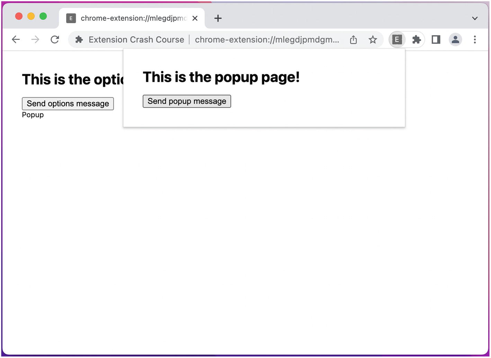
*Hình 3-11: Trang tùy chọn của extension với tin nhắn từ popup*

## Thêm Content Script (Adding a Content Script)

Tiếp theo, hãy tạo một số **content script** để thêm hành vi tương tự cho các trang tùy chọn và popup:

```text
extension-crash-course/
├─ manifest.json
├─ background.js
├─ popup/
│  ├─ popup.html
│  ├─ popup.css
│  └─ popup.js
├─ options/
│  ├─ options.html
│  ├─ options.css
│  └─ options.js
└─ content-scripts/
   ├─ content-script.css
   └─ content-script.js
```

Các content script này sẽ thêm một container tùy chỉnh đã được định kiểu vào trang:

**Tệp:** `content-scripts/content-script.css`

```css
#container {
  position: absolute;
  background-color: gray;
  color: white;
  padding: 2rem;
  top: 0;
  left: 0;
}
```

**Tệp:** `content-scripts/content-script.js`

```javascript
console.log('Hello from content script!');

document.body.innerHTML += `
<div id="container">
  <h1>This is the content script!</h1>
  <button id="btn">Send content script message</button>
</div>
`;

document.querySelector("#btn").addEventListener('click', () => {
  chrome.runtime.sendMessage({ text: "Content script" });
});

chrome.runtime.onMessage.addListener((msg) => {
  document.querySelector('#container').innerHTML += `<div>${msg.text}</div>`;
});
```

Cấu hình manifest để tiêm các content script này vào tất cả các trang web hợp lệ:

**Tệp:** `manifest.json`

```json
{
  "name": "Extension Crash Course",
  "description": "Browser extension created from scratch",
  "version": "1.0",
  "manifest_version": 3,
  "background": {
    "service_worker": "background.js"
  },
  "action": {
    "default_popup": "popup/popup.html"
  },
  "options_page": "options/options.html",
  "content_scripts": [
    {
      "matches": ["<all_urls>"],
      "css": ["content-scripts/content-script.css"],
      "js": ["content-scripts/content-script.js"]
    }
  ]
}
```

Mở một trang web thực tế chẳng hạn như `https://blank.org` để thấy content script được render (Hình 3-12):

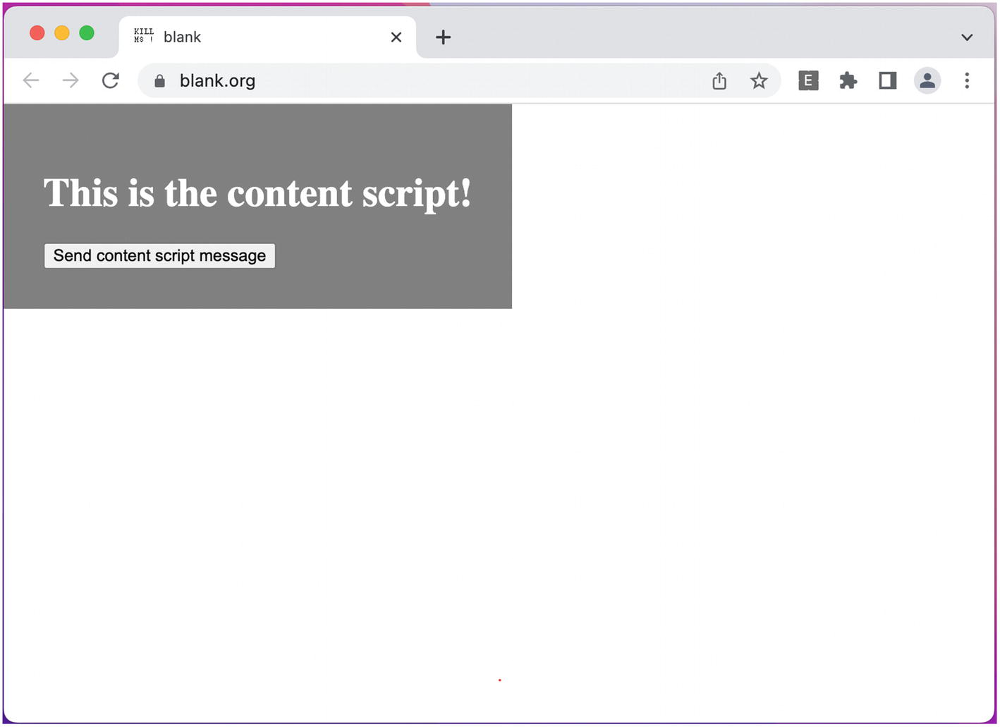
*Hình 3-12: Content script đang chạy trên trang web*

Ở trạng thái này, bạn sẽ có thể nhấp vào nút của content script và các tin nhắn sẽ hiển thị trong các giao diện của extension, chẳng hạn như trên trang tùy chọn.

## Làm việc với nhiều Tab (Working with Multiple Tabs)

Sau khi thử nghiệm với extension ở trạng thái này, bạn sẽ phát hiện ra rằng tin nhắn có thể được gửi thành công từ content script đến các phần khác của extension, nhưng tin nhắn *không* được nhận trong content script.

Điều này là do các content script vốn gắn liền với mô hình tab của trình duyệt. Có thể có nhiều tab đang mở cùng chạy một content script, vì vậy cần phải cân nhắc xem (các) phiên bản content script nào sẽ nhận được tin nhắn. Để gửi tin nhắn đến một content script, WebExtensions API cho phép bạn nhắm mục tiêu vào các tab riêng lẻ. Cập nhật script của popup như sau:

**Tệp:** `popup/popup.js`

```javascript
console.log('Hello from the popup!');

document.querySelector("#btn").addEventListener('click', () => {
  chrome.runtime.sendMessage({ text: "Popup" });

  chrome.tabs.query({
    active: true,
    currentWindow: true
  }, (tabs) => {
    chrome.tabs.sendMessage(
      tabs[0]?.id,
      { text: "Popup" }
    );
  });
});

chrome.runtime.onMessage.addListener((msg) => {
  document.body.innerHTML += `<div>${msg.text}</div>`;
});
```

Sau khi reload extension, bạn sẽ thấy rằng các tin nhắn được gửi từ nút của trang popup sẽ hiển thị trong chế độ xem của content script, nhưng *chỉ* trên tab đang hoạt động.

> [!TIP]
> Trước khi tiếp tục, hãy thử nghiệm với extension ở trạng thái hiện tại. Mở nhiều tab, nhiều cửa sổ trình duyệt, nhiều popup trong các cửa sổ khác nhau, và gửi tin nhắn từ các vị trí khác nhau để xem chúng hiển thị hoặc không hiển thị ở đâu. Kết quả có thể khiến bạn ngạc nhiên. Đây sẽ là một bài học bổ ích về cách mô hình tin nhắn broadcast hoạt động cho các extension.

## Thêm bảng điều khiển Devtools (Adding a Devtools Panel)

Tiếp theo, hãy thêm một bảng điều khiển (panel) vào công cụ dành cho nhà phát triển của Chrome. Tạo các tệp sau:

```text
extension-crash-course/
├─ manifest.json
├─ background.js
├─ popup/
│  ├─ popup.html
│  ├─ popup.css
│  └─ popup.js
├─ options/
│  ├─ options.html
│  ├─ options.css
│  └─ options.js
├─ content-scripts/
│  ├─ content-script.css
│  └─ content-script.js
└─ devtools/
   ├─ devtools.html
   ├─ devtools.js
   ├─ devtools_panel.html
   └─ devtools_panel.js
```

Việc thêm các giao diện devtools hơi khác một chút so with các giao diện extension khác. Extension được cung cấp một **trang không đầu** (headless page) cấp cao nhất, trang này sử dụng WebExtensions API trong một script để chèn các giao diện công cụ dành cho nhà phát triển tùy chỉnh. Các tệp nên trông như sau:

**Tệp:** `devtools/devtools.html`

```html
<!DOCTYPE html>
<html>
  <body>
    <script src="devtools.js"></script>
  </body>
</html>
```

**Tệp:** `devtools/devtools.js`

```javascript
chrome.devtools.panels.create(
  "Devtools Panel",
  "",
  "/devtools/devtools_panel.html"
);
```

Tiếp theo, hãy cấu hình **panel** devtools để ghi log URL của tất cả các hoạt động mạng đi ra từ trang bằng cách sử dụng Devtools API:

**Tệp:** `devtools/devtools_panel.html`

```html
<!DOCTYPE html>
<html>
  <body>
    <h1>This is the devtools panel!</h1>
    <script src="devtools_panel.js"></script>
  </body>
</html>
```

**Tệp:** `devtools/devtools_panel.js`

```javascript
console.log("Hello from the devtools panel!");

chrome.devtools.network.onRequestFinished.addListener(
  (request) => {
    document.body.innerHTML +=
      `<div>${request.request.url}</div>`;
  }
);
```

Cuối cùng, cập nhật manifest để sử dụng trang không đầu devtools:

**Tệp:** `manifest.json`

```json
{
  "name": "Extension Crash Course",
  "description": "Browser extension created from scratch",
  "version": "1.0",
  "manifest_version": 3,
  "background": {
    "service_worker": "background.js"
  },
  "action": {
    "default_popup": "popup/popup.html"
  },
  "options_page": "options/options.html",
  "devtools_page": "devtools/devtools.html",
  "content_scripts": [
    {
      "matches": ["<all_urls>"],
      "css": ["content-scripts/content-script.css"],
      "js": ["content-scripts/content-script.js"]
    }
  ]
}
```

Bạn sẽ cần reload extension cũng như đóng và mở lại bất kỳ cửa sổ công cụ dành cho nhà phát triển nào đang mở để thấy các thay đổi. Truy cập bất kỳ trang web nào sẽ thấy lưu lượng truy cập của nó được ghi log (Hình 3-13).


*Hình 3-13: Bảng điều khiển Devtools ghi log lưu lượng mạng*

## Tóm tắt (Summary)

Trong chương này, bạn đã được hướng dẫn quy trình tạo một extension Chrome đơn giản. Mục đích của khóa học cấp tốc này là cung cấp các hướng dẫn từng bước về cách tạo một extension chạm đến tất cả các yếu tố giao diện người dùng khác nhau mà browser extension có thể sử dụng. Sau khi hoàn thành khóa học cấp tốc, bạn nên hiểu rõ về cách các giao diện người dùng khác nhau được tạo ra từ mã nguồn của chúng, cũng như cách bố trí manifest để đạt được các mục tiêu đó.

Bạn cũng nên có một hiểu biết rất cơ bản về cách sử dụng WebExtensions API. Khóa học cấp tốc này mới chỉ chạm đến một số phương thức cơ bản, nhưng nó cung cấp cho bạn khái niệm ban đầu về tất cả các cách thức khác nhau mà browser extension có thể thao tác với trình duyệt để đạt được mục tiêu của chúng.

Chương tiếp theo sẽ khám phá kiến trúc của browser extension, bao gồm cách tổ chức các tệp và cách các yếu tố khác nhau hoạt động bên trong trình duyệt.
