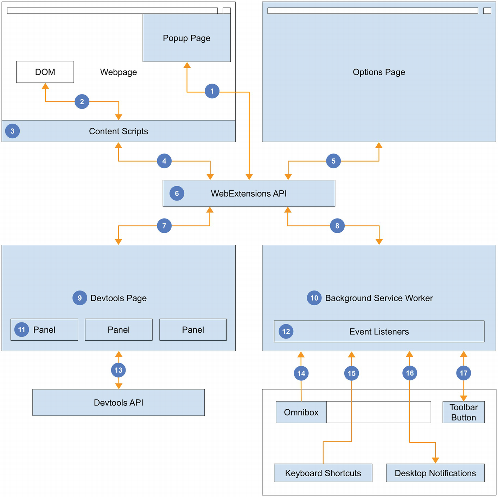
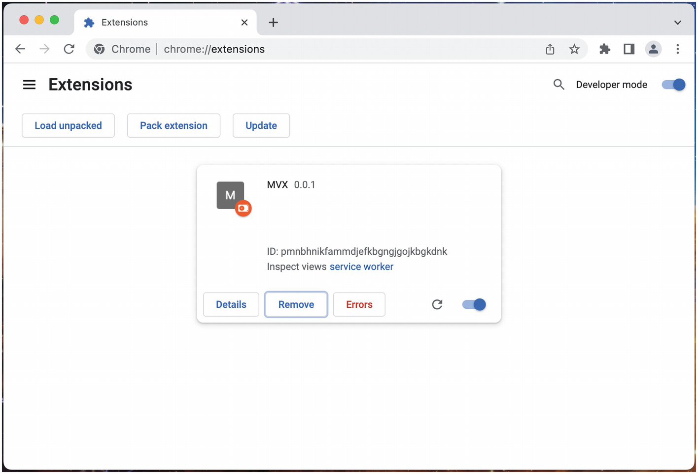
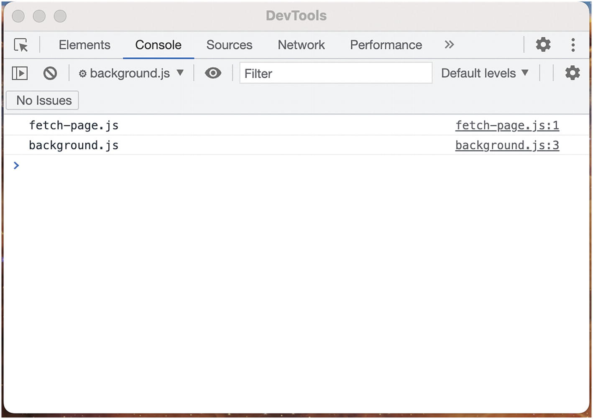
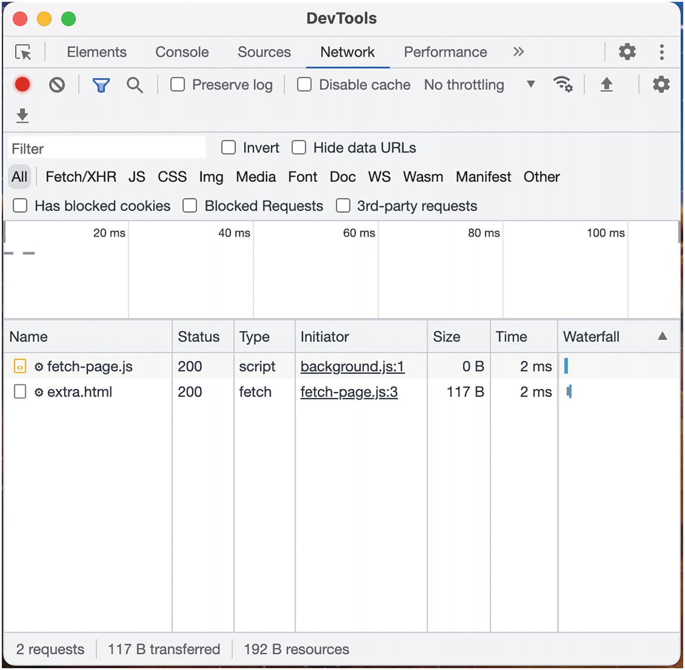
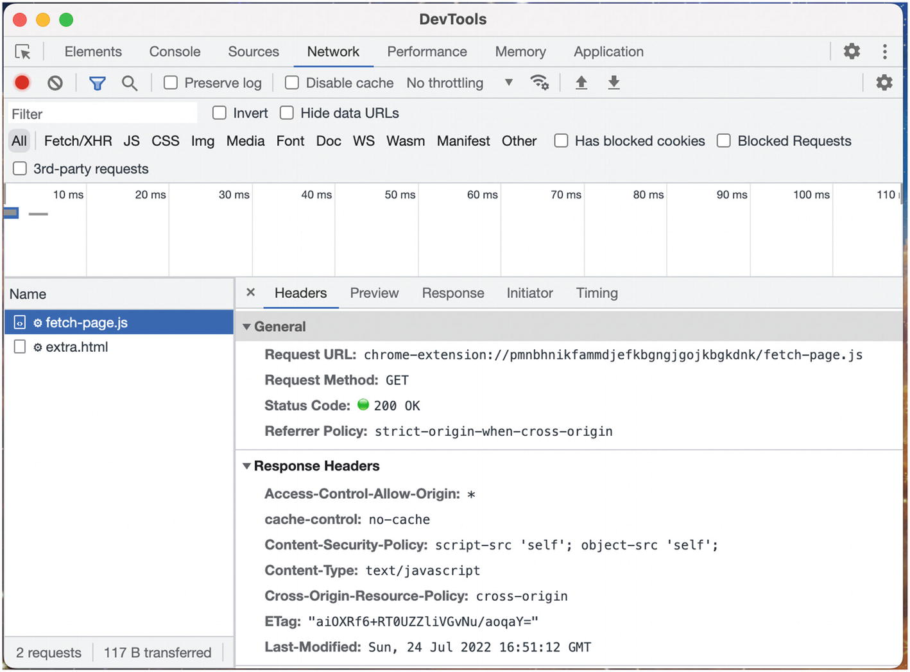
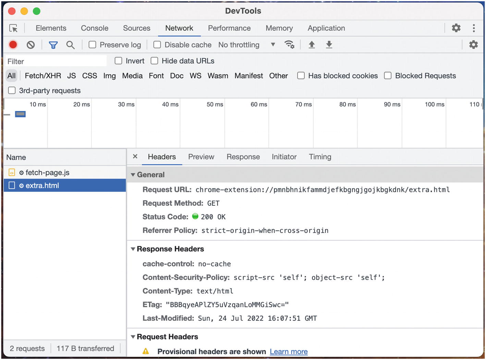
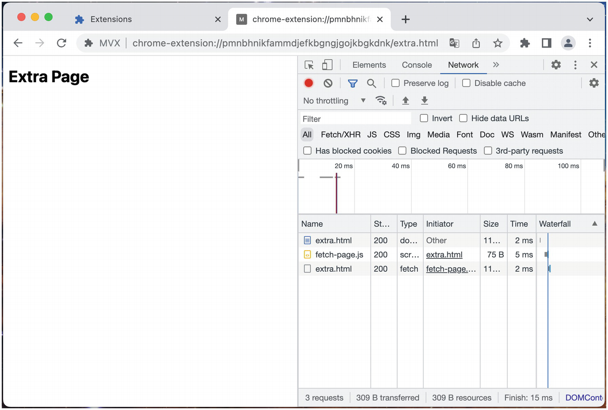
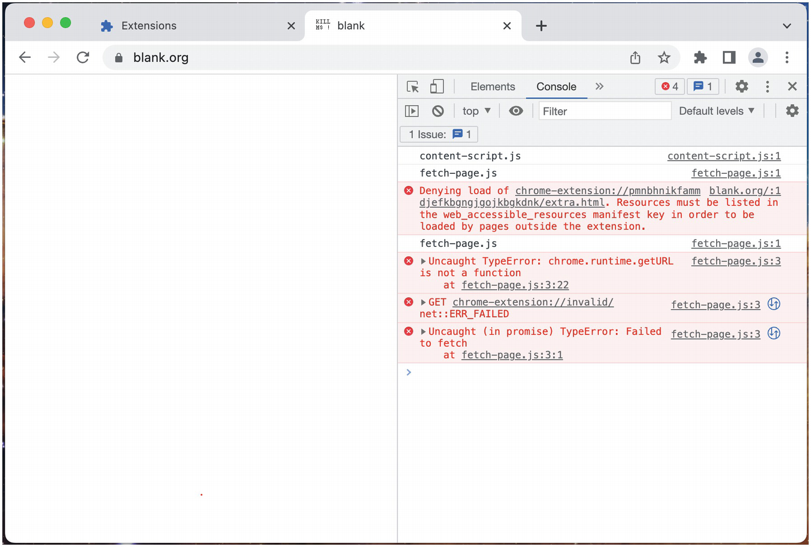

# Chương 4: Kiến trúc Browser Extension (Browser Extension Architecture)

Việc hiểu cách các thành phần khác nhau của browser extension hoạt động là quan trọng, nhưng điều quan trọng hơn nữa là hiểu cách chúng hoạt động cùng nhau. Kiến trúc của browser extension rất độc đáo và đa diện:

* Chúng thiếu sự tập trung và thay vào đó được hình thành bởi một mạng lưới các thành phần phân tán: background script, content script, các trang popup và trang tùy chọn, và các trang devtools.
* Chúng có thể quản lý hạ tầng trang trình duyệt phức tạp trải rộng trên nhiều cửa sổ và tab. Vì các content script có thể chạy trên nhiều trang và được tải độc lập, chúng yêu cầu các cân nhắc đặc biệt như kênh giao tiếp đa luồng (multiplexed communication channel) và kiểm soát phiên bản cập nhật.
* Chúng có thể cung cấp giao diện người dùng dựa trên trang web trong trang popup, trang tùy chọn, trang devtools và content script. Chúng cũng có thể tích hợp trực tiếp với giao diện gốc (native chrome) của trình duyệt bằng các tính năng như phím tắt, omnibox và thông báo trên màn hình (desktop notifications).

> [!NOTE]
> Chương này là một cái nhìn tổng quan cấp cao về cách các phần kết nối và tương tác với nhau. Các API và các chi tiết cụ thể khác sẽ được trình bày chủ yếu ở các phần sau trong cuốn sách này.

## Tổng quan về Kiến trúc (Architecture Overview)

Kiến trúc browser extension có thể được hiểu dễ dàng hơn thông qua hình ảnh. Hãy xem xét sơ đồ sau đây hiển thị cách tất cả các phần của browser extension khớp với nhau (Hình 4-1).


*Hình 4-1: Sơ đồ kiến trúc browser extension*

Hãy cùng bóc tách các thành phần và kết nối khác nhau được hiển thị ở đây, được xác định trong sơ đồ trên bằng số:

1. **Trang Popup (Popup pages)** có thể sử dụng WebExtensions API để thực hiện các tác vụ như đọc/ghi dữ liệu vào storage API, gửi tin nhắn đến trang background, hoặc kích hoạt hành vi trong content script của tab đang hoạt động.
2. **Content script** có thể xem và thao tác với DOM của trang web máy chủ cũng như lắng nghe các sự kiện DOM.
3. Content script được tiêm trực tiếp vào các trang web và được thực thi trong một môi trường JavaScript được cô lập (sandboxed). Mỗi tab có một lược đồ được phép (**permitted scheme**) (`http://`, `https://`, `ftp://`, `file:///`) đều đủ điều kiện để được tiêm content script.
4. Content script có thể sử dụng WebExtensions API để thực hiện các tác vụ như gửi và nhận chỉ thị từ **background script**, cũng như trích xuất thông tin từ DOM của trang. Content script trên một tab đơn lẻ hoặc một tập hợp các tab có thể được nhắm mục tiêu thông qua `chrome.tabs.query()`.
5. Tương tự như trang popup, **trang tùy chọn (options pages)** tương tác với phần còn lại của extension thông qua WebExtensions API.
6. WebExtensions API là sợi dây liên kết cho bất kỳ web extension nào. Nó cho phép nhắn tin hai chiều giữa bất kỳ hai thành phần nào, cũng như truy cập vào storage API dùng chung. Giao thức nhắn tin của extension là định dạng phát sóng (broadcast), nghĩa là bất kỳ phần nào khác của extension đều có thể lắng nghe tất cả các tin nhắn đang được gửi.
7. **Trang Devtools (Devtools pages)** chỉ có thể sử dụng một tập hợp con hạn chế của WebExtensions API.
8. **Background service worker** có thể quản lý phần còn lại của extension thông qua WebExtensions API. Điều này bao gồm việc gửi tin nhắn đến một phần khác của extension khi một trình xử lý sự kiện (event handler) API được kích hoạt.
9. Trang devtools được khởi tạo mỗi khi giao diện công cụ dành cho nhà phát triển (developer tools) được mở, và bị hủy khi nó đóng lại. Nó chủ yếu được sử dụng để khởi tạo các thành phần con như các bảng điều khiển (panels). Các trang devtools là các trang web không đầu (headless web pages).
10. Background service worker là trung tâm thần kinh của extension. Nó thường được sử dụng để xử lý các sự kiện, gửi tin nhắn và thực hiện các nhiệm vụ xác thực. Background service worker có đặc tính hữu ích là một **singleton**; đối với bất kỳ số lượng tab hoặc cửa sổ nào, chỉ có duy nhất một service worker chạy.
11. Sử dụng **Devtools API**, một trang devtools có thể tạo ra nhiều trang con hiển thị nguyên bản bên trong giao diện devtools của trình duyệt. Các trang con này có dạng các bảng điều khiển (panels) và thanh bên (sidebars).
12. Background service worker là thành phần duy nhất của một browser extension có thể xử lý các sự kiện trình duyệt một cách đáng tin cậy. Các thành phần của extension như trang tùy chọn, trang popup, content script và trang devtools là tạm thời (transient) và do đó có thể bỏ lỡ các sự kiện khi chúng không chạy.
13. Các trang devtools được quyền truy cập vào một Devtools API bổ sung cho phép các phương thức tạo các chế độ xem con, và kiểm tra cũng như gỡ lỗi các trang web.
14. **Omnibox** có thể được bật và cấu hình trong manifest. Khi một từ khóa đặc biệt được nhập vào thanh URL, một giao diện giống như tìm kiếm đặc biệt sẽ hiển thị. Giao diện này sẽ gửi các sự kiện omnibox với nội dung của thanh tìm kiếm đến extension, từ đó cho phép extension cung cấp hành vi kiểu công cụ tìm kiếm.
15. **Phím tắt (Keyboard shortcuts)** có thể được bật để kích hoạt hành vi nguyên bản như mở trang popup, hoặc để kích hoạt một sự kiện lệnh tùy chỉnh.
16. Các thông báo trên màn hình (native desktop notifications) có thể được hiển thị bằng mã lệnh (programmatically). Các thông báo cũng sẽ kích hoạt các sự kiện nhấp và đóng.
17. Biểu tượng thanh công cụ nguyên bản có thể hoạt động theo một trong hai cách: nó có thể kích hoạt trang popup, hoặc nó có thể kích hoạt một sự kiện nhấp chuột vào extension.

## Tính đa dạng, Vòng đời và Cập nhật (Plurality, Lifecycles, and Updates)

Một số cân nhắc quan trọng khi phát triển browser extension là có bao nhiêu thành phần mỗi loại có thể tồn tại tại bất kỳ thời điểm nào, cách thức các thành phần này được tạo ra và hủy bỏ, và cách chúng xử lý các bản cập nhật của extension.

### Background Service Worker

Background **service worker** là thành phần duy nhất của extension đảm bảo hành vi singleton bất kể số lượng trang extension, cửa sổ hoặc tab đang mở. Service worker sẽ bị hủy bỏ (torn down) khi trình duyệt phát hiện nó đang rảnh rỗi và được khởi động lại theo yêu cầu (ví dụ: khi trình duyệt phát hiện một sự kiện đến có trình xử lý). Trình duyệt sẽ khởi động lại service worker khi extension được cập nhật.

> [!NOTE]
> Để biết thêm chi tiết về cách hoạt động của background service worker, hãy tham khảo chương *Background Scripts*.

### Trang Popup và Trang Tùy chọn (Popup and Options Pages)

Trình duyệt sẽ đảm bảo rằng chỉ có duy nhất một **trang popup** được mở trên mỗi cửa sổ. Tuy nhiên, nếu có nhiều cửa sổ đang mở, mỗi cửa sổ có thể mở một trang popup một cách độc lập. Các trang popup là tạm thời: chúng khởi tạo khi giao diện popup mở rộng và bị hủy bỏ ngay lập tức khi giao diện popup đóng lại. Trình duyệt sẽ buộc đóng tất cả các popup đang mở khi extension được cập nhật.

Không có giới hạn về số lượng trang tùy chọn được mở. Tuy nhiên, nếu bạn đặt tùy chọn manifest `options_ui.open_in_tab` thành `false`, trình duyệt sẽ đảm bảo rằng chỉ có một trang tùy chọn dạng modal được mở trên mỗi cửa sổ. Các trang tùy chọn, ở cả dạng modal và dạng tab, đều có vòng đời của một trang web bình thường. Trình duyệt sẽ buộc đóng tất cả các trang tùy chọn đang mở khi extension được cập nhật.

> [!NOTE]
> Để biết thêm chi tiết về cách hoạt động của trang popup và trang tùy chọn, hãy tham khảo chương *Popup and Options Pages*.

### Trang Devtools (Devtools Pages)

**Trang devtools** được render chính xác một lần mỗi khi giao diện devtools của trình duyệt được mở. Do đó, vì chỉ có thể có một giao diện công cụ dành cho nhà phát triển trên mỗi cửa sổ, nên có thể có chính xác một trang devtools trên mỗi cửa sổ. Trang này và các trang con mà nó tạo ra, bao gồm các bảng điều khiển và thanh bên, sẽ tồn tại miễn là giao diện công cụ dành cho nhà phát triển còn mở. Quan trọng là, những trang công cụ dành cho nhà phát triển này sẽ không bị ảnh hưởng khi extension được cập nhật và do đó chúng có nguy cơ trở nên lỗi thời (stale).

> [!NOTE]
> Để biết thêm chi tiết về cách hoạt động của trang devtools, hãy tham khảo chương *Devtools Pages*.

### Content Script

**Content script** sẽ được tiêm vào các trang web theo cách được xác định trong manifest của extension. Hơn nữa, nhiều content script có thể được tiêm vào một trang web duy nhất. Đối với một extension có M content script được định nghĩa, và một trình duyệt có N tab đang mở, tổng số content script đang chạy tại bất kỳ thời điểm nào bị giới hạn bởi M x N. Content script có thể được tiêm vào trang dựa trên các sự kiện tải trang khác nhau, nhưng tất cả các sự kiện này đều xấp xỉ thời điểm trang bắt đầu được tải. Chúng hoạt động giống hệt các script bình thường của trang web và sẽ thực thi theo cùng một cách thức. Quan trọng là, content script sẽ không bị ảnh hưởng khi extension được cập nhật và do đó chúng có nguy cơ trở nên lỗi thời.

> [!NOTE]
> Để biết thêm chi tiết về cách hoạt động của content script, hãy tham khảo chương *Content Scripts*.

## File Server của Browser Extension (Browser Extension File Server)

Khi một extension được cài đặt, trình duyệt sẽ cho phép truy cập các tệp của extension đó thông qua một file server đơn giản. Để khám phá điều này, hãy sử dụng một extension đơn giản để minh họa một số khái niệm về file server của extension. Cấu trúc tệp như sau:

**Tệp:** `manifest.json`

```json
{
  "name": "MVX",
  "version": "0.0.1",
  "manifest_version": 3,
  "background": {
    "service_worker": "background.js",
    "type": "module"
  },
  "content_scripts": [
    {
      "matches": ["<all_urls>"],
      "js": ["content-script.js"]
    }
  ],
  "web_accessible_resources": [
    {
      "resources": ["fetch-page.js"],
      "matches": ["<all_urls>"]
    }
  ]
}
```

**Tệp:** `background.js`

```javascript
import "./fetch-page.js";
console.log("background.js");
```

**Tệp:** `content-script.js`

```javascript
console.log("content-script.js");
import(chrome.runtime.getURL("fetch-page.js"));

const el = document.createElement("script");
el.src = chrome.runtime.getURL("fetch-page.js");
document.body.appendChild(el);
```

**Tệp:** `fetch-page.js`

```javascript
console.log("fetch-page.js");
fetch(chrome.runtime.getURL("extra.html"));
```

**Tệp:** `extra.html`

```html
<!DOCTYPE html>
<html>
  <body>
    <h1>Extra Page</h1>
    <script src="fetch-page.js"></script>
  </body>
</html>
```

Hãy dành một chút thời gian để xem xét những gì extension này đang làm. Một số điều cần lưu ý:

* Extension sẽ tiêm `content-script.js` vào tất cả các trang web.
* Manifest chỉ định `fetch-page.js` là một **tài nguyên có thể truy cập web (web accessible resource)** và có thể được truy cập bởi tất cả các trang web.
* `content-script.js` cố gắng tải `fetch-page.js` theo hai cách khác nhau: thông qua `import` động và thông qua tải thẻ `<script>` động.
* `fetch-page.js` gửi một yêu cầu mạng cho tệp `extra.html`. Tệp này sẽ được tải và thực thi ở nhiều vị trí trong extension, với các kết quả khác nhau.

Để hiểu cách file server của extension hoạt động, chúng ta sẽ bóc tách từng tệp của extension này. Bắt đầu bằng cách tải extension vào Google Chrome và kiểm tra đầu ra console của background service worker bằng cách nhấp vào liên kết **service worker** trong thẻ extension (Hình 4-2).


*Hình 4-2: Nhấp vào liên kết service worker để mở console background*

Đầu ra console của background service worker sẽ xuất hiện như trong Hình 4-3.


*Hình 4-3: Đầu ra console background*

Điều này cho thấy background script đã có thể nhập và thực thi script `fetch-page.js` thành công. Hãy nhìn vào tab **Network** để xem điều này đã xảy ra như thế nào (Hình 4-4).


*Hình 4-4: Nhật ký hoạt động mạng của background*

Tải lại extension để kích hoạt các yêu cầu mạng này. Bạn sẽ thấy hai yêu cầu mạng thành công: một cho tệp JS được nhập và một cho tệp HTML được fetch. Kiểm tra yêu cầu JS sẽ thấy kết quả sau (Hình 4-5).


*Hình 4-5: Yêu cầu fetch-page.js*

Yêu cầu mạng này gửi thành công yêu cầu GET đến file server của extension, và file server trả về mã 200. Lưu ý URL bắt đầu bằng giao thức `chrome-extension://`. Hãy cùng phân tích các phần của URL này:

* **chrome-extension://** là giao thức URL (URL protocol), cho Google Chrome biết rằng yêu cầu nên được định tuyến đến các extension đã cài đặt của trình duyệt. Giao thức này khác nhau giữa các trình duyệt: Mozilla Firefox sử dụng `moz-extension://`, Microsoft Edge sử dụng `extension://`, Opera sử dụng `opera://`.
* **pmnbhnikfammdjefkbgngjgojkbgkdnk** là ID của extension (extension ID). ID extension của bạn sẽ khác. ID này được sử dụng để định danh duy nhất phiên bản này của extension cả bên trong trình duyệt cũng như khi được xuất bản trên cửa hàng tiện ích. Định dạng ID sẽ thay đổi một chút giữa các trình duyệt: ví dụ: Google Chrome sử dụng một chuỗi ký tự viết thường không đứt đoạn, trong khi Mozilla Firefox sử dụng v4 UUID.
* **fetch-page.js** là đường dẫn URL. Điều này sẽ khớp chính xác với đường dẫn tệp bên trong thư mục extension.

Tiếp theo, hãy kiểm tra yêu cầu `extra.html` (Hình 4-6).


*Hình 4-6: Yêu cầu extra.html*

So sánh hai yêu cầu và lưu ý sự hiện diện hoặc vắng mặt của các header `Access-Control-Allow-Origin` và `Cross-Origin-Resource-Policy`. Các header này được tự động thêm vào vì `fetch-page.js` được liệt kê trong `web_accessible_resources`. So sánh điều này với yêu cầu cho `extra.html`: bạn sẽ nhận thấy các header này vắng mặt, vì `extra.html` không được liệt kê là tài nguyên có thể truy cập web.

> [!NOTE]
> Bạn cũng sẽ nhận thấy rằng `extra.html` không được tham chiếu trực tiếp hoặc gián tiếp ở bất kỳ đâu trong manifest, nhưng file server của extension vẫn vui vẻ trả về tệp đó. Khi gửi yêu cầu từ ngữ cảnh extension (background, popup, giao thức extension), các yêu cầu cho *bất kỳ* tệp nào trong extension sẽ trả về tệp đó thành công.

Tiếp theo, hãy sao chép URL của yêu cầu `extra.html` (của bạn sẽ khác với ảnh chụp màn hình ở trên) và mở nó trong một tab trình duyệt mới. Mở công cụ dành cho nhà phát triển sau khi trang được tải (Hình 4-7).


*Hình 4-7: Trang extra.html với các yêu cầu mạng được hiển thị*

> [!TIP]
> Một cách dễ dàng để thực hiện việc này là nhấp chuột phải vào yêu cầu mạng và chọn "Mở trong tab mới" (Open in new tab).

Trình duyệt đang tải `extra.html` từ file server của extension, render nó như một trang web bình thường, tải thành công thẻ `<script>` và thực thi payload của nó (thực hiện một yêu cầu fetch trùng lặp cho `extra.html`). Có một số điểm quan trọng cần lưu ý ở đây:

* Vì nó có thể tải và render bất kỳ tệp nào có trong extension, browser extension có thể có số lượng trang web không giới hạn, bao gồm cả những trang không được manifest tham chiếu rõ ràng.
* Giao thức đặc biệt `chrome-extension://` định tuyến các yêu cầu đến file server. Các trang được render theo cách này có thể sử dụng WebExtensions API trong các script của chúng, cũng như gửi yêu cầu cho bất kỳ tệp nào trong thư mục extension.

Hành vi này hoàn toàn khác biệt khi so sánh với việc thực thi content script. Lưu ý rằng manifest được cấu hình để tiêm content script vào bất kỳ trang web nào, vì vậy tiếp theo hãy chuyển trình duyệt của bạn đến một trang web thử nghiệm như `blank.org` và xem đầu ra console (Hình 4-8).


*Hình 4-8: Đầu ra console từ các content script của extension*

Trước hết, hãy lưu ý rằng content script *không* được phục vụ thông qua yêu cầu mạng. Thay vì được tải từ file server của extension, trình duyệt đang tiêm nó trực tiếp vào trang.

Hãy quan sát thấy rằng content script đang cố gắng fetch tệp JS theo hai cách khác nhau, và mỗi cách đều gây ra lỗi vì một lý do khác nhau:

* Lần thử đầu tiên nhập động tệp `fetch-page.js` và thực thi nó. Việc nhập động thành công vì `fetch-page.js` là một tài nguyên có thể truy cập web. Tuy nhiên, vì điều này đang được thực thi bên trong một content script, nó không thể tải tệp HTML vì nó *không* được cung cấp quyền truy cập trong `web_accessible_resources`. Điều này gây ra lỗi **Denying load**.
* Lần thử thứ hai tạo một thành phần `<script>` để tải tệp `fetch-page.js` và thực thi nó. Việc tải script thành công vì `fetch-page.js` là một tài nguyên có thể truy cập web. Tuy nhiên, ngữ cảnh thực thi của script được tải không được cấp quyền truy cập vào WebExtensions API, và do đó nỗ lực sử dụng `chrome.runtime.getURL` gây ra lỗi **TypeError**.

Mặc dù content script vẫn có thể truy cập file server của extension, nhưng quyền truy cập của nó bị hạn chế hơn đáng kể.

> [!TIP]
> File server của extension là một cách linh hoạt để làm cho extension của bạn hoạt động giống như một trang web với nhiều chế độ xem và định tuyến, nhưng việc định tuyến yêu cầu không hỗ trợ các tính năng cơ bản như chuyển hướng (redirects) hoặc các trang 404 tùy chỉnh.

## Trang Sandboxed (Sandboxed Pages)

Trong manifest v3, các giá trị được phép trong **Chính sách Bảo mật Nội dung (Content Security Policy - CSP)** hạn chế hơn đáng kể so với v2. Nó mới không cho phép các tính năng sau trong các trang extension:

* Các script nội dòng (Inline scripts)
* Mã được tải từ xa (Remotely loaded code)
* `eval()`
* Các script do người dùng cung cấp (User-provided scripts)

Để sử dụng các công cụ này, bạn phải chạy một trang extension trong một **hộp cát (sandbox)**. Việc này sẽ cho phép trang sử dụng các tính năng bị cấm đã liệt kê ở trên, nhưng phải trả giá – trang đó sẽ mất tất cả quyền truy cập vào các WebExtensions API.

> [!NOTE]
> Trừ khi được chỉ định rõ, chính sách bảo mật nội dung sandbox mặc định là:
> `sandbox allow-scripts allow-forms allow-popups allow-modals; script-src 'self' 'unsafe-inline' 'unsafe-eval'; child-src 'self';`

Ví dụ sau định nghĩa trang popup là một trang sandboxed. Khi mở trang popup, script nội dòng sẽ thực thi `eval()` mà không gặp vấn đề gì:

**Tệp:** `manifest.json`

```json
{
  "name": "MVX",
  "version": "0.0.1",
  "manifest_version": 3,
  "action": {
    "default_popup": "popup.html"
  },
  "sandbox": {
    "pages": ["popup.html"]
  }
}
```

**Tệp:** `popup.html`

```html
<!DOCTYPE html>
<html>
  <body>
    <h1>Popup</h1>
    <script>
      eval(`document.body.innerHTML += '<div>Foobar</div>'`);
    </script>
  </body>
</html>
```

## Tóm tắt (Summary)

Trong chương này, bạn đã được giới thiệu tổng quan về cách tất cả các thành phần của một browser extension hoạt động phối hợp với nhau. Với kiến thức này, bây giờ bạn có thể phân tích cách một extension nhất định truyền tải thông tin và thực hiện các cuộc gọi API. Chương này cũng trang bị cho bạn kiến thức để lập kế hoạch hiệu quả hơn trong việc chuyển đổi một ý tưởng cho browser extension thành mã thực thi. Bạn cũng đã hiểu rõ về cách file server của browser extension có thể phân phối các tệp theo nhiều cách khác nhau, cũng như sự đánh đổi khi khai báo một trang sandboxed.

Chương tiếp theo sẽ bao gồm tất cả các trường có thể xuất hiện trong một manifest của extension cũng như cách định nghĩa của từng trường có thể kiểm soát hành vi của một extension.
