# Chương 5: Manifest của Tiện ích mở rộng

Manifest của tiện ích mở rộng (extension manifest) là bản thiết kế của tiện ích mở rộng trình duyệt. Nói một cách khái quát, đây là một tệp cấu hình chứa tập hợp các cặp khóa-giá trị quy định những gì tiện ích có thể làm và thực hiện theo cách nào.

Nội dung của một manifest có sự khác biệt giữa các phiên bản manifest và các trình duyệt. Không phải tất cả các thuộc tính đều có thể được sử dụng bởi tất cả các trình duyệt; một số trình duyệt sẽ hỗ trợ một phần thuộc tính, hoặc thậm chí không hỗ trợ chút nào. Giữa manifest v2 và manifest v3, các thuộc tính mới được thêm vào, những thuộc tính khác bị loại bỏ; và một số thay đổi trong cách chúng được định nghĩa.

MDN cung cấp một bảng rất tốt về khả năng hỗ trợ các thuộc tính manifest tại đây: [https://developer.mozilla.org/en-US/docs/Mozilla/Add-ons/WebExtensions/manifest.json#browser_compatibility](https://developer.mozilla.org/en-US/docs/Mozilla/Add-ons/WebExtensions/manifest.json#browser_compatibility).

> [!NOTE]
> Chương này lược bỏ một số ít thuộc tính manifest không được hầu hết các trình duyệt web hỗ trợ rộng rãi (chẳng hạn như `theme` và `theme_experiment`), hoặc hoàn toàn không được tài liệu hóa (chẳng hạn như `natively_connectable`).

## Tệp Manifest

Manifest của tiện ích mở rộng được định nghĩa trong một tệp `manifest.json` duy nhất nằm trong thư mục gốc của tiện ích. Đây là tệp duy nhất bắt buộc phải có để một tiện ích mở rộng trình duyệt được coi là hợp lệ:

```text
simple-extension-directory/
└─ manifest.json
```

> [!NOTE]
> Tệp này là một tệp JSON tiêu chuẩn, với ngoại lệ đáng chú ý là cho phép các ghi chú kiểu `//`. Nếu trình soạn thảo văn bản của bạn đang sử dụng bộ kiểm tra lỗi JSON tiêu chuẩn, nó có thể báo hiệu rằng các ghi chú không được phép trong `manifest.json` – hãy bỏ qua lỗi này. Tất cả các trình duyệt và cửa hàng tiện ích mở rộng đều cho phép ghi chú trong manifest.

Tệp JSON chứa một đối tượng duy nhất với một số lượng lớn các thuộc tính bắt buộc và tùy chọn cấu hình cách tiện ích mở rộng hoạt động. Chỉ có ba thuộc tính bắt buộc:

- `manifest_version`, cho biết cho trình duyệt cách manifest nên được diễn giải. Điều này có ảnh hưởng lớn đến hành vi của tiện ích mở rộng.
- `version`, khai báo số phiên bản của tiện ích mở rộng. Điều này được các cửa hàng tiện ích mở rộng sử dụng để phân biệt giữa các bản phát hành.
- `name`, khai báo tên của tiện ích mở rộng. Tên này được cả trình duyệt và cửa hàng tiện ích mở rộng sử dụng làm mã định danh cấp cao nhất của tiện ích.

Do đó, một manifest đơn giản nhất có thể sẽ như sau:

**Tệp:** `manifest.json`

```json
{
  "name": "MVP Extension",
  "version": "1.0",
  "manifest_version": 3
}
```

## Hỗ trợ các bản địa (Locales) khác nhau

Một số thuộc tính manifest định nghĩa các chuỗi ký tự và hình ảnh văn bản hiển thị cho người dùng. Trong các tình huống mà tiện ích mở rộng cần hỗ trợ nhiều ngôn ngữ dựa trên bản địa (locale) của người dùng, việc mã hóa cứng (hardcoding) các giá trị này là không phù hợp. Để giải quyết vấn đề này, manifest hỗ trợ tải các chuỗi từ tệp tin nhắn (message files) dựa trên bản địa của người dùng.

Để thêm hỗ trợ bản địa, các tệp tin nhắn phải được thêm vào thư mục `_locales`. Thư mục này chứa một thư mục cho mỗi bản địa bạn muốn hỗ trợ. Bên trong mỗi thư mục con này, một tệp `messages.json` duy nhất định nghĩa các chuỗi được bản địa hóa. Manifest sau đó có thể tự động tải các chuỗi này với mã định danh đặc biệt `__MSG_messagename__`.

Ví dụ sau đây cho thấy một manifest đơn giản hỗ trợ các bản địa tiếng Anh và tiếng Pháp:

```text
localized-extension-directory/
├─ manifest.json
└─ _locales/
   ├─ en/
   │  └─ messages.json
   └─ fr/
      └─ messages.json
```

Tệp manifest sẽ được viết như sau:

**Tệp:** `manifest.json`

```json
{
  "name": "__MSG_extensionName__",
  "version": "1.0",
  "manifest_version": 3,
  "default_locale": "en"
}
```

Khi sử dụng các bản địa, thuộc tính `default_locale` là bắt buộc trong manifest của bạn. Định dạng bắt buộc của các tệp `messages.json` được hiển thị bên dưới:

**Tệp:** `_locales/en/messages.json`

```json
{
  "extensionName": {
    "message": "Hello world!"
  }
}
```

**Tệp:** `_locales/fr/messages.json`

```json
{
  "extensionName": {
    "message": "Bonjour le monde!"
  }
}
```

> Bản địa và quốc tế hóa (internationalization) là một chủ đề rộng và sâu. Tham khảo [https://developer.mozilla.org/en-US/docs/Mozilla/Add-ons/WebExtensions/Internationalization](https://developer.mozilla.org/en-US/docs/Mozilla/Add-ons/WebExtensions/Internationalization) để biết thêm chi tiết về các trình giữ chỗ bản địa (locale placeholders), các thuộc tính tin nhắn bổ sung và hơn thế nữa.
> [!NOTE]
> API WebExtensions i18n và các tệp CSS của tiện ích mở rộng cũng có thể sử dụng các chuỗi bản địa từ các tệp `messages.json` này. Tham khảo chương *Các API của Tiện ích mở rộng và Trình duyệt* để biết chi tiết.

## Mẫu khớp (Match Patterns) và Globs

Một số thuộc tính trong manifest có thể sử dụng mẫu khớp (match patterns) và globs để chỉ định nhiều URL hoặc tệp cùng một lúc.

### Mẫu khớp đường dẫn tệp (File Path Match Patterns)

Các thuộc tính như `web_accessible_resources` có thể sử dụng mẫu khớp để chọn một tệp đơn lẻ hoặc toàn bộ thư mục. Giống như tất cả các đường dẫn tệp trong tệp manifest, chúng được giải quyết theo thư mục gốc của tiện ích mở rộng. Cú pháp cho phép sử dụng ký tự đại diện `*` để khớp với không hoặc nhiều ký tự. Sau đây là một số ví dụ về mẫu khớp tệp hợp lệ:

- `"/*"` chọn tất cả các tệp
- `"/foo/*"` chọn tất cả các tệp trong thư mục `foo`
- `"/foo/*.png"` chọn tất cả các tệp PNG trong thư mục `foo`
- `"/foo/bar.png"` chọn một tệp PNG duy nhất trong thư mục `foo`

### Mẫu khớp URL (URL Match Patterns)

Các thuộc tính như `content_scripts` có thể sử dụng mẫu khớp để đưa vào danh sách cho phép (whitelist) các URL đơn lẻ hoặc toàn bộ nguồn gốc web (web origins). Cú pháp cho phép sử dụng ký tự đại diện `*` để khớp với không hoặc nhiều ký tự. Sau đây là một số ví dụ về các mẫu khớp URL hợp lệ:

- `"<all_urls>"` chọn tất cả các URL với giao thức `http://`, `https://`, `ws://`, `wss://`, `ftp://`, `data://`, hoặc `file://`
- `"https://*/*"` chọn tất cả các URL với giao thức `https://`
- `"*://example.com/*"` chọn tất cả các URL có nguồn gốc `example.com`
- `"https://example.com/foo/*"` chọn tất cả các URL `example.com` có tiền tố đường dẫn `foo/`
- `"https://example.com/foo/bar"` chọn một URL duy nhất

> [!NOTE]
> Để biết chi tiết cụ thể về các quy tắc cho mẫu khớp, hãy tham khảo [https://developer.chrome.com/docs/extensions/mv3/match_patterns/](https://developer.chrome.com/docs/extensions/mv3/match_patterns/).

### URL Globs

Các thuộc tính như `content_scripts` có thể sử dụng globs để thêm lọc bổ sung cho các mẫu khớp URL. Globs là phần mở rộng của mẫu khớp URL; cú pháp của chúng cho phép sử dụng ký tự đại diện `*` để khớp với không hoặc nhiều ký tự, cũng như `?` để khớp chính xác một ký tự:

- `"*://example.com/*"` chọn tất cả các URL có nguồn gốc `example.com`
- `"*://example.???/*"` chọn tất cả các URL có nguồn gốc `example.` theo sau bởi TLD ba ký tự, chẳng hạn như `example.com`, `example.org` và `example.gov`

> [!NOTE]
> Để biết chi tiết cụ thể về các quy tắc cho globs, hãy tham khảo [https://developer.chrome.com/docs/extensions/mv3/content_scripts/#matchAndGlob](https://developer.chrome.com/docs/extensions/mv3/content_scripts/#matchAndGlob).

## Các thuộc tính Manifest

Phần này chứa một danh sách toàn diện các thuộc tính manifest và cách các giá trị của chúng nên được định nghĩa. Nhiều thuộc tính trong số này được liên kết với các quyền bổ sung của trình duyệt hoặc các phần của API WebExtensions; mỗi phần sẽ hướng dẫn bạn đến phần của cuốn sách trình bày chi tiết về sự tương quan giữa giá trị thuộc tính manifest, các quyền bắt buộc và các API liên quan.

Nếu bạn muốn kiểm tra mã nguồn trình duyệt liên quan đến việc phân tích cú pháp các thuộc tính manifest, hãy sử dụng các nguồn sau:

- Manifest của Chromium: [https://chromium.googlesource.com/chromium/src/+/main/chrome/common/extensions/api/_manifest_features.json](https://chromium.googlesource.com/chromium/src/+/main/chrome/common/extensions/api/_manifest_features.json)
- Manifest của Firefox: [https://searchfox.org/mozilla-central/source/browser/components/extensions/schemas](https://searchfox.org/mozilla-central/source/browser/components/extensions/schemas)

> [!TIP]
> Để thử nghiệm với các thuộc tính này trong một tiện ích mở rộng thực tế, bạn có thể thêm chúng vào "MVP Extension" `manifest.json` được định nghĩa ở đầu chương. (Nhiều thuộc tính trong số này yêu cầu các API, quyền và tệp bổ sung để hoạt động.) Lưu ý rằng mỗi thay đổi đối với manifest đều yêu cầu tải lại tiện ích mở rộng.

### `action`

Thuộc tính này định nghĩa một đối tượng chứa các giá trị quy định hành vi và giao diện của biểu tượng tiện ích mở rộng trên thanh công cụ trình duyệt (Hình 5-1). Đây là sự thay thế trong manifest v3 cho các thuộc tính `browser_action` và `page_action` trong manifest v2.

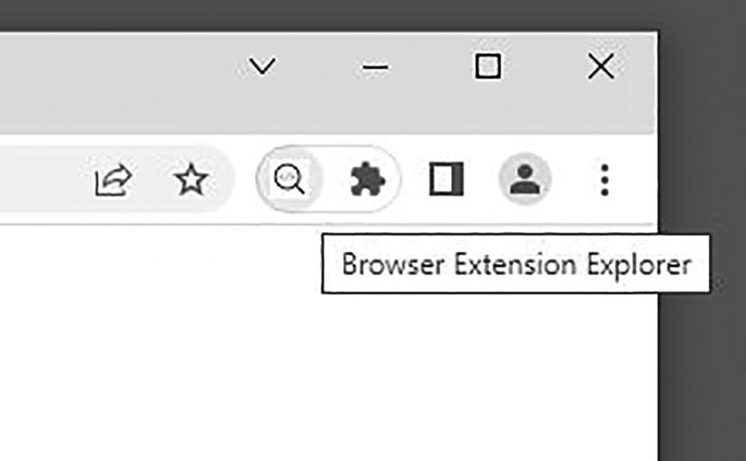

> [!NOTE]
> Thuộc tính này chỉ có thể được sử dụng trong manifest v3. Nếu viết cho manifest v2, hãy sử dụng `browser_action`.

Thuộc tính này được hiển thị bên dưới với một giá trị ví dụ được định nghĩa đầy đủ:

**Tệp:** `manifest.json`

```json
{
  ...
  "action": {
    "default_icon": {
      "16": "icons/icon-16.png",
      "32": "icons/icon-32.png",
      "64": "icons/icon-64.png"
    },
    "default_popup": "popup/popup.html",
    "default_title": "Building Browser Extensions",
    "browser_style": true,
    "theme_icons": [
      {
        "light": "icons/icon-16-light.png",
        "dark": "icons/icon-16.png",
        "size": 16
      },
      {
        "light": "icons/icon-32-light.png",
        "dark": "icons/icon-32.png",
        "size": 32
      }
    ]
  },
  ...
}
```

Đối tượng `action` cho phép các thuộc tính sau:

#### `default_icon`

Thuộc tính này cho trình duyệt biết nơi tìm các biểu tượng cho thanh công cụ thông qua các đường dẫn tương đối đến tệp hình ảnh. Có hai cách để định nghĩa thuộc tính này: cung cấp các biểu tượng hình ảnh PNG hoặc JPEG và để trình duyệt chọn biểu tượng phù hợp một cách thông minh, hoặc cung cấp một hình ảnh vector duy nhất.

Việc cung cấp một hoặc nhiều biểu tượng hình ảnh cho phép trình duyệt quyết định biểu tượng nào là tốt nhất cho cấu hình phần cứng hiện tại. (Ví dụ: màn hình Apple Retina ưu tiên biểu tượng có độ phân giải gấp đôi.) Việc cung cấp các biểu tượng kích thước 16x16px, 32x32px và 64x64px là đủ để bao quát tất cả các trường hợp có thể xảy ra. Sau đây là ví dụ về cách sử dụng thuộc tính này:

**Ví dụ về giá trị cho `default_icon` với các hình ảnh có kích thước:**

```json
{
  ...
  "action": {
    "default_icon": {
      "16": "icons/icon-16.png",
      "32": "icons/icon-32.png",
      "64": "icons/icon-64.png"
    },
    ...
  },
  ...
}
```

Nếu bạn muốn cung cấp một hình ảnh vector, trình duyệt chỉ cần một tệp vector duy nhất để đáp ứng tất cả các cấu hình hiển thị:

**Ví dụ về giá trị cho `default_icon` với hình ảnh vector:**

```json
{
  ...
  "action": {
    "default_icon": "icons/icon.svg"
    ...
  },
  ...
}
```

#### `default_popup`

Thuộc tính này cho trình duyệt biết nơi đặt tệp HTML sẽ hiển thị dưới dạng popup khi biểu tượng thanh công cụ của tiện ích mở rộng được nhấp vào. Điều này cũng có thể được thiết lập hoặc thay đổi thông qua phương thức `chrome.action.setPopup()` của API WebExtension. Sau đây là ví dụ về cách sử dụng thuộc tính này:

**Ví dụ về giá trị cho `default_popup`:**

```json
{
  ...
  "action": {
    "default_popup": "components/popup/popup.html"
    ...
  },
  ...
}
```

> [!NOTE]
> Nếu thuộc tính này không được định nghĩa, sẽ không có trang popup nào xuất hiện khi biểu tượng thanh công cụ của tiện ích được nhấp vào. Thay vào đó, trình duyệt sẽ gửi một sự kiện nhấp chuột (click event) trong bất kỳ kịch bản nền (background scripts) nào (nếu có).

#### `default_title`

Thuộc tính này cho trình duyệt biết văn bản sẽ hiển thị dưới dạng tooltip khi di chuột qua biểu tượng thanh công cụ của tiện ích mở rộng. Điều này cũng có thể được thiết lập hoặc thay đổi thông qua phương thức `chrome.action.setTitle()` của API WebExtension. Sau đây là ví dụ về cách sử dụng thuộc tính này:

**Ví dụ về giá trị cho `default_title`:**

```json
{
  ...
  "action": {
    "default_title": "Open Explorer menu"
    ...
  },
  ...
}
```

> [!NOTE]
> Nếu thuộc tính này không được định nghĩa, trình duyệt sẽ sử dụng thuộc tính `name` của tiện ích mở rộng làm văn bản hiển thị khi di chuột.

#### `browser_style` (action)

(Chỉ dành cho Firefox) Thuộc tính này là một giá trị boolean cho trình duyệt biết liệu nó có nên chèn một biểu định kiểu (stylesheet) vào popup để định kiểu cho nó nhất quán với trình duyệt hay không. Các biểu định kiểu này có thể được xem trong bất kỳ trình duyệt Firefox nào tại `chrome://browser/content/extension.css`, hoặc `chrome://browser/content/extension-mac.css` trên macOS. Thuộc tính này mặc định là `false`. Sau đây là ví dụ về cách sử dụng thuộc tính này:

**Ví dụ về giá trị cho `browser_style`:**

```json
{
  ...
  "action": {
    "browser_style": true
    ...
  },
  ...
}
```

#### `theme_icons`

(Chỉ dành cho Firefox) Thuộc tính này cho phép bạn định nghĩa các biểu tượng thay thế dựa trên chủ đề (theme) Firefox hiện đang hoạt động. Nó mở rộng hành vi của `default_icon`. Sau đây là ví dụ về cách sử dụng thuộc tính này:

**Ví dụ về giá trị cho `theme_icons`:**

```json
{
  ...
  "action": {
    ...,
    "theme_icons": [
      {
        "light": "icons/icon-16-light.png",
        "dark": "icons/icon-16.png",
        "size": 16
      },
      {
        "light": "icons/icon-32-light.png",
        "dark": "icons/icon-32.png",
        "size": 32
      }
    ],
    ...
  },
  ...
}
```

---

### `author`

Thuộc tính này cung cấp tên tác giả để hiển thị trong trình duyệt. Sau đây là ví dụ về cách sử dụng thuộc tính này:

**Ví dụ về giá trị cho `author`:**

```json
{
  ...
  "author": "Matt Frisbie"
  ...
}
```

> [!NOTE]
> Nếu thuộc tính `developer.name` được định nghĩa, nó sẽ ghi đè giá trị này.

### `automation`

(Chỉ dành cho trình duyệt Chromium) Thuộc tính này cho phép các nhà phát triển truy cập vào cây khả năng truy cập (accessibility tree) của trình duyệt. Thuộc tính này chỉ cần thiết trong các trường hợp tiện ích mở rộng nhắm mục tiêu trực tiếp đến các thiết bị hỗ trợ. Theo MDN, "Các trình duyệt tạo ra một cây khả năng truy cập dựa trên cây DOM, được sử dụng bởi các API Khả năng truy cập cụ thể của nền tảng để cung cấp một biểu diễn mà các công nghệ hỗ trợ, chẳng hạn như trình đọc màn hình, có thể hiểu được."

> [!NOTE]
> Các công nghệ hỗ trợ khả năng truy cập nằm ngoài phạm vi của cuốn sách này. Để biết chi tiết về việc sử dụng API này, hãy tham khảo [https://developer.chrome.com/docs/extensions/reference/automation/](https://developer.chrome.com/docs/extensions/reference/automation/) và [https://developer.mozilla.org/en-US/docs/Glossary/Accessibility_tree](https://developer.mozilla.org/en-US/docs/Glossary/Accessibility_tree).

### `background`

Thuộc tính này cho phép bạn xác định tệp hoặc các tệp nào sẽ được sử dụng cho kịch bản nền (background script). Thuộc tính này được sử dụng trong cả manifest v2 và v3, nhưng giá trị của thuộc tính có sự khác biệt đáng kể giữa hai phiên bản.

#### Kịch bản nền (background scripts) trong Manifest v2

Một cách để tạo kịch bản nền trong manifest v2 là cung cấp tham chiếu đến một hoặc nhiều tệp kịch bản trong một mảng `scripts`. Các kịch bản này được tải theo thứ tự mảng của chúng. Chúng được tải trong một trang web ẩn (headless) và sẽ có quyền truy cập vào đối tượng `window` và DOM. Sau đây là ví dụ về cách cung cấp kịch bản nền theo cách này:

**Ví dụ về giá trị cho kịch bản nền:**

```json
{
  ...
  "background": {
    "scripts": [
      "scripts/background-1.js",
      "scripts/background-2.js"
    ]
  },
  ...
}
```

#### Trang nền (background page) trong Manifest v2

Một cách khác để tạo kịch bản nền trong manifest v2 là cung cấp tham chiếu `page` đến một tệp HTML duy nhất với các thẻ `<script>` để tải các tệp kịch bản nền. Trang này được hiển thị dưới dạng một trang web ẩn, và do đó các kịch bản này được tải theo bất kỳ thứ tự nào mà công cụ JavaScript của trình duyệt thực hiện. Sau đây là ví dụ về cách cung cấp kịch bản nền theo cách này:

**Ví dụ về giá trị cho trang nền:**

```json
{
  ...
  "background": {
    "page": "background.html"
  },
  ...
}
```

Chiến lược này có một số lợi thế. Nó cho phép người dùng sử dụng các câu lệnh `import` bằng cách thêm `type="module"`, cũng như thêm nội dung vào trang HTML ẩn.

#### Trang duy trì (persistent pages) và trang sự kiện (event pages) trong Manifest v2

Ngoài việc định nghĩa cách tải các kịch bản nền, thuộc tính `background` cũng cho phép bạn định nghĩa cách các kịch bản sẽ thực thi thông qua thuộc tính boolean `persistent`. Giá trị mặc định là `true`:

- Khi `persistent` là `true`, một trang nền duy trì (persistent background page) được tạo ra. Nó được giữ trong bộ nhớ vào mọi lúc. Nó khởi động khi tiện ích mở rộng được tải hoặc trình duyệt được khởi chạy, và nó kéo dài cho đến khi tiện ích bị gỡ bỏ hoặc trình duyệt bị đóng.
- Khi `persistent` là `false`, một trang nền không duy trì được tạo ra. Đôi khi được gọi là một "**trang sự kiện**" (event page), kịch bản nền này có thể bị gỡ bỏ và tải lại bất cứ khi nào trình duyệt quyết định rằng nó đang ở trạng thái rảnh.

Sau đây là ví dụ về cách cung cấp kịch bản nền theo cách này:

**Ví dụ về giá trị cho trang nền duy trì:**

```json
{
  ...
  "background": {
    "page": "background.html",
    "persistent": true
  },
  ...
}
```

#### Service worker trong Manifest v3

Trong manifest v3, các tùy chọn để tạo kịch bản nền bị hạn chế hơn nhiều. Bởi vì các trang duy trì trong manifest v2 có khả năng tiêu tốn quá nhiều tài nguyên hệ thống, tất cả các kịch bản nền cho manifest v3 phải thực thi như một service worker. Bản tương đồng gần nhất của điều này trong manifest v2 là một trang sự kiện sử dụng một kịch bản duy nhất.

**Ví dụ về giá trị cho background service worker:**

```json
{
  ...
  "background": {
    "service_worker": "scripts/background.js"
  },
  ...
}
```

Để có thể sử dụng các câu lệnh `import` trong kịch bản nền, bạn có thể thêm `"type": "module"`:

**Ví dụ về giá trị cho background service worker với kịch bản mô-đun:**

```json
{
  ...
  "background": {
    "service_worker": "scripts/background.js",
    "type": "module"
  },
  ...
}
```

> [!NOTE]
> Tham khảo chương *Kịch bản nền (Background Scripts)* để biết chi tiết về cách thiết lập kịch bản nền.

---

### `browser_action`

(Chỉ dành cho manifest v2) Thuộc tính `browser_action` đã được thay thế bằng `action` trong manifest v3. Các giá trị và hành vi của thuộc tính này thực tế là giống hệt nhau. Nếu sử dụng manifest v2, hãy tham khảo thuộc tính `action` để biết chi tiết về cách gán giá trị cho thuộc tính này.

> [!NOTE]
> Thuộc tính này là một tàn dư của các công cụ tiện ích mở rộng cho các phiên bản trình duyệt cũ hơn. `browser_action` và `page_action` là dư thừa trong tất cả các trình duyệt hiện đại. Do đó, các thuộc tính này đã được hợp nhất thành thuộc tính `action`, thuộc tính này giống hệt về định dạng và hành vi.

### `browser_specific_settings`

Thuộc tính này định nghĩa các giá trị chỉ liên quan đến một số trình duyệt nhất định. Rất hiếm khi cần sử dụng thuộc tính này. Thuộc tính có dạng một đối tượng với các khóa phân bổ các giá trị cho các nhà cung cấp trình duyệt cụ thể. Các khóa phổ biến là `edge`, `gecko` và `safari`, tương ứng với các trình duyệt khớp với các nhà cung cấp/công cụ đó. Sau đây là ví dụ về cách sử dụng thuộc tính này:

**Ví dụ về giá trị cho `browser_specific_settings`:**

```json
{
  ...
  "browser_specific_settings": {
    "edge": {
      "browser_action_next_to_addressbar": false
    },
    ...
  },
  ...
}
```

> [!NOTE]
> Google Chrome không hỗ trợ khóa này.

---

### `chrome_settings_overrides`

Thuộc tính này cho phép tiện ích mở rộng ghi đè các thiết lập mặc định cho một số giao diện trình duyệt nhất định. Giá trị của nó là một đối tượng với các thuộc tính tùy chọn sau:

- `homepage`: ghi đè trang chủ mặc định của trình duyệt.
- `search_provider`: định nghĩa một nhà cung cấp tìm kiếm mới để thêm vào trình duyệt.
- `startup_pages`: ghi đè các trang bắt đầu mặc định của trình duyệt. Thuộc tính này chỉ được hỗ trợ trong các trình duyệt Chromium.

Trình duyệt sẽ cho biết các thiết lập này đang được áp dụng trong giao diện quản lý tiện ích mở rộng (Hình 5-2).

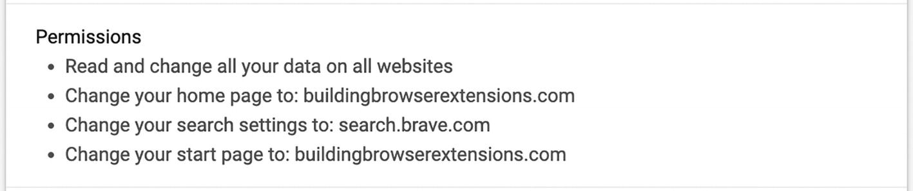

#### Trang chủ tùy chỉnh (Custom Homepage)

Trang chủ của trình duyệt là URL mà trình duyệt sẽ chuyển hướng người dùng đến khi họ nhấp vào nút "trang chủ" (home) trong trình duyệt (Hình 5-3). Tất cả các trình duyệt lớn hiện nay đều không hiển thị nút trang chủ theo mặc định, nhưng nó có thể được bật dễ dàng trong menu cài đặt của trình duyệt. URL trang chủ có thể được ghi đè như sau:

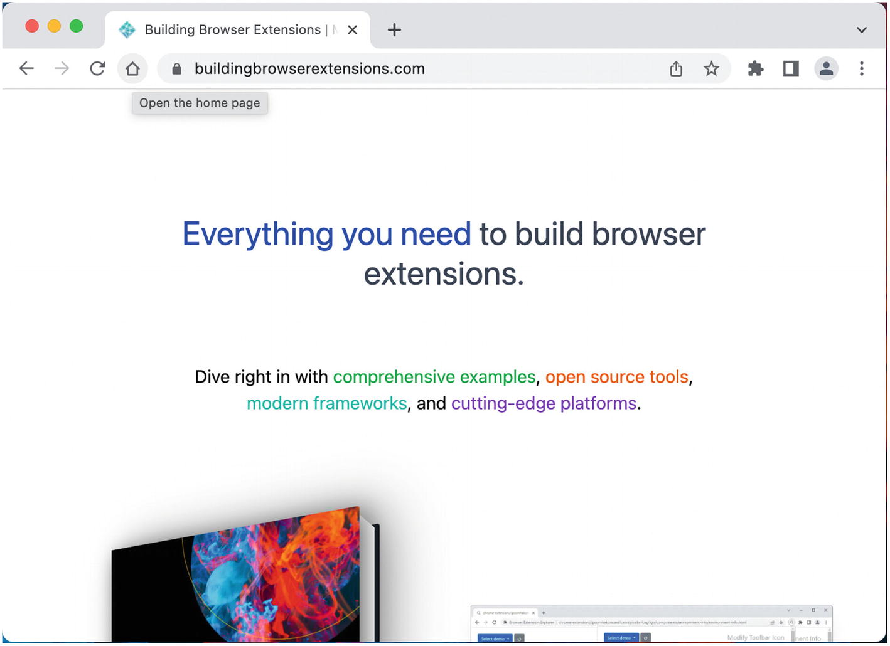

**Ví dụ về giá trị để ghi đè trang chủ:**

```json
{
  ...
  "chrome_settings_overrides": {
    "homepage": "https://www.buildingbrowserextensions.com"
  },
  ...
}
```

#### Công cụ tìm kiếm tùy chỉnh (Custom Search Engine)

Nhà cung cấp tìm kiếm quyết định nơi gửi các truy vấn được nhập vào thanh địa chỉ của trình duyệt. Tiện ích mở rộng có thể truy cập chuỗi truy vấn thông qua `searchTerms`, chèn nó vào một URL tùy chọn và gửi URL đó (Hình 5-4, 5-5, 5-6, 5-7).

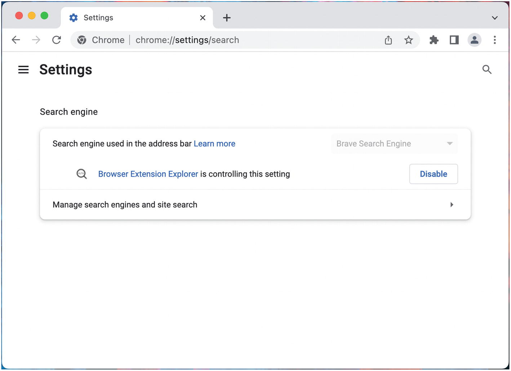

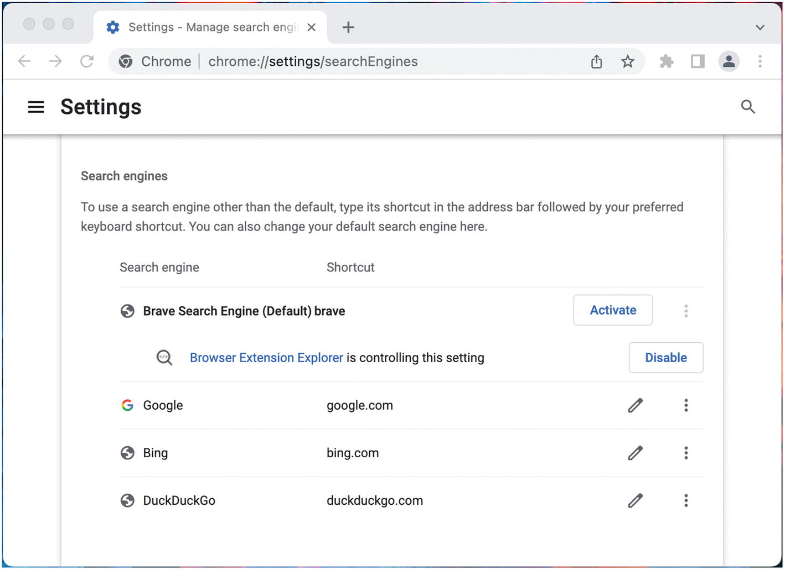

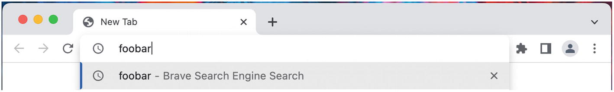

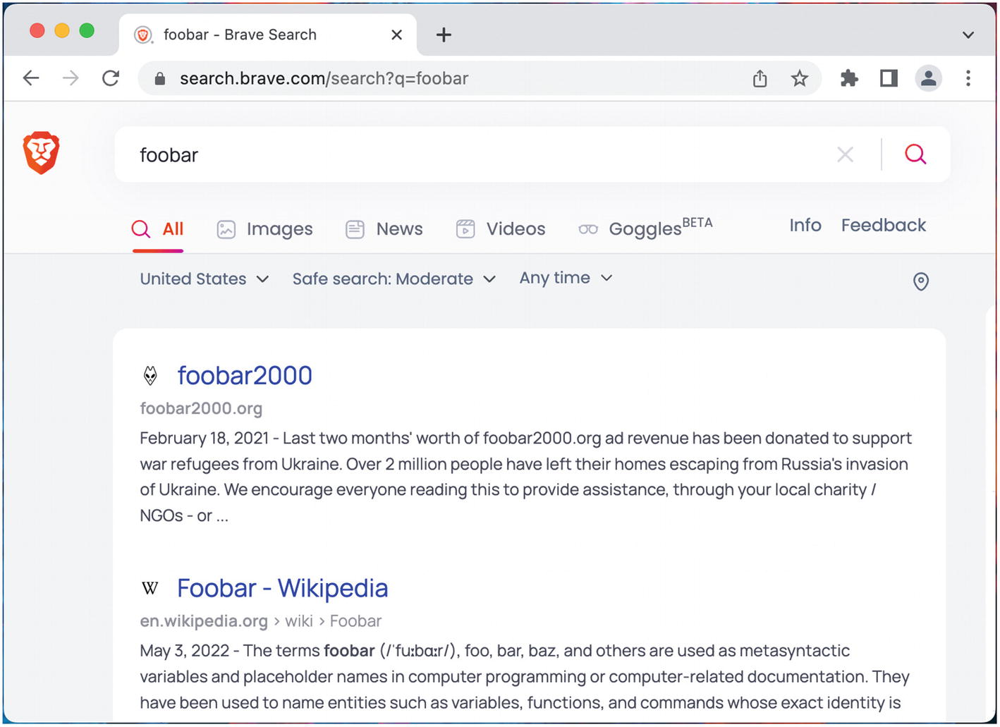

> [!NOTE]
> Các thiết lập công cụ tìm kiếm của trình duyệt được khởi tạo sớm khi trình duyệt bắt đầu. Bạn có thể cần khởi động lại hoàn toàn trình duyệt để thấy các thay đổi trong manifest này có hiệu lực.

Công cụ tìm kiếm có thể được ghi đè như sau:

**Ví dụ về giá trị để ghi đè `search_provider`:**

```json
{
  ...
  "chrome_settings_overrides": {
    "search_provider": {
      "name": "Brave Search Engine",
      "search_url": "https://search.brave.com/search?q={searchTerms}",
      "encoding": "UTF-8",
      "is_default": true
    }
  }
  ...
}
```

Đối tượng `search_provider` cũng có thể định nghĩa các thuộc tính bổ sung sau:

- `alternate_urls`
- `favicon_url`
- `image_url`
- `image_url_post_params`
- `instant_url`
- `instant_url_post_params`
- `keyword`
- `prepopulated_id`
- `search_url_post_params`
- `suggest_url`
- `suggest_url_post_params`

> [!NOTE]
> Việc hỗ trợ và tài liệu về các thuộc tính bổ sung này còn hạn chế – kết quả có thể thay đổi tùy trường hợp. Để biết chi tiết, hãy tham khảo [https://developer.mozilla.org/en-US/docs/Mozilla/Add-ons/WebExtensions/manifest.json/chrome_settings_overrides](https://developer.mozilla.org/en-US/docs/Mozilla/Add-ons/WebExtensions/manifest.json/chrome_settings_overrides).

#### Trang bắt đầu tùy chỉnh (Custom Startup Page)

(Chỉ dành cho trình duyệt Chromium) Trang bắt đầu là trang sẽ mở ra khi chương trình trình duyệt được khởi chạy lần đầu. Một tiện ích mở rộng có thể thiết lập trang bắt đầu bằng cách cung cấp một mảng chứa chính xác một URL (Hình 5-8). URL trang bắt đầu có thể được ghi đè như sau:

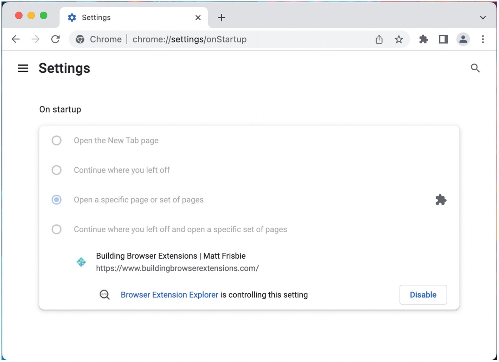

**Ví dụ về giá trị để ghi đè trang bắt đầu:**

```json
{
  ...
  "chrome_settings_overrides": {
    "startup_pages": [
      "https://www.buildingbrowserextensions.com"
    ]
  },
  ...
}
```

> [!NOTE]
> Tiền tố `chrome_` không liên quan đến khả năng tương thích của trình duyệt. Thuộc tính này được hỗ trợ ít nhất một phần bởi các trình duyệt Chromium và Firefox.

---

### `chrome_url_overrides`

Thuộc tính này cho phép tiện ích mở rộng ghi đè trang mặc định cho một số giao diện trình duyệt nhất định. Mỗi tiện ích mở rộng có thể ghi đè chính xác một trong các trang trình duyệt sau:

- Trang Lịch sử (History page)
- Trang Dấu trang (Bookmarks page)
- Trang Tab Mới (New Tab page)

Giá trị của `chrome_url_overrides` phải là một đối tượng chỉ chứa một trong các thuộc tính sau: `history`, `bookmarks`, hoặc `newtab`. Sau đây là ví dụ về cách sử dụng thuộc tính này:

**Ví dụ về giá trị cho `chrome_url_overrides`:**

```json
{
  ...
  "chrome_url_overrides": {
    "newtab": "components/newtab/newtab.html"
  },
  ...
}
```

> [!NOTE]
> Tiền tố `chrome_` không liên quan đến khả năng tương thích của trình duyệt. Thuộc tính này được hỗ trợ ít nhất một phần bởi các trình duyệt Chromium và Firefox.

---

### `commands`

Thuộc tính này được sử dụng để ánh xạ các câu lệnh bàn phím để thực hiện các tác vụ khác nhau trong tiện ích mở rộng của bạn. Một ví dụ về điều này là mở và đóng popup của tiện ích khi người dùng nhấn `Ctrl+Shift+F`. Trong khi việc ánh xạ các câu lệnh đa phím trong JavaScript liên quan đến việc thiết lập bộ lắng nghe cho các sự kiện `keydown` hoặc tương tự, thuộc tính `commands` cho phép bạn ánh xạ các câu lệnh bàn phím đa phím một cách nguyên bản bằng cách sử dụng một cú pháp đơn giản và trực quan. Bạn có thể định nghĩa hai loại câu lệnh: phím tắt (shortcuts), liên kết một câu lệnh bàn phím với một tập hợp các hành vi trình duyệt nguyên bản đã được định nghĩa trước, hoặc các câu lệnh tùy chỉnh (custom commands), liên kết một câu lệnh bàn phím với một sự kiện đặc biệt có thể được xử lý thông qua API WebExtensions.

#### Cú pháp câu lệnh (Command Syntax)

Tất cả các câu lệnh đều có cùng một cú pháp. Mỗi câu lệnh có dạng một đối tượng với hai thuộc tính: một đối tượng `suggested_key`, định nghĩa các phím tắt đa phím sẽ kích hoạt câu lệnh, và một chuỗi `description`, sẽ xuất hiện trong giao diện quản lý phím tắt của tiện ích mở rộng. Sau đây là ví dụ về cách định nghĩa một phím tắt cho một câu lệnh `foobar` chung:

**Ví dụ về giá trị cho một câu lệnh `foobar` chung:**

```json
{
  ...
  "commands": {
    "foobar": {
      "suggested_key": {
        "default": "Ctrl+Shift+F"
      },
      "description": "Chạy 'foobar' trên trang hiện tại."
    }
  },
  ...
}
```

Sau khi tiện ích mở rộng được tải, trình duyệt sẽ phản ánh phím tắt này trong giao diện quản lý phím tắt của nó (Hình 5-9).

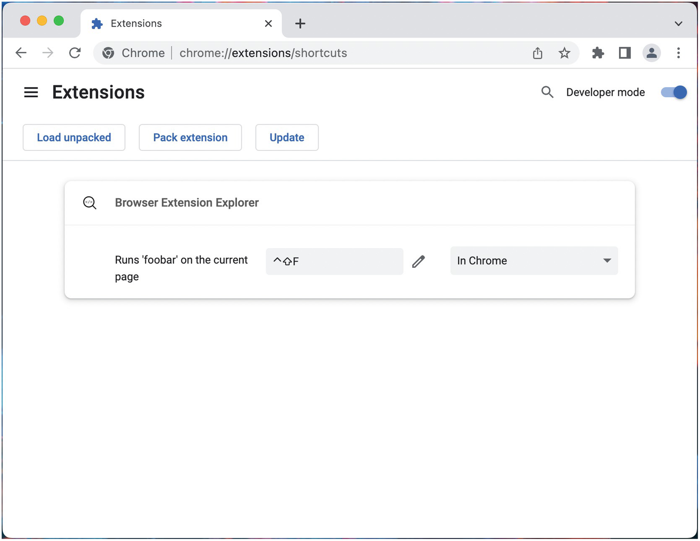

> [!NOTE]
> Danh sách phím tắt có sẵn tại `chrome://extensions/shortcuts` trong các trình duyệt Chromium và trong giao diện `about:addons` trong Firefox.

#### Định nghĩa phím tắt (Defining Key Shortcuts)

Khi một phím tắt được định nghĩa, trình duyệt sẽ theo dõi tổ hợp phím được chỉ định và thực thi câu lệnh khớp khi chúng được nhấn. Các mã định danh phím sau đây có sẵn để sử dụng:

- Các phím chữ cái và số: `A-Z` và `0-9`
- Các phím chung: `Comma`, `Period`, `Home`, `End`, `PageUp`, `PageDown`, `Space`, `Insert`, `Delete`
- Các phím chức năng: `F1-F12`
- Các phím mũi tên: `Up`, `Down`, `Left`, `Right`
- Các phím đa phương tiện: `MediaNextTrack`, `MediaPlayPause`, `MediaPrevTrack`, `MediaStop`
- Các phím bổ trợ (Modifier Keys): `Ctrl`, `Alt`, `Shift`, `MacCtrl` (chỉ dành cho macOS), `Command` (chỉ dành cho macOS), `Search` (chỉ dành cho ChromeOS)

Các phím tắt có các hạn chế sau:

- Phím tắt không được trùng với các tổ hợp phím mặc định của trình duyệt. Ví dụ, `Ctrl+R` đã được trình duyệt ánh xạ để tải lại trang và do đó không khả dụng để sử dụng cho các câu lệnh tiện ích.
- Phím tắt phải bao gồm hai hoặc ba phím.
- Phím tắt phải bao gồm `Ctrl` (hoặc `MacCtrl` trên MacOS) hoặc `Alt` nhưng không phải cả hai.

Phím tắt được định nghĩa dưới dạng một chuỗi với các mã định danh phím được nối với nhau bằng dấu `+`. Một số ví dụ về phím tắt hợp lệ:

- `Ctrl+Shift+F`
- `Alt+Q`
- `MacCtrl+Shift+F12`
- `Alt+MediaPlayPause`

#### Hỗ trợ đa trình duyệt (Multi-browser Support)

Đối tượng `suggested_key` tối thiểu phải định nghĩa một phím tắt `default`. Để hỗ trợ các hệ điều hành khác nhau, các thuộc tính sau có thể được định nghĩa thêm:

- `mac`
- `linux`
- `windows`
- `chromeos`
- `android`
- `ios`

Nếu các giá trị này được cung cấp và khớp với hệ điều hành đang chạy, trình duyệt sẽ tự động chọn chúng thay vì giá trị mặc định.

#### Các câu lệnh dành riêng (Reserved Commands)

Trình duyệt sẽ đối xử đặc biệt với một số tên câu lệnh:

- Trong manifest v3, `_execute_action` sẽ hoạt động như một lần nhấp vào nút thanh công cụ của tiện ích mở rộng.
- Trong manifest v2, `_execute_page_action` sẽ hoạt động như một lần nhấp vào nút page action của tiện ích.
- Trong manifest v2, `_execute_browser_action` sẽ hoạt động như một lần nhấp vào nút browser action của tiện ích.
- Trong Firefox và manifest v2, `_execute_sidebar_action` sẽ mở thanh bên (sidebar) của tiện ích.

Câu lệnh sau đây sẽ mở popup khi người dùng sử dụng phím tắt `Ctrl+Shift+F`:

**Ví dụ về giá trị cho câu lệnh dành riêng `_execute_action`:**

```json
{
  ...
  "commands": {
    "_execute_action": {
      "suggested_key": {
        "default": "Ctrl+Shift+F"
      }
    }
  },
  ...
}
```

> [!NOTE]
> Khi các câu lệnh dành riêng này thực thi, trình duyệt sẽ không kích hoạt phương thức `onCommand()`.

#### Câu lệnh tùy chỉnh (Custom Commands)

Đối với tất cả các mã định danh câu lệnh không khớp với các câu lệnh dành riêng, phím tắt sẽ gửi một sự kiện câu lệnh đến tất cả các bộ lắng nghe của `command.onCommand()`.

**Ví dụ về giá trị cho một câu lệnh `foobar` chung:**

```json
{
  ...
  "commands": {
    "foobar": {
      "suggested_key": {
        "default": "Ctrl+Shift+F"
      },
      "description": "Chạy 'foobar' trên trang hiện tại."
    }
  },
  ...
}
```

Câu lệnh `foobar` ở trên sẽ được xử lý như sau:

```javascript
chrome.commands.onCommand.addListener((command) => {
  console.log(`Command: ${command}`);
  // Command: foobar
});
```

#### Câu lệnh toàn cục (Global Commands)

Theo mặc định, khi trình duyệt không được tập trung (focus) trên thiết bị, các phím tắt sẽ không gửi bất kỳ câu lệnh tiện ích nào. Các trình duyệt Chromium hỗ trợ một thuộc tính `global` tùy chọn cho các câu lệnh, cho phép các câu lệnh sử dụng các phím tắt khớp với `Ctrl+Shift+[0..9]` được kích hoạt ngay cả khi trình duyệt không được tập trung. Sau đây là một ví dụ về điều này:

**Ví dụ về giá trị cho một câu lệnh `foobar` toàn cục:**

```json
{
  ...
  "commands": {
    "foobar": {
      "suggested_key": {
        "default": "Ctrl+Shift+0"
      },
      "description": "Chạy 'foobar' trên trang hiện tại.",
      "global": true
    }
  },
  ...
}
```

> [!NOTE]
> Để biết chi tiết về cách sử dụng API commands, hãy tham khảo chương *Các API của Tiện ích mở rộng và Trình duyệt*.

---

### `content_capabilities`

Thuộc tính này đã lỗi thời và không nên sử dụng. Trước khi phát hành API Clipboard và API Persistent Storage, nó hữu ích để cấp cho các tiện ích mở rộng khả năng truy cập vào clipboard hoặc bộ nhớ không giới hạn. Với quyền truy cập vào các API mới này, thuộc tính này không còn cần thiết nữa.

---

### `content_scripts`

Thuộc tính này định nghĩa các tệp nào nên được chèn dưới dạng content script (kịch bản nội dung), nơi chèn chúng và theo phương thức nào. Giá trị của nó là một mảng các đối tượng, mỗi đối tượng định nghĩa một tập hợp kịch bản nội dung và các quy tắc cho các kịch bản đó. Mỗi đối tượng chứa các thành phần sau:

- Thuộc tính `matches` phải chứa một mảng gồm một hoặc nhiều bộ so khớp URL (URL matchers). Mỗi URL khớp với các bộ so khớp này sẽ được chèn kịch bản. Thuộc tính này là bắt buộc.
- Các thuộc tính `js` và `css` mỗi thuộc tính chứa một mảng gồm một hoặc nhiều tệp nên được chèn dưới dạng kịch bản nội dung khi URL trang khớp. Một hoặc cả hai nên được định nghĩa.
- Thuộc tính `run_at` định nghĩa thời điểm các kịch bản nội dung sẽ được chèn. Giá trị này có thể là `document_start`, `document_end`, hoặc `document_idle`. Giá trị mặc định là `document_idle`.
  - `document_start` chèn các kịch bản khi `document.readyState === "loading"`
  - `document_end` chèn các kịch bản khi `document.readyState === "interactive"`
  - `document_idle` chèn các kịch bản khi `document.readyState === "complete"`
- Bạn có thể tùy chọn lọc URL theo ba bộ lọc bổ sung, được đánh giá như sau:
  - Thuộc tính `include_globs` có thể được định nghĩa như một danh sách trắng (whitelist) các glob URL. Nếu được cung cấp, các kịch bản nội dung sẽ *chỉ* được chèn nếu URL khớp với mảng glob này.
  - Thuộc tính `exclude_matches` có thể được định nghĩa như một danh sách đen (blacklist) các bộ so khớp URL. Nếu được cung cấp, các kịch bản nội dung sẽ *chỉ* được chèn nếu URL *không khớp* với mảng bộ so khớp này.
  - Thuộc tính `exclude_globs` có thể được định nghĩa như một danh sách đen các glob URL. Nếu được cung cấp, các kịch bản nội dung sẽ *chỉ* được chèn nếu URL *không khớp* với mảng glob này.
  - Thuộc tính `match_about_blank` cho phép kịch bản nội dung được chèn trên các URL `about:blank` hoặc `about:srcdoc`.
  - Thuộc tính `all_frames` cho phép kịch bản nội dung được chèn vào các khung (frames) lồng nhau.

Sau đây là ví dụ về cách sử dụng thuộc tính này:

**Ví dụ về giá trị cho `content_scripts`:**

```json
{
  ...
  "content_scripts": [
    {
      "matches": [
        "*://example.com/*"
      ],
      "include_globs": [
        "*archive*"
      ],
      "exclude_matches": [
        "*://example.com/experimental/*"
      ],
      "exclude_globs": [
        "*?display=legacy*"
      ],
      "js": [
        "scripts/content-script.js"
      ],
      "css": [
        "styles/content-script.css"
      ],
      "run_at": "document_end",
      "match_about_blank": true,
      "all_frames": true
    }
  ],
  ...
}
```

> [!TIP]
> Khóa `match_about_blank` có một số thông tin nền rất thú vị: [https://stackoverflow.com/questions/41408936](https://stackoverflow.com/questions/41408936)
>
> [!NOTE]
> Để biết thêm chi tiết về kịch bản nội dung, hãy tham khảo chương *Kịch bản nội dung (Content Scripts)*.

---

### `content_security_policy`

Thuộc tính này định nghĩa các chính sách bảo mật nội dung (CSP) của tiện ích mở rộng. Thuộc tính này đã thay đổi đáng kể giữa manifest v2 và v3, cả về cấu trúc lẫn các giá trị được phép.

#### Chính sách bảo mật nội dung trong Manifest v2

Trong manifest v2, thuộc tính `content_security_policy` là một chuỗi thiết lập các giá trị CSP cho toàn bộ ứng dụng. Manifest v2 rất nới lỏng về các hạn chế CSP: nó cho phép thực thi các kịch bản như `eval()`, điều này có tiềm năng tạo ra các lỗ hổng bảo mật. Sau đây là ví dụ về cách sử dụng thuộc tính này trong manifest v2:

**Ví dụ về giá trị cho `content_security_policy` trong manifest v2:**

```json
{
  ...
  "content_security_policy": "script-src 'self' 'unsafe-eval' https://example.com; object-src 'self'",
  ...
}
```

#### Chính sách bảo mật nội dung trong Manifest v3

Manifest v3 thay đổi đáng kể định dạng của `content_security_policy`. Thuộc tính này hiện là một đối tượng, với hai khóa có thể có:

- `extension_pages` định nghĩa CSP cho tất cả các trang tiện ích mở rộng không nằm trong sandbox.
- `sandbox` định nghĩa CSP cho tất cả các trang tiện ích mở rộng nằm trong sandbox.

Hơn nữa, manifest v3 trong các trình duyệt Chromium không cho phép một số giá trị CSP trong các trang tiện ích không nằm trong sandbox để ngăn chặn các hoạt động không an toàn như `eval()` và thực thi kịch bản của bên thứ ba. Sau đây là ví dụ về cách sử dụng thuộc tính này trong manifest v3:

**Ví dụ về giá trị cho `content_security_policy` trong manifest v3:**

```json
{
  ...
  "content_security_policy": {
    "extension_pages": "script-src 'self'",
    "sandbox": "script-src 'self' https://example.com; object-src 'self'"
  },
  ...
}
```

> [!NOTE]
> Chi tiết về việc định nghĩa chính sách bảo mật nội dung của tiện ích mở rộng được trình bày trong chương *Kiến trúc Tiện ích mở rộng*. Để biết chi tiết về các hạn chế CSP trong manifest v3, hãy tham khảo [https://developer.chrome.com/docs/extensions/mv3/intro/mv3-migration/#content-security-policy](https://developer.chrome.com/docs/extensions/mv3/intro/mv3-migration/#content-security-policy).

---

### `converted_from_user_script`

Thuộc tính này được sử dụng như một phần của quá trình chuyển đổi được Google hỗ trợ từ các userscript vào năm 2016. Mục đích của nó là để các Chrome Apps, vốn chia sẻ API với các tiện ích mở rộng web, có thể hướng dẫn người dùng của họ đến một Ứng dụng Web Lũy tiến (Progressive Web Application - PWA) thay thế thông qua phương thức `installReplacementWebApp()`. Các tiện ích mở rộng hiện đại sẽ không có nhu cầu sử dụng thuộc tính này.

> [!NOTE]
> Đọc thêm về quá trình chuyển đổi từ Chrome Apps tại đây: [https://developer.chrome.com/docs/apps/migration/](https://developer.chrome.com/docs/apps/migration/).

---

### `cross_origin_embedder_policy`

(Chỉ dành cho trình duyệt Chromium, chỉ dành cho manifest v3) Thuộc tính này định nghĩa giá trị tiêu đề (header) Cross-Origin-Embedder-Policy (COEP) cho các yêu cầu đến nguồn (origin) của tiện ích mở rộng. Vì tiện ích mở rộng hoạt động theo nhiều cách giống như một máy chủ web, nó có thể dễ bị tổn thương trước các vấn đề bảo mật dựa trên nguồn tương tự như các máy chủ web. Nếu bạn muốn bật các tính năng chỉ có thể truy cập được với sự cô lập đa nguồn (cross-origin isolation), thuộc tính này được sử dụng để thiết lập giá trị tiêu đề COEP để hoạt động theo cách đó. Thuộc tính này phải được thiết lập cùng với thuộc tính `cross_origin_opener_policy` để bật tính năng cô lập đa nguồn.

Thuộc tính chứa một đối tượng với một thuộc tính `value` duy nhất. Sau đây là ví dụ về cách sử dụng thuộc tính này để bật tính năng cô lập đa nguồn:

**Ví dụ về giá trị cho `cross_origin_embedder_policy`:**

```json
{
  ...
  "cross_origin_embedder_policy": {
    "value": "require-corp"
  },
  ...
}
```

> [!NOTE]
> Cô lập đa nguồn là một chủ đề quan trọng nằm ngoài phạm vi của cuốn sách này. Để biết một bài đăng blog tuyệt vời về chủ đề này, hãy truy cập [https://web.dev/coop-coep/](https://web.dev/coop-coep/).

---

### `cross_origin_opener_policy`

(Chỉ dành cho trình duyệt Chromium, chỉ dành cho manifest v3) Thuộc tính này định nghĩa giá trị tiêu đề Cross-Origin-Opener-Policy (COOP) cho các yêu cầu đến nguồn của tiện ích mở rộng. Vì tiện ích mở rộng hoạt động theo nhiều cách giống như một máy chủ web, nó có thể dễ bị tổn thương trước các vấn đề bảo mật dựa trên nguồn tương tự như các máy chủ web. Nếu bạn muốn bật các tính năng chỉ có thể truy cập được với sự cô lập đa nguồn, thuộc tính này được sử dụng để thiết lập giá trị tiêu đề COOP để hoạt động theo cách đó. Thuộc tính này phải được thiết lập cùng với thuộc tính `cross_origin_embedder_policy` để bật tính năng cô lập đa nguồn.

Thuộc tính chứa một đối tượng với một thuộc tính `value` duy nhất. Sau đây là ví dụ về cách sử dụng thuộc tính này để bật tính năng cô lập đa nguồn:

**Ví dụ về giá trị cho `cross_origin_opener_policy`:**

```json
{
  ...
  "cross_origin_opener_policy": {
    "value": "same-origin"
  },
  ...
}
```

> [!NOTE]
> Cô lập đa nguồn là một chủ đề quan trọng nằm ngoài phạm vi của cuốn sách này. Để biết một bài đăng blog tuyệt vời về chủ đề này, hãy truy cập [https://web.dev/coop-coep/](https://web.dev/coop-coep/).

---

### `declarative_net_request`

(Chỉ dành cho manifest v3 và trình duyệt Chromium) Thuộc tính này định nghĩa các tập quy tắc (rulesets) sẽ được sử dụng cho API Declarative Net Request. Giá trị là một đối tượng với một khóa `rule_resources` duy nhất, định nghĩa một mảng tất cả các đối tượng tập quy tắc được cung cấp trong tiện ích mở rộng. Mỗi đối tượng tập quy tắc phải định nghĩa một chuỗi `id` duy nhất, một giá trị boolean `enabled` kiểm soát xem trình duyệt có nên sử dụng tập quy tắc hay không, và một chuỗi `path` với đường dẫn tương đối đến tệp JSON của tập quy tắc. Sau đây là ví dụ về cách sử dụng thuộc tính này:

**Ví dụ về giá trị cho `declarative_net_request`:**

```json
{
  ...
  "declarative_net_request": {
    "rule_resources" : [
      {
        "id": "ruleset_1",
        "enabled": true,
        "path": "ruleset_1.json"
      }, {
        "id": "ruleset_2",
        "enabled": false,
        "path": "ruleset_1.json"
      }
    ]
  },
  ...
}
```

> [!NOTE]
> Để biết chi tiết về API Declarative Net Request, định nghĩa tập quy tắc và các quyền cho `declarative_net_request`, hãy tham khảo chương *Mạng (Networking)*.

---

### `default_locale`

Thuộc tính này định nghĩa chuỗi bản địa (locale) mặc định. Thuộc tính này phải có mặt nếu và chỉ khi có thư mục `_locales` như đã mô tả trong phần bản địa ở phần trước của chương này. Sau đây là ví dụ về cách sử dụng thuộc tính này:

**Ví dụ về giá trị cho `default_locale`:**

```json
{
  ...
  "default_locale": "en",
  ...
}
```

---

### `description`

Thuộc tính này định nghĩa mô tả chính thức của tiện ích mở rộng. Giá trị này được hiển thị trong trình duyệt cũng như trong các cửa hàng tiện ích mở rộng. Sau đây là ví dụ về cách sử dụng thuộc tính này:

**Ví dụ về giá trị cho `description`:**

```json
{
  ...
  "description": "Một bộ sưu tập các ví dụ về tiện ích mở rộng trình duyệt",
  ...
}
```

---

### `developer`

Thuộc tính này định nghĩa một đối tượng chứa tên tác giả và/hoặc URL trang chủ của tiện ích mở rộng để hiển thị trong trình duyệt. Cả hai thuộc tính `name` và `url` đều là tùy chọn. Sau đây là ví dụ về cách sử dụng thuộc tính này:

**Ví dụ về giá trị cho `developer`:**

```json
{
  ...
  "developer": {
    "name": "Matt Frisbie",
    "url": "https://www.buildingbrowserextensions.com"
  },
  ...
}
```

> [!NOTE]
> Nếu các thuộc tính của `developer` được định nghĩa, chúng sẽ ghi đè các thuộc tính `author` và `homepage_url`.

---

### `devtools_page`

Thuộc tính này cho trình duyệt biết nơi đặt tệp HTML sẽ được sử dụng làm điểm khởi đầu cho nội dung công cụ dành cho nhà phát triển của tiện ích mở rộng của bạn. Trang này được sử dụng để khởi động các tiện ích dành cho nhà phát triển, nhưng nó được hiển thị như một trang ẩn (headless page). Sau đây là ví dụ về cách sử dụng thuộc tính này:

**Ví dụ về giá trị cho `devtools_page`:**

```json
{
  ...
  "devtools_page": "components/devtools/devtools.html",
  ...
}
```

> [!NOTE]
> Tham khảo chương *Trang Công cụ dành cho nhà phát triển (Devtools Pages)* để biết chi tiết về cách thiết lập giao diện công cụ dành cho nhà phát triển tùy chỉnh.

---

### `differential_fingerprint`

Thuộc tính này là một khóa nội bộ được Chrome Web Store sử dụng để phân phối bản cập nhật tiện ích mở rộng. Bạn không nên tự thiết lập thuộc tính này trong bất kỳ trường hợp nào.

> [!NOTE]
> Chrome Web Store tạo thuộc tính này khi gửi đi bản cập nhật tiện ích mở rộng vi sai (differential extension update). Thuộc tính này xác định duy nhất chỉ những tệp đã thay đổi trong phiên bản mới của tiện ích đó. Khóa này sẽ tự động được loại bỏ khi tiện ích được cài đặt.

---

### `event_rules`

(Chỉ dành cho trình duyệt Chromium) Thuộc tính này đã bị phản đối (deprecated); nó định nghĩa các quy tắc có thể sửa đổi các yêu cầu mạng đang được thực hiện bằng cách sử dụng `declarativeWebRequest` hoặc thực hiện các hành động tùy thuộc vào nội dung trang – tất cả mà không yêu cầu quyền đọc nội dung của trang bằng cách sử dụng `declarativeContent`. `declarativeWebRequest` đã bị phản đối để thay thế bằng `declarativeNetRequest`, vì vậy thuộc tính này không nên được sử dụng.

---

### `externally_connectable`

Thuộc tính này định nghĩa những tiện ích mở rộng bên ngoài hoặc trang web nào có thể tương tác với tiện ích mở rộng này thông qua `runtime.connect()` hoặc `runtime.sendMessage()`. Nếu không được định nghĩa, hành vi mặc định là cho phép tất cả các tiện ích mở rộng bên ngoài giao tiếp thông qua các phương thức này, nhưng không cho phép tất cả các trang web giao tiếp thông qua các phương thức này. Giá trị thuộc tính là một đối tượng có thể định nghĩa các điều sau:

- Nếu mảng `ids` được định nghĩa, chỉ các tiện ích mở rộng có ID khớp mới được phép kết nối. Mảng này chấp nhận ký tự đại diện `*` để cho phép tất cả các tiện ích mở rộng.
- Nếu mảng `matches` được định nghĩa, chỉ các trang web có URL khớp mới được phép kết nối.
- Nếu thuộc tính `accepts_tls_channel_id` được thiết lập thành `true`, các tin nhắn sẽ bao gồm ID kênh TLS trong tin nhắn gửi đi để xác định khung (frame) gốc.

Sau đây là ví dụ về cách sử dụng thuộc tính này:

**Ví dụ về giá trị cho `externally_connectable`:**

```json
{
  ...
  "externally_connectable": {
    "ids": [
      "allowmeabcdefabcdefabcdefabcdefa"
    ],
    "matches": [
      "https://*.example.com/*"
    ],
    "accepts_tls_channel_id": true
  },
  ...
}
```

---

### `file_browser_handlers`

(Chỉ dành cho manifest v3 và Chrome/Chrome OS) Thuộc tính này định nghĩa một mảng chứa các đối tượng xử lý trình duyệt tệp (file browser handler) có thể mở rộng trình duyệt tệp của Chrome OS. Thuộc tính này chỉ áp dụng trên các thiết bị Chrome OS. Sau đây là ví dụ về cách sử dụng thuộc tính này:

**Ví dụ về giá trị cho `file_browser_handlers`:**

```json
{
  ...
  "file_browser_handlers": [
    {
      "id": "upload",
      "default_title": "Save File",
      "file_filters": [
        "filesystem:*.*"
      ]
    }
  ],
  ...
}
```

> [!NOTE]
> Bộ xử lý trình duyệt tệp của Chrome OS nằm ngoài phạm vi của cuốn sách này. Để biết tài liệu đầy đủ, hãy tham khảo [https://developer.chrome.com/docs/extensions/reference/fileBrowserHandler/](https://developer.chrome.com/docs/extensions/reference/fileBrowserHandler/).

---

### `file_system_provider_capabilities`

(Chỉ dành cho manifest v3 và Chrome/Chrome OS) Thuộc tính này định nghĩa một đối tượng chứa các thuộc tính quy định cách tiện ích mở rộng có thể tương tác với hệ thống tệp của thiết bị máy chủ thông qua API File System Provider. Thuộc tính này chỉ áp dụng trên các thiết bị Chrome OS. Sau đây là ví dụ về cách sử dụng thuộc tính này:

**Ví dụ về giá trị cho `file_system_provider_capabilities`:**

```json
{
  ...
  "file_system_provider_capabilities": {
    "configurable": true,
    "watchable": false,
    "multiple_mounts": true,
    "source": "network"
  },
  ...
}
```

> [!NOTE]
> Trình quản lý tệp và hệ thống tệp của Chrome OS nằm ngoài phạm vi của cuốn sách này. Để biết tài liệu đầy đủ, hãy tham khảo [https://developer.chrome.com/docs/extensions/reference/fileSystemProvider/](https://developer.chrome.com/docs/extensions/reference/fileSystemProvider/).

---

### `homepage_url`

Thuộc tính này cung cấp URL trang chủ của tiện ích mở rộng để hiển thị trong trình duyệt. Sau đây là ví dụ về cách sử dụng thuộc tính này:

**Ví dụ về giá trị cho `homepage_url`:**

```json
{
  ...
  "homepage_url": "https://www.buildingbrowserextensions.com",
  ...
}
```

> [!NOTE]
> Nếu thuộc tính `developer.url` được định nghĩa, nó sẽ ghi đè giá trị này. Thuộc tính này không được hỗ trợ trong Chrome hoặc Safari.

---

### `host_permissions`

(Chỉ dành cho manifest v3) Thuộc tính này định nghĩa các mẫu khớp máy chủ (host match patterns) mà tiện ích mở rộng yêu cầu để chạy. Nếu trang web khớp với một hoặc nhiều mẫu trong danh sách này, tiện ích mở rộng sẽ có khả năng đọc hoặc sửa đổi dữ liệu của máy chủ đó, chẳng hạn như `cookies`, `webRequest`, và `tabs.executeScript`. Sau đây là ví dụ về cách sử dụng thuộc tính này:

**Ví dụ về giá trị cho `host_permissions`:**

```json
{
  ...
  "host_permissions": [
    "*://developer.mozilla.org/*",
    "*://developer.chrome.com/*"
  ],
  ...
}
```

Điều quan trọng là các giá trị `host_permissions` không liên quan đến các bộ so khớp mẫu của `content_scripts`. Các bộ so khớp mẫu kiểm soát trang nào sẽ được chèn kịch bản nội dung được định nghĩa bên trong thuộc tính `content_scripts`.

> [!NOTE]
> Tham khảo chương *Quyền truy cập (Permissions)* để biết chi tiết về các quyền của tiện ích mở rộng.

---

### `icons`

Thuộc tính này định nghĩa một đối tượng chứa các giá trị quy định biểu tượng chính của tiện ích mở rộng. Biểu tượng này được sử dụng cả trong quá trình cài đặt cũng như trong các cửa hàng tiện ích mở rộng khác nhau. Tối thiểu, bạn nên định nghĩa một hình ảnh raster 128x128 (hình ảnh JPEG, PNG, BMP hoặc ICO). Nếu bạn muốn hỗ trợ tất cả các cửa hàng và trình duyệt, bạn nên định nghĩa bốn hình ảnh PNG với các kích thước 16x16, 32x32, 48x48 và 128x128.

Sau đây là ví dụ về cách sử dụng thuộc tính này:

**Ví dụ về giá trị cho `icons`:**

```json
{
  ...
  "icons": {
    "16": "assets/icons/icon-16.png",
    "32": "assets/icons/icon-32.png",
    "48": "assets/icons/icon-48.png",
    "128": "assets/icons/icon-128.png"
  },
  ...
}
```

> [!NOTE]
> Các tệp SVG không được hỗ trợ cho thuộc tính này.

---

### `incognito`

Thuộc tính này cho phép bạn định nghĩa cách tiện ích mở rộng có thể tương tác với các cửa sổ duyệt web riêng tư. Sau đây là ví dụ về cách sử dụng thuộc tính này:

**Ví dụ về giá trị cho `incognito`:**

```json
{
  ...
  "incognito": "spanning",
  ...
}
```

Thuộc tính `incognito` có thể có một trong ba giá trị:

- `spanning`: cho phép tiện ích mở rộng xử lý cả trang riêng tư và không riêng tư theo cùng một cách. Nó có thể phân biệt giữa hai loại trang thông qua phương thức `chrome.windows.getLastFocused()`. Giá trị này là mặc định.
- `split`: sẽ chia tiện ích mở rộng thành hai phần riêng biệt: một phần xử lý các trang riêng tư, một phần xử lý các trang không riêng tư. Các phần này hoạt động như hai phiên bản tiện ích mở rộng riêng biệt.
- `not_allowed`: vô hiệu hóa tiện ích mở rộng trên chế độ duyệt web riêng tư.

> [!NOTE]
> Việc hỗ trợ thuộc tính này khác nhau giữa các trình duyệt, hãy tham khảo [https://developer.chrome.com/docs/extensions/mv2/manifest/incognito/](https://developer.chrome.com/docs/extensions/mv2/manifest/incognito/) và [https://developer.mozilla.org/en-US/docs/Mozilla/Add-ons/WebExtensions/manifest.json/incognito](https://developer.mozilla.org/en-US/docs/Mozilla/Add-ons/WebExtensions/manifest.json/incognito) để biết chi tiết.

---

### `key`

(Chỉ dành cho trình duyệt Chromium) Thuộc tính này định nghĩa rõ ràng cho trình duyệt ID của tiện ích mở rộng (gồm 32 ký tự). Nếu `key` không được cung cấp, trình duyệt sẽ tự động tạo nó cho bạn.

**Ví dụ về giá trị cho `key`:**

```json
{
  ...
  "key": "hdokiejnpivrijdhajhdlcegeplioahd",
  ...
}
```

> [!NOTE]
> Thuộc tính này chỉ cần thiết trong trường hợp hiếm hoi khi bạn muốn định nghĩa rõ ràng ID tiện ích mở rộng cho việc phát triển cục bộ tại thời điểm tải. Giá trị này không được sử dụng khi triển khai lên cửa hàng web.

---

### `manifest_version`

Thuộc tính này cho trình duyệt biết cách manifest nên được diễn giải. Như đã mô tả ở phần trước của chương, số nguyên này có ý nghĩa quan trọng đối với cách cấu trúc toàn bộ tệp manifest. Sau đây là ví dụ về cách sử dụng thuộc tính này:

**Ví dụ về giá trị cho `manifest_version`:**

```json
{
  ...
  "manifest_version": 3,
  ...
}
```

> [!NOTE]
> Một số trình duyệt như Firefox vẫn đang trong quá trình tung ra hỗ trợ cho manifest v3, nhưng các trình duyệt khác như Chrome đang tích cực loại bỏ hỗ trợ cho manifest v2. Ứng dụng của bạn sẽ cần tạo nhiều tệp `manifest.json` để hỗ trợ nhiều cửa hàng tiện ích mở rộng.

---

### `minimum_chrome_version`

(Chỉ dành cho trình duyệt Chromium) Thuộc tính này định nghĩa phiên bản Chrome tối thiểu cần thiết cho tiện ích mở rộng. Các trình duyệt không dựa trên Chromium sẽ bỏ qua thuộc tính này. Sau đây là ví dụ về cách sử dụng thuộc tính này:

**Ví dụ về giá trị cho `minimum_chrome_version`:**

```json
{
  ...
  "minimum_chrome_version": "90",
  ...
}
```

---

### `nacl_modules`

Thuộc tính này đã từng được sử dụng để hỗ trợ Native Client (NaCl), việc sử dụng nó đã bị phản đối.

> [!NOTE]
> Native Client là một môi trường hộp cát để chạy mã C và C++ đã biên dịch trong trình duyệt một cách hiệu quả và an toàn, độc lập với hệ điều hành của người dùng. Nó đã bị phản đối vào năm 2020 và việc hỗ trợ đã kết thúc vào tháng 6 năm 2021.

---

### `name`

Thuộc tính này định nghĩa tên chính thức của tiện ích mở rộng. Giá trị này được hiển thị trong trình duyệt cũng như trong các cửa hàng tiện ích mở rộng. Tên này không nên vượt quá 45 ký tự. Sau đây là ví dụ về cách sử dụng thuộc tính này:

**Ví dụ về giá trị cho `name`:**

```json
{
  ...
  "name": "Building Browser Extensions",
  ...
}
```

---

### `oauth2`

(Chỉ dành cho trình duyệt Chromium) Thuộc tính này được sử dụng để đăng ký tiện ích mở rộng của bạn như một khách hàng (client) OAuth2. Giá trị của nó là một đối tượng chứa ID khách hàng OAuth2 và các phạm vi (scopes):

**Ví dụ về giá trị cho `oauth2`:**

```json
{
  ...
  "oauth2": {
    "client_id": "oAuthClientID.apps.googleusercontent.com",
    "scopes": [
      "https://www.googleapis.com/auth/contacts.readonly"
    ]
  },
  ...
}
```

> [!NOTE]
> Tham khảo chương *Các API của Tiện ích mở rộng và Trình duyệt* để biết chi tiết về cách thiết lập xác thực cho tiện ích mở rộng của bạn.

---

### `offline_enabled`

Thuộc tính này đã bị phản đối và không nên sử dụng. Trong các cơ sở mã cũ, nó cho biết liệu tiện ích mở rộng có dự kiến hoạt động ngoại tuyến hay không.

---

### `omnibox`

Thuộc tính này cho phép giao diện omnibox nguyên bản của trình duyệt bằng cách định nghĩa từ khóa truy cập của nó. Giá trị là một đối tượng chứa một thuộc tính `keyword` duy nhất. Sau đây là ví dụ về cách sử dụng thuộc tính này:

**Ví dụ về giá trị cho `omnibox`:**

```json
{
  ...
  "omnibox": {
    "keyword": "bbx"
  },
  ...
}
```

Giả sử một người dùng đã cài đặt một tiện ích mở rộng với cấu hình omnibox như trên. Giao diện omnibox hoạt động như sau:

1. Người dùng tập trung vào thanh địa chỉ trình duyệt đang trống.
2. Người dùng nhập `bbx` theo sau bởi một khoảng trắng.
3. Trình duyệt mở giao diện omnibox (Hình 5-10).

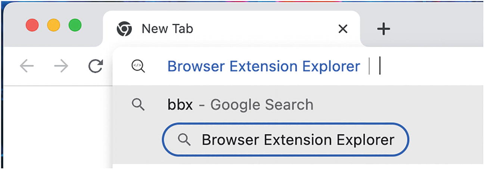

> [!NOTE]
> Tiện ích mở rộng có thể kiểm soát hành vi của omnibox bằng API Omnibox. Điều này được trình bày chuyên sâu trong chương *Các API của Tiện ích mở rộng và Trình duyệt*.

---

### `optional_host_permissions`

(Chỉ dành cho manifest v3 và Chromium) Thuộc tính này định nghĩa các mẫu khớp máy chủ mà tiện ích mở rộng không yêu cầu rõ ràng để chạy, nhưng người dùng có thể tùy chọn tham gia (opt into). Hành vi và cú pháp mẫu khớp giống hệt với `host_permissions`. Giao diện người dùng cấp quyền giống hệt với `optional_permissions`.

---

### `optional_permissions`

Thuộc tính này định nghĩa các quyền mà tiện ích mở rộng không yêu cầu để chạy chính xác, nhưng nó có thể nhắc người dùng cấp quyền truy cập vào thời điểm chạy. Thuộc tính này thường được sử dụng để thêm các quyền của tiện ích mở rộng trong các bản phát hành tiếp theo mà không yêu cầu tất cả người dùng phải cấp quyền truy cập vào một quyền mới. Không phải tất cả các loại quyền đều đủ điều kiện để xuất hiện trong mảng này. Sau đây là ví dụ về cách sử dụng thuộc tính này:

**Ví dụ về giá trị cho `optional_permissions`:**

```json
{
  ...
  "optional_permissions": [
    "cookies",
    "history",
    "notifications"
  ],
  ...
}
```

> [!NOTE]
> Tham khảo chương *Quyền truy cập (Permissions)* để biết chi tiết về các quyền của tiện ích mở rộng.

---

### `options_page`

Đây là một thuộc tính đã bị phản đối. Hãy sử dụng `options_ui` để thay thế.

---

### `options_ui`

Thuộc tính này cho trình duyệt biết nơi đặt tệp HTML sẽ hiển thị dưới dạng trang tùy chọn (options page) khi được mở theo lập trình, bằng URL hoặc qua menu ngữ cảnh trên thanh công cụ. Nó là một đối tượng thường chỉ chứa một thuộc tính `page` duy nhất, nhưng cũng hỗ trợ các thuộc tính bổ sung trong một số trình duyệt. Sau đây là ví dụ về cách sử dụng thuộc tính này:

**Ví dụ về giá trị cho `options_ui`:**

```json
{
  ...
  "options_ui": {
    "page": "components/options/options.html"
  },
  ...
}
```

#### `browser_style` (options_ui)

(Chỉ dành cho Firefox) Thuộc tính này là một giá trị boolean cho trình duyệt biết liệu nó có nên chèn một biểu định kiểu (stylesheet) vào trang tùy chọn để định kiểu cho nó nhất quán với trình duyệt hay không. Các biểu định kiểu này có thể được xem trong bất kỳ trình duyệt Firefox nào tại `chrome://browser/content/extension.css`, hoặc `chrome://browser/content/extension-mac.css` trên macOS. Thuộc tính này mặc định là `false`. Sau đây là ví dụ về cách sử dụng thuộc tính này:

**Ví dụ về giá trị cho `browser_style`:**

```json
{
  ...
  "options_ui": {
    "page": "components/options/options.html",
    "browser_style": true
  },
  ...
}
```

#### `open_in_tab`

(Chỉ dành cho Firefox) Thuộc tính này là một giá trị boolean cho trình duyệt biết liệu nó có nên mở trang tùy chọn trong một tab trình duyệt thông thường thay vì trong một trang tùy chọn nhúng (Hình 5-11) hay không. Thuộc tính này mặc định là `true`.

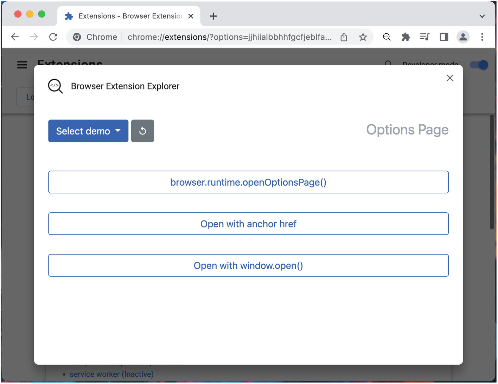

Sau đây là ví dụ về cách sử dụng thuộc tính này:

**Ví dụ về giá trị cho `options_ui`:**

```json
{
  ...
  "options_ui": {
    "page": "components/options/options.html",
    "open_in_tab": false
  },
  ...
}
```

---

### `page_action`

(Chỉ dành cho manifest v2) Thuộc tính `page_action` đã được thay thế bằng `action` trong manifest v3. Các giá trị thuộc tính và hành vi về cơ bản là giống hệt nhau. Nếu sử dụng manifest v2, hãy tham khảo thuộc tính `action` để biết chi tiết về cách gán giá trị cho thuộc tính này.

> [!NOTE]
> Thuộc tính này là vết tích của các công cụ tiện ích mở rộng cho các phiên bản trình duyệt cũ hơn. `browser_action` và `page_action` là dư thừa trong tất cả các trình duyệt hiện đại. Kết quả là, các thuộc tính này đã được hợp nhất thành thuộc tính `action`, vốn giống hệt về định dạng và hành vi.

---

### `permissions`

Thuộc tính này định nghĩa các quyền mà tiện ích mở rộng yêu cầu để chạy chính xác. Tất cả các loại quyền đều đủ điều kiện để xuất hiện trong mảng này. Khi cài đặt và cập nhật, mọi bổ sung vào mảng này sẽ yêu cầu người dùng phải cấp quyền truy cập rõ ràng vào quyền mới được thêm vào trong một hộp thoại bật lên. Sau đây là ví dụ về cách sử dụng thuộc tính này:

**Ví dụ về giá trị cho `permissions`:**

```json
{
  ...
  "permissions": [
    "activeTab",
    "declarativeNetRequest",
    "geolocation"
  ],
  ...
}
```

Trong manifest v2, mảng `permissions` cũng bao gồm các bộ so khớp mẫu URL mà hiện đã được định nghĩa trong thuộc tính `host_permissions`. Các tiện ích mở rộng hiện đại giờ đây chỉ nên đặt các bộ so khớp mẫu URL trong thuộc tính `host_permissions` hoặc `optional_host_permissions`.

> [!NOTE]
> Tham khảo chương *Quyền truy cập (Permissions)* để biết chi tiết về các quyền của tiện ích mở rộng.

---

### `platforms`

Thuộc tính này đã từng được sử dụng để hỗ trợ Native Client (NaCl), việc sử dụng nó đã bị phản đối.

> [!NOTE]
> Native Client là một môi trường hộp cát để chạy mã C và C++ đã biên dịch trong trình duyệt một cách hiệu quả và an toàn, độc lập với hệ điều hành của người dùng. Nó đã bị phản đối vào năm 2020 và việc hỗ trợ đã kết thúc vào tháng 6 năm 2021.

---

### `replacement_web_app`

Thuộc tính này được sử dụng như một phần của quá trình chuyển đổi được Google hỗ trợ từ Chrome Apps vào năm 2016. Mục đích của nó là để các Chrome Apps, vốn chia sẻ API với các tiện ích mở rộng web, có thể hướng dẫn người dùng của họ đến một Ứng dụng Web Lũy tiến thay thế thông qua phương thức `installReplacementWebApp()`. Các tiện ích mở rộng hiện đại sẽ không có nhu cầu sử dụng thuộc tính này.

> [!NOTE]
> Đọc thêm về quá trình chuyển đổi từ Chrome Apps tại đây: [https://developer.chrome.com/docs/apps/migration/](https://developer.chrome.com/docs/apps/migration/).

---

### `requirements`

(Chỉ dành cho trình duyệt Chromium) Thuộc tính này định nghĩa các công nghệ trình duyệt mà tiện ích mở rộng yêu cầu. Nếu thiết bị của người dùng không đáp ứng các yêu cầu, Chrome Web Store sẽ thông báo cho họ rằng thiết bị của họ thiếu công nghệ cần thiết để chạy tiện ích mở rộng. Hiện tại, thuộc tính duy nhất được hỗ trợ tích cực là "3D". Sau đây là ví dụ về cách sử dụng thuộc tính này:

**Ví dụ về giá trị cho `requirements`:**

```json
{
  ...
  "requirements": {
    "3D": {
      "features": [
        "webgl"
      ]
    }
  },
  ...
}
```

---

### `sandbox`

(Chỉ dành cho trình duyệt Chromium) Thuộc tính này định nghĩa trang nào nên được hiển thị trong chế độ hộp cát (sandbox mode). Giá trị của nó là một đối tượng với một mảng `pages` duy nhất chứa đường dẫn đến từng tệp nên được hiển thị trong chế độ hộp cát. Sau đây là ví dụ về cách sử dụng thuộc tính này:

**Ví dụ về giá trị cho `sandbox`:**

```json
{
  ...
  "sandbox": {
    "pages": [
      "components/popup/popup.html",
      "components/options/options.html"
    ]
  },
  ...
}
```

> [!NOTE]
> Để biết thêm chi tiết về việc đưa các trang vào hộp cát, hãy tham khảo chương *Kiến trúc Tiện ích mở rộng*.

---

### `short_name`

Thuộc tính này định nghĩa tên phụ của tiện ích mở rộng sẽ được sử dụng trong các ngữ cảnh mà thuộc tính `name` quá dài. Tên này không nên vượt quá 12 ký tự. Nếu thuộc tính này không được cung cấp, trình duyệt sẽ chỉ đơn giản là cắt ngắn thuộc tính `name`. Sau đây là ví dụ về cách sử dụng thuộc tính này:

**Ví dụ về giá trị cho `short_name`:**

```json
{
  ...
  "short_name": "BBX",
  ...
}
```

---

### `storage`

Thuộc tính này chỉ định tệp lược đồ cho bộ nhớ được quản lý (managed storage), vốn liên quan đến API `storage.managed`. Sau đây là ví dụ về cách sử dụng thuộc tính này:

**Ví dụ về giá trị cho `storage`:**

```json
{
  ...
  "storage": {
    "managed_schema": "schema.json"
  },
  ...
}
```

> [!NOTE]
> Các trình duyệt xử lý bộ nhớ được quản lý khác nhau. Tham khảo chương *Các API của Tiện ích mở rộng và Trình duyệt* để biết thêm chi tiết.

---

### `system_indicator`

Thuộc tính này đã bị phản đối và không nên sử dụng.

> [!NOTE]
> Tham khảo [https://bugs.chromium.org/p/chromium/issues/detail?id=142450](https://bugs.chromium.org/p/chromium/issues/detail?id=142450) để biết lịch sử của thuộc tính này.

---

### `tts_engine`

(Chỉ dành cho trình duyệt Chromium) Thuộc tính này được sử dụng để khai báo tất cả các giọng nói và cấu hình giọng nói mà tiện ích mở rộng muốn sử dụng cho công cụ chuyển văn bản thành giọng nói (text-to-speech) của trình duyệt. Sau đây là ví dụ về cách sử dụng thuộc tính này:

**Ví dụ về giá trị cho `tts_engine`:**

```json
{
  ...
  "tts_engine": {
    "voices": [
      {
        "voice_name": "Alice",
        "lang": "en-US",
        "event_types": ["start", "marker", "end"]
      },
      {
        "voice_name": "Pat",
        "lang": "en-US",
        "event_types": ["end"]
      }
    ]
  },
  ...
}
```

> [!NOTE]
> Để biết chi tiết về API text-to-speech của Chrome, hãy tham khảo [https://developer.chrome.com/docs/extensions/reference/ttsEngine/](https://developer.chrome.com/docs/extensions/reference/ttsEngine/).

---

### `update_url`

(Chỉ dành cho trình duyệt Chromium) Thuộc tính này định nghĩa URL mà trình duyệt nên gửi yêu cầu cập nhật. Nó chỉ được sử dụng cho các tiện ích mở rộng Chrome không được lưu trữ trên Chrome Web Store. Sau đây là ví dụ về cách sử dụng thuộc tính này:

**Ví dụ về giá trị cho `update_url`:**

```json
{
  ...
  "update_url": "https://example.com/updates.xml",
  ...
}
```

> [!NOTE]
> Tham khảo chương *Phát triển và Triển khai Tiện ích mở rộng* để biết chi tiết về việc tự lưu trữ tiện ích mở rộng.

---

### `version`

Thuộc tính này định nghĩa số phiên bản chính thức của tiện ích mở rộng. Nó được sử dụng để xác định duy nhất các bản phát hành khác nhau của tiện ích mở rộng của bạn, cũng như để xác định thứ tự của các bản phát hành đó.

Các trình duyệt đặt ra các yêu cầu khác nhau cho giá trị này; ví dụ, trình xác thực phiên bản của Chrome khắt khe hơn Firefox. Để đơn giản và tương thích đa trình duyệt, chúng tôi khuyên bạn nên tuân thủ các tiêu chuẩn lập phiên bản ngữ nghĩa (semantic versioning) được mô tả tại [https://semver.org/](https://semver.org/). Sau đây là ví dụ về cách sử dụng thuộc tính này:

**Ví dụ về giá trị cho `version`:**

```json
{
  ...
  "version": "1.5.0"
}
```

> [!NOTE]
> Sử dụng các định dạng phiên bản `MAJOR.MINOR`, `MAJOR.MINOR.PATCH`, hoặc `MAJOR.MINOR.PATCH.BUILD` đều là các định dạng phiên bản được chấp nhận mà tất cả các trình duyệt sẽ chấp nhận.

---

### `version_name`

Thuộc tính này định nghĩa một bộ mô tả cho phiên bản tiện ích mở rộng. Nó cho phép bạn thêm các nhãn như `beta` hoặc `rc1` cung cấp thêm thông tin về bản phát hành nhưng không tuân thủ các trình xác thực phiên bản tiện ích mở rộng của trình duyệt. Sau đây là ví dụ về cách sử dụng thuộc tính này:

**Ví dụ về giá trị cho `version_name`:**

```json
{
  ...
  "version_name": "1.5.0 beta",
  ...
}
```

---

### `web_accessible_resources`

Thuộc tính này định nghĩa những tệp nào trong tiện ích mở rộng có thể được truy cập từ bên ngoài tiện ích, có thể là trang web hoặc một tiện ích mở rộng khác. Bất kỳ tệp nào là một phần của tiện ích mở rộng đều đủ điều kiện để được liệt kê ở đây, nhưng thuộc tính này nhằm cho phép các tệp JS, CSS, HTML và hình ảnh trong tiện ích mở rộng được đưa vào trang web hoặc một tiện ích mở rộng bên ngoài. Thuộc tính này được sử dụng trong cả manifest v2 và v3, nhưng đặc tả manifest v3 bổ sung thêm các điều khiển để quản lý một danh sách kiểm soát quyền truy cập cho từng tài nguyên.

#### Manifest v2

Phiên bản manifest v2 của `web_accessible_resources` rất đơn giản: chỉ là một mảng các chuỗi mẫu. Nếu một tài nguyên khớp với chuỗi mẫu này, các trang web hoặc tiện ích mở rộng từ xa sẽ được cấp quyền truy cập đọc. Sau đây là ví dụ về cách sử dụng thuộc tính này:

**Ví dụ về giá trị cho `web_accessible_resources` trong manifest v2:**

```json
{
  ...
  "web_accessible_resources": [
    "scripts/widget.js",
    "assets/images/*"
  ],
  ...
}
```

#### Manifest v3

Manifest v3 mở rộng thuộc tính này để cho phép kiểm soát nguồn gốc hoặc tiện ích mở rộng nào có quyền truy cập vào các tài sản nhất định, cũng như tùy chọn bật URL tài nguyên động. Định dạng mới là một mảng các đối tượng với các thuộc tính sau:

- `resources` là danh sách các mẫu khớp với các tệp trong tiện ích mở rộng. Điều này tương đương với toàn bộ thuộc tính `web_accessible_resources` trong manifest v2. Thuộc tính này là bắt buộc.
- `matches` và `extension_ids` kiểm soát nơi danh sách tài nguyên có thể truy cập được. Một và chỉ một trong các thuộc tính này phải được định nghĩa. `matches` là một mảng các mẫu khớp với các nguồn gốc trang web đủ điều kiện để truy cập danh sách tài nguyên. `extension_ids` là một mảng các ID tiện ích mở rộng đủ điều kiện để truy cập danh sách tài nguyên.
- `use_dynamic_url` là một giá trị boolean mà khi là `true`, sẽ hướng dẫn trình duyệt thay đổi URL của các tài nguyên sau mỗi phiên làm việc. Thuộc tính này mặc định là `false`. Vì ID tiện ích mở rộng là tĩnh trong suốt vòng đời của tiện ích đó, nên bất kỳ tài nguyên nào theo mặc định sẽ có cùng một URL giữa các bản phát hành. Việc bật thuộc tính này làm cho URL của tài nguyên đó trở nên không thể đoán trước.

---

## Tóm tắt

Trong chương này, bạn đã được hướng dẫn về chức năng của manifest và cách tạo một manifest. Chương này đã đưa bạn đi qua tất cả các thuộc tính manifest có thể có, chức năng của chúng, cách chúng nên được định nghĩa, các API chúng hoạt động cùng và những trình duyệt nào có thể sử dụng chúng. Khi bạn bắt gặp một thuộc tính manifest, bạn sẽ có thể tham khảo phần liên quan trong chương này để nhanh chóng giải mã chức năng của thuộc tính đó.

Chương tiếp theo sẽ đề cập đến quá trình chuyển đổi từ manifest v2 sang v3. Nó khám phá những khác biệt giữa hai phiên bản và cách nó sẽ ảnh hưởng đến thế giới của các tiện ích mở rộng trình duyệt.
