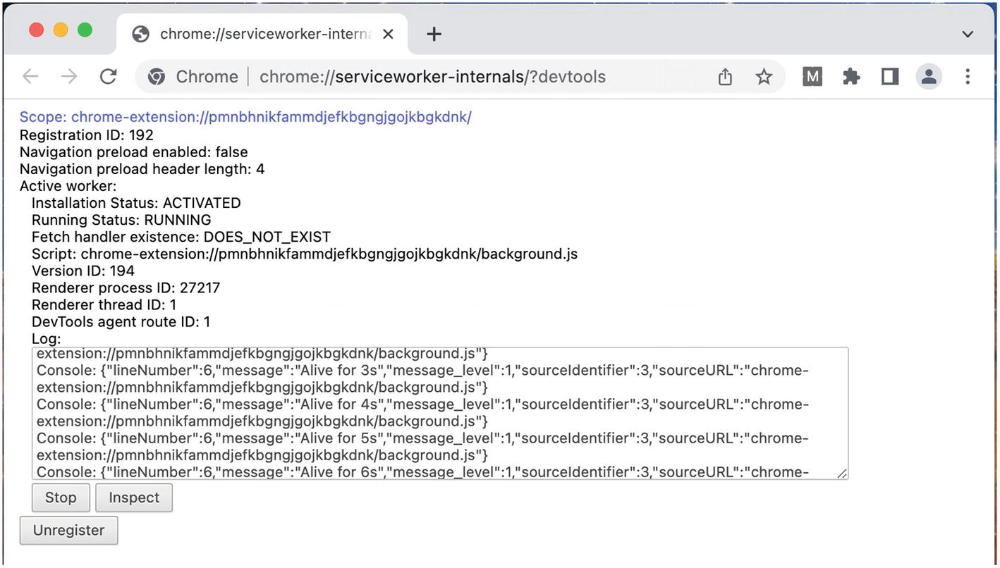
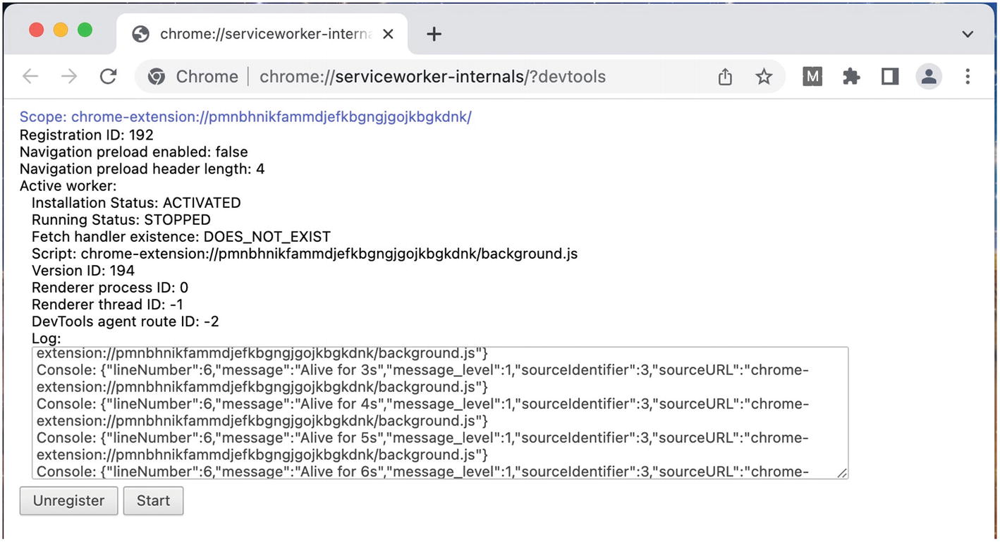
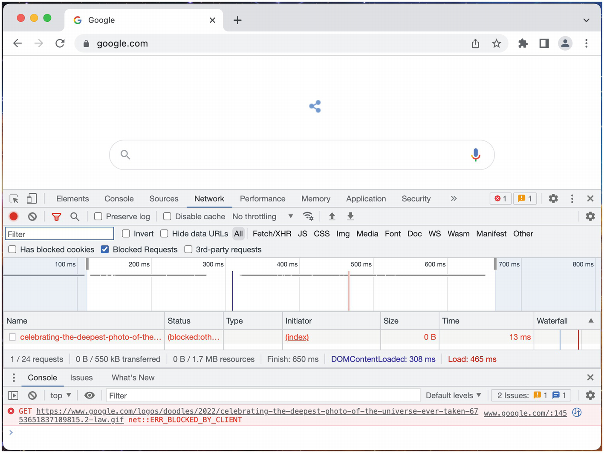

# Chương 6: Hiểu về các ảnh hưởng của Manifest V3

Thế giới của các tiện ích mở rộng trình duyệt đang trải qua một cuộc chuyển đổi lớn. Google Chrome đang đi đầu trong quá trình chuyển đổi thay đổi cách thức hoạt động và khả năng của các tiện ích mở rộng, và phần còn lại của các trình duyệt chính có khả năng sẽ làm theo. Một số thay đổi này gây tranh cãi, vì chúng có ảnh hưởng đáng kể đến nhiều tiện ích mở rộng Chrome rất phổ biến. Những thay đổi này được thể hiện trong việc định hình lại cách viết `manifest.json` (bằng cách định nghĩa một `manifest_version` 3 mới); do đó, những thay đổi này thường được gọi là "manifest v3".

> [!NOTE]
> Quá trình chuyển đổi còn lâu mới kết thúc và nhiều chi tiết về đích đến cuối cùng của hệ sinh thái vẫn còn phải được hoàn thiện. Chương này chủ yếu sẽ bao gồm các thông tin và ví dụ chắc chắn.

## Động lực cho Manifest V3

Tất cả những thay đổi chính có trong manifest v3 có thể được nhóm vào một vài động lực: bảo mật, hiệu suất, quyền riêng tư và minh bạch, và doanh thu.

### Bảo mật

Manifest v2 cho phép các tiện ích mở rộng thực thi JavaScript được tải từ các URL từ xa hoặc do người dùng cung cấp. Điều này được đánh giá là có vấn đề, vì một kịch bản độc hại thực thi với quyền truy cập vào các API và quyền của tiện ích mở rộng có thể gây ra rất nhiều thiệt hại. Để giải quyết lỗ hổng bảo mật này, manifest v3 hạn chế các tiện ích mở rộng chỉ có thể thực thi các kịch bản được bao gồm trong chính gói tiện ích mở rộng.

### Hiệu suất

Một số tính năng của manifest v2 có tiềm năng gây ra các vấn đề về hiệu suất trong trình duyệt.

#### Chuyển đổi sang `DeclarativeNetRequest`

API `webRequest` của manifest v2 cho phép các nhà phát triển chạy JavaScript tại các thời điểm khác nhau trong vòng đời của một yêu cầu mạng (network request). Khi được sử dụng ở mức cực đoan, các tiện ích mở rộng quản lý *tất cả* lưu lượng mạng trên *tất cả* các trang do đó sẽ thực thi JavaScript chặn (blocking) cho mỗi yêu cầu mạng duy nhất mà trình duyệt thực hiện.

Manifest v3 giải quyết vấn đề này bằng cách chuyển các kịch bản chặn vào một tập hợp các quy tắc khai báo (declarative rules) tĩnh để quản lý lưu lượng mạng (chặn, chuyển hướng, v.v.). Trình duyệt tải các quy tắc tĩnh này và thực thi chúng một cách tự nhiên khi cần thiết, từ đó loại bỏ nhu cầu chạy thêm JavaScript cho mỗi yêu cầu mạng.

#### Chuyển đổi sang Service Workers

Các kịch bản nền (background scripts) trong manifest v2 có thể là "duy trì" (persistent), nghĩa là kịch bản sẽ không bao giờ kết thúc. Hệ quả của việc này là mỗi tiện ích mở rộng có kịch bản nền duy trì sẽ tạo ra thêm một môi trường thực thi JavaScript mà trình duyệt phải quản lý.

Manifest v3 giải quyết vấn đề này bằng cách di trú các kịch bản nền sang chạy dưới dạng service workers. Các service workers này sẽ tự động khởi chạy theo yêu cầu để phản hồi các sự kiện trình duyệt được quan sát và kết thúc khi không có hoạt động để giải phóng tài nguyên hệ thống.

> [!NOTE]
> Việc loại bỏ các kịch bản nền duy trì gây ra nhiều tranh cãi và tạo ra vấn đề cho các tiện ích mở rộng yêu cầu sử dụng các thực thể tồn tại lâu dài như websockets. Hãy đọc tiếp chương này để biết các chiến lược giải quyết các vấn đề này.

### Quyền riêng tư và Minh bạch

Giống như các ứng dụng di động, các tiện ích mở rộng trình duyệt yêu cầu sự cho phép của người dùng trước khi chúng được phép thực hiện tất cả trừ những tác vụ cơ bản nhất. Nhiều quyền, một khi được cấp, sẽ cung cấp quyền truy cập chưa được sàng lọc vào thông tin nhạy cảm như nội dung trang, cookie và hoạt động duyệt web. Manifest v3 thay đổi cấu trúc quyền của manifest và giới thiệu khả năng kiểm soát và hiển thị tăng cao đối với việc các quyền mà một tiện ích mở rộng đang sử dụng.

### Doanh thu

Không có gì bí mật khi nhiều gã khổng lồ công nghệ dựa dẫm vào doanh thu từ quảng cáo web. Một số tiện ích mở rộng trình duyệt phổ biến nhất là "trình chặn quảng cáo" (ad blockers), vốn đặc biệt lão luyện trong việc ngăn người dùng nhìn thấy quảng cáo và loại bỏ bất kỳ tiềm năng doanh thu quảng cáo nào. Bất chấp sự thống trị của lưu lượng truy cập web di động, lưu lượng truy cập web trên máy tính để bàn vẫn là một phần đáng kể trong tổng lưu lượng truy cập web – và một tỷ lệ lớn trong phần này sử dụng trình chặn quảng cáo.

Các công ty bị mất doanh thu quảng cáo vào tay các trình chặn quảng cáo cũng chính là những công ty hỗ trợ các API và các cửa hàng tiện ích mở rộng trình duyệt vốn cung cấp sức mạnh cho chính các trình chặn quảng cáo đó. Để giải quyết xung đột này, manifest v3 nhắm vào các API tiện ích mở rộng mà các trình chặn quảng cáo dựa vào. Những thay đổi trong manifest v3 không hoàn toàn xóa bỏ khả năng chặn quảng cáo, nhưng nó bị hạn chế đi đáng kể.

## Ảnh hưởng của Background Service Workers

Trong manifest v2, các kịch bản nền có thể được định nghĩa dưới dạng *kịch bản duy trì* (persistent script) hoặc *trang sự kiện* (event page). Kịch bản duy trì được khởi tạo và giữ cho hoạt động trong toàn bộ thời gian trình duyệt vẫn mở. Điều này cho phép kịch bản nền chạy song song với trang web, thực hiện công việc ở cấp cao nhất của kịch bản, mở các kết nối mạng lâu dài như websockets, lắng nghe các sự kiện đến từ các nguồn bên ngoài và thực hiện các tác vụ ở khoảng thời gian ngắn, tất cả mà không lo ngại kịch bản bị kết thúc. Các tiện ích mở rộng không có nhu cầu về trạng thái kịch bản duy trì này có thể chọn chạy kịch bản nền của chúng dưới dạng trang sự kiện. Trình duyệt sẽ chạy kịch bản nền để khởi tạo các trình xử lý cho các sự kiện trình duyệt và sau đó tạm dừng kịch bản nền khi nó được coi là rảnh rỗi. Khi một sự kiện trình duyệt có trình xử lý được kích hoạt, trang sự kiện sẽ thức dậy và chạy trình xử lý.

Manifest v3 loại bỏ sự phân đôi giữa kịch bản duy trì và trang sự kiện để ủng hộ *service workers*. Theo nhiều cách, background service worker tương tự như một trang sự kiện. Mặc dù vậy, các kịch bản nền trong manifest v2 và manifest v3 có một số khác biệt quan trọng:

### DOM

Trong manifest v2, các kịch bản nền được tạo ra như một trang trình duyệt không giao diện (headless browser page), bao gồm toàn quyền truy cập vào DOM. Trong manifest v3, service worker không thể truy cập DOM hoặc bất kỳ API DOM nào. Tuy nhiên, nó vẫn có quyền truy cập vào OffscreenCanvas API.

### XMLHttpRequest

Trong manifest v2, các kịch bản nền có thể thực hiện các yêu cầu mạng bằng `XMLHttpRequest`. Trong manifest v3, vì tất cả các kịch bản nền đều là service worker, các yêu cầu mạng phải được thực hiện thông qua `fetch()`.

### Timer API

Trong manifest v2, một kịch bản duy trì có thể sử dụng một phương thức API hẹn giờ như `setTimeout()` hoặc `setInterval()` ở cấp cao nhất của kịch bản và trình xử lý sẽ thực thi một cách đáng tin cậy. Sau đây là ví dụ về một trình xử lý timeout vốn sẽ chạy một cách đáng tin cậy trong một tiện ích mở rộng manifest v2 với nền duy trì:

*Bộ hẹn giờ sẽ chạy đáng tin cậy trong một kịch bản nền duy trì trong manifest v2:*

```javascript
// Ghi thông báo sau 5 phút trì hoãn
setTimeout(() => console.log("5 minutes is up!"), 5 * 60 * 1000);
```

Trong manifest v3, vì không có tùy chọn yêu cầu sự duy trì, các trình xử lý này có thể không thực thi một cách đáng tin cậy. Trình duyệt không tính đến các trình xử lý timer này trong quyết định về việc liệu một service worker có rảnh rỗi hay không. Khi trình duyệt quyết định dừng một service worker rảnh rỗi, các trình xử lý timer này sẽ bị hủy bỏ trong âm thầm. Trong ví dụ trên, câu lệnh log sẽ không bao giờ được in ra nếu service worker bị dừng trước khi trình xử lý thực thi.

Thay thế được khuyến nghị là sử dụng API Alarms của tiện ích mở rộng. Các phương thức này tương tự như các phương thức API hẹn giờ ở chỗ chúng có thể kích hoạt các sự kiện theo thời gian, nhưng những sự kiện này *sẽ* đánh thức service worker và thực thi trình xử lý. Ví dụ sau đây mô phỏng lại ví dụ trên để nó hoạt động chính xác trong một service worker manifest v3:

*Cảnh báo (alarm) sẽ chạy đáng tin cậy trong một background service worker trong manifest v3:*

```javascript
// Lên lịch một sự kiện cảnh báo sẽ được kích hoạt sau 5 phút
chrome.alarms.create({ delayInMinutes: 5 });

// Thiết lập một trình xử lý cho các sự kiện cảnh báo
chrome.alarms.onAlarm.addListener(() => console.log("5 minutes is up!"));
```

Trong ví dụ đã được sửa lại này, service worker sẽ thức dậy cho sự kiện cảnh báo. Do đó, đảm bảo rằng trình xử lý sẽ chạy như mong đợi. Khi so sánh hai chiến lược này, bạn sẽ nhận thấy rằng API Alarms là một sự thay thế kém cho các sự kiện có tần suất cao hơn.

> [!NOTE]
> API Alarms được trình bày trong chương *Các API của Tiện ích mở rộng và Trình duyệt*. Tham khảo chương *Kịch bản nền (Background Scripts)* để biết các chiến lược xử lý các bộ hẹn giờ tần suất cao.

### Trình xử lý sự kiện (Event Handlers)

Vì các service worker được mong đợi sẽ khởi động và dừng một cách thường xuyên, kịch bản nền phải được tổ chức theo một cách cụ thể để đảm bảo hành vi chính xác. Hãy ghi nhớ hành vi sau khi viết service worker của bạn:

- Các trình lắng nghe (listeners) của service worker luôn bị kết thúc khi service worker dừng.
- Các trình lắng nghe của service worker luôn được thêm vào khi service worker khởi động.
- Khi một service worker khởi động để phản hồi một sự kiện, sự kiện đó sẽ được gửi đến service worker ngay sau khi nó khởi động.

Khi viết một background service worker, bạn nên giả định rằng một sự kiện có thể được kích hoạt ngay sau khi bạn thiết lập trình xử lý. Do đó, các trình xử lý sự kiện phải được đăng ký *trong lượt đầu tiên của vòng lặp sự kiện* (event loop). Sau đây là một ví dụ về một trình xử lý không được đăng ký trong lượt đầu tiên của vòng lặp sự kiện, và do đó có thể bỏ lỡ các sự kiện click được gửi khi service worker khởi động lại:

*Đăng ký trình xử lý sự kiện có thể không xử lý tất cả các sự kiện một cách chính xác:*

```javascript
// Xấu
setTimeout(
  () => chrome.action.onClicked.addListener(() => console.log("click")),
  10
);
```

Sau đây là ví dụ về một trình xử lý được đăng ký trong lượt đầu tiên của vòng lặp sự kiện, và do đó sẽ xử lý chính xác các sự kiện được gửi khi service worker khởi động lại:

*Đăng ký trình xử lý sự kiện sẽ xử lý tất cả các sự kiện một cách chính xác:*

```javascript
// Tốt
chrome.action.onClicked.addListener(
  () => console.log("click"));
```

> [!TIP]
> Quy tắc ngón tay cái là luôn đăng ký các sự kiện ở cấp cao nhất của kịch bản nền.

### Sự duy trì của Service Worker (Service Worker Persistence)

Trong manifest v2, một kịch bản nền duy trì sẽ được khởi tạo khi cài đặt hoặc khởi động trình duyệt và chạy không bị gián đoạn cho đến khi trình duyệt đóng lại hoặc tiện ích mở rộng bị gỡ cài đặt. Trong manifest v3, các service worker sẽ bị dừng khi trình duyệt phát hiện chúng rảnh rỗi.

Hãy xem xét tiện ích mở rộng sau, công việc thiết lập một bộ hẹn giờ trong background service worker để đo thời gian nó duy trì sự sống:

*background.js ghi log ra console cho đến khi service worker bị tắt:*

```javascript
const t0 = performance.now();

setInterval(() => {
  const t1 = performance.now();
  console.log(`Alive for ${Math.round((t1 - t0) / 1e3)}s`);
}, 1e3);
```

> [!TIP]
> Trong Google Chrome, nếu bạn truy cập `chrome://serviceworker-internals/?devtools`, bạn sẽ tìm thấy giao diện Service Worker Internals, cho phép bạn theo dõi trạng thái thời gian thực của các service worker cũng như đầu ra console của chúng. Không giống như giao diện trình kiểm tra trình duyệt (browser inspector), vốn có thể ngăn trình duyệt nhận ra service worker là rảnh rỗi, công cụ này sẽ cho phép các service worker đi vào trạng thái rảnh rỗi và bị dừng.

Các ảnh chụp màn hình sau đây cho thấy service worker của tiện ích mở rộng này ở trạng thái RUNNING và STOPPED (Hình 6-1 và 6-2):





Ngay cả với bộ hẹn giờ theo khoảng thời gian (interval timer), trình duyệt vẫn sẽ coi kịch bản này là rảnh rỗi. Thông thường, bạn sẽ thấy bộ hẹn giờ ghi log trong 30 giây trước khi trình duyệt dừng service worker.

Các kết nối lâu dài đang mở như các cổng nhắn tin của tiện ích mở rộng hoặc websockets sẽ trì hoãn việc tắt service worker, nhưng Chrome vẫn sẽ dừng service worker sau 5 phút và cắt đứt các kết nối. Do đó, các tiện ích mở rộng manifest v3 nên được tổ chức để tránh dựa dẫm vào các kết nối lâu dài từ kịch bản nền.

> [!NOTE]
> Khía cạnh cụ thể này của service workers rất gây tranh cãi. Trong nhiều trường hợp, các kết nối lâu dài trong kịch bản nền là bắt buộc để tiện ích mở rộng hoạt động bình thường. Có một số mẹo để ép service worker tiếp tục chạy. Để biết thêm chi tiết, hãy tham khảo chương *Kịch bản nền (Background Scripts)*.

### Trạng thái toàn cục và Bộ nhớ (Global State and Storage)

Các tiện ích mở rộng manifest v2 thường dựa vào trạng thái toàn cục trong kịch bản nền khi sử dụng các kịch bản duy trì. Sau đây là một ví dụ về một kịch bản nền đơn giản đếm số lần nhấp vào nút Action:

*manifest.json cho ví dụ manifest v2:*

```json
{
  "name": "MVX",
  "version": "0.0.1",
  "manifest_version": 2,
  "background": {
    "scripts": ["background.js"],
    "persistent": true
  },
  "browser_action": {}
}
```

*background.js cho ví dụ manifest v2:*

```javascript
let count = 0;

chrome.browserAction.onClicked.addListener(() => {
  console.log(`Clicked ${++count} times`);
});
```

Bởi vì biến `count` nằm trong phạm vi toàn cục duy trì, tiện ích mở rộng có thể truy cập nó mãi mãi mà không có vấn đề gì. Tuy nhiên, hãy xem xét ví dụ này khi nó được chuyển đổi sang manifest v3:

*manifest.json cho ví dụ manifest v3:*

```json
{
  "name": "MVX",
  "version": "0.0.1",
  "manifest_version": 3,
  "background": {
    "service_worker": "background.js"
  },
  "action": {}
}
```

*background.js cho ví dụ manifest v3:*

```javascript
let count = 0;

chrome.action.onClicked.addListener(() => {
  console.log(`Clicked ${++count} times`);
});
```

Ví dụ này sẽ hoạt động chính xác cho đến khi service worker dừng. Tại thời điểm đó, biến toàn cục sẽ được đặt lại, vì bất kỳ biến nào trong phạm vi toàn cục đều bị mất. Giải pháp được khuyến nghị là sử dụng API Storage, vốn sẽ duy trì qua các lần dừng và khởi động của service worker. Mã sau đây cho thấy ví dụ này được cấu trúc lại để sử dụng API này:

*manifest.json được cấu trúc lại cho ví dụ manifest v3:*

```json
{
  "name": "MVX",
  "version": "0.0.1",
  "manifest_version": 3,
  "background": {
    "service_worker": "background.js"
  },
  "action": {},
  "permissions": ["storage"]
}
```

*background.js được cấu trúc lại cho ví dụ manifest v3:*

```javascript
chrome.action.onClicked.addListener(() => {
  chrome.storage.local.get(["count"], ({ count = 0 }) => {
    console.log(`Clicked ${++count} times`);
    chrome.storage.local.set({ count });
  });
});
```

> [!NOTE]
> Để biết thêm chi tiết về API Storage, hãy tham khảo chương *Các API của Tiện ích mở rộng và Trình duyệt*.

### Âm thanh và Video (Audio and Video)

Service worker không thể phát hoặc chụp các luồng phương tiện (media streams) trong trình duyệt. Để sử dụng các API phương tiện này, phải sử dụng một trang tiện ích mở rộng chrome hoặc một nội dung kịch bản (content script).

## Ảnh hưởng của các hạn chế về Chính sách bảo mật nội dung (CSP)

Trong manifest v2, các tiện ích mở rộng được phép tải các kịch bản từ các nguồn từ xa, chạy các kịch bản do người dùng cung cấp và chạy các kịch bản nội dòng trong trình duyệt. Trong manifest v3, những điều này bị cấm rõ ràng. Vẫn có thể sử dụng chúng trong một trang được đưa vào môi trường hộp cát (sandboxed page), nhưng các kịch bản hộp cát này không thể truy cập các API của tiện ích mở rộng.

Trang popup sau đây hiển thị ba trường hợp kịch bản sẽ gây ra lỗi thời gian chạy khi được tải trong một tiện ích mở rộng manifest v3:

*popup.js với eval() bị cấm:*

```javascript
// eval() không được cho phép
eval(`console.log('foobar');`);
```

*popup.html với các kịch bản bị cấm:*

```html
<!DOCTYPE html>
<html>
  <body>
    <h1>Popup</h1>
    <!-- Kịch bản nội dòng không được cho phép -->
    <script>
      console.log("foobar");
    </script>
    <script src="popup.js"></script>
    <!-- Tải từ nguồn từ xa không được cho phép -->
    <script
      src="https://code.jquery.com/jquery-3.6.0.js"
      integrity="sha256-H+K7U5CnXl1h5ywQfKtSj8PCmoN9aaq30gDh27Xc0jk="
      crossorigin="anonymous"
    ></script>
  </body>
</html>
```

Đối với các tiện ích mở rộng manifest v3, nguyên tắc rất đơn giản: tất cả JavaScript chạy trong tiện ích mở rộng phải được tải cùng với tiện ích mở rộng. Nếu tiện ích mở rộng của bạn cần sử dụng các thư viện của bên thứ ba, bạn phải bao gồm các bản sao tĩnh của các thư viện đó trong gói tiện ích mở rộng của mình. Các nhà phát triển xây dựng tiện ích mở rộng của họ bằng các công cụ như Webpack sẽ không phải lo lắng về việc này, vì các thư viện đã được đóng gói và bao gồm sẵn.

> [!NOTE]
> Với tất cả các kỹ thuật script này bị vô hiệu hóa, trong manifest v3, người dùng tiện ích mở rộng không còn có thể cung cấp các script riêng của họ tại thời điểm chạy để chạy trong bất kỳ tiện ích mở rộng nào. Kết quả là, thay đổi này phá vỡ tất cả các tiện ích mở rộng userscript như Greasemonkey và Tampermonkey.

## Ảnh hưởng của DeclarativeNetRequest

Sự thay đổi từ `webRequest` sang `declarativeNetRequest` không hẳn là một phần của manifest v3, nhưng cuộc chuyển đổi đang diễn ra đồng thời và tác động của nó cũng quan trọng không kém. Với `webRequest`, trình duyệt chặn và chuyển hướng lưu lượng mạng đến tiện ích mở rộng, và tiện ích mở rộng thao tác lập trình với từng yêu cầu bằng JavaScript. API DeclarativeNetRequest đảo ngược mô hình này: tiện ích mở rộng định nghĩa một tập hợp các quy tắc để hướng dẫn trình duyệt cách xử lý từng yêu cầu mạng, và trình duyệt thực hiện việc thao tác yêu cầu đó.

Ví dụ, tiện ích mở rộng manifest v2 sau đây sử dụng một trình khớp URL đơn giản để chặn biểu trưng Google không cho tải:

*manifest.json cho trình chặn biểu trưng Google phiên bản manifest v2:*

```json
{
  "name": "MVX",
  "version": "0.0.1",
  "manifest_version": 2,
  "background": {
    "scripts": ["background.js"]
  },
  "permissions": [
    "webRequest",
    "webRequestBlocking",
    "<all_urls>"
  ]
}
```

*background.js cho trình chặn biểu trưng Google phiên bản manifest v2:*

```javascript
chrome.webRequest.onBeforeRequest.addListener(
  () => {
    return { cancel: true };
  },
  { urls: ["*://*.google.com/logos/*"] },
  ["blocking"]
);
```

Tiện ích mở rộng này sẽ triệt tiêu tất cả các yêu cầu mạng khớp với `*://*.google.com/logos/*`. Hãy tải tiện ích mở rộng và truy cập `google.com` để thử nghiệm.

Hành vi này có thể được nhân bản trong manifest v3 như sau:

*manifest.json cho trình chặn biểu trưng Google phiên bản manifest v3:*

```json
{
  "name": "MVX",
  "version": "0.0.1",
  "manifest_version": 3,
  "permissions": ["declarativeNetRequest"],
  "host_permissions": ["<all_urls>"],
  "declarative_net_request": {
    "rule_resources": [
      {
        "id": "ruleset_1",
        "enabled": true,
        "path": "rules.json"
      }
    ]
  }
}
```

*rules.json cho trình chặn biểu trưng Google phiên bản manifest v3:*

```json
[
  {
    "id": 1,
    "priority": 1,
    "action": { "type": "block" },
    "condition": {
      "urlFilter": "*.google.com/logos/*",
      "resourceTypes": ["image"]
    }
  }
]
```

> [!NOTE]
> Chi tiết về mạng có thể được tìm thấy trong chương *Mạng (Networking)*.

Tải lại `google.com` một lần nữa để thử nghiệm trình chặn biểu trưng (Hình 6-3).



API DeclarativeNetRequest gây ra một số hạn chế có vấn đề đối với các trình chặn quảng cáo. Google Chrome thực thi một *giới hạn quy tắc tĩnh toàn cục* (global static rule limit), nghĩa là tất cả các tiện ích mở rộng được cài đặt trong một trình duyệt đều đóng góp vào một tổng số quy tắc kết hợp. Tại thời điểm cuốn sách này được viết, tổng số đó là 150.000, mặc dù con số có thể tiếp tục dao động dựa trên phản hồi của cộng đồng. Đây có vẻ là một con số hào phóng – nhưng xét đến việc chỉ riêng uBlock Origin đã định nghĩa khoảng 100.000 quy tắc, giới hạn này sẽ nhanh chóng bị đạt tới.

Hơn nữa, khả năng khớp yêu cầu của `declarativeNetRequest` bị hạn chế một cách đáng đau đớn khi so sánh với những gì `webRequest` có thể cung cấp: chặn các yêu cầu dựa trên kích thước payload, vô hiệu hóa việc thực thi JavaScript thông qua việc chèn các chỉ thị CSP, và loại bỏ các tiêu đề cookie khỏi các yêu cầu đi. Vì những hạn chế này, một số trình duyệt như Firefox dường như đang định vị bản thân để bảo tồn các tính năng của `webRequest` trong manifest v3.

> [!NOTE]
> Để đọc thêm về việc manifest v3 ảnh hưởng đến các trình chặn quảng cáo như thế nào, hãy tham khảo các luồng sau:
>
> [https://github.com/uBlockOrigin/uBlock-issues/issues/338](https://github.com/uBlockOrigin/uBlock-issues/issues/338)
>
> [https://bugs.chromium.org/p/chromium/issues/detail?id=896897](https://bugs.chromium.org/p/chromium/issues/detail?id=896897)

## Tóm tắt

Việc chuyển đổi từ manifest v2 sang manifest v3 có những ảnh hưởng lớn đối với hệ sinh thái tiện ích mở rộng trình duyệt. Những thay đổi đáng kể nhất là service workers và `declarativeNetRequest`, cả hai đều có ảnh hưởng rộng rãi đến cách thức hoạt động của các tiện ích mở rộng. Với những thay đổi này, các tiện ích mở rộng trở nên an toàn và hiệu suất hơn, nhưng đồng thời dường như một số tính năng có giá trị đang bị loại bỏ hoàn toàn.

Chương tiếp theo sẽ khám phá các kịch bản nền. Nó sẽ bao gồm chuyên sâu về cách chúng hoạt động, cách tốt nhất để xây dựng chúng và cách chúng hoạt động như là trung tâm thần kinh của tiện ích mở rộng trình duyệt.
