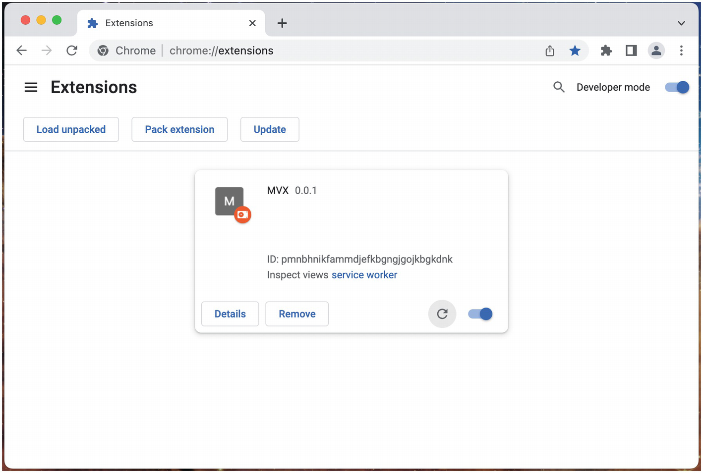
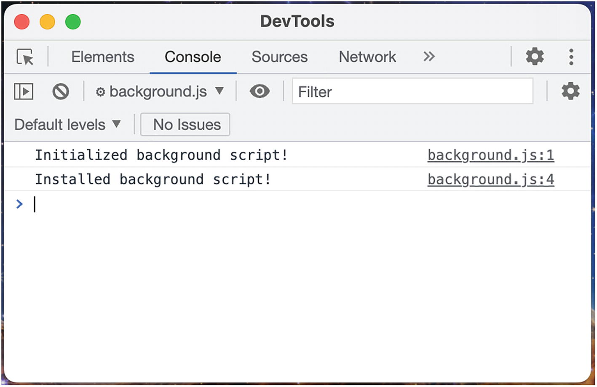
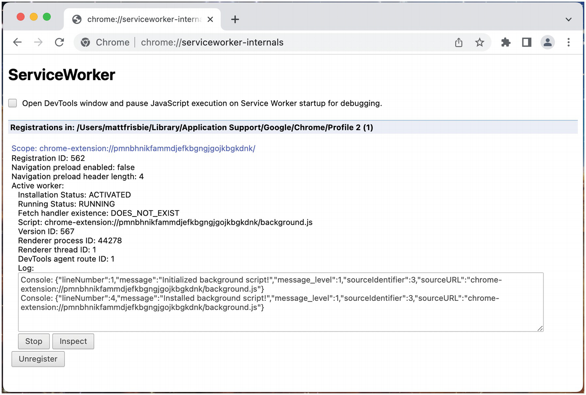
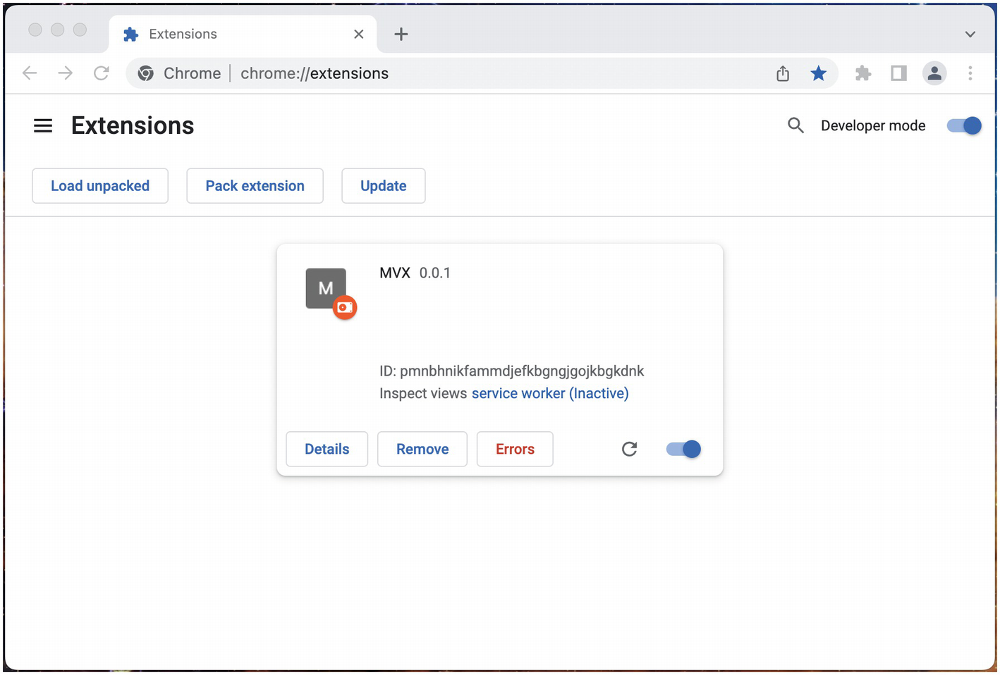
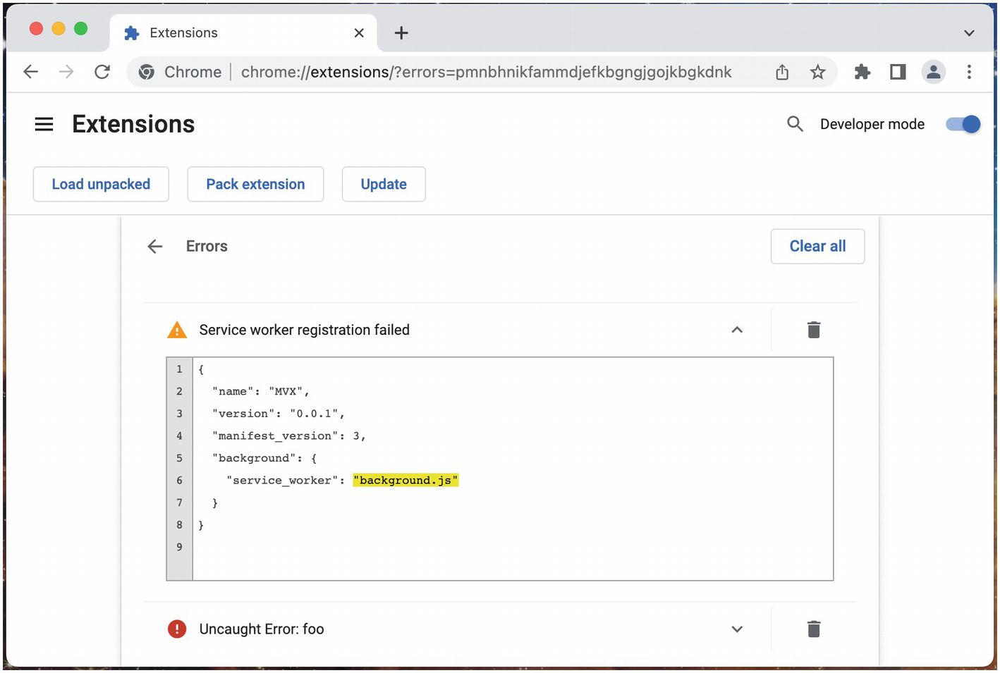
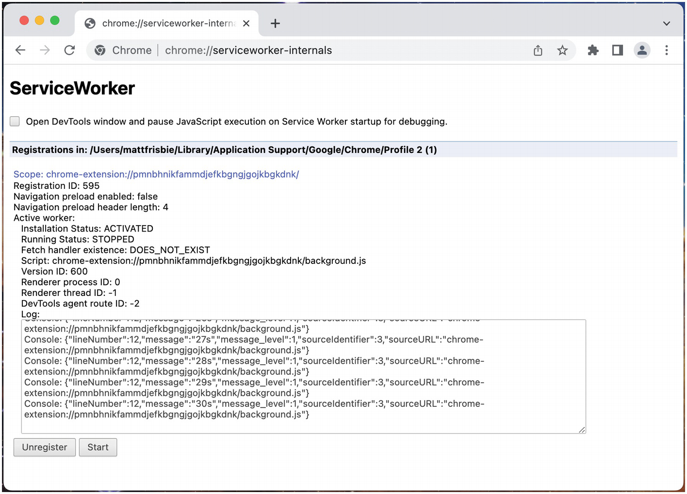
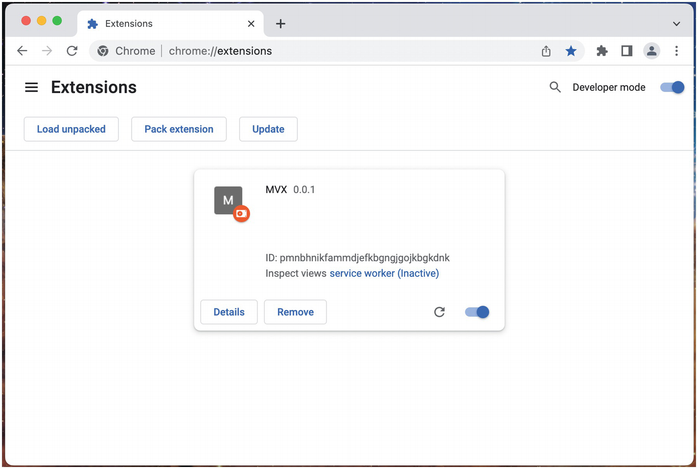

# Chương 7: Kịch bản nền (Background Scripts)

Các nhà phát triển tiện ích mở rộng trình duyệt thường thấy cần phải thực thi JavaScript trong nền (background) của trình duyệt. **Kịch bản nền (Background scripts)**, đúng như tên gọi của chúng, là câu trả lời cho vấn đề này: chúng là một môi trường thực thi JavaScript riêng biệt có thể giao tiếp với tất cả các thành phần khác nhau của tiện ích mở rộng, thêm các trình xử lý cho nhiều sự kiện trình duyệt khác nhau và hoạt động mà không phụ thuộc vào bất kỳ trang web hoặc giao diện người dùng tiện ích mở rộng nào.

> [!NOTE]
> Chương này sẽ tập trung vào việc triển khai kịch bản nền dưới dạng service worker trong manifest v3. Manifest v2 sử dụng trang nền (background pages), vốn có nhiều công dụng hơn đáng kể. Tuy nhiên, Google Chrome đang dần loại bỏ sự hỗ trợ dành cho chúng, vì vậy tôi không khuyến khích việc xây dựng một tiện ích mở rộng trình duyệt dựa hoàn toàn vào trang nền manifest v2.

## Service Worker của Trang Web so với Service Worker của Tiện ích mở rộng

Một điểm gây nhầm lẫn phổ biến cho các nhà phát triển web mới làm quen với tiện ích mở rộng trình duyệt là bản chất của **service workers** nền. Mặc dù nhiều nhà phát triển web đã có kinh nghiệm xử lý service worker trong nội dung xây dựng các trang web, nhưng bản chất của service worker trong tiện ích mở rộng có một số khác biệt đáng chú ý.

Hãy so sánh hai ví dụ sau, một service worker trang web đơn giản và một service worker tiện ích mở rộng trình duyệt đơn giản:

*Service worker của trang web:*

```javascript
// Thiết lập tên bộ nhớ đệm
const cacheName = 'cache_v1';

// Các tài nguyên cần lưu sẵn vào bộ nhớ đệm (precache)
const precachedAssets = [
  '/img1.jpg',
  '/img2.jpg',
  '/img3.jpg'
];

self.addEventListener('install', (event) => {
  // Lưu sẵn tài nguyên vào bộ nhớ đệm khi cài đặt
  event.waitUntil(caches.open(cacheName).then((cache) => {
    return cache.addAll(precachedAssets);
  }));
});

self.addEventListener('fetch', (event) => {
  // Kiểm tra xem yêu cầu có khớp với tài nguyên đã lưu sẵn không
  const url = new URL(event.request.url);
  const isPrecachedRequest = precachedAssets.includes(url.pathname);

  if (isPrecachedRequest) {
    // Lấy tài nguyên đã lưu sẵn từ bộ nhớ đệm
    event.respondWith(caches.open(cacheName).then((cache) => {
      return cache.match(event.request.url);
    }));
  } else {
    // Đi ra mạng
    return;
  }
});
```

Service worker trang web đơn giản này định nghĩa một bộ nhớ đệm cho một số hình ảnh. Trong sự kiện `install`, nó tải trước các hình ảnh vào bộ nhớ đệm. Khi thấy một sự kiện `fetch` khớp với URL của một trong những hình ảnh đó, nó chặn yêu cầu và trả về giá trị từ bộ nhớ đệm.

*Service worker của tiện ích mở rộng:*

```javascript
// Mã này sẽ chạy khi cài đặt hoặc cập nhật
chrome.runtime.onInstalled.addListener(() => {
  console.log('Installed or updated!');
});

// Mã này sẽ chạy khi một dấu trang (bookmark) được tạo.
chrome.bookmarks.onCreated.addListener(() => {
  console.log('Created a new bookmark!');
});

const filter = {
  url: [
    {
      urlMatches: 'https://www.example.com/',
    },
  ],
};

// Mã này sẽ chạy khi trang web ví dụ được truy cập
chrome.webNavigation.onCompleted.addListener(() => {
  console.log("Loaded the example site!");
}, filter);
```

Service worker tiện ích mở rộng đơn giản này thiết lập các trình lắng nghe cho các sự kiện `runtime.onInstalled`, `bookmark.onCreated` và `webNavigation.onCompleted`. Mỗi trình xử lý in một câu lệnh log ra console khi các sự kiện đó được kích hoạt.

### Điểm tương đồng

Đặc tả W3C cho service workers bắt đầu bằng đặc điểm cấp cao sau đây:

> *Cốt lõi của đặc tả này là một worker thức dậy để nhận các sự kiện.*

Về khía cạnh này, service worker trang web và service worker tiện ích mở rộng đang phục vụ cùng một mục đích. Hơn nữa, sự phân biệt giữa service worker "trang web" và service worker "tiện ích mở rộng" chỉ mô tả cách thức service worker được triển khai trong ngữ cảnh đó; nền tảng service worker bên dưới vẫn không thay đổi.

Khi so sánh hai ví dụ trên, bạn có thể nhận thấy những điều sau:

- Cả hai kịch bản service worker phần lớn bao gồm các trình xử lý sự kiện được gán ở cấp cao nhất của kịch bản.
- Cả hai service worker đều đang lắng nghe một dạng sự kiện cài đặt nào đó.
- Cả hai service worker đều có thể truy cập các yêu cầu mạng đang diễn ra trong trình duyệt.

Những điểm tương đồng này nhấn mạnh nhiều điểm chung giữa cả hai. Với những điểm tương đồng về mã này, hãy khám phá những cách mà các ngữ cảnh service worker này giống nhau.

#### Chỉ chiếm dụng duy nhất (Single Occupancy)

Đối với cả service worker trang web và service worker tiện ích mở rộng, sẽ chỉ có duy nhất một service worker cho mỗi kịch bản. Khi cài đặt các bản cập nhật cho service worker, trình duyệt sẽ cẩn thận hoán đổi các service worker cũ bằng các service worker mới trong khi đảm bảo chỉ có duy nhất một service worker hoạt động tại bất kỳ thời điểm nào.

Điều này cực kỳ quan trọng trong cả hai ngữ cảnh: nhiều service worker sẽ gây ra sự hỗn loạn hoàn toàn với việc lưu bộ nhớ đệm, chặn mạng và xử lý sự kiện.

#### Cài đặt và Vòng đời (Installation and Lifecycle)

Tất cả các service worker được cài đặt chính xác một lần, và sau đó có thể trở nên rảnh rỗi và cuối cùng bị chấm dứt. Trình duyệt sẽ quyết định khi nào nên đánh thức service worker, thường là do một sự kiện được kích hoạt, và kịch bản service worker sẽ thực thi lại mỗi lần.

Mặc dù khái niệm về sự kiện "đã cài đặt" (installed) có ý nghĩa khác nhau đối với trang web và tiện ích mở rộng, việc sử dụng các trình xử lý này vẫn không thay đổi. Nhà phát triển nên mong đợi rằng kịch bản service worker sẽ được thực thi vô số lần, nhưng trình xử lý cài đặt sẽ chỉ thực thi một lần và do đó nên được tận dụng để thực hiện công việc thiết lập không nên lặp lại.

#### Xử lý sự kiện ở cấp cao nhất (Top-Level Event Handling)

Bởi vì service worker được mong đợi sẽ trải qua một chu kỳ lặp đi lặp lại của việc trở nên rảnh rỗi, bị chấm dứt và được kích hoạt lại, cấu trúc kịch bản service worker phải tính đến điều này. Các sự kiện được trình duyệt kích hoạt và chuyển đến service worker phải có các trình xử lý được thêm vào trong lượt đầu tiên của vòng lặp sự kiện (event loop) – nếu không sẽ có nguy cơ bỏ lỡ sự kiện. Lý do cho điều này là các service worker thường được đánh thức để phản hồi trực tiếp một sự kiện đang được kích hoạt. Trình duyệt sẽ đánh thức service worker, thực thi một lượt của vòng lặp sự kiện, và sau đó kích hoạt sự kiện đang chờ trong service worker. Nếu trình xử lý cho sự kiện đó không hiện diện vào cuối lượt đó, sự kiện có thể trôi qua mà không được xử lý.

#### Nhắn tin bất đồng bộ (Async Messaging)

Vì tất cả các service worker đều nghiêm ngặt bất đồng bộ, cả hai đều phải sử dụng một dạng nhắn tin bất đồng bộ để giao tiếp với các phần khác của trình duyệt.

- Đối với service worker trang web, điều này diễn ra dưới dạng `postMessage()` hoặc MessageChannel API.
- Đối với tiện ích mở rộng trình duyệt, điều này diễn ra dưới dạng `runtime.sendMessage()`, `tabs.sendMessage()`, `runtime.connect()`, hoặc `tabs.connect()`.

### Sự khác biệt

Mặc dù service worker trang web và service worker tiện ích mở rộng sử dụng cùng một nền tảng bên dưới, chúng khác nhau ở một vài điểm quan trọng.

#### Đăng ký (Registration)

Service worker trang web phải được đăng ký từ một kịch bản cấp trang. Một ví dụ về việc này được hiển thị dưới đây:

*Ví dụ đăng ký service worker trang web:*

```javascript
if ('serviceWorker' in navigator) {
  navigator.serviceWorker.register('/sw.js')
  .then((registration) => {
    registration.addEventListener('updatefound', () => {
      console.log('A new service worker is being installed:');
    });
  })
  .catch((error) => {
    console.error(`Service worker registration failed: ${error}`);
  });
} else {
  console.error('Service workers are not supported.');
}
```

Đối với service worker tiện ích mở rộng, bước duy nhất cần thiết để đăng ký một service worker là chỉ định kịch bản `background.service_worker` trong manifest. Việc đăng ký service worker trang web bao gồm các trạng thái `installing/waiting/active` vốn không có ý nghĩa đối với service worker tiện ích mở rộng.

> [!NOTE]
> Để biết thêm thông tin về service worker trang web, hãy tham khảo [https://developer.mozilla.org/en-US/docs/Web/API/Service_Worker_API](https://developer.mozilla.org/en-US/docs/Web/API/Service_Worker_API).

#### Mục đích

Sự khác biệt quan trọng nhất giữa service worker trang web và service worker tiện ích mở rộng là mục đích chính của chúng. Service worker trang web được trang bị để đóng vai trò như một bộ nhớ đệm, và đây là trường hợp sử dụng phổ biến nhất của chúng. Chúng có thể chặn các yêu cầu mạng một cách có điều kiện và trả về nội dung đã lưu vào bộ nhớ đệm. Service worker cũng có thể được sử dụng để xây dựng các ứng dụng web lũy tiến (progressive web applications - PWAs), các trang web mô phỏng hành vi của ứng dụng với việc cài đặt, khả năng ngoại tuyến và thông báo đẩy được gửi từ máy chủ.

Bởi vì các kịch bản tiện ích mở rộng trình duyệt là các tài nguyên và tất cả đều được cung cấp từ trình duyệt, nên không còn nhu cầu lưu các tài nguyên này vào bộ nhớ đệm nữa, vì chúng không được tải từ máy chủ từ xa. Hơn nữa, các giao diện như trang popup và trang options hoàn toàn có khả năng hoạt động bình thường khi ngoại tuyến mà không cần sử dụng một background service worker. Thay vào đó, service worker tiện ích mở rộng chủ yếu được giao nhiệm vụ xử lý phạm vi rộng lớn các sự kiện được trình duyệt và WebExtensions API kích hoạt.

> [!NOTE]
> Trong phần còn lại của chương này, một service worker tiện ích mở rộng sẽ được gọi đơn giản là một "service worker".

## Manifest v2 so với Manifest v3

Manifest v3 đã thay đổi đáng kể các kịch bản nền. Các kịch bản nền trong manifest v2 được đối xử như các **trang nền (background pages)**: JavaScript thực thi trong một trang web không giao diện (headless). Các trang nền này cũng có khả năng chạy vô thời hạn, nghĩa là chúng phù hợp để quản lý các tác vụ chạy lâu dài và các yêu cầu web. Trong manifest v3, các kịch bản nền hiện thực thi dưới dạng **service workers**. Các worker này nhẹ hơn, nhưng chúng bị hạn chế ở một số điểm quan trọng.

### Kịch bản so với Service Workers

Trong manifest v2, giá trị `background` trong manifest có thể được truyền một mảng các kịch bản:

*manifest.json của manifest v2:*

```json
{
  "manifest_version": 2,
  ...
  "background": {
    "scripts": ["bg1.js", "bg2.js", "bg3.js"]
  }
  ...
}
```

Các kịch bản này được tải theo thứ tự xuất hiện trong mảng, và tất cả đều thực thi bên trong cùng một trang nền. Trong manifest v3, kịch bản nền là một service worker duy nhất:

*manifest.json của manifest v3:*

```json
{
  "manifest_version": 3,
  ...
  "background": {
    "service_worker": "bg.js"
  }
  ...
}
```

### Nhập JavaScript (JavaScript Imports)

Trong manifest v2, cách duy nhất để sử dụng một từ khóa `import` JavaScript là sử dụng thuộc tính `background.page` và sử dụng các thẻ script trong HTML của trang nền:

*manifest.json kích hoạt một trang HTML nền:*

```json
{
  "manifest_version": 2,
  ...
  "background": {
    "page": "bg.html"
  }
  ...
}
```

*bg.html:*

```html
<html>
  <body>
    <!-- việc nhập (import) được cho phép trong tệp JS này -->
    <script type="module" src="bg.js"></script>
  </body>
</html>
```

Trong manifest v3, bạn có thể chỉ cần đặt thuộc tính `background.type` thành `"module"`, như được hiển thị ở đây:

*manifest.json của manifest v3 cho phép sử dụng từ khóa import:*

```json
{
  "manifest_version": 3,
  ...
  "background": {
    "service_worker": "bg.js",
    "type": "module"
  }
  ...
}
```

### Không có quyền truy cập vào DOM và các API Toàn cục có giới hạn

Trong manifest v2, các trang nền thực chất là các trang web không giao diện với quyền truy cập đầy đủ vào DOM và đối tượng toàn cục của trang web. Trong manifest v3, các service worker không có quyền truy cập vào DOM và đối tượng toàn cục là `ServiceWorkerGlobalScope`, vốn thiếu nhiều API có sẵn trong đối tượng toàn cục của trang web. Điều này có một số ảnh hưởng quan trọng:

- **Không có quyền truy cập vào đối tượng `document`.** DOM và tất cả các phương thức liên quan của nó không còn khả dụng. Điều này cũng có nghĩa là background service worker không còn có thể tạo và lưu trữ các tài nguyên (assets).
- **Không có khả năng kết xuất nội dung để hiển thị trong các ngữ cảnh khác.** Kết xuất nội dung trong trang không giao diện là hữu ích trong một số tình huống, nhưng điều này không còn khả thi nữa. Các giải pháp thay thế một phần bao gồm sử dụng thư viện bên thứ ba như `jsdom` hoặc sử dụng API **OffscreenCanvas**.
- **Không có quyền truy cập vào đối tượng `window`.** Điều này có nghĩa là các phương thức như `window.open()` không còn khả dụng nữa.
- **Không có khả năng phát hoặc thu thập phương tiện (media) trực tiếp trong một service worker.** Việc này vẫn có thể thực hiện được, nhưng nó yêu cầu một kịch bản nội dung (content script) đang hoạt động trên máy chủ hoặc một giao diện tiện ích mở rộng để cấp quyền truy cập vào các API phương tiện.
- **Không có quyền truy cập vào `localStorage`, `sessionStorage`, cookies.**
- **Không có khả năng sử dụng `XMLHttpRequest`.** Nên sử dụng `fetch()`.

> [!NOTE]
> Việc mất quyền truy cập vào đối tượng `window` đặc biệt gây khó khăn khi cố gắng xác thực từ service worker, vì các thư viện xác thực bên thứ ba thường dựa vào việc mở một cửa sổ mới cho luồng OAuth. Hãy tham khảo chương *Mạng (Networking)* để biết thêm thông tin về xác thực.

### Không duy trì (Nonpersistent)

Manifest v2 cho phép các trang nền được ở trạng thái "duy trì" (persistent), điều này thực tế có nghĩa là chúng sẽ chạy vô thời hạn miễn là chương trình duyệt chủ vẫn mở. Trong manifest v3, khả năng này đã bị loại bỏ. Điều này có một số ảnh hưởng:

- **`setTimeout()` và `setInterval()` sẽ không còn thực thi một cách đáng tin cậy.** Các phương thức này vẫn khả dụng. Tuy nhiên, nếu service worker chấm dứt trước khi hàm được lên lịch thực thi, nó sẽ bị bỏ qua trong âm thầm. API `chrome.alarms` thay thế một số chức năng này, nhưng nó không thể được sử dụng cho các khoảng thời gian dưới một phút.
- **Các truy vấn chạy lâu và websockets có thể bị tắt.** Service worker sẽ bỏ qua các kết nối mạng đang mở khi xác định xem một service worker có rảnh rỗi hay không, nghĩa là các kết nối này có thể bị cắt đứt nếu service worker chấm dứt trong khi các kết nối vẫn đang hoạt động.

> [!TIP]
> Có một số mẹo ở phần sau của chương này có thể kéo dài tuổi thọ của một service worker.

### Không có sự kiện tắt (No Shutdown Event)

Manifest v2 cho phép nhà phát triển thêm các trình xử lý cho các sự kiện `runtime.onSuspend` và `runtime.onSuspendCanceled`. Điều này giúp tiện ích mở rộng có cơ hội thực hiện một số công việc dọn dẹp. Trong manifest v3, các service worker không có trình xử lý cho sự kiện tắt, nghĩa là các kịch bản service worker phải thực hiện các tác vụ một cách hăng hái (eagerly) với kỳ vọng rằng việc tắt có thể xảy ra bất cứ lúc nào.

### Không có quyền truy cập nền theo lập trình (No Programmatic Background Access)

Trong manifest v2, có thể truy cập đối tượng window nền từ một giao diện tiện ích mở rộng ở phía trước (foreground) bằng cách sử dụng `chrome.extension.getBackgroundPage()`. Trong manifest v3, khả năng này đã bị loại bỏ.

## Làm việc với các Kịch bản nền

Hãy bắt đầu bằng cách tạo một tiện ích mở rộng trình duyệt đơn giản với một kịch bản nền. Điều này được thực hiện bằng cách xác định thuộc tính `background.service_worker` trong manifest:

*manifest.json:*

```json
{
  "name": "MVX",
  "version": "0.0.1",
  "manifest_version": 3,
  "background": {
    "service_worker": "background.js"
  }
}
```

*background.js:*

```javascript
console.log("Initialized background script!");

chrome.runtime.onInstalled.addListener((object) => {
  console.log("Installed background script!");
});
```

Kịch bản nền đơn giản này ghi log vào console, thiết lập một trình xử lý cài đặt và thoát.

### Kiểm tra các Background Service Workers

Sau khi cài đặt tiện ích mở rộng này vào trình duyệt của bạn, trang quản lý tiện ích mở rộng sẽ hiển thị một thẻ mới cho tiện ích mở rộng bao gồm một liên kết *service worker* (Hình 7-1).



Bạn có thể kiểm tra kịch bản nền bằng cách nhấp vào liên kết *service worker* (Hình 7-2).



> [!NOTE]
> Giao diện devtools này rất hữu ích để kiểm tra và gỡ lỗi service worker của bạn, nhưng hãy nhớ rằng việc để cửa sổ này mở sẽ ngăn trình duyệt tạm dừng service worker. Việc vô tình để cửa sổ devtools mở có thể gây ra hành vi tiện ích mở rộng không mong muốn khi cố gắng tải lại hoặc gỡ lỗi các kịch bản nền.

Để xem trạng thái của tất cả các service worker trong trình duyệt mà không làm phiền vòng đời bình thường của chúng, hãy điều hướng trình duyệt của bạn đến `chrome://serviceworker-internals/`, như được hiển thị trong Hình 7-3.



> [!NOTE]
> Trang này sẽ hiển thị *tất cả* các service worker mà trình duyệt của bạn đã cài đặt – không chỉ dành cho các tiện ích mở rộng. Hãy nhớ rằng trình duyệt không phân biệt giữa service worker của trang web và service worker của tiện ích mở rộng.

### Lỗi Service Worker

> [!NOTE]
> Đối với phần này, bạn phải bắt đầu với tiện ích mở rộng đã được cài đặt như hiển thị trong Ví dụ 7-1 *và* tất cả các cửa sổ devtools đã được đóng.

Sửa đổi kịch bản nền như hiển thị ở đây:

*background.js:*

```javascript
console.log("Initialized background script!");

chrome.runtime.onInstalled.addListener((object) => {
  console.log("Installed background script!");
});

throw new Error("foo");
```

Khi kịch bản nền đã được lưu, hãy nhấp vào nút tải lại (reload) trong thẻ tiện ích mở rộng. Bạn sẽ thấy service worker ngay lập tức trở nên không hoạt động (inactive) và nút *Errors* xuất hiện (Hình 7-4).



Nhấp vào nút Errors để hiển thị chế độ xem lỗi (Hình 7-5).



Bạn sẽ thấy thông báo lỗi "foo" mong đợi ở phía dưới, nhưng trình duyệt cũng đang cho chúng ta biết rằng service worker không đăng ký được. Điều này rất quan trọng: **khi một service worker ném ra một lỗi trong lượt đầu tiên của vòng lặp sự kiện, service worker đó sẽ không đăng ký được.**

> [!NOTE]
> Trang lỗi đặc biệt hữu ích trong các tình huống mà kịch bản nền không đăng ký được. Khi đăng ký thất bại, vì service worker không tồn tại, bạn sẽ không thể kiểm tra đầu ra lỗi của service worker. Thay vào đó, trang lỗi sẽ chứa thông tin lỗi để hỗ trợ gỡ lỗi.

### Chấm dứt Service Worker

> [!NOTE]
> Đối với phần này, bạn phải đóng tất cả các cửa sổ devtools để cho phép service worker trở nên dảnh rỗi (idle).

Cài đặt tiện ích mở rộng sau:

*manifest.json:*

```json
{
  "name": "MVX",
  "version": "0.0.1",
  "manifest_version": 3,
  "action": {},
  "background": {
    "service_worker": "background.js"
  }
}
```

*background.js:*

```javascript
console.log("Initialized background script!");

chrome.runtime.onInstalled.addListener((object) => {
  console.log("Installed background script!");
});

chrome.action.onClicked.addListener(() => {
  console.log("Clicked toolbar icon!");
});

let elapsed = 0;
setInterval(() => console.log(`${++elapsed}s`), 1000);
```

Kịch bản nền này sẽ ghi log vào console sau mỗi 1000ms cho đến khi service worker bị chấm dứt. (Hãy nhớ rằng `setInterval()` sẽ không ngăn service worker trở nên dảnh rỗi.) Nó cũng sẽ ghi log vào console bất cứ khi nào biểu tượng thanh công cụ được nhấp vào.

Sau khi tải lại tiện ích mở rộng, hãy mở trang `chrome://serviceworker-internals` để quan sát đầu ra log. Trình duyệt thấy rằng tiện ích mở rộng này không tích cực thực hiện công việc, và do đó được coi là *rảnh rỗi* (idle). Sau khoảng 30 giây, bạn sẽ thấy trình duyệt dừng service worker (Hình 7-6).



Trang quản lý tiện ích mở rộng cũng sẽ phản ánh điều này (Hình 7-7).



Bởi vì bạn đã thiết lập một trình xử lý cho sự kiện `action.onClicked`, trình duyệt sẽ đánh thức service worker, chạy lại kịch bản và khởi động lại bộ đếm khi bạn nhấp vào biểu tượng thanh công cụ.

> [!NOTE]
> Quan sát kỹ đầu ra console sau khi nhấp vào nút biểu tượng thanh công cụ. Bạn sẽ nhận thấy rằng trạng thái toàn cục trong service worker đã bị đặt lại.

## Các mô hình phổ biến (Common Patterns)

Trong phần này, chúng ta sẽ khám phá một số mô hình mà background service worker thường xuyên được sử dụng.

### Trình xử lý sự kiện (Event Handler)

WebExtensions API cho phép trình duyệt gửi một loạt các sự kiện khác nhau vào tiện ích mở rộng để xử lý. Vì API này có thể truy cập được trong các kịch bản nội dung, popup, trang tùy chọn và kịch bản nền, các sự kiện này về mặt kỹ thuật có thể được xử lý ở bất kỳ nơi nào trong số này. Tuy nhiên, vì các kịch bản nội dung, popup và trang tùy chọn là nhất thời (ephemeral), chỉ có kịch bản nền mới *đảm bảo* rằng sự kiện sẽ được xử lý. Tiện ích mở rộng ví dụ sau thiết lập một kịch bản nền để xử lý vô số sự kiện API khác nhau:

*manifest.json:*

```json
{
  "name": "MVX",
  "version": "0.0.1",
  "manifest_version": 3,
  "background": {
    "service_worker": "background.js"
  },
  "permissions": ["alarms", "tabs"],
  "action": {},
  "commands": {
    "foobar": {
      "suggested_key": {
        "default": "Ctrl+Shift+J",
        "mac": "MacCtrl+Shift+J"
      },
      "description": "Perform foobar action"
    }
  }
}
```

*background.js:*

```javascript
// Ghi log khi tiện ích mở rộng được cài đặt
chrome.runtime.onInstalled.addListener(() => {
  console.log("Installed background!");
});

chrome.alarms.create("My alarm", { periodInMinutes: 1 });

// Ghi log sau mỗi phút
chrome.alarms.onAlarm.addListener((alarmInfo) => {
  console.log(`Alarm fired: ${alarmInfo.name}`);
});

// Ghi log khi trạng thái tab thay đổi
chrome.tabs.onUpdated.addListener(() => {
  console.log("Tabs updated");
});

// Ghi log khi Ctrl+Shift+J được nhấn
chrome.commands.onCommand.addListener((command) => {
  console.log(`Command: ${command}`);
});

// Ghi log khi biểu tượng thanh công cụ được nhấp
chrome.action.onClicked.addListener(() => {
  console.log(`Clicked toolbar icon`);
});
```

Tất nhiên, mã này có thể được chuyển sang một kịch bản popup như cũ. Tuy nhiên, các sự kiện sẽ *chỉ* được xử lý nếu popup đang mở. Việc đặt các trình xử lý trong kịch bản nền đảm bảo rằng các trình xử lý sẽ được thực thi.

Nếu service worker bị chấm dứt, trình duyệt sẽ khởi động lại service worker, chạy một lượt của vòng lặp sự kiện để thiết lập tất cả các trình xử lý, và chỉ sau đó nó mới kích hoạt tất cả các sự kiện bên trong service worker. Bằng cách này, bạn có thể đảm bảo việc xử lý sự kiện bằng cách gán các trình xử lý ở cấp cao nhất.

### Quản lý Bí mật và Xác thực (Secret Management and Authentication)

Các tiện ích mở rộng thường xuyên cần quản lý việc xác thực và các giá trị bí mật tách biệt với các trang web không đáng tin cậy. Điều này đặc biệt đúng trong các tình huống mà một kịch bản nội dung cần giao tiếp với một máy chủ. Việc gửi yêu cầu từ kịch bản nội dung thường sẽ không hoạt động, vì các yêu cầu mạng của kịch bản nội dung vẫn bị ràng buộc bởi các hạn chế chéo nguồn (cross-origin) của trang lưu trữ. Hơn nữa, việc thu thập thông tin đăng nhập hoặc lưu trữ các bí mật xác thực trong kịch bản nội dung là một ý tưởng *tồi tệ*, vì DOM và storage API của trang được chia sẻ bởi trang lưu trữ:

- Nếu một kịch bản nội dung đặt một JSON Web Token (JWT) vào `localStorage`, JavaScript của trang lưu trữ có thể truy cập JWT đó.
- Nếu một kịch bản nội dung thu thập thông tin đăng nhập trong các thẻ `<input>` trong trang lưu trữ, trang lưu trữ có khả năng đọc các giá trị ra khỏi các phần tử HTML đó.

Sau đây là một ví dụ về luồng xác thực an toàn:

1. Thu thập thông tin đăng nhập của người dùng trong một giao diện người dùng đáng tin cậy, chẳng hạn như trang popup hoặc trang tùy chọn. (Bất cứ thứ gì có nguồn là `chrome-extension://my-extension-id` hoặc tương tự).
2. Xác thực với thông tin đăng nhập từ trang đáng tin cậy.
3. Lưu trữ mã xác thực bằng `chrome.storage` API.

Sau khi thực hiện các bước này, background service worker của bạn có thể truy cập mã xác thực này và gửi các yêu cầu đã được xác thực đến máy chủ từ xa. Một kịch bản nội dung có thể gián tiếp gửi các yêu cầu đã được xác thực thông qua một rơ-le tin nhắn:

1. Kịch bản nội dung sử dụng extension message API để gửi một tin nhắn đến nền cho biết loại yêu cầu xác thực mà nó muốn gửi.
2. Kịch bản nền truy cập mã xác thực từ bộ nhớ lưu trữ và gửi yêu cầu đã được xác thực.
3. Khi yêu cầu trả về, kịch bản nền thu thập phản hồi và gửi nó ngược lại cho kịch bản nội dung đang yêu cầu.
4. Kịch bản nội dung nhận được dữ liệu phản hồi thông qua extension message API.

Chiến lược này có lợi vì một số lý do:

- Kịch bản nội dung không bao giờ phải thu thập thông tin đăng nhập.
- Kịch bản nội dung không bao giờ phải lưu trữ các bí mật.
- Kịch bản nội dung không còn bị ràng buộc bởi các hạn chế chéo nguồn của trang lưu trữ.

### Trung tâm tin nhắn (Message Hub)

Bất kỳ thành phần nào của tiện ích mở rộng cũng có thể sử dụng extension messaging API, nhưng kịch bản nền là thực thể duy nhất đảm bảo rằng tin nhắn sẽ được nghe. Hơn nữa, nó cũng đảm bảo rằng tin nhắn sẽ được nhận chính xác một lần. Bằng cách này, nó thường hữu ích cho một loạt các kịch bản nội dung để tất cả kết nối với một background service worker duy nhất và sử dụng nó như một trung tâm tin nhắn. Tiện ích mở rộng ví dụ sau sẽ tạo ra một cổng tin nhắn trên mỗi trang được mở và liên tục gửi tin nhắn đến nền. Hãy cài đặt tiện ích mở rộng, mở một vài tab của `https://example.com`, và kiểm tra nhật ký (logs) của các trang và background service worker để quan sát nền giao tiếp độc lập với từng trang.

*manifest.json:*

```json
{
  "name": "MVX",
  "version": "0.0.1",
  "manifest_version": 3,
  "background": {
    "service_worker": "background.js",
    "type": "module"
  },
  "content_scripts": [
    {
      "matches": ["<all_urls>"],
      "css": [],
      "js": ["content-script.js"]
    }
  ]
}
```

*background.js:*

```javascript
// Các tin nhắn bao gồm thông tin về người gửi
chrome.runtime.onMessage.addListener((request, sender, sendResponse) => {
  // Trình xử lý này sẽ kích hoạt cho tất cả các gói dữ liệu runtime.sendMessage.
  // Sử dụng một giá trị trong gói dữ liệu để lọc.
  if (request.type === "getCurrentTabId") {
    // Gửi ID của tab ngược lại cho kịch bản nội dung
    sendResponse({ currentTabId: sender.tab.id });
  }
});

// Điều này sẽ kích hoạt khi kịch bản nội dung gọi runtime.connect()
chrome.runtime.onConnect.addListener((port) => {
  console.log(`Connected to ${port.name}`);

  // Các tin nhắn được gửi từ kịch bản nội dung
  port.onMessage.addListener((msg) => {
    console.log(port.name, msg);
    // Trừ đi 1 và gửi giá trị ngược lại cho kịch bản nội dung
    port.postMessage({ value: msg.value - 1 });
  });
});
```

*content-script.js:*

```javascript
function initializeCountdown(currentTabId) {
  // Điều này sẽ kích hoạt sự kiện runtime.onConnect trong nền
  const port = chrome.runtime.connect({
    name: `Tab ${currentTabId}`,
  });

  // Các tin nhắn được gửi từ service worker
  port.onMessage.addListener((msg) => {
    console.log(port.name, msg);
    // Tiếp tục chuyển giá trị cho nền khi giá trị > 0
    if (msg.value > 0) {
      port.postMessage({ value: msg.value });
    }
  });

  // Bắt đầu một chuỗi đếm ngược sau mỗi 1000ms
  setInterval(() => {
    const value = Math.floor(Math.random() * 10) + 1;
    console.log(`New countdown sequence: ${value}`);
    // Gửi postMessage ban đầu trong chuỗi
    port.postMessage({ value });
  }, 1000);
}

// Gửi một tin nhắn gọi/phản hồi đến nền để xác định ID của tab hiện tại
chrome.runtime.sendMessage(
  // Việc cung cấp một type cho phép nền lọc các tin nhắn đến
  { type: "getCurrentTabId" },
  // Nền có thể trả lời tin nhắn này bằng ID của tab
  (response) => initializeCountdown(response.currentTabId)
);
```

### Quản lý Lưu trữ (Storage Manager)

Đối với các tiện ích mở rộng cần lưu trữ lượng lớn dữ liệu, background service worker có thể sử dụng **IndexedDB**. Popup, trang tùy chọn và kịch bản nội dung đều có thể sử dụng messaging API để đọc và ghi vào IndexedDB. Lợi thế của việc sử dụng nền làm trình quản lý IndexedDB là lập phiên bản (versioning): trình duyệt đảm bảo chỉ có duy nhất một background service worker cho mỗi tiện ích mở rộng tại bất kỳ thời điểm nào, vì vậy bất kỳ quá trình di chuyển (migrations) IndexedDB nào bạn cần chạy đều có thể thực thi an toàn bên trong service worker mà không có nguy cơ xung đột phiên bản.

### Chèn Kịch bản (Injecting Scripts)

Background service worker có thể chèn các kịch bản nội dung vào trang bằng lập trình. Điều này rất hữu ích khi bạn cần chèn một kịch bản nội dung có điều kiện hoặc bất đồng bộ. Ví dụ sau chèn một kịch bản nội dung nhỏ khi nút biểu tượng thanh công cụ được nhấp:

*manifest.json:*

```json
 {
  "name": "MVX",
  "version": "0.0.1",
  "manifest_version": 3,
  "background": {
    "service_worker": "background.js",
    "type": "module"
  },
  "action": {},
  "permissions": ["activeTab", "scripting"]
}
```

*background.js:*

```javascript
function wipeOutPage() {
  document.body.innerHTML = "";
}

chrome.action.onClicked.addListener((tab) => {
  chrome.scripting.executeScript({
    target: { tabId: tab.id },
    func: wipeOutPage,
  });
});
```

> [!NOTE]
> Hãy tham khảo chương *Kịch bản nội dung (Content Scripts)* để biết thêm chi tiết về vấn đề này.

### Theo dõi Lưu lượng Web (Sniffing Web Traffic)

Background service worker có thể theo dõi các trang mà người dùng đang truy cập và thực hiện logic một cách có điều kiện dựa trên các chi tiết của trang đó. Ví dụ sau ghi lại URL trên mỗi trang đã truy cập và ghi lại một thông báo đặc biệt chỉ trên một URL cụ thể:

*manifest.json:*

```json
{
  "name": "MVX",
  "version": "0.0.1",
  "manifest_version": 3,
  "background": {
    "service_worker": "background.js",
    "type": "module"
  },
  "action": {},
  "permissions": ["webNavigation"]
}
```

*background.js:*

```javascript
const filter = {
  url: [
    {
      urlMatches: "https://www.example.com/",
    },
  ],
};

chrome.webNavigation.onCompleted.addListener(() => {
  console.log("Visited the special site!");
}, filter);

chrome.webNavigation.onDOMContentLoaded.addListener((details) => {
  console.log(`Loaded ${details.url}!`);
});
```

### Các sự kiện Đã cài đặt/Đã cập nhật (Installed/Updated Events)

Các nhà phát triển thường cần chạy một đoạn mã chỉ khi tiện ích mở rộng được cập nhật hoặc cài đặt. Sự kiện `runtime.onInstalled` nên được sử dụng cho mục đích này. Nó có khả năng phân biệt giữa các sự kiện cài đặt và các sự kiện cập nhật khác nhau thông qua thuộc tính `reason`. Kịch bản nền sau đây xác định khi nào mỗi lý do cài đặt sẽ thực thi:

*background.js:*

```javascript
console.log("This will run each time the service worker starts");

chrome.runtime.onInstalled.addListener((details) => {
  switch (details.reason) {
    case chrome.runtime.OnInstalledReason.INSTALL:
      console.log("This runs when the extension is newly installed.");
      break;
    case chrome.runtime.OnInstalledReason.CHROME_UPDATE:
      console.log("This runs when a chrome chrome update installs.");
      break;
    case chrome.runtime.OnInstalledReason.SHARED_MODULE_UPDATE:
      console.log("This runs when a shared module update installs.");
      break;
    case chrome.runtime.OnInstalledReason.UPDATE:
      console.log("This runs when an extension update installs.");
      break;
    default:
      break;
  }
});
```

### Mở các Tab (Opening Tabs)

Kịch bản nội dung không thể mở các URL của tiện ích mở rộng, nhưng chúng có thể ủy quyền việc mở này cho kịch bản nền. Ví dụ sau thêm hai nút vào trang: một nút sẽ không mở được URL tiện ích mở rộng một cách gián tiếp, và một nút gửi tin nhắn đến kịch bản nền để mở URL.

*manifest.json:*

```json
{
  "name": "MVX",
  "version": "0.0.1",
  "manifest_version": 3,
  "background": {
    "service_worker": "background.js",
    "type": "module"
  },
  "content_scripts": [
    {
      "matches": ["<all_urls>"],
      "css": [],
      "js": ["content-script.js"]
    }
  ],
  "permissions": ["tabs"]
}
```

*background.js:*

```javascript
chrome.runtime.onMessage.addListener((msg) => {
  chrome.tabs.create({ url: msg.url });
});
```

*content-script.js:*

```javascript
const root = document.createElement("div");
root.innerHTML = `
<div style="position:fixed;top:0;left:0">
    <button id="direct-open">THIS WILL NOT WORK</button>
    <button id="indirect-open">THIS WILL WORK</button>
</div>
`;

document.body.appendChild(root);

const url = chrome.runtime.getURL("foobar.html");

document.querySelector("#direct-open").addEventListener("click", () => {
  window.open(url);
});

document.querySelector("#indirect-open").addEventListener("click", () => {
  chrome.runtime.sendMessage({ url });
});
```

*foobar.html:*

```html
<!DOCTYPE html>
<html>
  <body>
    <h1>Foobar</h1>
  </body>
</html>
```

## Ép buộc Duy trì Service Worker (Forcing Service Worker Persistence)

Như đã mô tả trước đó trong chương này, các service worker được thiết kế để tắt thường xuyên. Đối với hầu hết các nhà phát triển tiện ích mở rộng, đây không phải là vấn đề, vì nhu cầu của họ có thể được đáp ứng đầy đủ bởi hình thức service worker. Đối với một số ít tình huống mà một kịch bản nền duy trì là *tuyệt đối cần thiết*, không có biện pháp khắc phục chính thức nào được hỗ trợ. Tuy nhiên, có một số chiến lược không chính thức có thể kéo dài tuổi thọ cho service worker của bạn.

### Triển khai (Implementation)

Tất cả các giải pháp ép buộc duy trì đều dựa trên cùng một chiến lược tổng thể. Khi một cổng tin nhắn tiện ích mở rộng được mở giữa một kịch bản nội dung và nền, trình duyệt sẽ không chấm dứt service worker trong 5 phút. Không cần phải có bất kỳ việc truyền tin nhắn nào diễn ra, cổng chỉ cần duy trì mở. Khi 5 phút này trôi qua, trình duyệt có thể quyết định service worker là rảnh rỗi và chấm dứt nó. Tuy nhiên, nếu một cổng mới được kết nối trước khi 5 phút kết thúc, trình duyệt sẽ khởi động lại bộ đếm thời gian 5 phút. Nếu tiện ích mở rộng liên tục mở lại các cổng mới, background service worker về mặt lý thuyết có thể duy trì hoạt động vô thời hạn.

Người dùng Stack Overflow wOxxOm có một bài viết tuyệt vời về vấn đề này tại đây: [https://stackoverflow.com/questions/66618136/persistent-service-worker-in-chrome-extension#answer-66618269](https://stackoverflow.com/questions/66618136/persistent-service-worker-in-chrome-extension#answer-66618269). Một trong những bản demo của họ được điều chỉnh dưới đây:

*manifest.json:*

```json
{
  "name": "MVX",
  "version": "0.0.1",
  "manifest_version": 3,
  "background": {
    "service_worker": "background.js",
    "type": "module"
  },
  "permissions": ["scripting"],
  "host_permissions": ["<all_urls>"]
}
```

*background.js:*

```javascript
let lifeline;

// Ngắt kết nối và kết nối lại
function keepAliveForced() {
  lifeline?.disconnect();
  lifeline = null;
  keepAlive();
}

async function keepAlive() {
  if (lifeline) {
    return;
  }

  // Tìm kiếm bất kỳ tab đủ điều kiện nào và kết nối với nó
  for (const tab of await chrome.tabs.query({})) {
    try {
      await chrome.scripting.executeScript({
        target: { tabId: tab.id },
        function: () => chrome.runtime.connect({
          name: "KEEPALIVE"
        }),
      });
      return;
    } catch (e) {}
  }
}

chrome.runtime.onConnect.addListener((port) => {
  if (port.name == "KEEPALIVE") {
    lifeline = port;
    // Làm mới kết nối sau 1 phút
    setTimeout(keepAliveForced, 6e4);
    port.onDisconnect.addListener(keepAliveForced);
  }
});

// Bất kỳ thay đổi tab nào cũng có nghĩa là có thể cần kết nối lại
chrome.tabs.onUpdated.addListener((tabId, info, tab) => {
  if (info.url && /^(file|https?):/.test(info.url)) {
    keepAlive();
  }
});

keepAlive();

let age = 0;
setInterval(() => console.log(`Age: ${++age}s`), 1000);
```

Để thấy điều này hoạt động:

- Cài đặt tiện ích mở rộng và đảm bảo tất cả các cửa sổ devtools đã được đóng.
- Có ít nhất một tab đang mở có giao thức là `http://`, `https://`, hoặc `file://`.
- Mở trang `chrome://serviceworker-internals`. Bạn sẽ thấy tiện ích mở rộng tiếp tục ghi log vào console vô thời hạn.

### Nhược điểm và Hạn chế

Vấn đề chính của chiến lược này là nó dựa vào một kịch bản nội dung ở đầu kia để hoàn tất kết nối. Ví dụ, nếu người dùng chỉ mở các tab có giao thức `chrome://`, kịch bản nền sẽ không có tab đủ điều kiện để kết nối, và service worker sẽ không kết nối được và cuối cùng bị chấm dứt. Một giải pháp cho vấn đề này là buộc mở một tab đủ điều kiện bằng cách sử dụng `tabs.create()`, nhưng điều này có thể làm giảm trải nghiệm của người dùng vì họ sẽ thấy một tab mới xuất hiện một cách thần kỳ do tiện ích mở rộng tạo ra một cách bất ngờ.

> [!WARNING]
> Nhìn chung, giải pháp này là một "mẹo" thông minh. Tại thời điểm xuất bản, nó dường như có thể ép buộc service worker duy trì vô thời hạn, nhưng không có gì đảm bảo rằng Chrome hoặc bất kỳ trình duyệt nào khác sẽ tiếp tục hành xử theo cách này trong tương lai. Kết quả có thể khác nhau tùy trường hợp!

## Tóm tắt

Trong chương này, bạn đã tìm hiểu tất cả về cách mã tiện ích mở rộng có thể chạy trong nền trong trình duyệt. Bạn đã được thấy những điểm tương đồng và khác biệt giữa service worker chạy trong một trang web so với trong một tiện ích mở rộng, cũng như tất cả những thay đổi quan trọng giữa các kịch bản nền trong manifest v2 và v3. Tiếp theo, chúng ta đã đi qua tất cả các kiến thức cơ bản về việc kiểm tra và gỡ lỗi kịch bản nền. Cuối cùng, bạn đã được giới thiệu về một loạt các mô hình phổ biến mà các nhà phát triển sử dụng trong kịch bản nền, cũng như một chiến lược thông minh để kéo dài tuổi thọ của một service worker.

Trong chương tiếp theo, bạn sẽ tìm hiểu về hai thành phần giao diện người dùng chính của tiện ích mở rộng: trang popup và trang options.
