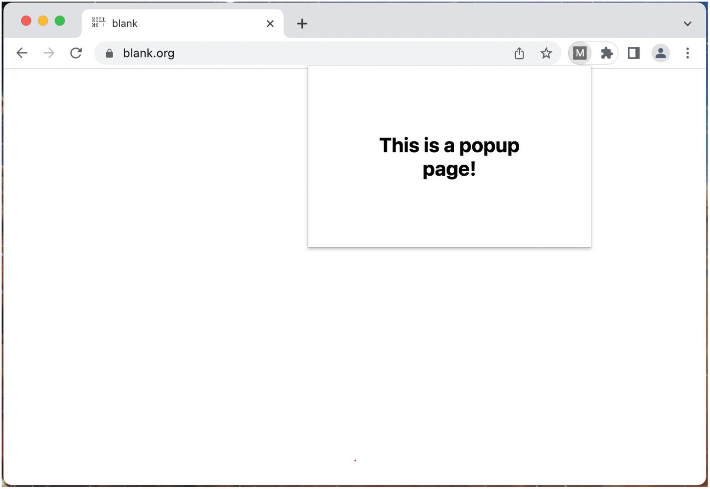
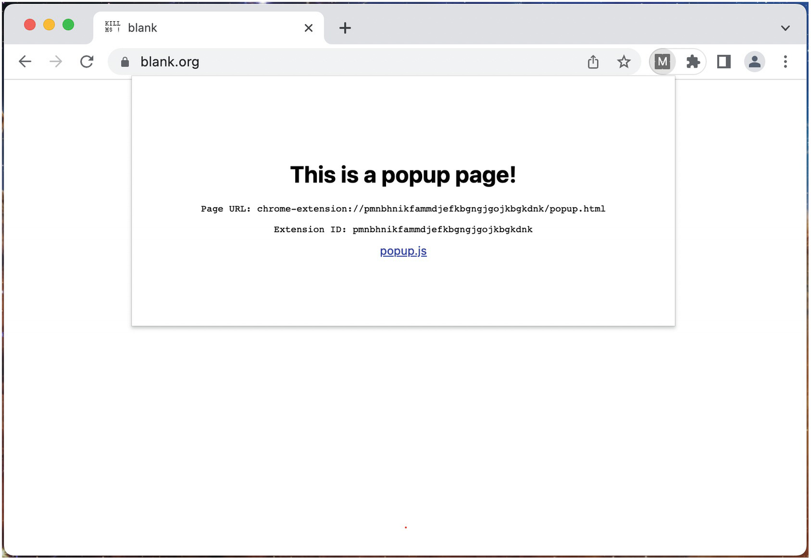
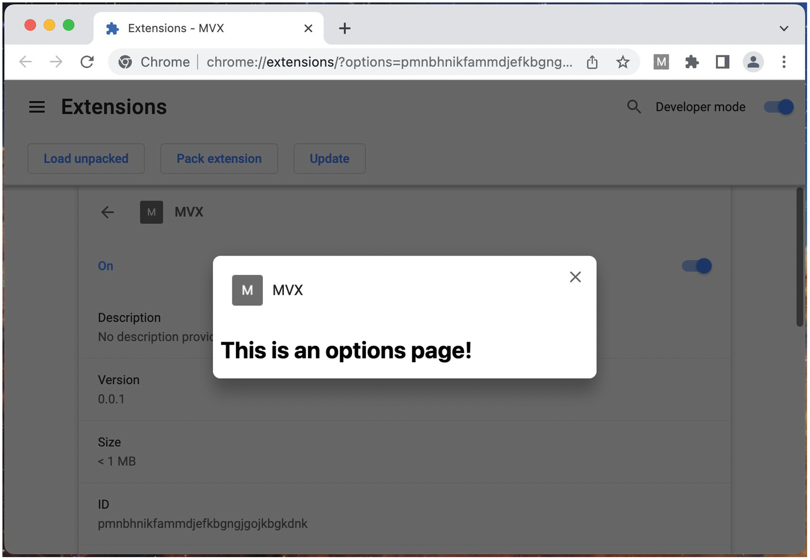
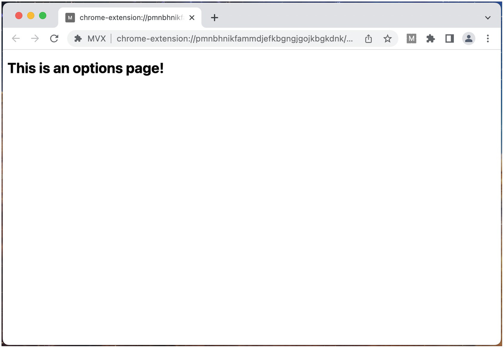
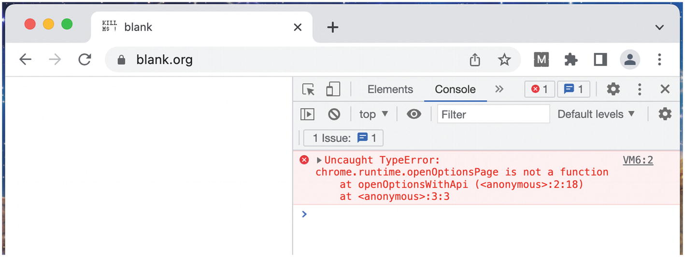
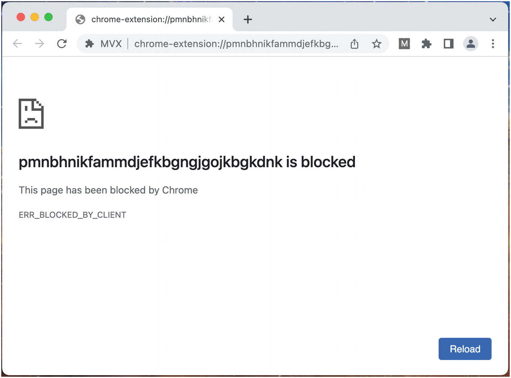

# Chương 8: Giao diện người dùng của Tiện ích mở rộng (Extension User Interfaces)

Tiện ích mở rộng trình duyệt hầu như luôn cần cho phép người dùng kiểm soát một số khía cạnh hành vi của nó thông qua giao diện người dùng. Các trang **popup** và **options** (tùy chọn) là những thành phần tiện ích mở rộng cơ bản cần được sử dụng cho nhu cầu này. Kịch bản nội dung (content scripts) cũng có thể được sử dụng để cung cấp giao diện người dùng ngay trong trang web, nhưng có những sự đánh đổi và sự phức tạp quan trọng khi làm như vậy.

> [!NOTE]
> Tham khảo chương *Kịch bản nội dung (Content Scripts)* để biết thêm chi tiết về những sự đánh đổi này.

## Trang Popup

Đúng như tên gọi của nó, **trang popup** là một trang web được hiển thị bên trong một khung chứa "bật lên" (pop up) trên trang web của trình duyệt. Nó hoàn toàn được kiểm soát bởi tiện ích mở rộng trình duyệt và được đảm bảo sẽ phủ lên trang web hiện tại của trình duyệt (Hình 8-1).



### Thuộc tính của Trang Popup

Khung chứa trang popup có thể được coi là một tab trình duyệt đơn giản mà không có bất kỳ thành phần trang trí nào của trình duyệt (browser chrome): không có thanh URL, không có các nút điều khiển trình duyệt, v.v. Trong hầu hết các khía cạnh khác, trang popup giống như bất kỳ trang web nào khác. Tiện ích mở rộng demo sau đây minh họa một số thuộc tính cơ bản của trang popup (Hình 8-2):

*manifest.json:*

```json
{
  "name": "MVX",
  "version": "0.0.1",
  "manifest_version": 3,
  "action": {
    "default_popup": "popup.html"
  }
}
```

*popup.html:*

```html
<!DOCTYPE html>
<html>
  <head>
    <link href="popup.css" rel="stylesheet" />
  </head>
  <body>
    <h1>This is a popup page!</h1>
    <div id="url"></div>
    <div id="xid"></div>
    <a href="popup.js">popup.js</a>
    <script src="popup.js"></script>
  </body>
</html>
```

*popup.js:*

```javascript
document.querySelector("#url").innerHTML = `
<pre>Page URL: ${window.location.href}</pre>
`;

document.querySelector("#xid").innerHTML = `
<pre>Extension ID: ${chrome.runtime.id}</pre>
`;
```

*popup.css:*

```css
body {
  text-align: center;
  min-width: 20rem;
  padding: 4rem;
}
```



Trong `manifest.json`, trang popup được khai báo bằng cách chỉ định đường dẫn đến tệp HTML của popup thông qua giá trị `action.default_popup`. Như đã mô tả trong chương *Tệp Manifest của Tiện ích mở rộng (Extension Manifest)*, từ điển `action` xác định cách nút biểu tượng trên thanh công cụ xuất hiện và hoạt động:

- Nếu từ điển `action` được định nghĩa với giá trị `default_popup`, việc nhấp vào nút đó sẽ mở popup.
- Nếu từ điển `action` được định nghĩa mà *không có* giá trị `default_popup`, việc nhấp vào nút biểu tượng thanh công cụ thay vào đó sẽ gọi trình xử lý `chrome.action.onClicked()` ở bất cứ nơi nào nó được định nghĩa.

Khung chứa popup sẽ được định kích thước để vừa với nội dung của trang popup, nhưng các trình duyệt sẽ xử lý các quy tắc kích thước hơi khác nhau. Ví dụ, Google Chrome không đặt giới hạn trên cho kích thước tối đa của popup, cho phép nó thậm chí mở rộng lớn hơn chính cửa sổ trình duyệt. Ngược lại, Mozilla Firefox giới hạn popup không lớn hơn 800px x 600px.

> [!TIP]
> Để xử lý các giới hạn kích thước popup thay đổi này, bạn nên làm cho trang popup có khả năng đáp ứng (responsive) hoặc giới hạn lượng nội dung xuất hiện bên trong popup.

Bởi vì trang popup được cung cấp từ **giao thức tiện ích mở rộng** của trình duyệt – trong Google Chrome là `chrome-extension://` – JavaScript của trang có quyền truy cập vào WebExtensions API. Trang popup không bị hạn chế điều hướng đến các URL khác, vì vậy việc nhấp vào liên kết đến `popup.js` sẽ điều hướng thành công trang popup đến một URL mới.

Các tiện ích mở rộng nâng cao hơn thường sẽ xây dựng các **ứng dụng đơn trang (single page applications - SPAs)** đa giao diện bên trong trang popup. Các tiện ích mở rộng này nên sử dụng trang HTML mà manifest chỉ định làm popup như là điểm khởi đầu tương đương với tệp `index.html` của một trang web.

### Mở và Đóng Trang Popup

Trang popup chỉ nhằm mục đích hiển thị sau một hành động rõ ràng của người dùng. Các trình duyệt cố ý ngăn cản bạn mở trang popup theo lập trình để tránh việc các tiện ích mở rộng làm phiền người dùng bằng các lớp phủ trang. Do đó, về cơ bản có hai cách để mở trang popup:

- Nhấp vào nút biểu tượng thanh công cụ khi manifest có định nghĩa `action.default_popup`.
- Nhập **phím tắt (shortcut)** được định nghĩa trong `commands._execute_action` của manifest khi `action.default_popup` được định nghĩa.

> [!NOTE]
> Có một phương thức `chrome.action.openPopup()` được liệt kê trong tài liệu tiện ích mở rộng, nhưng tại thời điểm viết cuốn sách này, phương thức này vẫn chưa được hỗ trợ. Khi sự hỗ trợ cuối cùng được triển khai, nó vẫn sẽ chỉ có thể sử dụng được ngay sau một tương tác người dùng đủ điều kiện; do đó, việc mở trang popup theo lập trình trên thực tế sẽ vẫn bị cấm.

Khi popup đã mở, có nhiều cách khác để kích hoạt việc đóng. Từ góc độ của trang popup, việc đóng popup giống hệt như một tab bị đóng. Các hành động sau đây sẽ kích hoạt đóng popup:

- Nhấp vào nút biểu tượng thanh công cụ khi popup đã mở.
- Nhấp ra ngoài cửa sổ popup đã mở *và* bên trong cùng một cửa sổ trình duyệt.
- Gọi `window.close()` từ bên trong JavaScript của popup.
- Sử dụng phím `Esc`.

> [!NOTE]
> Quan trọng là, việc nhấp chuột bên ngoài cửa sổ trình duyệt sẽ *không* làm đóng popup. Hành vi này cho phép bạn mở một trang popup cho mỗi cửa sổ. Nó cũng có nghĩa là phải giả định rằng người dùng có thể mở đồng thời nhiều trang popup.

### Thay đổi Trang Popup

Bạn có thể thay đổi trang popup thông qua WebExtensions API. Bất kỳ thay đổi nào được thực hiện sẽ tồn tại qua các phiên trình duyệt. Đoạn mã sau minh họa cách thay đổi trang popup:

```javascript
chrome.action.setPopup({
  popup: chrome.runtime.getURL("new-popup.html")
});
```

### Phát hiện Trạng thái Popup

Tiện ích mở rộng trình duyệt ngầm theo dõi các đối tượng cửa sổ đang hoạt động do tiện ích mở rộng kiểm soát. Phương thức `chrome.extension.getViews()` cung cấp quyền truy cập vào danh sách này, và bạn có thể cung cấp một `type` để chỉ lọc các giao diện (views) popup, như được hiển thị ở đây:

```javascript
// Trả về một mảng các đối tượng window
chrome.extension.getViews({ type: "popup" });
```

Nếu bạn muốn phát hiện xem một giao diện có đang được hiển thị bên trong một popup hay không, bạn có thể thực hiện một kiểm tra đơn giản đối với đối tượng `window`:

```javascript
const popups = chrome.extension.getViews({ type: "popup" });

console.log(`Inside a popup: ${popups.includes(window)}`);
```

### Cách sử dụng Khuyến nghị cho Trang Popup

Khi phát triển các trang popup, bạn nên tuân theo các chiến lược sau:

- Trang popup tốt nhất nên được sử dụng cho các giao diện người dùng mà người dùng cần truy cập nhanh chóng mà không làm mất ngữ cảnh của trang hiện tại họ đang truy cập.
- Vì một số trình duyệt sẽ hạn chế kích thước trang của trang popup, một quy tắc chung là giao diện nên chứa lượng nội dung tương đương với một ứng dụng điện thoại.
- Bởi vì các trang popup sẽ được đóng và mở lại nhanh chóng, trang popup nên hiển thị hiệu quả và không dựa vào các hoạt động chạy lâu dài có thể cần kết thúc sớm.
- Khi bạn cần trang popup có trạng thái hoặc tải dữ liệu, nó nên sử dụng triệt để chiến lược lưu bộ nhớ đệm (caching) để tránh bất kỳ sự chậm trễ nào trong trải nghiệm người dùng (UX).
- Trong các tình huống bạn cần nhiều không gian màn hình hơn, trang popup có thể cung cấp các liên kết hoặc nút để mở trang tùy chọn hoặc các giao diện khác trong một tab trình duyệt riêng biệt.

## Trang Tùy chọn (Options Pages)

**Trang tùy chọn** là một trang web hiển thị theo một trong hai cách: dưới dạng một **tab** độc lập hoặc bên trong một khung chứa mô-đun (modal) phủ lên trang **quản lý tiện ích mở rộng** của trình duyệt (Hình 8-3 và 8-4). Nó hoàn toàn được kiểm soát bởi tiện ích mở rộng trình duyệt.





### Thuộc tính của Trang Tùy chọn

Khi được mở trong một tab, trang tùy chọn giống như bất kỳ trang web nào khác. Khi được mở dưới dạng một mô-đun (modal), khung chứa mô-đun tùy chọn có thể được coi là một tab trình duyệt đơn giản không có bất kỳ thành phần trang trí nào của trình duyệt: không có thanh URL, không có các nút điều khiển trình duyệt, v.v. Tiện ích mở rộng demo sau đây minh họa một số thuộc tính cơ bản của các trang tùy chọn:

*manifest.json:*

```json
{
  "name": "MVX",
  "version": "0.0.1",
  "manifest_version": 3,
  "action": {
    "default_popup": "popup.html"
  },
  "options_ui": {
    "open_in_tab": false,
    "page": "options.html"
  }
}
```

*popup.html:*

```html
<!DOCTYPE html>
<html>
  <body>
    <h1>Popup</h1>
    <button id="opts">Options</button>
    <a href="options.html" target="_blank">options.html</a>
    <script src="popup.js"></script>
  </body>
</html>
```

*popup.js:*

```javascript
document.querySelector("#opts").addEventListener(
  "click",
  () => chrome.runtime.openOptionsPage()
);
```

*options.html:*

```html
<!DOCTYPE html>
<html>
  <body>
    <h1>Options</h1>
    <a href="options.js">options.js</a>
  </body>
</html>
```

Trong `manifest.json`, trang tùy chọn được khai báo bằng cách chỉ định đường dẫn đến tệp HTML của tùy chọn thông qua giá trị `options_ui.page`. Việc hiển thị mặc định của trang tùy chọn có thể xảy ra theo một trong hai cách:

- Nếu `options_ui.open_in_tab` là `false`, trang tùy chọn theo mặc định sẽ mở trong một tab trình duyệt.
- Nếu `options_ui.open_in_tab` là `true`, trang tùy chọn theo mặc định sẽ mở trong một mô-đun phủ lên trang quản lý tiện ích mở rộng của trình duyệt.

> [!NOTE]
> Nhãn của trang tùy chọn chủ yếu xuất phát từ khả năng của trình duyệt trong việc truy cập trang thông qua mục menu ngữ cảnh hoặc phương thức WebExtensions API. Khi đã được mở dưới dạng một tab, trang tùy chọn không khác gì bất kỳ tệp HTML tiện ích mở rộng nào khác được mở qua URL giao thức tiện ích mở rộng.

Nếu được mở dưới dạng một mô-đun, khung chứa tùy chọn sẽ được định kích thước để vừa với nội dung của trang tùy chọn. Trang tùy chọn có thể chỉ định kích thước phần thân (body) để mở rộng hoặc thu hẹp khi cần thiết.

Bởi vì trang tùy chọn được cung cấp từ giao thức tiện ích mở rộng của trình duyệt – trong Google Chrome là `chrome-extension://` – JavaScript của trang có quyền truy cập vào WebExtensions API. Ở cả chế độ tab và mô-đun, trang tùy chọn không bị hạn chế điều hướng đến các URL khác, vì vậy việc nhấp vào liên kết đến `options.js` sẽ điều hướng thành công trang tùy chọn đến một URL mới.

Các tiện ích mở rộng nâng cao hơn thường sẽ xây dựng các ứng dụng đơn trang đa giao diện bên trong trang tùy chọn. Các tiện ích mở rộng này nên sử dụng trang HTML mà manifest chỉ định là tùy chọn như là điểm khởi đầu tương đương với tệp `index.html` của một trang web.

### Mở và Đóng Trang Tùy chọn

Có một số cách để mở trang tùy chọn, và không giống như popup, trang tùy chọn *có thể* được mở theo lập trình. Các hành động sau đây sẽ mở trang tùy chọn, và sẽ luôn tôn trọng giá trị `options_ui.open_in_tab`:

- Nhấp chuột phải vào nút biểu tượng thanh công cụ và chọn *Options*.
- Gọi `chrome.runtime.openOptionsPage()`.

Khi trang tùy chọn được mở trong một tab, nó sẽ đóng lại giống như một trang web tiêu chuẩn. Khi được mở dưới dạng một mô-đun, các hành động sau đây sẽ kích hoạt đóng tùy chọn:

- Nhấp vào nút X bên trong khung chứa mô-đun trang tùy chọn.
- Gọi `window.close()` từ bên trong JavaScript của tùy chọn.
- Sử dụng phím `Esc` khi đang xem mô-đun tùy chọn.
- Đóng tab quản lý tiện ích mở rộng.

### Phát hiện Trang Tùy chọn

Khi các trang tùy chọn được mở dưới dạng một tab, chúng được đối xử như bất kỳ tab nào khác và do đó có thể được phát hiện thông qua `chrome.extension.getViews()` hoặc `chrome.tabs.query()`. Tuy nhiên, khi được mở dưới dạng một mô-đun, trang tùy chọn sẽ có những hạn chế sau:

- `chrome.tabs.query()` sẽ không trả về trang tùy chọn.
- Các sự kiện `chrome.tabs.onCreated` và `chrome.tabs.onUpdated` sẽ không kích hoạt khi mô-đun được mở hoặc thay đổi.
- Trang tùy chọn mô-đun không thể được gửi tin nhắn thông qua `chrome.tabs.connect()` hoặc `chrome.tabs.sendMessage()`.
- `chrome.extension.getViews({ type: "tab" })` sẽ không trả về cửa sổ tùy chọn mô-đun. Lưu ý rằng `chrome.extension.getViews()` vẫn sẽ bao gồm cửa sổ tùy chọn mô-đun.

### Cách sử dụng Khuyến nghị cho Trang Tùy chọn

Khi phát triển các trang tùy chọn, bạn nên tuân theo các chiến lược sau:

- Trang tùy chọn tốt nhất nên được sử dụng cho các giao diện người dùng chứa các nút điều khiển cho cách thức hoạt động của tiện ích mở rộng.
- Trang tùy chọn không có hạn chế về nội dung. Tuy nhiên, vì một con đường rất phổ biến để truy cập nó là nhấp chuột phải vào biểu tượng thanh công cụ và chọn "Options", trang tùy chọn nên giống như một trang để kiểm soát các tùy chọn của tiện ích mở rộng.
- Không có nhiều lợi ích khi sử dụng phiên bản mô-đun (modal) của trang tiện ích mở rộng. Người dùng có thể không quen thuộc với giao diện quản lý tiện ích mở rộng, vì vậy việc hiển thị một chế độ xem mô-đun phía trên nó có thể gây nhầm lẫn. Tôi khuyên bạn nên sử dụng phiên bản tab.

## Hạn chế của Kịch bản nội dung (Content Script Restrictions)

Một hành vi khó hiểu và quan trọng cần lưu ý là quyền truy cập theo lập trình vào các trang tùy chọn (và mọi URL tiện ích mở rộng khác) đều bị cấm. Hãy xem xét ví dụ về tiện ích mở rộng sau đây, có một trang popup với bốn nút, mỗi nút cố gắng mở trang tùy chọn theo một cách khác nhau:

*manifest.json:*

```json
{
  "name": "MVX",
  "version": "0.0.1",
  "manifest_version": 3,
  "action": {
    "default_popup": "popup.html"
  },
  "options_ui": {
    "open_in_tab": true,
    "page": "options.html"
  },
  "permissions": ["scripting"],
  "host_permissions": ["<all_urls>"]
}
```

*popup.html:*

```html
<!DOCTYPE html>
<html>
  <body>
    <h1>Popup</h1>
    <button id="popup-api">Popup API</button>
    <button id="popup-url">Popup URL</button>
    <button id="cs-api">Content Script API</button>
    <button id="cs-url">Content Script URL</button>
    <script src="popup.js"></script>
  </body>
</html>
```

*popup.js:*

```javascript
function openOptionsWithUrl() {
  window.open(chrome.runtime.getURL("options.html"));
}

function openOptionsWithApi() {
  chrome.runtime.openOptionsPage();
}

async function sendFnToActiveTab(fn) {
  let [tab] = await chrome.tabs.query({
    active: true,
    currentWindow: true,
  });

  chrome.scripting.executeScript({
    target: { tabId: tab.id },
    function: fn,
  });
}

document.querySelector("#popup-api").addEventListener(
  "click",
  () => openOptionsWithApi()
);

document.querySelector("#popup-url").addEventListener(
  "click",
  () => openOptionsWithUrl()
);

document.querySelector("#cs-api").addEventListener(
  "click",
  () => sendFnToActiveTab(openOptionsWithApi)
);

document.querySelector("#cs-url").addEventListener(
  "click",
  () => sendFnToActiveTab(openOptionsWithUrl)
);
```

*options.html:*

```html
<!DOCTYPE html>
<html>
  <body>
    <h1>Options</h1>
  </body>
</html>
```

> [!NOTE]
> Các nút kịch bản nội dung phải được sử dụng với một tab đang hoạt động hợp lệ, chẳng hạn như `https://blank.org`.

Bốn nút của trang popup mỗi nút cung cấp một trong bốn sự kết hợp giữa nguồn gốc popup hoặc nguồn gốc kịch bản nội dung, và mở bằng API hoặc mở bằng URL. Ban đầu, không có gì ở đây có vẻ bất thường. Khi bạn nhấp vào hai nút popup, trang tùy chọn sẽ mở chính xác mà không gặp sự cố nào.

Tuy nhiên, sau khi nhấp vào từng nút kịch bản nội dung, trang tùy chọn sẽ không mở chính xác và bạn sẽ thấy các lỗi hiển thị trong Hình 8-5 và 8-6.





Trình duyệt ngăn kịch bản nội dung mở trang tùy chọn theo lập trình. Trong kịch bản nội dung, phương thức API chỉ đơn giản là bị loại bỏ, và URL tiện ích mở rộng bị ngăn cản truy cập vào máy chủ tệp của tiện ích mở rộng.

Lý do cho việc này có lẽ liên quan đến bảo mật. Khả năng các kịch bản nội dung lạm dụng khả năng đẩy người dùng vào một tab mới là quá lớn, vì vậy các kịch bản nội dung bị hạn chế làm như vậy.

## Tóm tắt

Trong chương này, bạn đã tìm hiểu về hai khối xây dựng giao diện người dùng chính của tiện ích mở rộng trình duyệt: trang popup và trang tùy chọn (options). Chương này đã đưa bạn đi qua các chi tiết về cách mỗi trang hoạt động bên trong trình duyệt, cách chúng có thể phù hợp với luồng người dùng, cũng như ưu điểm và nhược điểm của việc sử dụng mỗi loại.

Trong chương tiếp theo, bạn sẽ tìm hiểu về cách các kịch bản nội dung có thể bổ sung và nâng cao các trang popup và tùy chọn, cũng như cho phép một miền tiện ích mở rộng hoàn toàn mới để kiến trúc giao diện người dùng.
