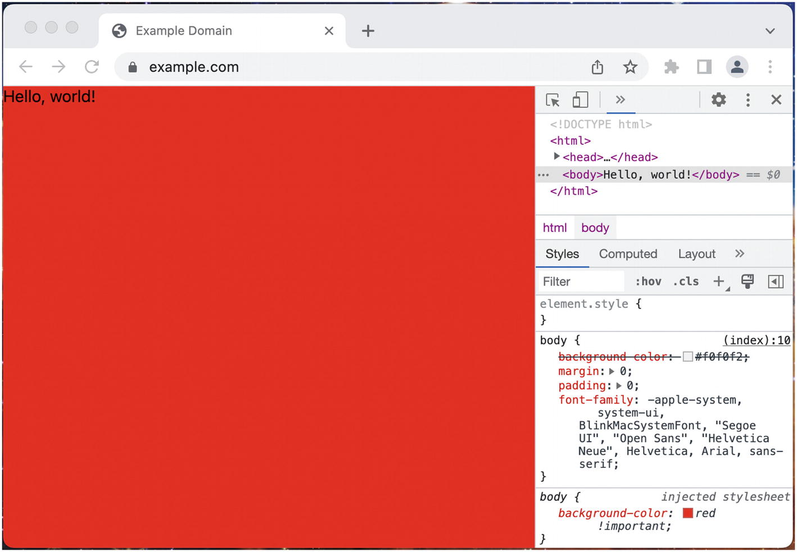
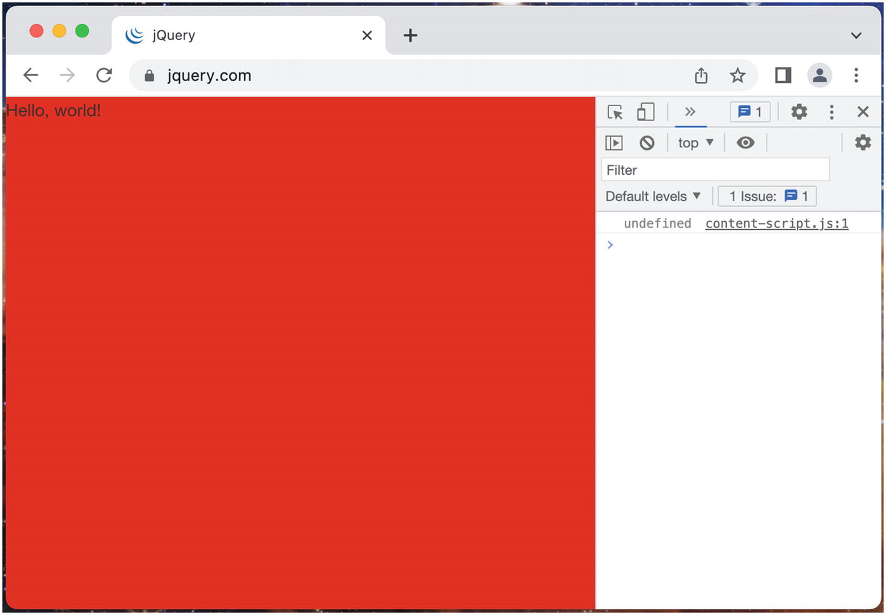
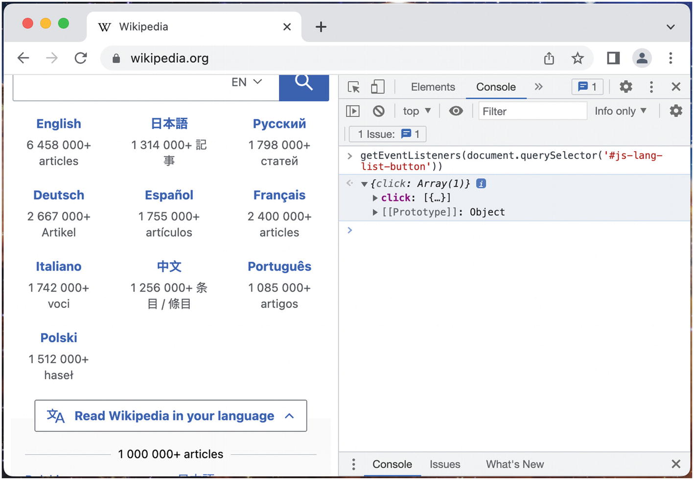
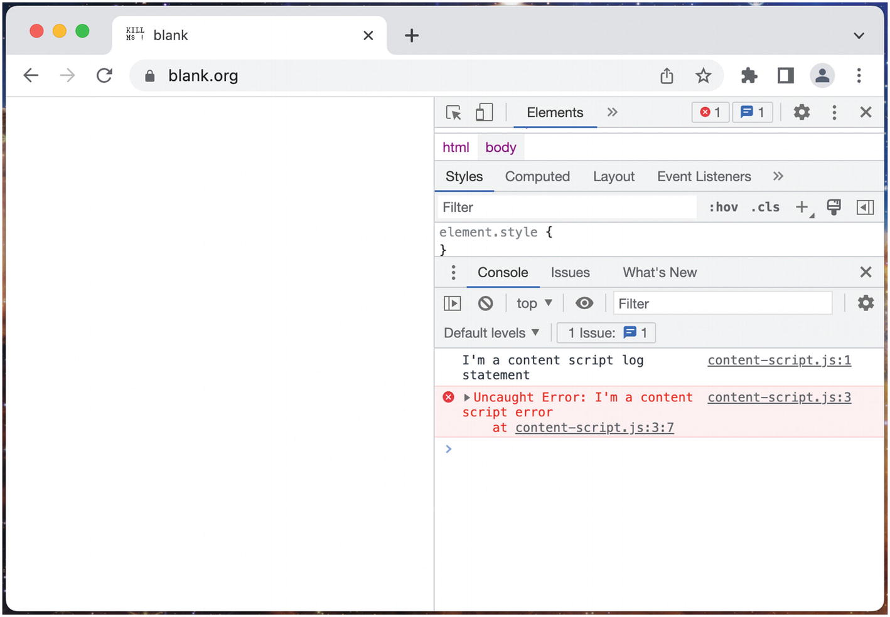
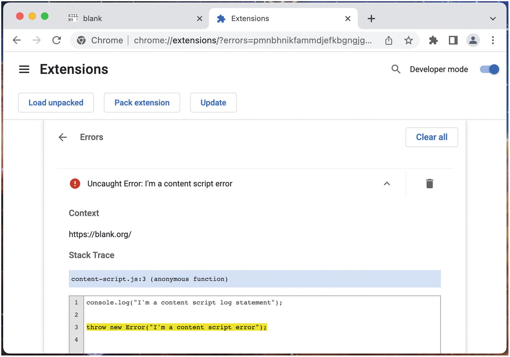
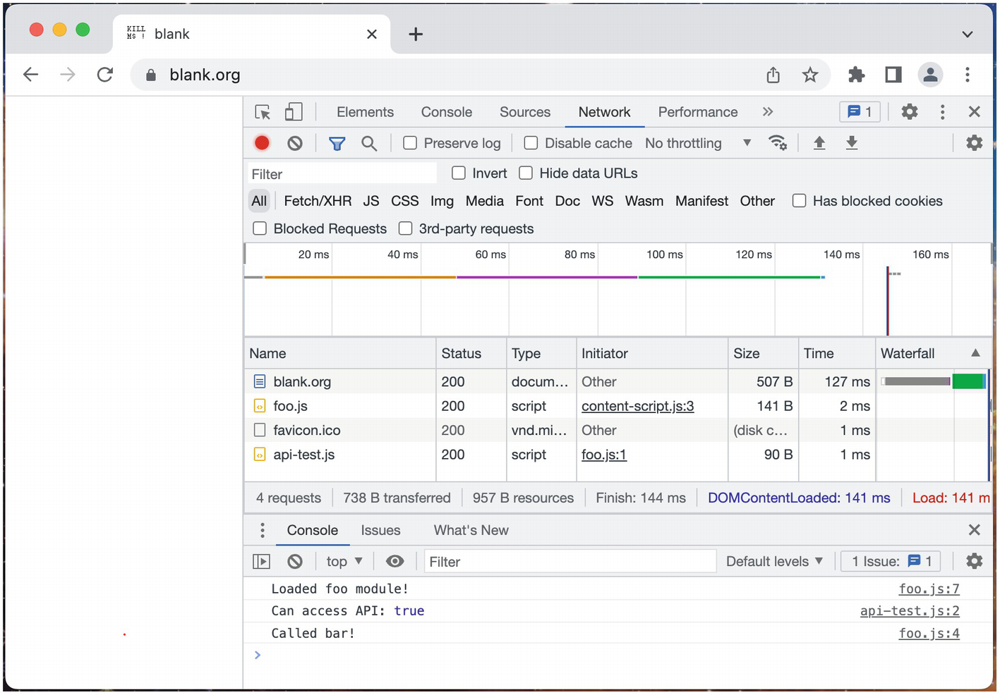
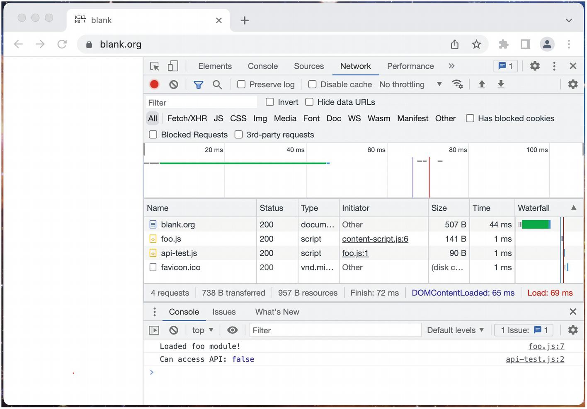

# Chương 9: Kịch bản nội dung (Content Scripts)

Kịch bản nội dung là một trong những công cụ mạnh mẽ nhất có sẵn trong các tiện ích mở rộng trình duyệt. Chúng cho phép bạn chèn JavaScript và CSS vào bất kỳ trang web nào và sửa đổi nó mà hầu như không có hạn chế. Nội dung được chèn có thể đơn giản như một vài tinh chỉnh hình ảnh, hoặc phức tạp như toàn bộ các khung làm việc ứng dụng đơn trang. Các tiện ích mở rộng cũng có thể sử dụng chúng cho các lý do không liên quan đến giao diện người dùng: kịch bản nội dung có thể đọc và sửa đổi DOM của trang, cũng như gửi các yêu cầu mạng với tư cách là người dùng đã được xác thực.

## Giới thiệu về Kịch bản nội dung

Cách phổ biến nhất mà các **kịch bản nội dung (content scripts)** được sử dụng là thông qua **chèn khai báo (declarative injection)** qua manifest. Manifest chỉ định các tệp nền nên được chèn, và các tên miền mà chúng nên được chèn vào, và trình duyệt sẽ chèn chúng vào trang web. JavaScript được chèn tương tự như việc chèn động một thẻ `<script>` vào trang, và CSS được chèn tương tự như việc chèn động một thẻ `<link>` vào trang. Ví dụ sau đây minh họa một tiện ích mở rộng sẽ chèn JS và CSS vào tất cả các trang web:

*manifest.json:*

```json
{
  "name": "MVX",
  "version": "0.0.1",
  "manifest_version": 3,
  "content_scripts": [
    {
      "matches": ["<all_urls>"],
      "css": ["content-script.css"],
      "js": ["content-script.js"]
    }
  ],
  "permissions": []
}
```

*content-script.js:*

```javascript
console.log(window.jQuery);

document.body.innerHTML = "Hello, world!";
```

*content-script.css:*

```css
body {
    background-color: red !important;
}
```

### Chèn CSS

Việc chèn kịch bản nội dung CSS vào một trang chủ (host page) tương đối đơn giản. Nếu URL khớp, kịch bản sẽ được chèn như thể nó được liệt kê như một phần tử `<link>` bổ sung. Hãy cài đặt ví dụ tiện ích mở rộng trước đó và truy cập bất kỳ trang web nào để thấy kết quả chèn CSS (Hình 9-1).



Có một vài điều cần lưu ý ở đây:

- Các kịch bản nội dung chỉ được trình chiếu (projected) vào trang web. Bạn sẽ không thấy các thẻ `<script>` hoặc `<link>` thực tế được thêm vào.
- Độ ưu tiên (specificity) của CSS được chèn thấp hơn CSS của trang web, vì vậy việc sử dụng `!important` thường là cần thiết.

### Cách ly Kịch bản nội dung (Content Script Isolation)

Tiếp theo, hãy điều hướng đến `jquery.com` (hoặc bất kỳ trang web nào khác tải thư viện jQuery) (Hình 9-2).



Khi thư viện JavaScript jQuery được tải trên `jquery.com`, thuộc tính `jQuery` được định nghĩa trên đối tượng `window`, nhưng kịch bản nội dung không thể thấy thuộc tính này. Tuy nhiên, trong công cụ dành cho nhà phát triển (developer tools), `window.jQuery` sẽ được định nghĩa. Điều này là do sự cách ly thời gian chạy (runtime isolation) của kịch bản nội dung.

Kịch bản nội dung JavaScript thực thi trong một thời gian chạy riêng biệt song song với trang chủ. Cả hai thời gian chạy đều không thể truy cập các biến của nhau, và mỗi bên đều có vòng lặp sự kiện (event loop), phạm vi toàn cục (global scope) và hàng đợi tác vụ (task queue) riêng. Tuy nhiên, cả hai đều có thể truy cập các API tương tác với cùng các đối tượng: ví dụ: DOM, `localStorage`, `sessionStorage`, `IndexedDB`, `cookieStore`, v.v. Giả sử trang chủ định nghĩa một biến trong phạm vi toàn cục. Kịch bản nội dung không có cách nào truy cập giá trị của nó. Tuy nhiên, nếu trang chủ viết biến đó vào `localStorage`, API `localStorage` của kịch bản nội dung sẽ có quyền truy cập vào giá trị đó!

Việc chia sẻ quyền truy cập vào DOM đặc biệt thú vị. Một tính năng hữu ích ngay lập tức là khả năng của kịch bản nội dung trong việc thêm, sửa đổi hoặc xóa các nút DOM khỏi trang chủ. Ví dụ, nếu bạn muốn xóa sạch tất cả các kiểu dáng CSS trên tất cả các trang web, bạn có thể sử dụng tiện ích mở rộng ví dụ sau:

*manifest.json:*

```json
{
  "name": "MVX",
  "version": "0.0.1",
  "manifest_version": 3,
  "content_scripts": [
    {
      "matches": ["<all_urls>"],
      "css": [],
      "js": ["content-script.js"]
    }
  ],
  "permissions": []
}
```

*content-script.js:*

```javascript
for (const el of document.querySelectorAll("style")) {
  el.parentElement.removeChild(el);
}

for (const el of document.querySelectorAll('link[rel="stylesheet"]')) {
  el.parentElement.removeChild(el);
}

for (const el of document.querySelectorAll("[style]")) {
  el.removeAttribute("style");
}
```

Hãy tải tiện ích mở rộng này và điều hướng đến bất kỳ trang web nào. Bạn sẽ nhận thấy rằng tất cả các kiểu dáng CSS sẽ bị tước bỏ hoàn toàn.

> [!NOTE]
> Điều này sẽ không ảnh hưởng đến các kiểu dáng CSS được thêm vào bởi JavaScript sau khi kịch bản nội dung chạy. Một giải pháp đơn giản có thể là bọc kịch bản này trong một hàm `setInterval()`, nhưng sau đó có thể có những cân nhắc về hiệu suất cần tính đến với tất cả các biểu thức `querySelectorAll` bổ sung đang được đánh giá. Loại quản lý trang web này là thứ khiến các kịch bản nội dung trở nên rất khó khăn để thực hiện đúng.

### Tự động hóa Trang web (Page Automation)

Mặc dù kịch bản nội dung không thể truy cập các trình xử lý sự kiện (event handlers), nó có thể điều phối (dispatch) các sự kiện trên các nút DOM chung. Các trình xử lý sự kiện mà trang chủ đã gán trong ngữ cảnh JavaScript của trang chủ sẽ được gọi bởi các sự kiện được điều phối từ ngữ cảnh JavaScript của kịch bản nội dung. Ví dụ sau đây minh họa điều này bằng cách tự động hóa một tìm kiếm trên `Wikipedia.org`.

*manifest.json:*

```json
{
  "name": "MVX",
  "version": "0.0.1",
  "manifest_version": 3,
  "content_scripts": [
    {
      "matches": ["https://*.wikipedia.org/*"],
      "css": [],
      "js": ["content-script.js"]
    }
  ],
  "permissions": []
}
```

*content-script.js:*

```javascript
// Đợi vài giây để người dùng
// có thể thấy truy vấn đang được nhập
setTimeout(() => {
  document.querySelector("#searchInput").value = "javascript";
}, 2000);

setTimeout(() => {
  document.querySelector('button[type="submit"]').click();
}, 3000);
```

Sau khi tải tiện ích mở rộng này, hãy truy cập `https://wikipedia.org`. Bạn sẽ thấy tiện ích mở rộng đặt một giá trị vào trường nhập và nhấp vào nút tìm kiếm, và bạn sẽ được đưa đến trang về JavaScript.

Nếu bạn muốn làm cho việc nhập văn bản trông thực tế hơn, bạn có thể điều chỉnh kịch bản nội dung thành như sau:

#### content-script.js (Page Automation Example)

```javascript
const typedValue = "javascript";
const input = document.querySelector("#searchInput");
const form = document.querySelector("#search-form");

function typeOrSubmit(idx = 0) {
  const char = typedValue[idx];

  if (!char) {
    setTimeout(() => form.submit(), 500);
  } else {
    input.value = input.value + char;
    setTimeout(() => typeOrSubmit(++idx), 100);
  }
}

if (input && form) {
  setTimeout(() => {
    input.focus();
    typeOrSubmit();
  }, 2000);
}
```

Hãy tải lại tiện ích mở rộng và trang Wikipedia. Kịch bản nội dung sẽ dần dần nhập cụm từ tìm kiếm. Cũng lưu ý ở đây rằng kịch bản nội dung đang gửi (submit) biểu mẫu trực tiếp, chứ không chỉ nhấp vào nút tìm kiếm.

Điều này chạm đến một khái niệm quan trọng cần ghi nhớ khi viết kịch bản nội dung: bạn đang phụ thuộc vào trang chủ. Trong ví dụ trên, chúng ta đang sử dụng các bộ chọn (selectors) được định nghĩa bởi trang chủ để định vị các phần tử mà chúng ta muốn tương tác. Nếu trang chủ thay đổi các bộ chọn này dù chỉ một chút, kịch bản nội dung sẽ bị hỏng. Hơn nữa, hãy lưu ý rằng các kịch bản nội dung đang sử dụng các phương thức điều phối sự kiện tích hợp sẵn như `click()`, `focus()` và `submit()`. Những phương thức này rất tiện lợi vì chúng ngắn gọn và cho phép bạn tránh việc điều phối sự kiện theo cách thủ công.

Đôi khi, việc điều phối sự kiện theo cách thủ công là cần thiết. Một kịch bản nội dung không thể thấy phần tử nào có trình xử lý sự kiện đính kèm, nhưng nhà phát triển có thể tìm hiểu thông tin này trước bằng cách sử dụng phương thức `getEventListeners()`. Ví dụ, trên `https://wikipedia.org`, bạn có thể sử dụng phương thức này để tìm tất cả các trình lắng nghe sự kiện trên nút "Read Wikipedia in your language" (Hình 9-3).



Chúng ta thấy ở đây có một trình lắng nghe sự kiện được trang chủ thiết lập. Sau đó, chúng ta có thể kiểm tra xem trình xử lý này đang làm gì bằng cách điều phối một sự kiện click thử nghiệm trong bảng điều khiển dành cho nhà phát triển — và bạn sẽ thấy nó bật/tắt menu ngôn ngữ. Để tự động hóa việc mở menu này, chúng ta chắc chắn có thể gọi `click()` trong kịch bản nội dung, nhưng vì mục đích của ví dụ này, hãy mở menu bằng cách điều phối một sự kiện click theo cách thủ công:

#### content-script.js (Manual Event Dispatch Example)

```javascript
setTimeout(() => {
  const el = document.querySelector("#js-lang-list-button");

  // Cuộn xuống nút để chúng ta có thể thấy việc nhấp hoạt động
  el.scrollIntoView();

  el.dispatchEvent(new Event("click"));
}, 2000);
```

Tải lại tiện ích mở rộng và trang Wikipedia. Bạn sẽ thấy kịch bản nội dung cuộn trang xuống và tự động mở menu ngôn ngữ.

### Ghi nhật ký và Lỗi (Logging and Errors)

Các thông báo console và lỗi được tạo ra bởi một kịch bản nội dung sẽ hiển thị trong bảng điều khiển dành cho nhà phát triển của trang chủ (Hình 9-4).



Bởi vì các lỗi chưa được xử lý (uncaught errors) ném ra trong kịch bản nội dung vẫn là một phần của ngữ cảnh tiện ích mở rộng, các thông báo lỗi này cũng sẽ xuất hiện trong chế độ xem lỗi của tiện ích mở rộng (Hình 9-5).



## Truy cập API Tiện ích mở rộng (Extension API Access)

Không giống như trang popup và trang tùy chọn, kịch bản nội dung chỉ có thể truy cập một phần hạn chế của WebExtensions API:

- `chrome.i18n.*`
- `chrome.storage.*`
- `chrome.runtime.connect`
- `chrome.runtime.getManifest`
- `chrome.runtime.getURL`
- `chrome.runtime.id`
- `chrome.runtime.onConnect`
- `chrome.runtime.onMessage`
- `chrome.runtime.sendMessage`

Nếu bạn yêu cầu các phần khác của API, bạn có thể ủy thác cho service worker nền bằng cách gửi một tin nhắn để kích hoạt một lời gọi thủ tục từ xa (remote procedure call). Service worker nền có thể sử dụng toàn bộ API và gửi lại kết quả nếu cần.

Một khía cạnh bất thường của kịch bản nội dung là, mặc dù chúng có thể sử dụng `runtime.getURL()`, chúng bị ngăn cản mở các tab của URL tiện ích mở rộng. Tab sẽ mở ra, nhưng trang sẽ không hiển thị và thay vào đó hiển thị một lỗi trình duyệt. Kịch bản nội dung chạy trong một môi trường không đáng tin cậy, và do đó việc sử dụng `<a href>` hoặc `window.open(chrome-extension://...)` để truy cập các trang tiện ích mở rộng nhất thiết có nghĩa là các trang chủ cũng có thể mở các URL đó. Như đã trình bày trong chương *Kịch bản nền (Background Scripts)*, giải pháp cho việc này là gửi một tin nhắn đến nền chỉ định nó mở một tab mới với URL mong muốn.

## Mô-đun và Tách mã (Modules and Code Splitting)

Như bất kỳ nhà phát triển có kinh nghiệm nào cũng biết, JavaScript hiện đại sử dụng nhiều mô-đun ES6 và từ khóa `import`. Bởi vì kịch bản nội dung cấp cao nhất không phải là một mô-đun, và hiện tại không có cách nào để định nghĩa nó là một mô-đun, nó không thể có các lệnh nhập tĩnh (static imports). May mắn thay, có một số giải pháp đơn giản.

### Đóng gói (Bundling)

Hầu hết việc phát triển tiện ích mở rộng được thực hiện bằng các công cụ xây dựng tinh vi như Parcel, Webpack hoặc Plasmo, và những công cụ này thường được cấu hình để "nhào nặn" toàn bộ đồ thị mã của kịch bản nội dung vào một tệp duy nhất, từ đó loại bỏ nhu cầu sử dụng lệnh nhập trong kịch bản nội dung cấp cao nhất. Các ứng dụng web truyền thống có nhu cầu tải lười (lazy loading) nhiều hơn, vì từ góc độ hiệu suất, việc tải dữ liệu từ một máy chủ từ xa là tốn kém. Vì các tiện ích mở rộng trình duyệt được phục vụ độc quyên từ máy chủ tệp tiện ích mở rộng trên thiết bị địa phương, nên hình phạt cho việc đóng gói toàn bộ kịch bản nội dung vào một kịch bản khổng lồ duy nhất là không đáng kể.

### Nhập động (Dynamic Imports)

Kịch bản nội dung có thể không sử dụng được lệnh nhập tĩnh, nhưng chúng hoàn toàn có thể sử dụng lệnh nhập động (dynamic imports) và tải một mô-đun phụ *có thể* sử dụng lệnh nhập tĩnh. Việc này yêu cầu một yêu cầu mạng bổ sung đến máy chủ tệp tiện ích mở rộng, nhưng hình phạt này là không đáng kể và do đó có thể chấp nhận được.

Tất nhiên, bất kỳ lệnh `import` tĩnh hoặc động nào trong một kịch bản nội dung cũng sẽ tạo ra một yêu cầu mạng cho mô-đun đó. Do đó, để cho phép các mô-đun này được nhập vào, chúng phải được liệt kê dưới mục `web_accessible_resources`. Điều này được minh họa trong tiện ích mở rộng ví dụ sau, thực hiện một lệnh nhập động. Hãy tải tiện ích mở rộng và kiểm tra đầu ra console:

*manifest.json:*

```json
{
  "name": "MVX",
  "version": "0.0.1",
  "manifest_version": 3,
  "content_scripts": [
    {
      "matches": ["<all_urls>"],
      "css": [],
      "js": ["content-script.js"]
    }
  ],
  "permissions": [],
  "web_accessible_resources": [
    {
      "resources": ["*.js"],
      "matches": ["<all_urls>"]
    }
  ]
}
```

*content-script.js:*

```javascript
const url = chrome.runtime.getURL("foo.js");

import(url).then((fooModule) => {
  fooModule.bar();
});
```

*foo.js:*

```javascript
import apiTest from "./api-test.js";

export function bar() {
  console.log("Called bar!");
}

console.log("Loaded foo module!");
apiTest();
```

*api-test.js:*

```javascript
export default function () {
  // Bạn sẽ chỉ thấy phương thức này hiện diện nếu
  // kịch bản có quyền truy cập vào WebExtensions API
  console.log("Can access API:", !!chrome.runtime.getURL);
}
```

Kết quả được hiển thị trong Hình 9-6.



Có một vài điều cần lưu ý ở đây:

- Đúng như dự đoán, cả lệnh `import` tĩnh và động đều làm phát sinh các yêu cầu mạng cho các tệp mô-đun.
- Mô-đun được nhập vẫn giữ được quyền truy cập vào WebExtensions API và có thể nhập các mô-đun khác.
- Bởi vì đó là một lệnh nhập động, bạn có thể gọi các phương thức trên mô-đun được nhập từ đối tượng mô-đun được trả về.

### Thẻ Script Động (Dynamic Script Tags)

Cũng có thể tải các mô-đun theo cách tương tự bằng cách tạo động một `<script type="module">` trong trang web. Hãy thay đổi tiện ích mở rộng ví dụ trước đó để khớp với nội dung sau:

*content-script.js:*

```javascript
const url = chrome.runtime.getURL("foo.js");

const script = document.createElement("script");
script.setAttribute("type", "module");
script.setAttribute("src", url);
document.head.appendChild(script);
```

Tải lại tiện ích mở rộng và bạn sẽ thấy màn hình được hiển thị trong Hình 9-7.



Có một vài điều cần lưu ý ở đây:

- Các thẻ script được tạo động sẽ mất quyền truy cập vào WebExtensions API.
- Bởi vì việc này không sử dụng từ khóa `import`, chúng ta không thể sử dụng các lệnh xuất (exports) cụ thể từ mô-đun.

Bạn có thể gặp một số tình huống đặc biệt mà việc tạo thẻ script động là hữu ích, nhưng nhìn chung nó kém hữu ích hơn so với việc sử dụng lệnh nhập động.

### Các Thuộc tính Kịch bản nội dung Chuyên biệt

Kịch bản nội dung có thể được tùy chỉnh thêm để kiểm soát thời điểm kịch bản được chèn, đường dẫn URL nào nó nên hoặc không nên được chèn vào, và liệu nó có nên được chèn vào các URL đặc biệt như `about:blank` hay không. Các thuộc tính sau có sẵn:

- `run_at`
- `match_about_blank`
- `match_origin_as_fallback`
- `exclude_matches`
- `include_globs`
- `exclude_globs`
- `all_frames`

Hành vi của chúng được trình bày chi tiết trong chương *Tệp Manifest của Tiện ích mở rộng (Extension Manifests)*.

## Chèn theo lập trình (Programmatic Injection)

Manifest không phải là cách duy nhất để chèn kịch bản nội dung. Cũng có thể chèn JavaScript và CSS theo lập trình vào trang bằng API `chrome.scripting`. Hãy xem xét ví dụ sau đây chèn cả JS và CSS sau khi biểu tượng thanh công cụ được nhấp:

*manifest.json:*

```json
{
  "name": "MVX",
  "version": "0.0.1",
  "manifest_version": 3,
  "background": {
    "service_worker": "background.js",
    "type": "module"
  },
  "permissions": ["scripting", "activeTab"],
  "action": {}
}
```

*background.js:*

```javascript
chrome.action.onClicked.addListener((tab) => {
  const target = {
    tabId: tab.id,
  };

  chrome.scripting.executeScript({
    target,
    func: () => {
      document.body.innerHTML = `Hello, world!`;
    },
  });

  chrome.scripting.insertCSS({
    target,
    css: `body { background-color: red !important; }`,
  });
});
```

Như đã trình bày ở đây, API `chrome.scripting` có thể được sử dụng để dễ dàng chèn JavaScript và CSS vào trang web trên cơ sở khi cần thiết. Cơ chế mà hàm được truyền vào trang web hơi khác thường: trên thực tế nó đang gọi `func.toString()`, và sau đó đánh giá chuỗi đó trong ngữ cảnh của trang web.

Thay vì truyền vào các hàm và chuỗi, cũng có thể cung cấp các tham chiếu tệp. Ví dụ sau đây hoạt động giống hệt như ví dụ trước:

*manifest.json:*

```json
{
  "name": "MVX",
  "version": "0.0.1",
  "manifest_version": 3,
  "background": {
    "service_worker": "background.js",
    "type": "module"
  },
  "permissions": ["scripting", "activeTab"],
  "action": {}
}
```

*background.js:*

```javascript
chrome.action.onClicked.addListener((tab) => {
  const target = {
    tabId: tab.id,
  };

  chrome.scripting.executeScript({
    target,
    files: ["content-script.js"],
  });

  chrome.scripting.insertCSS({
    target,
    files: ["content-script.css"],
  });
});
```

*content-script.js:*

```javascript
document.body.innerHTML = `Hello, world!`;
```

*content-script.css:*

```css
body {
  background-color: red !important;
}
```

Quan trọng là, không có closure hàm nào được ghi lại trong quá trình tuần tự hóa; bất kỳ tham chiếu biến bên ngoài nào đều bị mất. Thay vào đó, các biến có thể được tuần tự hóa và đưa vào hàm thông qua thuộc tính `args`. Ví dụ sau đây minh họa điều này:

*background.js:*

```javascript
const outerVar = "foobar";

function wipeOutPage(bg) {
  // Ghi lại typeof bên trong kịch bản nội dung
  const cs = typeof outerVar;
  document.body.innerHTML = `${bg} -> ${cs}`;
}

const css = `
body {
    background-color: red !important;
}`;

chrome.action.onClicked.addListener((tab) => {
  const target = {
    tabId: tab.id,
  };

  // Ghi lại typeof bên trong mã nền
  const backgroundTypeof = typeof outerVar;

  chrome.scripting.executeScript({
    target,
    func: wipeOutPage,
    // Mảng giá trị này sẽ được truyền
    // vào `func` (tương tự như Array.apply)
    args: [backgroundTypeof]
  });

  chrome.scripting.insertCSS({
    target,
    css,
  });
});
```

Hãy tải lại tiện ích mở rộng này. Bạn sẽ thấy nội dung trang là `string -> undefined`. Điều này cho thấy tham chiếu biến đã bị mất khi hàm được đánh giá trong trang web.

> [!NOTE]
> Trước đây có thể truyền một chuỗi hàm vào `executeScript()`. Trong manifest v3, điều này không còn khả thi nữa, vì việc này sẽ cho phép thực thi mã tùy ý.

Cũng có thể đăng ký và hủy đăng ký các kịch bản nội dung khai báo khi đang chạy. Điều này tương tự như việc cập nhật thuộc tính `content_scripts` của manifest. Vì việc này đang sửa đổi danh sách chèn khai báo, các kịch bản sẽ không được chèn cho đến lần tải trang tiếp theo. Ví dụ sau đây là một tiện ích mở rộng bật/tắt việc chèn khai báo khi biểu tượng thanh công cụ được nhấp.

*manifest.json:*

```json
{
  "name": "MVX",
  "version": "0.0.1",
  "manifest_version": 3,
  "background": {
    "service_worker": "background.js",
    "type": "module"
  },
  "permissions": ["scripting", "activeTab"],
  "action": {}
}
```

*background.js:*

```javascript
const id = "1";

chrome.action.onClicked.addListener(async () => {
  const activeScripts = await chrome.scripting.getRegisteredContentScripts();

  // Bật/tắt kịch bản nội dung
  if (activeScripts.find((x) => x.id === id)) {
    chrome.scripting.unregisterContentScripts({
      ids: [id],
    });
    console.log("Unregistered content script");
  } else {
    chrome.scripting.registerContentScripts([
      {
        id,
        matches: ["<all_urls>"],
        js: ["content-script.js"],
        css: ["content-script.css"],
      },
    ]);
    console.log("Registered content script");
  }
});
```

*content-script.js:*

```javascript
document.body.innerHTML = "Hello, world!";
```

*content-script.css:*

```css
body {
    background-color: red !important;
}
```

## Tóm tắt

Trong chương này, bạn đã tìm hiểu về cách các kịch bản nội dung cho phép bạn thực hiện quyền kiểm soát gần như tuyệt đối đối với các trang web chủ. Mặc dù chúng có quyền truy cập hạn chế vào WebExtensions API, kịch bản nội dung có thể phối hợp với service worker nền để thêm những cải tiến cực kỳ mạnh mẽ cho trải nghiệm trình duyệt của người dùng. Cuối cùng, bạn đã được xem cách các kịch bản nội dung có thể được thêm và xóa động khỏi trang web.

Trong chương tiếp theo, bạn sẽ tìm hiểu cách xây dựng các trang devtools tùy chỉnh vào giao diện công cụ dành cho nhà phát triển của trình duyệt. Bạn cũng sẽ tìm hiểu cách sử dụng các API devtools tùy chỉnh chỉ có thể truy cập được từ các trang devtools của tiện ích mở rộng.
