# Chương 10: Trang Devtools (Devtools Pages)

Các trình duyệt hiện đại cung cấp cho các nhà phát triển một bộ công cụ phong phú để gỡ lỗi, đo kiểm hiệu năng (profiling) và kiểm tra các trang web. Các tiện ích mở rộng trình duyệt có thể bổ sung cho các công cụ này bằng cách cung cấp các giao diện tùy chỉnh nằm bên trong giao diện công cụ dành cho nhà phát triển và có thể truy cập các API công cụ dành cho nhà phát triển đặc biệt.

Các nhà phát triển web là đối tượng mục tiêu của các **trang devtools**, vì vậy các tiện ích mở rộng hướng đến người tiêu dùng thông thường có lẽ sẽ không cần sử dụng đến chúng. Nói chung, các tiện ích mở rộng trình duyệt sẽ chỉ cần **trang devtools** nếu chúng muốn sử dụng Devtools API để kiểm tra hoặc đo kiểm hiệu năng trang web.

> [!IMPORTANT]
> Có hai khái niệm riêng biệt trong chương này với tên gọi tương tự nhau: "trang devtools" (devtools pages) và "**công cụ dành cho nhà phát triển**" (developer tools). Thuật ngữ "công cụ dành cho nhà phát triển" ám chỉ giao diện gốc của trình duyệt được mở bằng cách nhấp chuột phải vào trang web và chọn "Kiểm tra" (Inspect). Thuật ngữ "trang devtools" là các giao diện bổ sung được thêm vào bên trong công cụ dành cho nhà phát triển. Các tiện ích mở rộng trình duyệt sử dụng **Devtools API** để thêm các giao diện bổ sung này.

## Giới thiệu về Trang Devtools

Công cụ dành cho nhà phát triển của trình duyệt là một giao diện đặc biệt được cấp quyền kiểm soát và tính minh bạch hoàn toàn đối với trang web đang hoạt động (Hình 10-1). Nó hoàn toàn có khả năng kiểm tra và quản lý HTML, thêm và sửa đổi trang, và đánh hơi (sniff) tất cả lưu lượng mạng. Nó không bị hạn chế bởi các quy tắc chéo nguồn (cross origin), và do đó nó hoàn toàn có khả năng kiểm tra các khung (frames) trang web từ bất kỳ nguồn nào. Trình gỡ lỗi JavaScript của nó có thể tạm dừng thực thi và phơi bày toàn bộ mô hình bộ nhớ của một thời gian chạy JavaScript.

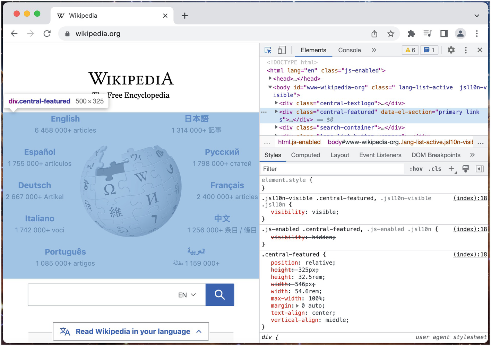

Giao diện công cụ dành cho nhà phát triển rất phức tạp và dày đặc thông tin, vì vậy nó dựa vào giao diện tab phân cấp để chia nhỏ các chế độ xem này thành các phần riêng biệt. Các tiện ích mở rộng trình duyệt có thể tăng cường giao diện công cụ dành cho nhà phát triển này bằng cách thêm các tab bổ sung. Các tab được thêm vào này giống như bất kỳ giao diện người dùng nào khác do tiện ích mở rộng kiểm soát.

### Tạo một Trang devtools

Các tiện ích mở rộng trình duyệt sử dụng một chiến lược bất thường để thêm các giao diện bổ sung vào công cụ dành cho nhà phát triển của trình duyệt. Một tiện ích mở rộng trình duyệt có tùy chọn định nghĩa thuộc tính `devtools_page` bên trong manifest. Trang HTML được tham chiếu sẽ hiển thị như một **trang không giao diện (headless page)** mỗi khi công cụ dành cho nhà phát triển của trình duyệt được mở. Trang không giao diện này có một mục đích duy nhất: nó sẽ tải và thực thi các kịch bản sử dụng Devtools API để chèn thêm các giao diện bổ sung.

Các tên gọi có thể gây nhầm lẫn, vì vậy tốt nhất là học qua ví dụ. Đây là một tiện ích mở rộng đơn giản cung cấp một trang devtools không làm gì cả:

*manifest.json:*

```json
{
  "name": "MVX",
  "version": "0.0.1",
  "manifest_version": 3,
  "devtools_page": "devtools.html"
}
```

*devtools.html:*

```html
<!DOCTYPE html>
<html>
  <body>
    <script src="devtools.js"></script>
  </body>
</html>
```

*devtools.js:*

```javascript
// Sử dụng kịch bản này để truy cập Devtools API
```

Đừng lo lắng về việc tải tiện ích mở rộng này, nó chưa làm được gì cả.

> [!NOTE]
> Trang devtools không giao diện chỉ chạy mỗi khi công cụ dành cho nhà phát triển mở ra. Điều này có nghĩa là, khi bạn thay đổi các bảng điều khiển (panels) đã thêm, chúng sẽ không hiển thị lại ngay cả khi tiện ích mở rộng được cập nhật hoặc trang được tải lại. Khi thực hiện cập nhật cho các trang devtools, bạn phải đóng và mở lại giao diện devtools hoặc tải lại các khung (frames) devtools đã được cập nhật.

### Thêm các bảng điều khiển và thanh bên (panels and sidebars)

Các tiện ích mở rộng có thể thêm hai loại giao diện vào công cụ dành cho nhà phát triển: bảng điều khiển (panels) và thanh bên (sidebars). Chúng xuất hiện ở những vị trí khác nhau bên trong công cụ dành cho nhà phát triển, nhưng mặt khác chúng hoạt động giống hệt nhau. Cả bảng điều khiển và thanh bên đều có quyền truy cập vào cùng một tập hợp con hạn chế của WebExtensions API giống như kịch bản nội dung. Ngoài ra, chúng được phép truy cập Devtools API.

> [!NOTE]
> Hầu hết các giao diện tiện ích mở rộng trình duyệt như trang popup và trang tùy chọn được tạo theo kiểu khai báo (declaratively): manifest chỉ định một đường dẫn tệp HTML làm điểm nhập (entrypoint), và trình duyệt hiểu cách diễn giải điều đó và tự động kết hợp giao diện mới. Ngược lại, các trang devtools được tạo theo kiểu lệnh (imperatively): để tạo một giao diện, bạn phải gọi các phương thức từ Devtools API và truyền vào một đường dẫn tệp HTML.

#### Thêm một Bảng điều khiển (Panel)

Để thêm một bảng điều khiển mới vào công cụ dành cho nhà phát triển, hãy sử dụng phương thức `chrome.devtools.panels.create()`. Sửa đổi ví dụ trước đó như sau:

*foo_panel.html:*

```html
<!DOCTYPE html>
<html>
  <body>
    <h1>I'm the foo panel!</h1>
  </body>
</html>
```

*devtools.js:*

```javascript
chrome.devtools.panels.create("Demo Devtools",
                              "",
                              "foo_panel.html");
```

Phương thức `create()` nhận vào một tiêu đề, một URL biểu tượng (ở đây được để trống) và một tệp HTML bảng điều khiển. Với tiện ích mở rộng này được tải, hãy đóng và mở lại công cụ dành cho nhà phát triển và nhìn vào menu bảng điều khiển của bạn. Bạn sẽ nhận thấy có một tùy chọn mới gọi là "Demo Devtools" (Hình 10-2).

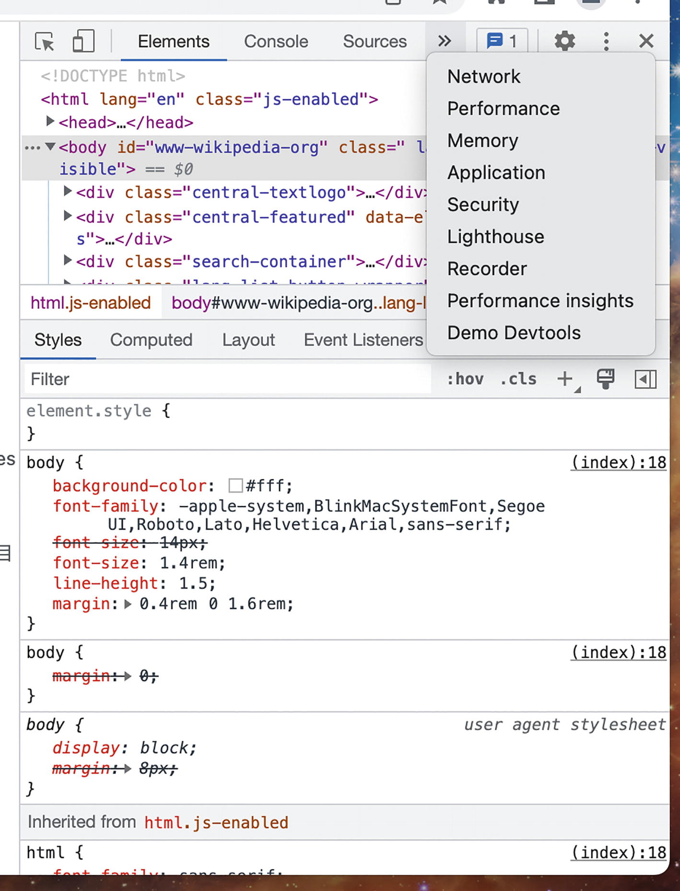

Nhấp vào tùy chọn này để hiển thị bảng điều khiển mới (Hình 10-3).

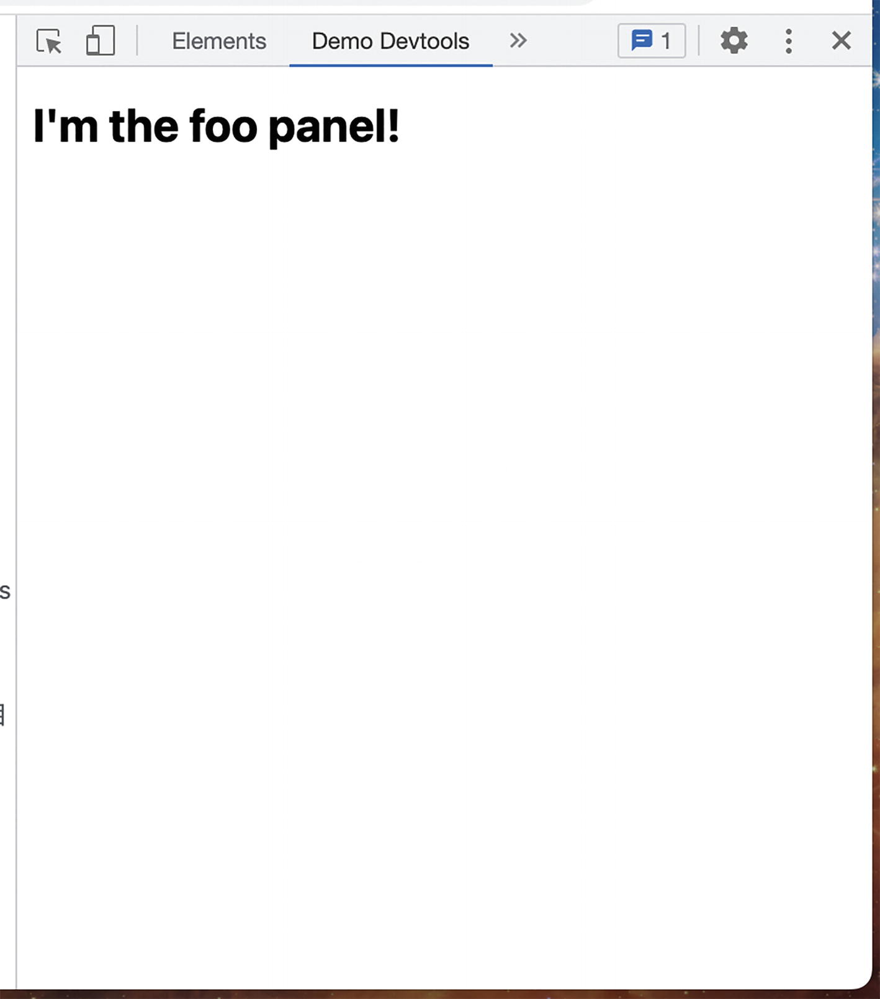

#### Thêm một Thanh bên (Sidebar)

Các thanh bên hơi khác so với các bảng điều khiển. Trong khi một bảng điều khiển là một giao diện cấp cao nhất trong công cụ dành cho nhà phát triển, thì các thanh bên là các giao diện nằm cạnh một trong số vài giao diện hiện có bên trong devtools. Hiện tại, có hai giao diện mà bạn có thể thêm thanh bên vào:

- Elements
- Sources

Việc thêm một thanh bên có phần rắc rối. Bạn phải gọi `createSidebarPane()` trên thuộc tính tương ứng cho giao diện đó: `elements` hoặc `sources`. Hàm gọi lại (callback) cho phương thức này được truyền vào ngăn thanh bên (sidebar pane) mới dưới dạng một đối số, mà bạn có thể sử dụng để thêm trang tùy chỉnh của mình thông qua phương thức `setPage()`.

Ví dụ sau đây sửa đổi tiện ích mở rộng trước đó để thay thế bằng việc thêm hai thanh bên: một cho giao diện Elements, và một cho giao diện Sources:

*devtools.js:*

```javascript
chrome.devtools.panels.sources.createSidebarPane(
  "Demo Sources Sidebar",
  (sidebar) => {
    sidebar.setPage("sources_sidebar.html");
  }
);
chrome.devtools.panels.elements.createSidebarPane(
  "Demo Elements Sidebar",
  (sidebar) => {
    sidebar.setPage("elements_sidebar.html");
  }
);
```

*elements_sidebar.html:*

```html
<!DOCTYPE html>
<html>
  <body>
    <h1>I'm the elements sidebar!</h1>
  </body>
</html>
```

*sources_sidebar.html:*

```html
<!DOCTYPE html>
<html>
  <body>
    <h1>I'm the sources sidebar!</h1>
  </body>
</html>
```

Cài đặt tiện ích mở rộng này và mở lại công cụ dành cho nhà phát triển. Trong các tab *Elements* và *Sources*, bạn sẽ thấy một tùy chọn con mới (Hình 10-4, 10-5, 10-6 và 10-7).

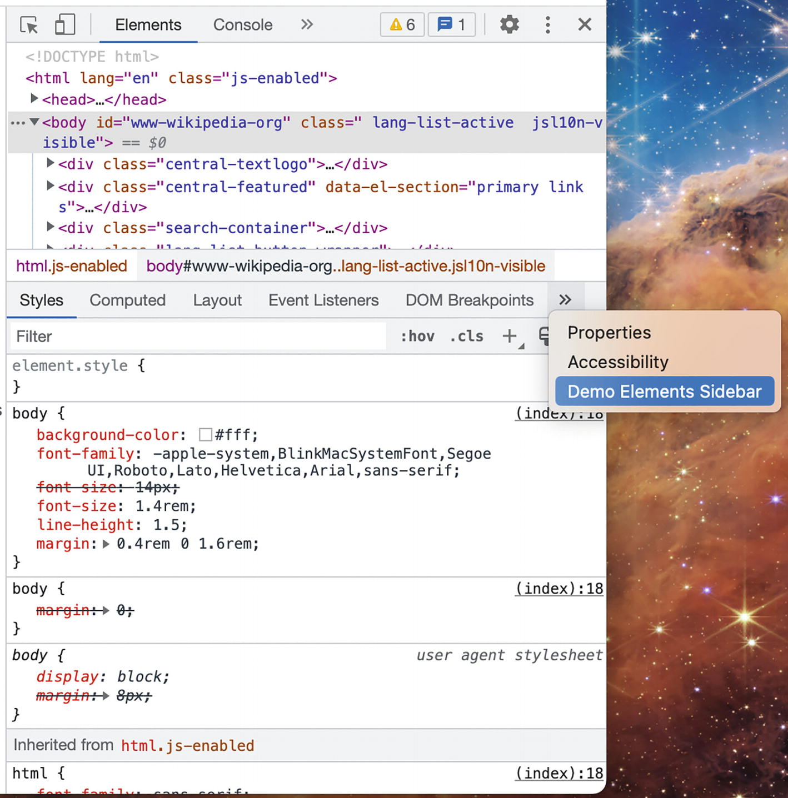
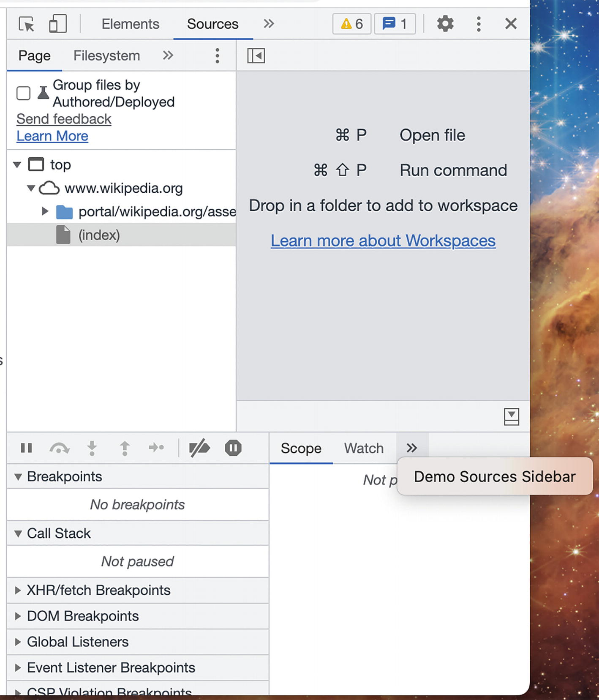
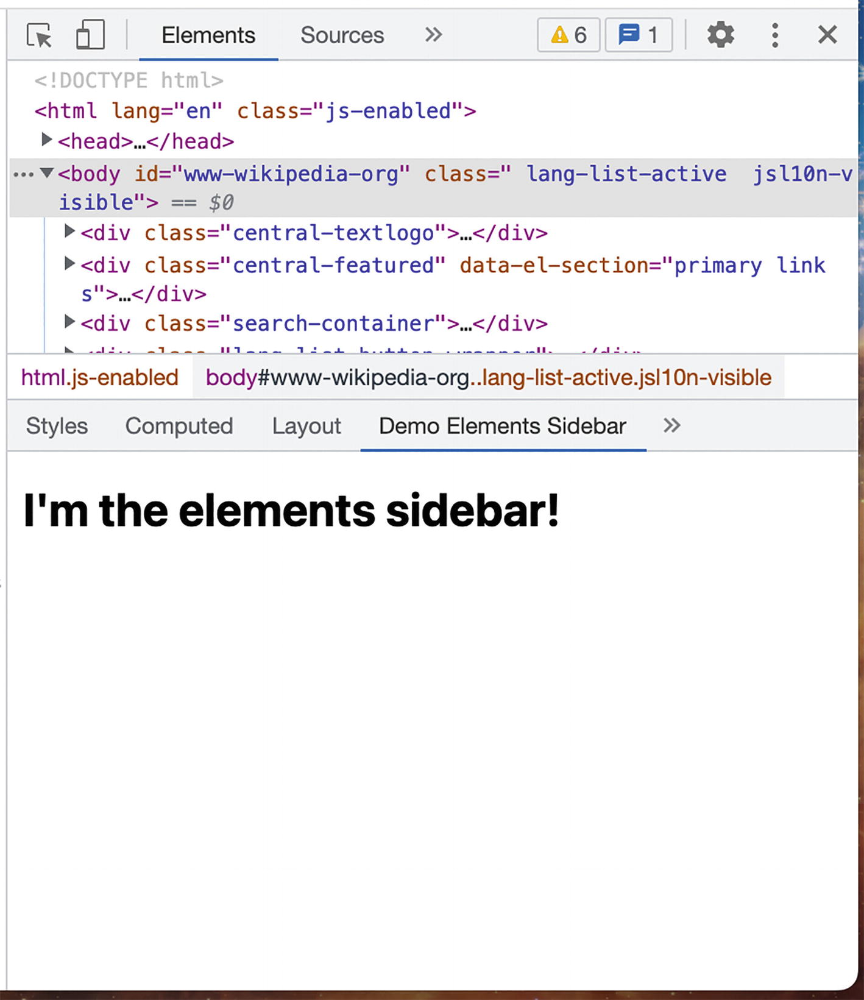
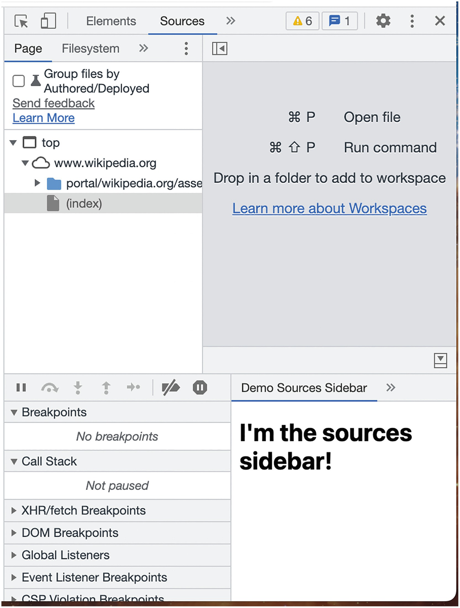

Nhấp vào các tùy chọn này để xem các giao diện thanh bên mới.

Tất nhiên, những chế độ xem này vẫn chưa làm được gì hữu ích. Trong phần tiếp theo, chúng ta sẽ đề cập đến các phương thức đặc biệt mà các chế độ xem này có thể truy cập.

> [!NOTE]
> Các chế độ xem bảng điều khiển và thanh bên sẽ hiển thị lại trang HTML mỗi khi tab được mở. Ví dụ, nếu bạn nhấp vào bảng điều khiển tùy chỉnh của mình, nhấp sang tab Elements, và nhấp ngược lại bảng điều khiển ban đầu, nó sẽ được hiển thị hai lần riêng biệt. Hãy ghi nhớ điều này nếu bạn cần bảo toàn trạng thái (state).

## Devtools API

Devtools API là một phần bổ sung cho WebExtensions API và chỉ có sẵn cho các chế độ xem tiện ích mở rộng bên trong giao diện công cụ dành cho nhà phát triển. API này bao gồm bốn không gian tên (namespaces) sau:

- `chrome.devtools.panels` được sử dụng để thêm các bảng điều khiển và thanh bên tùy chỉnh vào công cụ dành cho nhà phát triển theo lập trình. Các phương thức này thường được gọi từ trang devtools không giao diện được hiển thị khi giao diện công cụ dành cho nhà phát triển được mở.
- `chrome.devtools.network` được sử dụng để đánh hơi lưu lượng mạng trong trang này. Nó tương tự như API `webNavigation`, nhưng phiên bản devtools ghi lại lưu lượng ở **định dạng lưu trữ HTTP (HAR)**.
- `chrome.devtools.inspectedWindow` được sử dụng để kiểm tra trang web hiện tại theo những cách mà WebExtensions API thông thường không thể làm được. Nó có thể đánh giá các biểu thức JavaScript trong ngữ cảnh của trang cũng như xem danh sách các tài nguyên (như tài liệu, kịch bản hoặc hình ảnh) mà trang web hiện tại đang sử dụng.
- `chrome.devtools.recorder` được sử dụng để tùy chỉnh bảng điều khiển Recorder của công cụ dành cho nhà phát triển. Tại thời điểm cuốn sách này được viết, API này đang được xem trước và chỉ hỗ trợ xuất dữ liệu trình ghi.

> [!NOTE]
> Google Chrome và các trình duyệt dựa trên Chromium khác sẽ hỗ trợ đầy đủ Devtools API. Các trình duyệt khác như Safari và Firefox có thể không hỗ trợ đầy đủ các API này.

## Đánh hơi lưu lượng mạng (Sniffing network traffic)

Hầu hết các nhà phát triển web sẽ rất quen thuộc với bảng điều khiển Network của công cụ dành cho nhà phát triển. Bảng điều khiển này hiển thị thông tin thực tế cực kỳ chi tiết về các yêu cầu mạng đi của trang web đang hoạt động. Một tiện ích mở rộng trình duyệt có thể khai thác chính nguồn cấp dữ liệu này bằng Devtools API. API cho phép bạn truy cập một bản ghi các yêu cầu mạng đã được lưu lại, cũng như thêm các trình xử lý cho một số sự kiện trong vòng đời của yêu cầu mạng.

API sẽ cung cấp thông tin về các yêu cầu mạng theo định dạng **HTTP Archive (HAR)**. Một ví dụ rút gọn về định dạng HAR cho một yêu cầu GET đến `wikipedia.org` được hiển thị bên dưới:

*Dữ liệu HAR ví dụ cho yêu cầu GET wikipedia.org:*

```json
{
  "_initiator": {
    "type": "other"
  },
  "_priority": "VeryHigh",
  "_resourceType": "document",
  "cache": {},
  "connection": "769999",
  "pageref": "page_2",
  "request": {
    "method": "GET",
    "url": "https://www.wikipedia.org/",
    "httpVersion": "http/2.0",
    "headers": [
      {
        "name": ":method",
        "value": "GET"
      },
      {
        "name": ":path",
        "value": "/"
      },
      {
        "name": ":scheme",
        "value": "https"
      },
      ...
    ],
    "queryString": [],
    "cookies": [
      ...
    ],
    "headersSize": -1,
    "bodySize": 0
  },
  "response": {
    "status": 304,
    "statusText": "",
    "httpVersion": "http/2.0",
    "headers": [
      {
        "name": "content-encoding",
        "value": "gzip"
      },
      {
        "name": "content-type",
        "value": "text/html"
      },
      ...
    ],
    "cookies": [],
    "content": {
      "size": 75189,
      "mimeType": "text/html"
    },
    "redirectURL": "",
    "headersSize": -1,
    "bodySize": 0,
    "_transferSize": 1145,
    "_error": null
  },
  "serverIPAddress": "208.80.154.224",
  "startedDateTime": "2022-08-24T15:28:35.006Z",
  "time": 45.61999998986721,
  "timings": {
    "blocked": 3.410000022381544,
    "dns": -1,
    "ssl": -1,
    "connect": -1,
    "send": 0.2370000000000001,
    "wait": 41.07399999056011,
    "receive": 0.8989999769255519,
    "_blocked_queueing": 1.80700000223815441
  }
}
```

Đối với những nhà phát triển đã dành nhiều thời gian trong bảng điều khiển Network, bạn sẽ nhanh chóng nhận ra đây là bản kết xuất dữ liệu JSON của tất cả các thông tin được hiển thị trong bảng điều khiển đó.

Devtools API chỉ có một phương thức và hai sự kiện để bạn sử dụng, nhưng điều này là đủ để bạn có thể kiến trúc phiên bản trình kiểm tra mạng của riêng mình. Ví dụ sau đây tạo ra một bảng điều khiển mạng tùy chỉnh rất đơn giản:

*manifest.json:*

```json
{
  "name": "MVX",
  "version": "0.0.1",
  "manifest_version": 3,
  "devtools_page": "devtools.html"
}
```

*devtools.html:*

```html
<!DOCTYPE html>
<html>
  <body>
    <script src="devtools.js"></script>
  </body>
</html>
```

*devtools.js:*

```javascript
chrome.devtools.panels.create("Devtools Traffic", "", "traffic_panel.html");
```

*traffic_panel.html:*

```html
<!DOCTYPE html>
<html>
  <head>
    <script src="traffic_panel.js" defer></script>
  </head>
  <body></body>
</html>
```

*traffic_panel.js:*

```javascript
function logRequest(har) {
  document.body.innerHTML += `
  <div>
    ${har.request.method} ${har.request.url}
    (${har.response.status})
  </div>`;
}

// Gọi một lần để lấy tất cả các yêu cầu đã tích lũy
// cho đến nay. Điều này cho phép bạn điều hướng giữa các
// bảng điều khiển devtools mà không làm mất nhật ký lưu lượng.
chrome.devtools.network.getHAR((harLog) => {
  for (let har in harLog.entries) {
    logRequest(har);
  }
});

// Kích hoạt mỗi khi trang web cấp cao nhất thay đổi URL
chrome.devtools.network.onNavigated.addListener((url) => {
  document.body.innerHTML += `<hr><h1>${url}</h1><hr>`;
});

// Kích hoạt mỗi khi có bất kỳ thứ gì trong trang web
// thực hiện một yêu cầu mạng
chrome.devtools.network.onRequestFinished.addListener(
  (har) => logRequest(har));
```

Tải tiện ích mở rộng này, mở công cụ dành cho nhà phát triển và chọn bảng điều khiển "Devtools Traffic" mới. Điều hướng đến bất kỳ trang web nào và bạn sẽ thấy tất cả các yêu cầu được đổ ra bảng điều khiển này, như trong Hình 10-8.

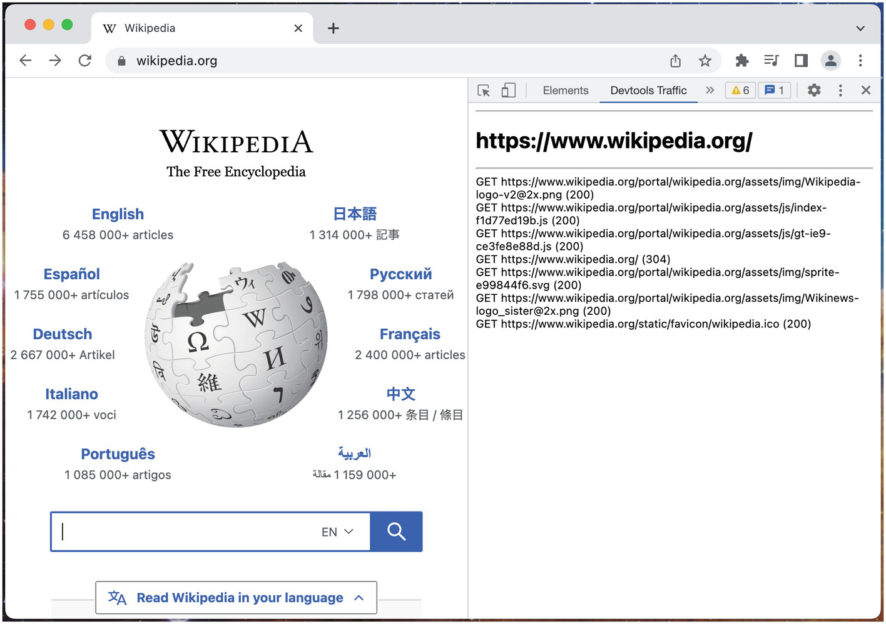

## Kiểm tra trang web (Inspecting the Page)

Devtools API cho phép bạn chạy các biểu thức JavaScript trong ngữ cảnh của trang web bằng phương thức `eval()`. Phương thức này rất giống với `scripting.executeScript()`: bạn cung cấp một đoạn mã JavaScript trong ngữ cảnh devtools địa phương, nó được truyền lên và đánh giá trong ngữ cảnh trang web từ xa, và một giá trị có thể tuần tự hóa có thể được trả về. Tuy nhiên, không giống như phương thức `scripting.executeScript()`, `eval()` cũng cung cấp quyền truy cập vào trạng thái JavaScript của trang. Ngoài ra, `eval()` sử dụng các biểu thức chuỗi, trong khi `executeScript` sử dụng một đối tượng hàm hoặc tham chiếu tệp.

Trong chương *Kịch bản nội dung (Content Scripts)*, chúng ta đã xem xét cách một kịch bản nội dung không thể truy cập trạng thái JavaScript của trang chủ với một ví dụ cho thấy kịch bản được chèn không thể thấy đối tượng `jQuery` toàn cục của trang chủ. Sử dụng Devtools API, giờ đây có thể thấy và tương tác với trạng thái JavaScript của trang chủ. Hành vi này được thể hiện trong ví dụ sau:

*manifest.json:*

```json
{
  "name": "MVX",
  "version": "0.0.1",
  "manifest_version": 3,
  "devtools_page": "devtools.html"
}
```

*devtools.html:*

```html
<!DOCTYPE html>
<html>
  <body>
    <script src="devtools.js"></script>
  </body>
</html>
```

*devtools.js:*

```javascript
chrome.devtools.panels.create("Devtools Inspector", "",
                              "inspect_panel.html");
```

*inspect_panel.html:*

```html
<!DOCTYPE html>
<html>
  <head>
    <script src="inspect_panel.js" defer></script>
  </head>
  <body>
    <button id="check">CHECK FOR JQUERY</button>
  </body>
</html>
```

*inspect_panel.js:*

```javascript
document.querySelector("#check").addEventListener("click", () => {
  chrome.devtools.inspectedWindow.eval(
    `({
      'url': window.location.href,
      'usesJquery': !!window.jQuery
    })`,
    null,
    (result) => {
      const div = document.createElement("div");
      div.innerText = `${result.url} uses jQuery: ${result.usesJquery}`;
      document.body.appendChild(div);
    }
  );
});
```

Tải tiện ích mở rộng này và mở devtools trên `jquery.com`, nơi có đối tượng toàn cục `jQuery`, và `wikipedia.org`, nơi không có (Hình 10-9). Việc nhấp vào nút trên mỗi trang web sẽ ghi lại chính xác bên trong bảng điều khiển devtools liệu trang web đó có sử dụng jQuery hay không.

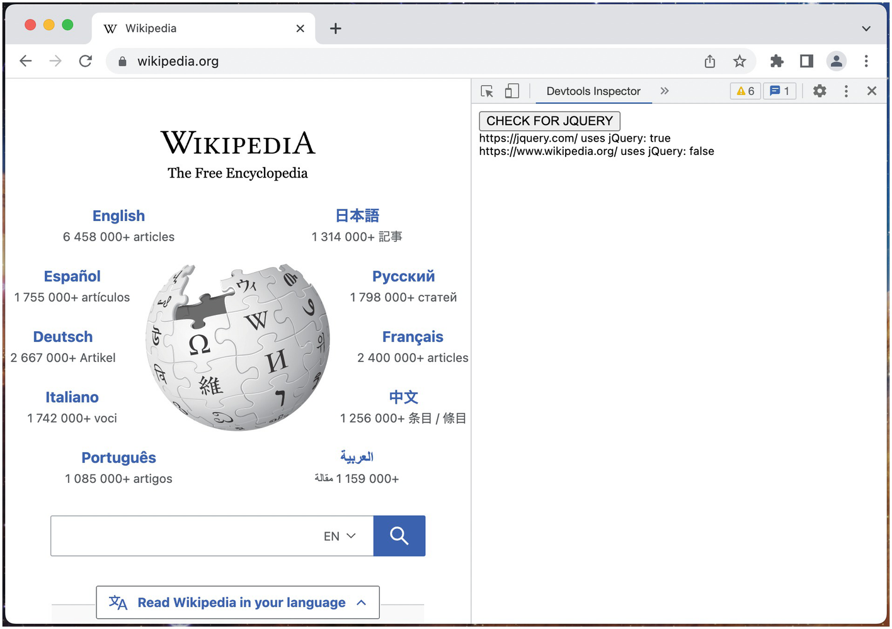

Đối với các biểu thức phức tạp, bạn có thể sử dụng một biểu thức hàm được gọi ngay lập tức (IIFE) để trả về một giá trị. Biểu thức trước đó có thể được cấu trúc lại để sử dụng IIFE:

```javascript
chrome.devtools.inspectedWindow.eval(
  `(() => {
     const url = window.location.href;
     const usesJquery = !!window.jQuery;
     return { url, usesJquery };
   })()`,
  ...
)
```

Các biểu thức JavaScript được truyền vào `eval()` cũng có quyền truy cập vào console API của trình duyệt, vì vậy các giá trị và phương thức console đặc biệt như `$0` và `inspect()` có thể được sử dụng. Những thứ này đặc biệt hữu ích khi được sử dụng trong một thanh bên mở rộng giao diện Elements vì có thể tích hợp trực tiếp với trình khám phá cây DOM của bảng điều khiển Element. Ví dụ sau đây thực hiện chính xác điều này:

*manifest.json:*

```json
{
  "name": "MVX",
  "version": "0.0.1",
  "manifest_version": 3,
  "devtools_page": "devtools.html"
}
```

*devtools.html:*

```html
<!DOCTYPE html>
<html>
  <body>
    <script src="devtools.js"></script>
  </body>
</html>
```

*devtools.js:*

```javascript
chrome.devtools.panels.elements.createSidebarPane(
  "Devtools Inspector",
  (sidebar) => {
    sidebar.setPage("inspect_panel.html");
  }
);
```

*inspect_panel.html:*

```html
<!DOCTYPE html>
<html>
  <head>
    <script src="inspect_panel.js" defer></script>
  </head>
  <body>
    <button id="inspect">INSPECT IMG</button>
    <button id="tagname">ACTIVE TAG NAME</button>
  </body>
</html>
```

*inspect_panel.js:*

```javascript
document.querySelector("#inspect").addEventListener("click", () => {
  chrome.devtools.inspectedWindow.eval(
    `inspect(document.querySelector('img'))`
  );
});

document.querySelector("#tagname").addEventListener("click", () => {
  chrome.devtools.inspectedWindow.eval(
    `$0?.tagName`,
    null,
    (result) => {
      const div = document.createElement("div");
      div.innerText = result;
      document.body.appendChild(div);
    });
});
```

Tải tiện ích mở rộng này, mở công cụ dành cho nhà phát triển, chọn tab Elements và mở thanh bên Devtools Inspector.

Trong ví dụ này, nút "INSPECT IMG" đang gọi `inspect()` trên hình ảnh đầu tiên xuất hiện trong tài liệu. Vì điều này được gọi từ một thanh bên bên trong bảng điều khiển Elements, bạn sẽ thấy điều này ngay lập tức được phản ánh trong trình kiểm tra DOM gốc của trình duyệt (Hình 10-10).

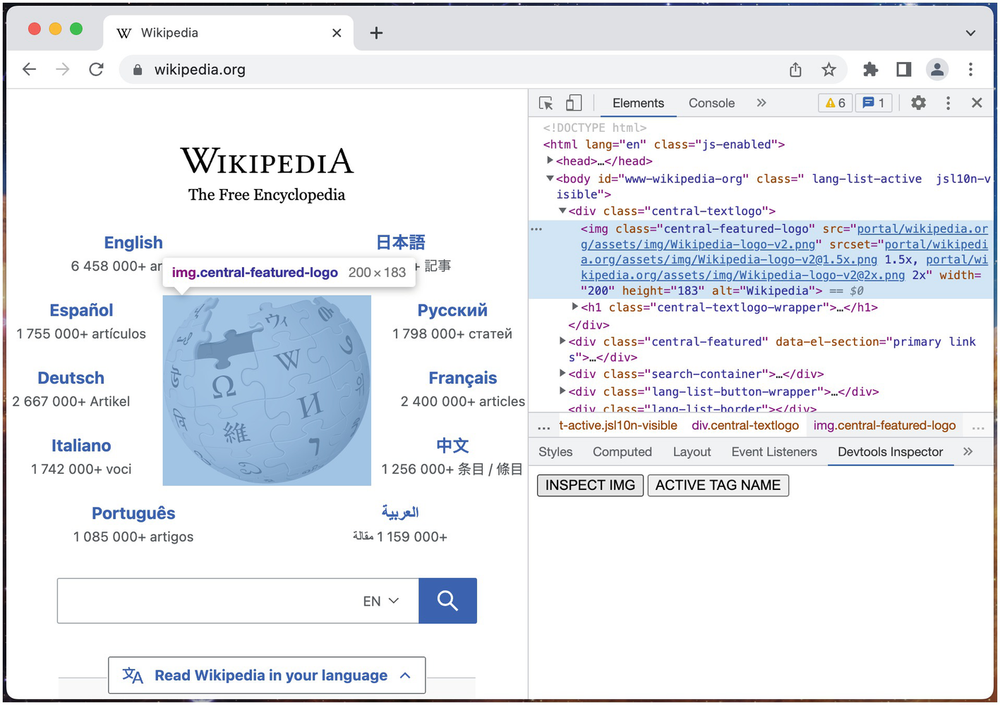

Nhấp vào nút ACTIVE TAG NAME sẽ sử dụng mã thông báo `$0` để tham chiếu đến bất kỳ nút trình kiểm tra DOM nào được kiểm tra lần cuối và in ra tên thẻ của nó (Hình 10-11).

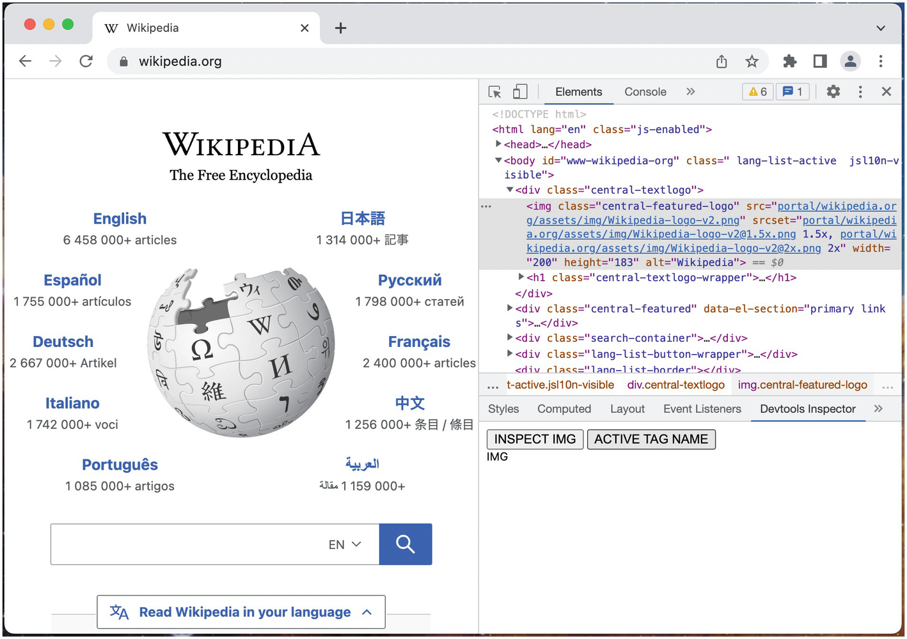

Sự tích hợp hai chiều này với trình duyệt gốc cho phép bạn xây dựng các trang devtools tinh vi có thể nhanh chóng hướng dẫn người dùng xung quanh trang web.

## Kịch bản Nội dung và Nhắn tin Devtools (Content Scripts and Devtools Messaging)

Thông thường, các trang devtools hữu ích nhất khi chúng có thể phối hợp với các kịch bản nội dung được chèn vào trang. Mỗi thành phần đều có trách nhiệm riêng: các trang devtools chịu trách nhiệm tương tác với Devtools API, các kịch bản nội dung chịu trách nhiệm quản lý các lớp phủ (overlays) trang web và các widget tương tự, và cả hai có thể phối hợp thông qua nhắn tin. Các vấn đề với chiến lược này là gấp đôi:

- Mặc dù Devtools API có thể truy cập ID tab của trang chủ thông qua `chrome.devtools.inspectedWindow.tabId`, nó không thể sử dụng `chrome.tabs.sendMessage()` để gửi một tin nhắn đến tab cụ thể đó.
- Khi gửi tin nhắn từ kịch bản nội dung đến devtools, bạn phải tính đến các tình huống có nhiều giao diện công cụ dành cho nhà phát triển được mở đồng thời. Kịch bản nội dung không có cách nào trực tiếp để gửi một tin nhắn chỉ đến bảng điều khiển devtools của trang đó.

Có một số chiến lược thông minh để giải quyết các vấn đề này:

- `runtime.sendMessage()` có thể giải quyết vấn đề trang devtools nhắn tin cho kịch bản nội dung. Trang devtools có thể bao gồm tabID, và kịch bản nội dung có thể lọc theo ID tab của trang. Kịch bản nội dung sau đó có thể phản hồi trực tiếp cho tin nhắn đó, tin nhắn này sẽ chỉ được thấy bởi devtools gốc. Để thiết lập một kênh giả hai chiều, kịch bản nội dung có thể xếp hàng các tin nhắn, và trang devtools có thể thăm dò (poll) định kỳ.
- Trang devtools thiết lập một kết nối lâu dài với trang nền. Trang nền quản lý một ánh xạ của các ID tab với các kết nối, vì vậy nó có thể định tuyến mỗi tin nhắn đến đúng kết nối.
- Trang devtools kết hợp một kịch bản được chèn với một kịch bản nội dung đóng vai trò trung gian. Sau đó, nó sử dụng `window.postMessage()` để truyền tin nhắn đến kịch bản nội dung.

> [!TIP]
> Nhóm Google Chrome có một bài viết xuất sắc về vấn đề này tại đây: [https://developer.chrome.com/docs/extensions/mv3/devtools/#solutions](https://developer.chrome.com/docs/extensions/mv3/devtools/#solutions).

## Các Tính năng khác của Devtools API

Ngoài các ví dụ được trình bày trong chương này, Devtools API còn bao gồm một số tính năng thú vị khác:

- Các trang devtools có thể đánh giá các biểu thức `eval()` dưới dạng một kịch bản nội dung của tiện ích mở rộng bằng cách sử dụng tùy chọn `useContentScriptContext`. Điều này hữu ích để trao đổi dữ liệu với kịch bản nội dung cũng như truy cập WebExtensions API trong ngữ cảnh của trang.
- Các trang devtools có thể kiểm tra những tài nguyên nào (tài liệu, bản kiểu mẫu, kịch bản, hình ảnh, v.v.) mà trang hiện đang sử dụng thông qua `chrome.devtools.inspectedWindow.getResources()`, cũng như lắng nghe các thay đổi trong các tài nguyên đó thông qua các sự kiện `onResourceAdded` và `onResourceContentCommitted`.
- Các trang devtools có thể buộc trang tải lại bằng `chrome.devtools.inspectedWindow.reload()`. Phương thức `reload()` này cũng cho phép bạn bỏ qua bộ nhớ đệm của trình duyệt, chèn các kịch bản tùy chỉnh trong lần tải tiếp theo và làm giả (spoof) tác nhân người dùng (user agent).
- Các trang devtools có thể định nghĩa một plugin để xuất dữ liệu Recorder thông qua `chrome.devtools.recorder.registerRecorderExtensionPlugin()`. Để biết thêm thông tin về bảng điều khiển Recorder, hãy xem tại đây: [https://developer.chrome.com/docs/devtools/recorder/](https://developer.chrome.com/docs/devtools/recorder/).

## Tóm tắt

Trong chương này, bạn đã tìm hiểu về cách một tiện ích mở rộng có thể mở rộng giao diện công cụ dành cho nhà phát triển gốc của trình duyệt. Chúng ta đã đi qua cách thức bất thường mà một tiện ích mở rộng chèn các giao diện người dùng vào công cụ dành cho nhà phát triển, cũng như tất cả các tính năng chính của Devtools API mà chỉ các trang devtools mới có quyền truy cập.

Trong chương tiếp theo, chúng ta sẽ đề cập đến tất cả các API WebExtensions chính và cách chúng có thể được sử dụng.
