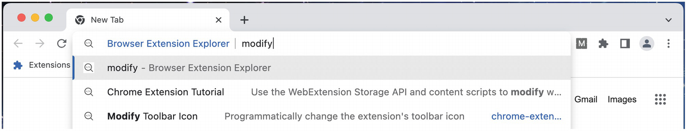
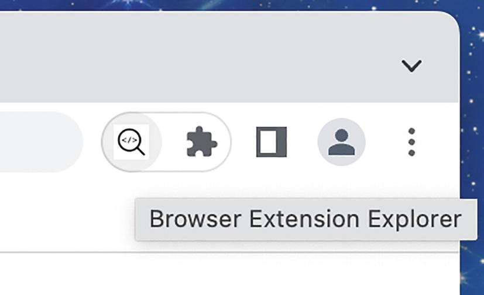
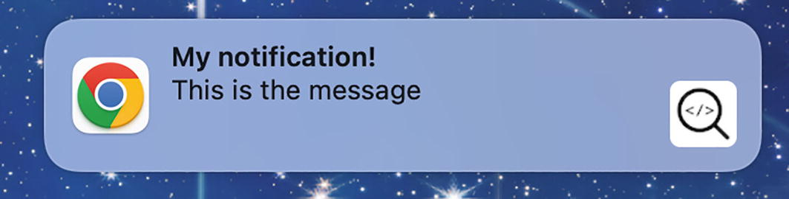
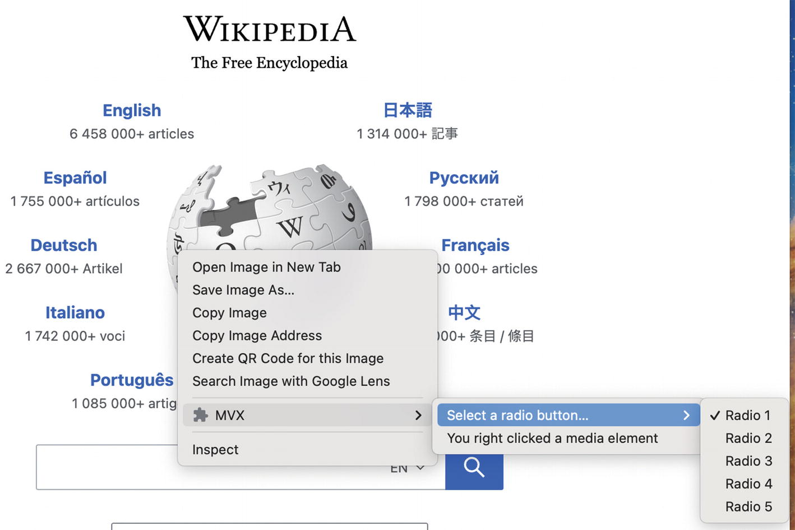

# Chương 11: Các API của Tiện ích và Trình duyệt

Các API WebExtensions là "nước sốt bí mật" của các tiện ích mở rộng trình duyệt. Chúng cho phép tiện ích tiếp cận vào trang web và trình duyệt để thực hiện các thay đổi, kiểm tra và sửa đổi lưu lượng mạng, cũng như kiểm soát các khía cạnh của giao diện người dùng gốc của trình duyệt.

## Không gian tên API Toàn cục (Global API Namespace)

Tất cả các tiện ích đều có thể được truy cập từ bên trong không gian tên API toàn cục. Chúng có sẵn thông qua không gian tên `chrome.*` hoặc không gian tên `browser.*`.

* Các trình duyệt dựa trên Chromium và Safari ưa chuộng không gian tên `chrome.*`
* Firefox ưa chuộng không gian tên `browser.*`

Tất cả các trình duyệt đều hỗ trợ không gian tên `chrome.*`, vì vậy hãy ưu tiên sử dụng nó trong tất cả các tiện ích mở rộng.

## Lời hứa so với Hàm gọi lại (Promises vs. Callbacks)

API WebExtensions được viết trước khi `async/await` trở thành một tiêu chuẩn công nghiệp. Giải pháp ban đầu của API đã sử dụng các hàm gọi lại (callbacks) để hỗ trợ thực thi mã không đồng bộ. Ví dụ, đoạn mã sau thực thi một hàm gọi lại sau khi nhận được phản hồi tin nhắn:

```javascript
chrome.runtime.sendMessage("msg", (response) => {
  console.log("Đã nhận được phản hồi!", response);
});
```

Để phù hợp với các quy ước lập trình hiện đại, hầu hết các trình duyệt đã được trang bị lại các phương thức API của họ để hỗ trợ cả hàm gọi lại và lời hứa (promises). Đoạn mã trên có thể được cấu trúc lại để sử dụng `async/await`:

```javascript
const response = await chrome.runtime.sendMessage("msg");
console.log("Đã nhận được phản hồi!", response);
```

Có một số điều cần biết khi thực hiện thay đổi này:

* Không phải tất cả các phương thức API đều được điều chỉnh để hỗ trợ lời hứa. Hãy kiểm tra tài liệu của trình duyệt để xem nó có được hỗ trợ hay không. Các hàm gọi lại sẽ luôn hoạt động.
* Đối với mỗi lần gọi phương thức, chỉ sử dụng hàm gọi lại hoặc lời hứa, tuyệt đối không dùng cả hai.
* Thư viện `webextension-polyfill` của Mozilla ([https://github.com/mozilla/webextension-polyfill](https://github.com/mozilla/webextension-polyfill)) có thể được sử dụng để tăng cường các phương thức API WebExtensions thành dạng dựa trên lời hứa, bất kể việc triển khai của trình duyệt chủ như thế nào.

## Xử lý lỗi (Error Handling)

Các lỗi ném ra từ các phương thức API WebExtensions phải được xử lý khác nhau dựa trên cách sử dụng của bạn. Nếu bạn sử dụng hàm gọi lại, khi phương thức thất bại, thuộc tính `chrome.runtime.lastError` sẽ chỉ được định nghĩa bên trong trình xử lý hàm gọi lại:

```javascript
chrome.tabs.executeScript(tabId, details, () => {
  if (chrome.runtime.lastError) {
    // Xử lý lỗi ở đây
  }
})
```

Nếu bạn sử dụng `async/await`, lỗi có thể được bắt bằng khối `.catch()` hoặc `try/catch`:

```javascript
chrome.tabs.executeScript(tabId, details).catch((e) => {
  // Xử lý lỗi ở đây
})

// hoặc

try {
  await chrome.tabs.executeScript(tabId, details);
} catch(e) {
  // Xử lý lỗi ở đây
}
```

## Các API bị hạn chế theo ngữ cảnh (Context-restricted APIs)

Không phải tất cả các API đều có thể được sử dụng ở mọi nơi:

* Một số API như `tabCapture` và `fileSystem` bị hạn chế ở lớp giao diện (foreground), nghĩa là chúng không thể được truy cập từ một service worker nền.
* API Devtools chỉ có thể được sử dụng trong ngữ cảnh devtools.

## API Sự kiện (Events API)

"API Sự kiện" đề cập đến mô hình chung về cách bạn có thể thêm các trình lắng nghe sự kiện (event listeners) vào các sự kiện được kích hoạt trong các tiện ích mở rộng trình duyệt. Hầu hết các API WebExtensions đều sử dụng định dạng này.

### Định dạng

Mỗi loại sự kiện có một giao diện để thêm, loại bỏ và kiểm tra các trình lắng nghe. Ví dụ, giao diện `chrome.runtime.onMessage` có các phương thức sau:

* `chrome.runtime.onMessage.addListener()`
* `chrome.runtime.onMessage.dispatch()`
* `chrome.runtime.onMessage.hasListener()`
* `chrome.runtime.onMessage.hasListeners()`
* `chrome.runtime.onMessage.removeListener()`

> [!WARNING]
> `dispatch()` có thể được sử dụng để ép buộc kích hoạt một sự kiện, nhưng nó không được tài liệu hóa và do đó không nên dựa vào.

Các phương thức này được chia sẻ bởi tất cả các giao diện sự kiện. `addListener()` được sử dụng để gắn một hàm xử lý (handler function) sẽ chạy khi một sự kiện được kích hoạt, còn `hasListener()`, `hasListeners()`, và `removeListener()` được sử dụng để xem và loại bỏ chính hàm đó.

Ví dụ sau đây sử dụng một số phương thức này để xử lý các lần nhấp vào nút biểu tượng trên thanh công cụ:

```json
// manifest.json
{
  "name": "MVX",
  "version": "0.0.1",
  "manifest_version": 3,
  "background": {
    "service_worker": "background.js",
    "type": "module"
  },
  "action": {},
  "permissions": []
}
```

**Ví dụ 11-1a:** manifest.json

```javascript
// background.js
let count = 0;

function handler() {
  console.log("Hàm xử lý đã thực thi!");

  if (++count > 4) {
    chrome.action.onClicked.removeListener(handler);
  }
}

// false
console.log(chrome.action.onClicked.hasListener(handler));

chrome.action.onClicked.addListener(handler);

// true
console.log(chrome.action.onClicked.hasListener(handler));
```

**Ví dụ 11-1b:** background.js

Ví dụ này thiết lập một trình lắng nghe cho các sự kiện `onClicked`, lắng nghe năm sự kiện, sau đó tự hủy đăng ký chính nó.

### Lọc sự kiện (Event Filtering)

Nếu bạn muốn giới hạn trình xử lý sự kiện trong một tên miền nhất định, bạn sẽ cần thực hiện việc lọc bên trong trình xử lý:

```javascript
chrome.webNavigation.onCommitted.addListener((event) => {
  if (!event.url.match(/^https:\/\/*.wikipedia\.org/)) {
    return;
  }

  // Xử lý sự kiện đã lọc
});
```

Thay vào đó, bạn có thể yêu cầu trình duyệt lọc các sự kiện khớp với các URL nhất định theo cách khai báo (declaratively). Việc trình duyệt tự thực hiện lọc này sẽ giúp tăng hiệu năng đáng kể. Mã ở trên có thể được cấu trúc lại như sau:

```javascript
chrome.webNavigation.onCommitted.addListener((event) => {
  // Xử lý sự kiện đã lọc
}, {
  url: [
    { hostSuffix: "wikipedia.org" }
  ]
});
```

## Tham khảo nhanh API WebExtensions

Phần này là một danh sách toàn diện các API tiện ích mở rộng. Mỗi API bao gồm một đoạn mã ngắn minh họa cách sử dụng phổ biến và các liên kết đến tài liệu đầy đủ.

> [!TIP]
> Tiện ích mở rộng đi kèm với cuốn sách này, *Browser Extension Explorer*, có các bản demo tương tác và mã nguồn cho hầu hết các API này. Tải về tại đây: [https://buildbrowserextensions.com/b2x](https://buildbrowserextensions.com/b2x)

### Quyền hạn (Permissions)

* Permissions API – Chrome Developers: [https://developer.chrome.com/docs/extensions/reference/permissions/](https://developer.chrome.com/docs/extensions/reference/permissions/)
* Permissions API – MDN: [https://developer.mozilla.org/en-US/docs/Web/API/Permissions_API](https://developer.mozilla.org/en-US/docs/Web/API/Permissions_API)

API `chrome.permissions` cho phép bạn kiểm tra các quyền hiện tại và thêm hoặc xóa các quyền. Bạn cũng có thể thêm các trình xử lý kích hoạt khi các quyền được thêm hoặc xóa.

```javascript
chrome.action.onClicked.addListener(async () => {
  // Chỉ có thể yêu cầu quyền sau hành động của người dùng
  const permissionsGranted = await chrome.permissions.request({
    permissions: ['tabs']
  });
});

const hasPermissions = await chrome.permissions.contains({
  permissions: ['tabs']
});
```

### Nhắn tin (Messaging)

* Chrome Messaging Overview – Chrome Developers: [https://developer.chrome.com/docs/extensions/mv3/messaging/](https://developer.chrome.com/docs/extensions/mv3/messaging/)
* runtime API – Chrome Developers: [https://developer.chrome.com/docs/extensions/reference/runtime/](https://developer.chrome.com/docs/extensions/reference/runtime/)
* runtime API – MDN: [https://developer.mozilla.org/en-US/docs/Mozilla/Add-ons/WebExtensions/API/runtime/](https://developer.mozilla.org/en-US/docs/Mozilla/Add-ons/WebExtensions/API/runtime/)
* tabs API – Chrome Developers: [https://developer.chrome.com/docs/extensions/reference/tabs/](https://developer.chrome.com/docs/extensions/reference/tabs/)
* tabs API – MDN: [https://developer.mozilla.org/en-US/docs/Mozilla/Add-ons/WebExtensions/API/tabs/](https://developer.mozilla.org/en-US/docs/Mozilla/Add-ons/WebExtensions/API/tabs/)

API nhắn tin của tiện ích mở rộng được sử dụng để gửi tin nhắn giữa các phần của tiện ích, hoặc giữa tiện ích và một thực thể bên ngoài (chẳng hạn như một tiện ích khác, trang web đang hoạt động, hoặc một chương trình bên ngoài).

#### Tin nhắn một lần (One-off Messages)

Phương thức `chrome.runtime.sendMessage()` có thể được sử dụng để gửi các tin nhắn đơn lẻ giữa các thành phần của tiện ích mở rộng. Nó chỉ có thể được sử dụng để gửi tin nhắn *từ* một kịch bản nội dung (content script). Các trình lắng nghe có thể gửi lại một tin nhắn bên trong trình xử lý tin nhắn.

```javascript
// Bên gửi
chrome.runtime.sendMessage(msg, (response) => {
  // Xử lý phản hồi
});

// Bên nhận
chrome.runtime.onMessage.addListener((msg, sender, sendResponse) => {
  // Xử lý tin nhắn ban đầu từ bên gửi
  sendResponse(responseMsg);
});
```

Để gửi tin nhắn một lần đến một kịch bản nội dung cụ thể, thay vào đó bạn phải sử dụng `chrome.tabs.sendMessage()` và chỉ định `tabId`:

```javascript
// Bên gửi
chrome.tabs.sendMessage(tabId, msg, (response) => {
  // Xử lý phản hồi
});

// Bên nhận (kịch bản nội dung)
chrome.runtime.onMessage.addListener((msg, sender, sendResponse) => {
  // Xử lý tin nhắn ban đầu từ bên gửi
  sendResponse(responseMsg);
});
```

#### Mở các cổng thông điệp (Opening Message Ports)

Các cổng thông điệp (message ports) liên tục có thể được mở để kết nối hai thành phần tiện ích sẽ gửi một khối lượng lớn tin nhắn qua lại. Nó chỉ có thể được sử dụng để kết nối một cổng *từ* một kịch bản nội dung.

```javascript
// Điểm cuối 1
const port1 = chrome.runtime.connect({name: "portName"});
// Gửi đi
port1.postMessage(msg);
// Nhận về
port1.onMessage.addListener((msg) => {});

// Điểm cuối 2
let port2 = null;
chrome.runtime.onConnect.addListener((p) => {
  port2 = p;
});
// Gửi đi
port2.postMessage(msg);
// Nhận về
port2.onMessage.addListener((msg) => {});
```

Để kết nối một cổng đến một kịch bản nội dung cụ thể, thay vào đó bạn phải sử dụng `chrome.tabs.connect()` và chỉ định `tabId`:

```javascript
// Điểm cuối 1
const port1 = chrome.tabs.connect(tabId, {name: "portName"});
// Gửi đi
port1.postMessage(msg);
// Nhận về
port1.onMessage.addListener((msg) => {});

// Điểm cuối 2 (kịch bản nội dung)
let port2 = null;
chrome.runtime.onConnect.addListener((p) => {
  port2 = p;
});
// Gửi đi
port2.postMessage(msg);
// Nhận về
port2.onMessage.addListener((msg) => {});
```

#### Nhắn tin cho các ứng dụng gốc (Messaging Native Applications)

Các tiện ích mở rộng có thể trao đổi tin nhắn với các ứng dụng gốc. Nếu tên của ứng dụng gốc đã được biết (ví dụ: `com.my_company.my_application`), tiện ích có thể nhắm mục tiêu nó theo cách tương tự như kịch bản nội dung:

```javascript
chrome.runtime.sendNativeMessage(applicationName, msg, (response) => {});

chrome.tabs.connectNative(applicationName, {name: "portName"});
```

Một ví dụ về điều này được trình bày trong chương *Cross-Browser Extensions*. Các tiện ích mở rộng Safari sử dụng nhắn tin gốc để kết nối tiện ích với ứng dụng iOS hoặc macOS gốc.

#### Nhắn tin cho các tiện ích mở rộng khác (Messaging Other Extensions)

Để gửi một tin nhắn một lần cho một tiện ích mở rộng khác, bạn có thể truyền ID của tiện ích đó vào `chrome.runtime.sendMessage()`:

```javascript
// Bên gửi
chrome.runtime.sendMessage(extensionId, msg, (response) => {
  // Xử lý phản hồi
});

// Bên nhận (tiện ích mở rộng bên ngoài)
chrome.runtime.onMessageExternal.addListener((msg, sender, sendResponse) => {
  // Xử lý tin nhắn ban đầu từ bên gửi
  sendResponse(responseMsg);
});
```

Để kết nối một cổng đến một tiện ích mở rộng khác, bạn có thể sử dụng `chrome.runtime.connect()` và chỉ định `extensionId`:

```javascript
// Tiện ích 1
const port1 = chrome.runtime.connect(extensionId, {name: "portName"});
// Gửi đi
port1.postMessage(msg);
// Nhận về
port1.onMessage.addListener((msg) => {});

// Tiện ích 2
let port2 = null;
chrome.runtime.onConnectExternal.addListener((p) => {
  port2 = p;
});
// Gửi đi
port2.postMessage(msg);
// Nhận về
port2.onMessage.addListener((msg) => {});
```

Phương thức này cũng cho phép các trang web thông thường (không phải kịch bản nội dung) gửi tin nhắn đến tiện ích của bạn theo cách tương tự. API được hiển thị trong môi trường JavaScript của trang web, và tiện ích của bạn có thể nhận tin nhắn nếu các điều kiện sau đây là đúng:

* Trang chủ biết ID tiện ích của bạn và truyền nó vào `runtime.connect()` hoặc `runtime.sendMessage()`
* Tiện ích của bạn đưa URL trang web vào danh sách cho phép (whitelist) dưới trường `externally_connectable` trong manifest.

### Lưu trữ (Storage)

* storage API – Chrome Developers: [https://developer.chrome.com/docs/extensions/reference/storage/](https://developer.chrome.com/docs/extensions/reference/storage/)
* storage API – MDN: [https://developer.mozilla.org/en-US/docs/Mozilla/Add-ons/WebExtensions/API/storage](https://developer.mozilla.org/en-US/docs/Mozilla/Add-ons/WebExtensions/API/storage)

API lưu trữ của tiện ích mở rộng là một bộ lưu trữ khóa/giá trị đơn giản nhưng mạnh mẽ. Có bốn tùy chọn lưu trữ chính mà bạn có thể sử dụng:

* `storage.local` lưu trữ các giá trị chỉ trên trình duyệt cục bộ
* `storage.sync` lưu trữ các giá trị được chia sẻ giữa các phiên trình duyệt đã xác thực
* `storage.session` lưu trữ các giá trị trong bộ nhớ sẽ bị hủy khi trình duyệt đóng lại
* `storage.managed` là một bộ lưu trữ chỉ đọc dành cho người dùng doanh nghiệp

`local`, `sync`, và `session` đều chia sẻ những đặc điểm sau:

* Chỉ với quyền `storage`, kích thước lưu trữ tối đa mặc định cho mỗi loại là 5 MB. Giới hạn này có thể được loại bỏ với quyền `unlimitedStorage` bổ sung.
* Mỗi loại chỉ có phương thức `get()` và `set()`. Các phương thức này là không đồng bộ, và cả hai đều có thể đọc và viết song song.
* Bạn có thể lắng nghe các thay đổi đối với mỗi loại bằng cách thiết lập một trình xử lý `onChanged`.
* Các đối tượng JavaScript thuần túy có thể được lưu trữ và truy xuất nguyên trạng, không cần phải tuần tự hóa/giải tuần tự hóa (serialize/deserialize).

Ví dụ sau đây minh họa trình xử lý `get/set` song song và `onChanged`:

```javascript
chrome.storage.onChanged.addListener(console.log);

await chrome.storage.local.set({ foo: "tmp" });
// { foo: { newValue "tmp" } }

await chrome.storage.local.set({ foo: "bar", baz: "qux" });
// {
//   foo: { oldValue: "tmp", newValue "bar" }
//   baz: { newValue "qux" }
// }

console.log(await chrome.storage.local.get(["foo", "baz"]));
// { foo: "bar", baz: "qux" }
```

### Xác thực (Authentication)

* identity API – Chrome Developers: [https://developer.chrome.com/docs/extensions/reference/identity/](https://developer.chrome.com/docs/extensions/reference/identity/)
* identity API – MDN: [https://developer.mozilla.org/en-US/docs/Mozilla/Add-ons/WebExtensions/API/identity](https://developer.mozilla.org/en-US/docs/Mozilla/Add-ons/WebExtensions/API/identity)

API `chrome.identity` được sử dụng để quản lý trạng thái xác thực và các luồng OAuth. Google Chrome hỗ trợ các phương thức bổ sung cho phép xác thực gốc bên trong trình duyệt. Tất cả các trình duyệt đều hỗ trợ việc sử dụng `launchWebAuthFlow` cho các luồng OAuth chung.

```javascript
// OAuth gốc của trình duyệt
chrome.identity.getAuthToken(
  { interactive: true },
  async (token) => {
    if (token) {
      const info = await chrome.identity.getProfileUserInfo(
        { accountStatus: "ANY" }
      );
    }
  }
);

// Hỗ trợ OAuth chung
chrome.identity.launchWebAuthFlow(
  {
    url: authUrl,
    interactive: true,
  },
  (redirectUrl) => {
    if (redirectUrl) {
    }
  }
);
```

> [!NOTE]
> API này được trình bày chuyên sâu trong chương *Networking*.

### Yêu cầu mạng (Network Requests)

* declarativeNetRequest API – Chrome Developers: [https://developer.chrome.com/docs/extensions/reference/declarativeNetRequest/](https://developer.chrome.com/docs/extensions/reference/declarativeNetRequest/)
* webRequest API – Chrome Developers: [https://developer.chrome.com/docs/extensions/reference/webRequest/](https://developer.chrome.com/docs/extensions/reference/webRequest/)
* webRequest API – MDN: [https://developer.mozilla.org/en-US/docs/Mozilla/Add-ons/WebExtensions/API/webRequest](https://developer.mozilla.org/en-US/docs/Mozilla/Add-ons/WebExtensions/API/webRequest)
* webNavigation API – Chrome Developers: [https://developer.chrome.com/docs/extensions/reference/webNavigation/](https://developer.chrome.com/docs/extensions/reference/webNavigation/)
* webNavigation API – MDN: [https://developer.mozilla.org/en-US/docs/Mozilla/Add-ons/WebExtensions/API/webNavigation](https://developer.mozilla.org/en-US/docs/Mozilla/Add-ons/WebExtensions/API/webNavigation)

Các API yêu cầu mạng bao gồm `declarativeNetRequest`, `webRequest`, và `webNavigation`:

* `declarativeNetRequest` (DNR) được sử dụng để hướng dẫn trình duyệt quản lý lưu lượng trang một cách khai báo theo một tập hợp các quy tắc do tiện ích xác định.
* `webRequest` được sử dụng để kiểm soát lưu lượng trang một cách bắt buộc (imperatively) bằng các trình xử lý JavaScript.
* `webNavigation` được sử dụng để kiểm tra các sự kiện điều hướng cấp thẻ (tab-level).

```javascript
// Sử dụng DNR để chặn lưu lượng đến wikipedia.org
chrome.declarativeNetRequest.updateDynamicRules({
  addRules: [{
    id: 1,
    priority: 1,
    action: {
      type: "block"
    },
    condition: {
      urlFilter: "https://www.wikipedia.org",
    },
  }]
});

// Sử dụng webRequest để chặn lưu lượng đến wikipedia.org
chrome.webRequest.onBeforeRequest.addListener(
  (details) => {
    return {
      cancel: true
    };
  },
  { urls: ["*://www.wikipedia.org/*"] },
  ["blocking"]
);

// Ghi nhật ký tất cả lưu lượng thẻ với webNavigation
chrome.webNavigation.onCompleted.addListener((details) => {
  console.log(details.url);
});
```

> [!NOTE]
> Các API này được trình bày chuyên sâu trong chương *Networking*.

### Quốc tế hóa (Internationalization)

* i18n API – Chrome Developers: [https://developer.chrome.com/docs/extensions/reference/i18n/](https://developer.chrome.com/docs/extensions/reference/i18n/)
* i18n API – MDN: [https://developer.mozilla.org/en-US/docs/Mozilla/Add-ons/WebExtensions/API/i18n](https://developer.mozilla.org/en-US/docs/Mozilla/Add-ons/WebExtensions/API/i18n)

API `chrome.i18n` cho phép bạn xác định ngôn ngữ hệ thống cũng như đọc các thông điệp từ các tệp `_locales/_mã_ngôn_ngữ_/messages.json` của bạn. Ví dụ sau đây đọc ngôn ngữ giao diện hệ thống đang hoạt động và truy xuất một thông điệp từ ngôn ngữ đó:

```javascript
chrome.i18n.getUILanguage();

chrome.i18n.getMessage("foo_message");
```

## Kiểm soát Trình duyệt và Hệ thống

### Năng lượng (Power)

* power API – Chrome Developers: [https://developer.chrome.com/docs/extensions/reference/power/](https://developer.chrome.com/docs/extensions/reference/power/)

API `chrome.power` cho phép một tiện ích mở rộng ghi đè các tính năng quản lý năng lượng của hệ điều hành máy chủ. Tiện ích có thể yêu cầu hệ thống luôn thức tỉnh (nhắm vào toàn bộ hệ thống hoặc chỉ màn hình) hoặc dỡ bỏ yêu cầu đó.

```javascript
// Giữ màn hình luôn sáng
chrome.power.requestKeepAwake("display");

// Giải phóng yêu cầu
chrome.power.releaseKeepAwake();
```

### Cửa sổ tìm kiếm (Omnibox)

* omnibox API – Chrome Developers: [https://developer.chrome.com/docs/extensions/reference/omnibox/](https://developer.chrome.com/docs/extensions/reference/omnibox/)
* omnibox API – MDN: [https://developer.mozilla.org/en-US/docs/Mozilla/Add-ons/WebExtensions/API/omnibox](https://developer.mozilla.org/en-US/docs/Mozilla/Add-ons/WebExtensions/API/omnibox)

API `chrome.omnibox` cho phép tiện ích của bạn xử lý dữ liệu nhập từ thanh địa chỉ của trình duyệt. Sau khi người dùng bắt đầu một từ khóa đặc biệt để kích hoạt tiện ích (được định nghĩa trong trường `omnibox.keyword` của manifest), trình duyệt sẽ gửi cho tiện ích dữ liệu nhập hiện tại khi nó được gõ cũng như khi phím "Enter" được nhấn.


**Hình 11-1:** Omnibox của Wikipedia Explorer hoạt động

```javascript
chrome.omnibox.onInputChanged.addListener(
  (text, suggest) => {
    // Trả về danh sách gợi ý cho người dùng
    suggest([
      { content: "foo", description: "Mô tả foo" }
    ]);
  }
);

chrome.omnibox.onInputEntered.addListener(
  (text) => {
    // Thực hiện hành động sau khi nhấn 'Enter'
  }
);
```

### Hành động (Action)

* action API – Chrome Developers: [https://developer.chrome.com/docs/extensions/reference/action/](https://developer.chrome.com/docs/extensions/reference/action/)
* browserAction API – MDN: [https://developer.mozilla.org/en-US/docs/Mozilla/Add-ons/WebExtensions/API/browserAction](https://developer.mozilla.org/en-US/docs/Mozilla/Add-ons/WebExtensions/API/browserAction)
* pageAction API – MDN: [https://developer.mozilla.org/en-US/docs/Mozilla/Add-ons/WebExtensions/API/pageAction](https://developer.mozilla.org/en-US/docs/Mozilla/Add-ons/WebExtensions/API/pageAction)

API `chrome.action` (tiền thân là `browserAction` và `pageAction`) được sử dụng để kiểm soát giao diện và hành vi của biểu tượng thanh công cụ của tiện ích. Nó có thể được sử dụng để điều khiển biểu tượng, huy hiệu (badge), chú thích (tooltip) và cửa sổ bật lên (popup).


**Hình 11-2:** Action API hỗ trợ biểu tượng, huy hiệu và cửa sổ bật lên

```javascript
chrome.action.onClicked.addListener(() => {
  // Thực thi khi nút biểu tượng được nhấp
});

chrome.action.setTitle({ title: "Tiêu đề mới" });

chrome.action.setBadgeText({ text: "HV" });

chrome.action.setPopup({ popup: "popup.html" });
```

> [!NOTE]
> API này được trình bày chuyên sâu trong chương *Extension User Interfaces*.

### Thông báo (Notifications)

* notifications API – Chrome Developers: [https://developer.chrome.com/docs/extensions/reference/notifications/](https://developer.chrome.com/docs/extensions/reference/notifications/)
* notifications API – MDN: [https://developer.mozilla.org/en-US/docs/Mozilla/Add-ons/WebExtensions/API/notifications](https://developer.mozilla.org/en-US/docs/Mozilla/Add-ons/WebExtensions/API/notifications)

API `chrome.notifications` cho phép một tiện ích mở rộng tạo ra và hiển thị các thông báo hệ thống phong phú cho người dùng.


**Hình 11-3:** Một thông báo hệ thống phong phú của tiện ích Google Drive

```javascript
chrome.notifications.create({
  type: "basic",
  iconUrl: "icon.png",
  title: "Wikipedia Explorer",
  message: "Bài viết đã được lưu!",
  buttons: [{ title: "Mở" }],
  priority: 0
});
```

### Menu ngữ cảnh (Context Menus)

* contextMenus API – Chrome Developers: [https://developer.chrome.com/docs/extensions/reference/contextMenus/](https://developer.chrome.com/docs/extensions/reference/contextMenus/)
* contextMenus API – MDN: [https://developer.mozilla.org/en-US/docs/Mozilla/Add-ons/WebExtensions/API/contextMenus](https://developer.mozilla.org/en-US/docs/Mozilla/Add-ons/WebExtensions/API/contextMenus)

API `chrome.contextMenus` cho phép tiện ích mở rộng thêm các mục mới vào trình đơn chuột phải (menu ngữ cảnh) của trình duyệt. Tiện ích có thể chỉ định khi nào các mục này sẽ xuất hiện (ví dụ: chỉ trên các siêu liên kết, hoặc chỉ khi văn bản được chọn).


**Hình 11-4:** Tiện ích mở rộng Google Translate sử dụng menu ngữ cảnh

```javascript
chrome.contextMenus.create({
  id: "wikipedia-explorer-id",
  title: "Tìm kiếm Wikipedia cho '%s'",
  contexts: ["selection"]
});

chrome.contextMenus.onClicked.addListener((info, tab) => {
  if (info.menuItemId === "wikipedia-explorer-id") {
    // Thực hiện tìm kiếm với info.selectionText
  }
});
```

## Chụp trang và màn hình

* pageCapture API – Chrome Developers: [https://developer.chrome.com/docs/extensions/reference/pageCapture/](https://developer.chrome.com/docs/extensions/reference/pageCapture/)
* pageCapture API – MDN: [https://developer.mozilla.org/en-US/docs/Mozilla/Add-ons/WebExtensions/API/pageCapture](https://developer.mozilla.org/en-US/docs/Mozilla/Add-ons/WebExtensions/API/pageCapture)
* tabCapture API – Chrome Developers: [https://developer.chrome.com/docs/extensions/reference/tabCapture/](https://developer.chrome.com/docs/extensions/reference/tabCapture/)
* desktopCapture API – Chrome Developers: [https://developer.chrome.com/docs/extensions/reference/desktopCapture/](https://developer.chrome.com/docs/extensions/reference/desktopCapture/)
* desktopCapture API – MDN: [https://developer.mozilla.org/en-US/docs/Mozilla/Add-ons/WebExtensions/API/desktopCapture](https://developer.mozilla.org/en-US/docs/Mozilla/Add-ons/WebExtensions/API/desktopCapture)

Có bốn API riêng biệt có khả năng chụp nội dung của trang hoặc màn hình của người dùng.

* `pageCapture` cho phép một tiện ích lưu một thẻ dưới dạng MHTML.
* `tabCapture` cho phép một tiện ích chụp luồng video/âm thanh của một thẻ đang hoạt động. Nó chỉ có thể được sử dụng sau hành động của người dùng (ví dụ: nhấp vào biểu tượng) và chỉ có thể được sử dụng bởi các thành phần diện (foreground).
* `desktopCapture` cho phép một tiện ích chụp nội dung của toàn bộ màn hình, một cửa sổ riêng biệt hoặc một thẻ riêng biệt.
* `tabs.captureVisibleTab` là một phương thức chụp ảnh màn hình đơn giản của thẻ đang hoạt động.

```javascript
// Lưu thẻ dưới dạng MHTML
chrome.pageCapture.saveAsMHTML({ tabId: 123 }, (mhtml) => {});

// Chụp luồng của thẻ đang hoạt động
chrome.tabCapture.capture({ audio: true, video: true }, (stream) => {});

// Chọn nội dung màn hình để chụp
chrome.desktopCapture.chooseDesktopMedia(["screen", "window", "tab"], (id) => {});

// Chụp ảnh màn hình thẻ đang hoạt động
chrome.tabs.captureVisibleTab((dataUrl) => {});
```

## Proxy

* proxy API – Chrome Developers: [https://developer.chrome.com/docs/extensions/reference/proxy/](https://developer.chrome.com/docs/extensions/reference/proxy/)
* proxy API – MDN: [https://developer.mozilla.org/en-US/docs/Mozilla/Add-ons/WebExtensions/API/proxy](https://developer.mozilla.org/en-US/docs/Mozilla/Add-ons/WebExtensions/API/proxy)

Sử dụng API `chrome.proxy` để quản lý các thiết lập proxy của trình duyệt.

> [!NOTE]
> Theo MDN: *Google Chrome cung cấp một API tiện ích cũng được gọi là "proxy" có chức năng tương tự như API này, trong đó các tiện ích có thể sử dụng nó để triển khai chính sách proxy. Tuy nhiên, thiết kế của API Chrome hoàn toàn khác với API này. Vì API này không tương thích với API proxy của Chrome, nên API này chỉ có sẵn thông qua không gian tên browser.*

```javascript
chrome.proxy.settings.set(
  {
    value: {
      mode: "fixed_servers",
      rules: {
        proxyForHttp: {
          scheme: "socks5",
          host: "192.168.1.2",
        },
        bypassList: ["wikipedia.org"],
      },
    },
    scope: "regular",
  },
  () => {}
);
```

## Quản lý trạng thái Trình duyệt

API WebExtensions cung cấp cho bạn một bộ công cụ rộng lớn để quản lý trạng thái của trình duyệt của người dùng.

### Thiết lập Phông chữ (Font Settings)

* fontSettings API – Chrome Developers: [https://developer.chrome.com/docs/extensions/reference/fontSettings/](https://developer.chrome.com/docs/extensions/reference/fontSettings/)

API này cho phép tiện ích quản lý một số thiết lập phông chữ dựa trên các họ phông chữ chung (generic font families) và các loại chữ viết ngôn ngữ (language scripts).

```javascript
chrome.fontSettings.getFont(
  { genericFamily: 'standard', script: 'Egyp' },
  (details) => {}
);

chrome.fontSettings.setFont(
  { genericFamily: 'serif', script: 'Jpan',
    fontId: 'Comic Sans' }
);
```

### Thiết lập Nội dung (Content Settings)

* contentSettings API – Chrome Developers: [https://developer.chrome.com/docs/extensions/reference/contentSettings/](https://developer.chrome.com/docs/extensions/reference/contentSettings/)

API này cho phép bạn tùy chỉnh hành vi của trình duyệt trên cơ sở từng trang web thay vì trên toàn cầu: bật hoặc tắt cookie, JavaScript và các plugin. Mỗi thuộc tính sau đây đều có các phương thức `get()`, `set()` và `clear()`:

* `automaticDownloads`
* `camera`
* `cookies`
* `fullscreen`
* `images`
* `javascript`
* `location`
* `microphone`
* `mouselock`
* `notifications`
* `plugins`
* `popups`
* `unsandboxedPlugins`

### Cookies

* cookies API – Chrome Developers: [https://developer.chrome.com/docs/extensions/reference/cookies/](https://developer.chrome.com/docs/extensions/reference/cookies/)
* cookies API – MDN: [https://developer.mozilla.org/en-US/docs/Mozilla/Add-ons/WebExtensions/API/cookies](https://developer.mozilla.org/en-US/docs/Mozilla/Add-ons/WebExtensions/API/cookies)

API `chrome.cookies` là một giao diện tạo/đọc/cập nhật/xóa (CRUD) cho các cookie của trình duyệt.

```javascript
const cookies = await chrome.cookies.getAll();

chrome.cookies.set({
    "name": "foo",
    "url": "https://www.wikipedia.org",
    "value": "bar"
});

chrome.cookies.remove({
    "name": "foo",
    "url": "https://www.wikipedia.org"
});

chrome.cookies.onChanged.addListener(() => {});
```

### Dấu trang (Bookmarks)

* bookmarks API – Chrome Developers: [https://developer.chrome.com/docs/extensions/reference/bookmarks/](https://developer.chrome.com/docs/extensions/reference/bookmarks/)
* bookmarks API – MDN: [https://developer.mozilla.org/en-US/docs/Mozilla/Add-ons/WebExtensions/API/bookmarks](https://developer.mozilla.org/en-US/docs/Mozilla/Add-ons/WebExtensions/API/bookmarks)

API `chrome.bookmarks` là một giao diện CRUD cho các dấu trang của trình duyệt. Nó bao gồm các phương thức để quản lý cấu trúc phân cấp của các dấu trang.

```javascript
chrome.bookmarks.create(
  {'title': 'Wikipedia', 'url': 'https://www.wikipedia.org'}
);

const allBookmarks = await chrome.bookmarks.getTree();

const matchingNodes =
  await chrome.bookmarks.search({ query: 'wikipedia' });
```

### Lịch sử (History)

* history API – Chrome Developers: [https://developer.chrome.com/docs/extensions/reference/history/](https://developer.chrome.com/docs/extensions/reference/history/)
* history API – MDN: [https://developer.mozilla.org/en-US/docs/Mozilla/Add-ons/WebExtensions/API/history](https://developer.mozilla.org/en-US/docs/Mozilla/Add-ons/WebExtensions/API/history)

API `chrome.history` là một giao diện CRUD cho lịch sử duyệt web của trình duyệt.

```javascript
chrome.history.deleteAll();

const allPages = await chrome.history.search();

// Các trang Wikipedia trong 30 phút qua
const pages = await chrome.history.search({
  text: 'wikipedia',
  startTime: Date.now() - (30 * 60 * 1E3)
});
```

### Tải về (Downloads)

* downloads API – Chrome Developers: [https://developer.chrome.com/docs/extensions/reference/downloads/](https://developer.chrome.com/docs/extensions/reference/downloads/)
* downloads API – MDN: [https://developer.mozilla.org/en-US/docs/Mozilla/Add-ons/WebExtensions/API/downloads](https://developer.mozilla.org/en-US/docs/Mozilla/Add-ons/WebExtensions/API/downloads)

API `chrome.downloads` là một giao diện CRUD cho các bản tải về của trình duyệt. "Tạo" một bản tải về có nghĩa là buộc trình duyệt tải về từ một URL được chỉ định.

```javascript
// Bắt đầu tải về
chrome.downloads.download({
  url: "https://www.wikipedia.org/portal/wikipedia.org/assets/img/Wikipedia-logo-v2@2x.png",
});

const allDownloads = await chrome.downloads.search({});
```

### Các trang hàng đầu (Top Sites)

* topSites API – Chrome Developers: [https://developer.chrome.com/docs/extensions/reference/topSites/](https://developer.chrome.com/docs/extensions/reference/topSites/)
* topSites API – MDN: [https://developer.mozilla.org/en-US/docs/Mozilla/Add-ons/WebExtensions/API/topSites](https://developer.mozilla.org/en-US/docs/Mozilla/Add-ons/WebExtensions/API/topSites)

API này cho phép một tiện ích đọc danh sách "các trang hàng đầu" (các trang được truy cập nhiều nhất) được hiển thị trên trang thẻ mới.

```javascript
const topSites = await chrome.topSites.get();
```

### Dữ liệu duyệt web (Browsing Data)

* browsingData API – Chrome Developers: [https://developer.chrome.com/docs/extensions/reference/browsingData/](https://developer.chrome.com/docs/extensions/reference/browsingData/)
* browsingData API – MDN: [https://developer.mozilla.org/en-US/docs/Mozilla/Add-ons/WebExtensions/API/browsingData](https://developer.mozilla.org/en-US/docs/Mozilla/Add-ons/WebExtensions/API/browsingData)

API này cho phép một tiện ích xóa dữ liệu duyệt web theo cách lập trình, bao gồm rất nhiều danh mục khác nhau.

```javascript
chrome.browsingData.remove({
  // 24 giờ qua
  "since": (Date.now() - 24 * 60 * 60 * 1E3)
}, {
  "appcache": true,
  "cache": true,
  "cacheStorage": true,
  "cookies": true,
  "downloads": true,
  "fileSystems": true,
  "formData": true,
  "history": true,
  "indexedDB": true,
  "localStorage": true,
  "passwords": true,
  "serviceWorkers": true,
  "webSQL": true
});
```

### Phiên làm việc (Sessions)

* sessions API – Chrome Developers: [https://developer.chrome.com/docs/extensions/reference/sessions/](https://developer.chrome.com/docs/extensions/reference/sessions/)
* sessions API – MDN: [https://developer.mozilla.org/en-US/docs/Mozilla/Add-ons/WebExtensions/API/sessions](https://developer.mozilla.org/en-US/docs/Mozilla/Add-ons/WebExtensions/API/sessions)

API này cho phép một tiện ích kiểm tra và mở lại các thẻ đã đóng gần đây theo cách lập trình.

```javascript
const recentlyClosed =
  await chrome.sessions.getRecentlyClosed();

// Khôi phục thẻ vừa mới đóng
chrome.sessions.restore();
```

## Thẻ và Cửa sổ (Tabs and Windows)

* tabs API – Chrome Developers: [https://developer.chrome.com/docs/extensions/reference/tabs/](https://developer.chrome.com/docs/extensions/reference/tabs/)
* tabs API – MDN: [https://developer.mozilla.org/en-US/docs/Mozilla/Add-ons/WebExtensions/API/tabs](https://developer.mozilla.org/en-US/docs/Mozilla/Add-ons/WebExtensions/API/tabs)
* windows API – Chrome Developers: [https://developer.chrome.com/docs/extensions/reference/windows/](https://developer.chrome.com/docs/extensions/reference/windows/)
* windows API – MDN: [https://developer.mozilla.org/en-US/docs/Mozilla/Add-ons/WebExtensions/API/windows](https://developer.mozilla.org/en-US/docs/Mozilla/Add-ons/WebExtensions/API/windows)
* tabGroups API – Chrome Developers: [https://developer.chrome.com/docs/extensions/reference/tabGroups/](https://developer.chrome.com/docs/extensions/reference/tabGroups/)

Các API này cho phép trình duyệt kiểm soát hoàn toàn các thẻ và cửa sổ xuất hiện bên trong trình duyệt. Nó có thể thực hiện các tác vụ như tạo, xóa, kiểm tra, sửa đổi, sắp xếp lại, ghim và tắt tiếng.

```javascript
const [activeTab] = await chrome.tabs.query({
  active: true,
  currentWindow: true
});

chrome.tabs.create({
  active: false,
  url: "https://www.wikipedia.org",
});

// Đóng một thẻ
chrome.tabs.remove(tabId);

// Tải lại một thẻ
chrome.tabs.reload(tabId);

// Tạo một cửa sổ mới
chrome.windows.create({
  focused: true,
  url: "https://www.wikipedia.org",
});

// Đóng một cửa sổ
chrome.windows.remove(windowId);

const allTabGroups = await chrome.tabGroups.query();

// Cập nhật một nhóm thẻ
chrome.tabGroups.update(
  groupId,
  { title: "foo" }
);
```

### Trình gỡ lỗi (Debugger)

* debugger API – Chrome Developers: [https://developer.chrome.com/docs/extensions/reference/debugger/](https://developer.chrome.com/docs/extensions/reference/debugger/)

API `chrome.debugger` cho phép bạn kiểm soát trình gỡ lỗi của trình duyệt theo cách lập trình. Với nó, bạn có thể thực hiện hầu hết mọi thứ mà API Devtools có thể làm, bao gồm truy vấn nội dung phản hồi, ngay cả khi giao diện công cụ dành cho nhà phát triển của trình duyệt không mở.

```javascript
chrome.debugger.attach(
  tabId,
  "1.0",
  () => {}
);

chrome.debugger.sendCommand(
  tabId,
  "Debugger.enable"
);

chrome.debugger.sendCommand(
  tabId,
  "Debugger.setBreakpointByUrl",
  {
    lineNumber: 10,
    url: 'https://www.wikipedia.org/script.js'
  });
```

### Tìm kiếm (Search)

* search API – Chrome Developers: [https://developer.chrome.com/docs/extensions/reference/search/](https://developer.chrome.com/docs/extensions/reference/search/)

API này cho phép bạn thực hiện các cuộc tìm kiếm theo cách lập trình trong công cụ tìm kiếm mặc định của trình duyệt.

```javascript
chrome.search.query(
  { disposition: "NEW_TAB", text: "wikipedia" });
```

### Báo thức (Alarms)

* alarms API – Chrome Developers: [https://developer.chrome.com/docs/extensions/reference/alarms/](https://developer.chrome.com/docs/extensions/reference/alarms/)
* alarms API – MDN: [https://developer.mozilla.org/en-US/docs/Mozilla/Add-ons/WebExtensions/API/alarms](https://developer.mozilla.org/en-US/docs/Mozilla/Add-ons/WebExtensions/API/alarms)

API này được sử dụng để lập lịch mã chạy trong tương lai. Nó tương tự về khái niệm với `setTimeout()` và `setInterval()`, nhưng nó có khả năng đánh thức một service worker.

```javascript
// Kích hoạt sự kiện báo thức sau 1 phút
chrome.alarms.create({ delayInMinutes: 1 });

// Kích hoạt sự kiện báo thức mỗi 5 phút
chrome.alarms.create({ periodInMinutes: 5 });

// Kích hoạt sự kiện báo thức sau 90 giây
chrome.alarms.create({ when: (Date.now() + 90 * 1E3) });

chrome.alarms.onAlarm.addListener((alarm) => {})
```

### Lập kịch bản (Scripting)

* scripting API – Chrome Developers: [https://developer.chrome.com/docs/extensions/reference/scripting/](https://developer.chrome.com/docs/extensions/reference/scripting/)
* scripting API – MDN: [https://developer.mozilla.org/en-US/docs/Mozilla/Add-ons/WebExtensions/API/scripting](https://developer.mozilla.org/en-US/docs/Mozilla/Add-ons/WebExtensions/API/scripting)

API này được sử dụng để chèn JavaScript hoặc CSS vào trang theo cách lập trình.

```javascript
function fooScript() {}

// Chèn một hàm
chrome.scripting.executeScript({
  target: { tabId: 123 },
  function: fooScript
});

// Chèn một tệp kịch bản
chrome.scripting.executeScript({
  target: { tabId: 123 },
  files: ['script.js']
});

// Chèn chuỗi CSS
chrome.scripting.insertCSS({
  target: { tabId: 123 },
  css: 'body { background-color: red; }'
});

// Chèn tệp CSS
chrome.scripting.insertCSS({
  target: { tabId: 123 },
  files: ['styles.css']
});
```

### DOM

* dom API – Chrome Developers: [https://developer.chrome.com/docs/extensions/reference/dom/](https://developer.chrome.com/docs/extensions/reference/dom/)

API `dom` có một phương thức duy nhất, `openOrClosedShadowRoot()`, được sử dụng để lấy Shadow Root mở hoặc đóng được lưu trữ bởi phần tử đã chỉ định.

```javascript
chrome.dom.openOrClosedShadowRoot(el);
```

### Chuyển văn bản thành giọng nói (Text to Speech)

* tts API – Chrome Developers: [https://developer.chrome.com/docs/extensions/reference/tts](https://developer.chrome.com/docs/extensions/reference/tts)

API `tts` cho phép bạn hướng dẫn trình duyệt đọc to văn bản bằng công cụ chuyển văn bản thành giọng nói gốc của nó.

```javascript
// Trình duyệt sẽ đọc to văn bản
chrome.tts.speak('Foo', {'lang': 'en-US', 'rate': 2.0});

// Đợi cho đến khi bài phát biểu trước đó kết thúc
chrome.tts.speak('Bar', {'enqueue': true});

// Dừng bài phát biểu ngay lập tức
chrome.tts.stop();
```

### Quyền riêng tư (Privacy)

* privacy API – Chrome Developers: [https://developer.chrome.com/docs/extensions/reference/privacy/](https://developer.chrome.com/docs/extensions/reference/privacy/)

API này cho phép một tiện ích lấy và thiết lập các kiểm soát quyền riêng tư của người dùng.

```javascript
chrome.privacy.services.searchSuggestEnabled.get(
  {},
  (details) => {
    if (details.levelOfControl ===
        'controllable_by_this_extension') {
      chrome.privacy.services.searchSuggestEnabled.set({
        value: true }
      );
    }
  });
```

### Trạng thái nghỉ (Idle)

* idle API – Chrome Developers: [https://developer.chrome.com/docs/extensions/reference/idle/](https://developer.chrome.com/docs/extensions/reference/idle/)

API này cho biết khi nào hệ thống máy chủ đã chuyển sang trạng thái nghỉ (idle).

```javascript
// Kiểm tra trạng thái hệ thống mỗi 30 giây
chrome.idle.queryState(30);

chrome.idle.onStateChanged.addListener(() => {})
```

### Devtools

* Devtools API – Chrome Developers: [https://developer.chrome.com/docs/extensions/mv3/devtools/](https://developer.chrome.com/docs/extensions/mv3/devtools/)
* Devtools API – MDN: [https://developer.mozilla.org/en-US/docs/Mozilla/Add-ons/WebExtensions/Extending_the_developer_tools](https://developer.mozilla.org/en-US/docs/Mozilla/Add-ons/WebExtensions/Extending_the_developer_tools)

API Devtools cho phép bạn thêm các giao diện tùy chỉnh vào giao diện công cụ dành cho nhà phát triển của trình duyệt. Các giao diện này được cấp quyền truy cập đặc biệt vào các API chỉ có thể truy cập được từ bên trong các công cụ dành cho nhà phát triển.

```javascript
// Tạo một bảng devtools
chrome.devtools.panels.create(
  "Panel title",
  "path/to/icon.png",
  "panel.html"
);

// Theo dõi lưu lượng của trang đang hoạt động
chrome.devtools.network.onNavigated.addListener((url) => {
});
```

> [!NOTE]
> Chủ đề này được đề cập chuyên sâu trong chương *Devtools Pages*.

### Tự kiểm tra tiện ích (Extension Introspection)

* extension API – Chrome Developers: [https://developer.chrome.com/docs/extensions/reference/extension/](https://developer.chrome.com/docs/extensions/reference/extension/)
* extension API – MDN: [https://developer.mozilla.org/en-US/docs/Mozilla/Add-ons/WebExtensions/API/extension](https://developer.mozilla.org/en-US/docs/Mozilla/Add-ons/WebExtensions/API/extension)

API này là một tập hợp các tiện ích. Nhiều phương thức có thể được sử dụng để kiểm tra cấu hình nội bộ của tiện ích đang chạy.

```javascript
const popupUrl = chrome.extension.getURL("popup.html");

const allViews = chrome.extension.getViews();

const popups = chrome.extension.getViews({ type: "popup" });
```

### Quản lý tiện ích (Extension Management)

* management API – Chrome Developers: [https://developer.chrome.com/docs/extensions/reference/management/](https://developer.chrome.com/docs/extensions/reference/management/)
* runtime API – Chrome Developers: [https://developer.chrome.com/docs/extensions/reference/runtime/](https://developer.chrome.com/docs/extensions/reference/runtime/)

Các tiện ích mở rộng có thể kiểm soát các nguyên tắc cơ bản trong hoạt động của chính chúng, bao gồm tải lại tiện ích, kiểm tra các bản cập nhật, tự gỡ cài đặt và thiết lập URL gỡ cài đặt.

```javascript
const selfInfo = chrome.management.getSelf();

// Gỡ cài đặt tiện ích đang chạy
chrome.management.uninstallSelf();

const manifest = chrome.runtime.getManifest();

// Tải lại tiện ích
chrome.runtime.reload();

// Chỉ định URL để dẫn người dùng đến sau khi gỡ cài đặt
chrome.runtime.setUninstallURL(
  "https://www.wikipedia.org");
```

### Trạng thái hệ thống (System State)

* system APIs – Chrome Developers:
* [https://developer.chrome.com/docs/extensions/reference/system_cpu/](https://developer.chrome.com/docs/extensions/reference/system_cpu/)
* [https://developer.chrome.com/docs/extensions/reference/system_display/](https://developer.chrome.com/docs/extensions/reference/system_display/)
* [https://developer.chrome.com/docs/extensions/reference/system_memory/](https://developer.chrome.com/docs/extensions/reference/system_memory/)
* [https://developer.chrome.com/docs/extensions/reference/system_storage/](https://developer.chrome.com/docs/extensions/reference/system_storage/)

API hệ thống cho phép bạn kiểm tra một số chi tiết về hệ điều hành máy chủ. Các thuộc tính `cpu`, `display`, `memory`, và `storage` đều là các trình lấy (getters) trả về một đối tượng JavaScript chứa bất cứ điều gì hệ thống máy chủ cung cấp.

### Chỉ dành cho Doanh nghiệp (Enterprise Only)

Các API sau đây chỉ có thể sử dụng bởi các tiện ích được cài đặt bắt buộc theo chính sách doanh nghiệp và không được đề cập trong chương này:

* `enterprise.deviceAttributes`
* `enterprise.hardwarePlatform`
* `enterprise.networkingAttributes`
* `enterprise.platformKeys`

### Chỉ dành cho Firefox (Firefox Only)

Các API sau đây chỉ có thể sử dụng trên Firefox và không được đề cập trong chương này:

* `captivePortal`
* `contextualIdentites`
* `dns`
* `find`
* `menus`
* `pcks11`
* `sidebarAction`
* `theme`
* `userScripts`

### Chỉ dành cho Chrome OS (Chrome OS Only)

Các API sau đây chỉ có thể sử dụng trên ChromeOS và không được đề cập trong chương này:

* `accesibilityFeatures`
* `audio`
* `certificateProvider`
* `fileBrowserHandler`
* `fileSystemProvider`
* `input.ime`
* `loginState`
* `platformKeys`
* `printing`
* `printingMetrics`
* `restart`
* `restartAfterDelay`
* `vpnProvider`

### Các API đã bị loại bỏ (Deprecated)

Các API sau đây đã bị loại bỏ và không nên được sử dụng:

* `instanceID`
* `gcm`

## Tổng kết

Trong chương này, chúng ta đã đề cập đến tất cả các đặc thù khác nhau của API WebExtensions, bao gồm lời hứa và hàm gọi lại, xử lý lỗi và API sự kiện. Cuối cùng, chúng ta đã đi qua từng API, tìm hiểu một chút về mục đích của chúng và xem một đoạn mã ngắn cho mỗi loại.

Trong chương tiếp theo, chúng ta sẽ thảo luận về các quyền hạn cần thiết để kích hoạt các API này cũng như các cách tốt nhất để quản lý quyền trong một tiện ích mở rộng.
