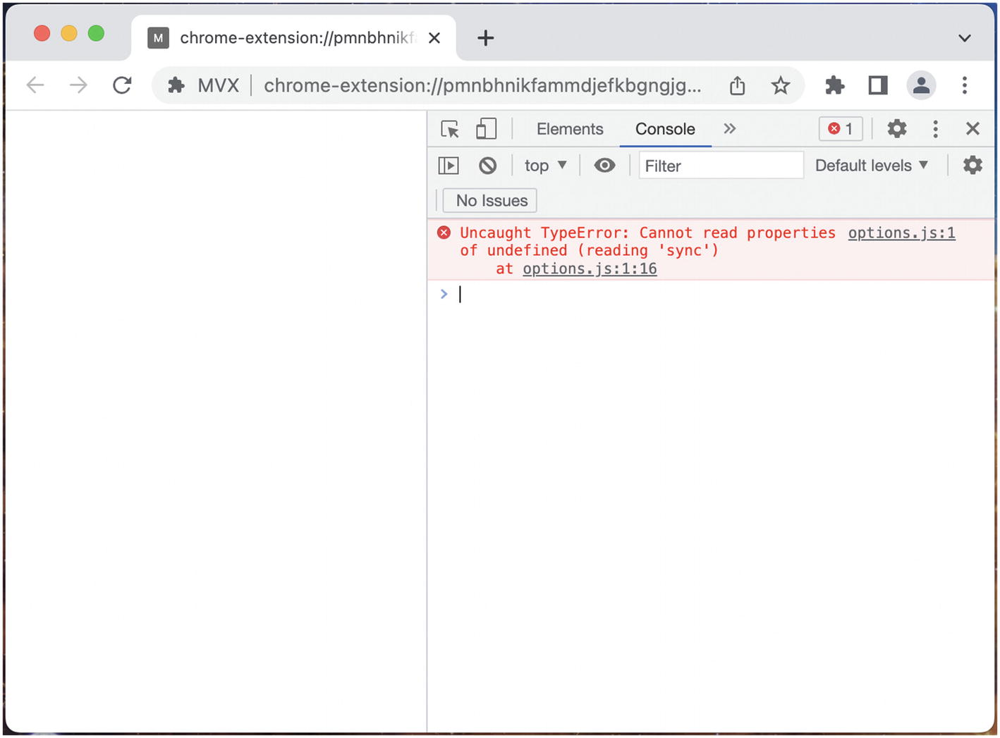
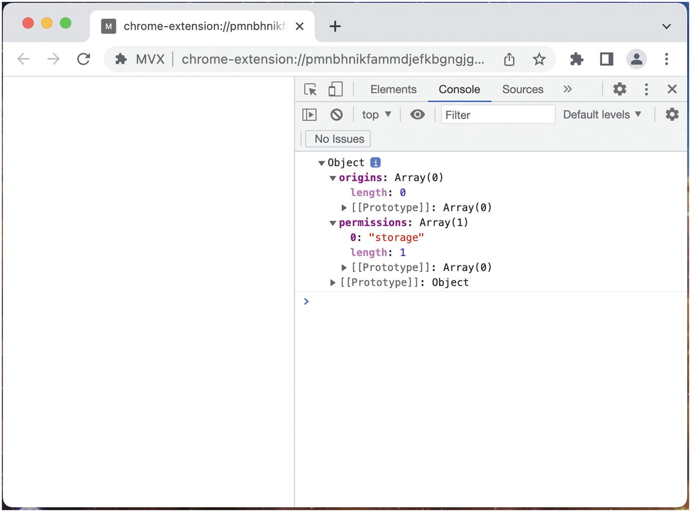
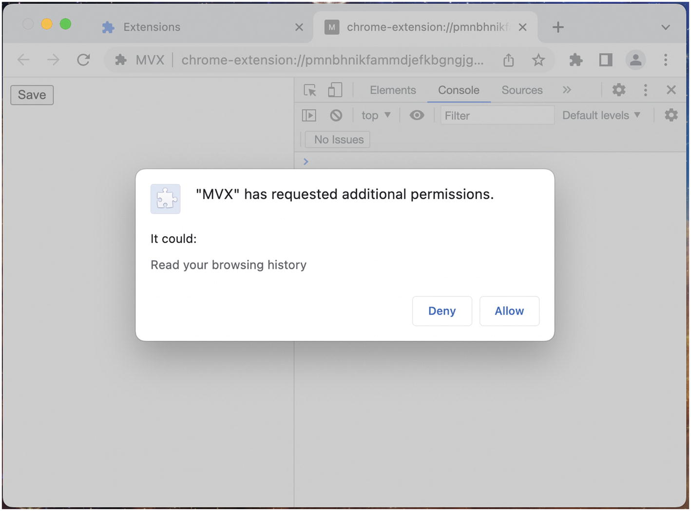
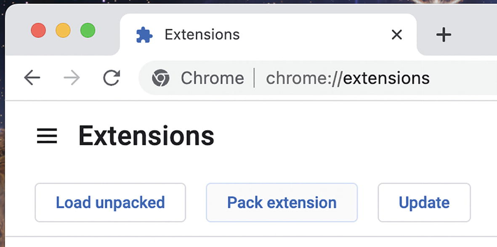
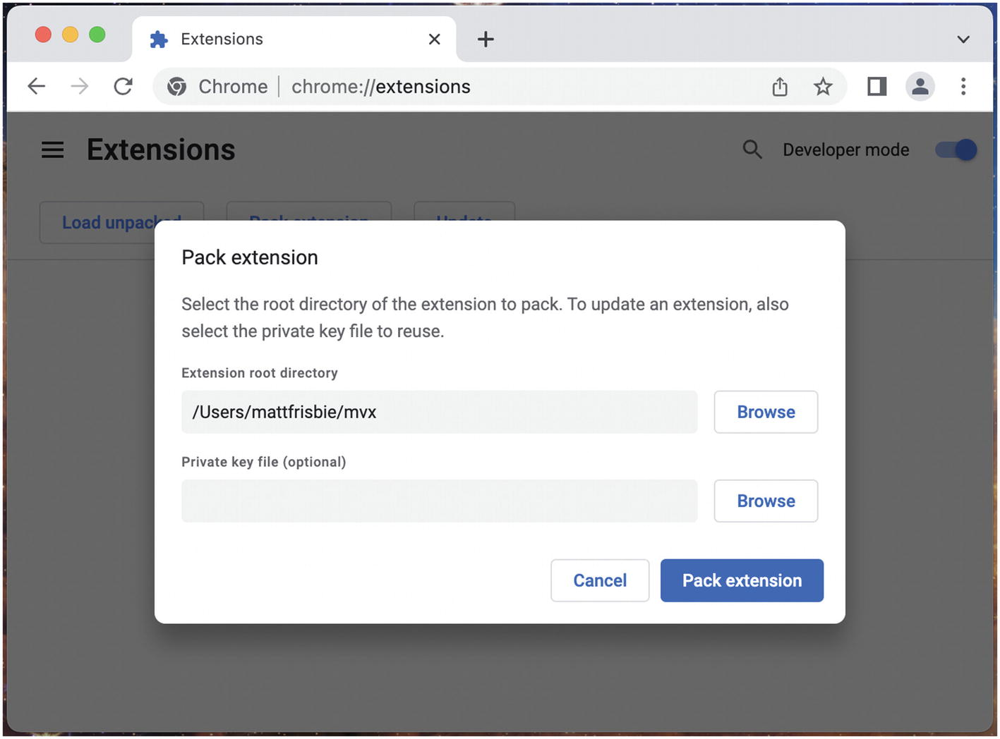
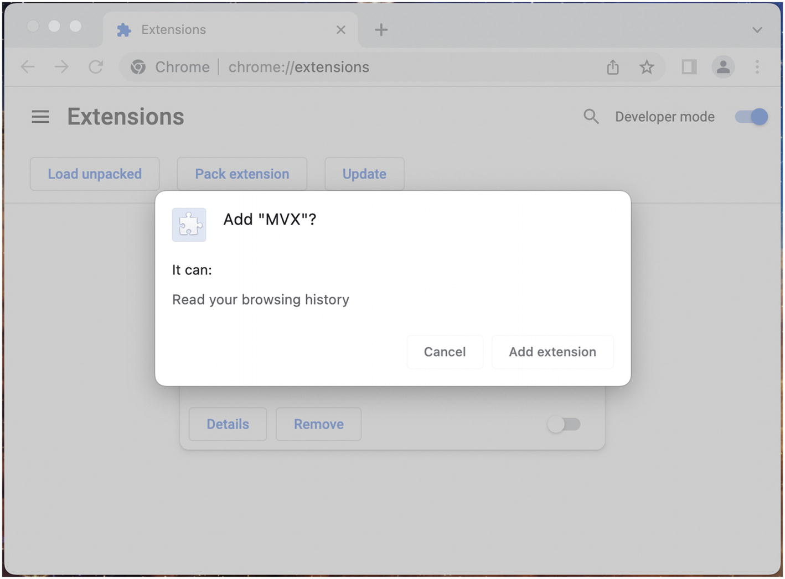
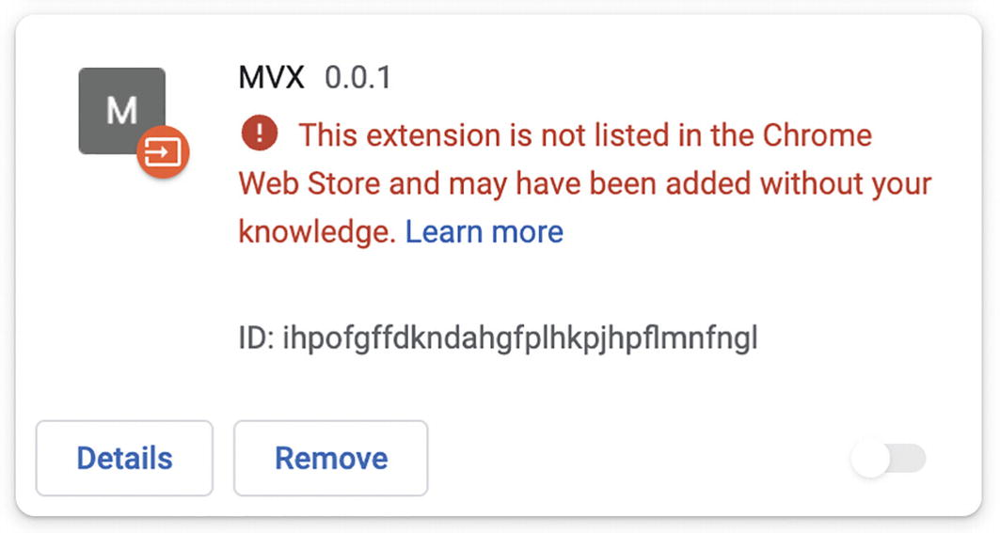
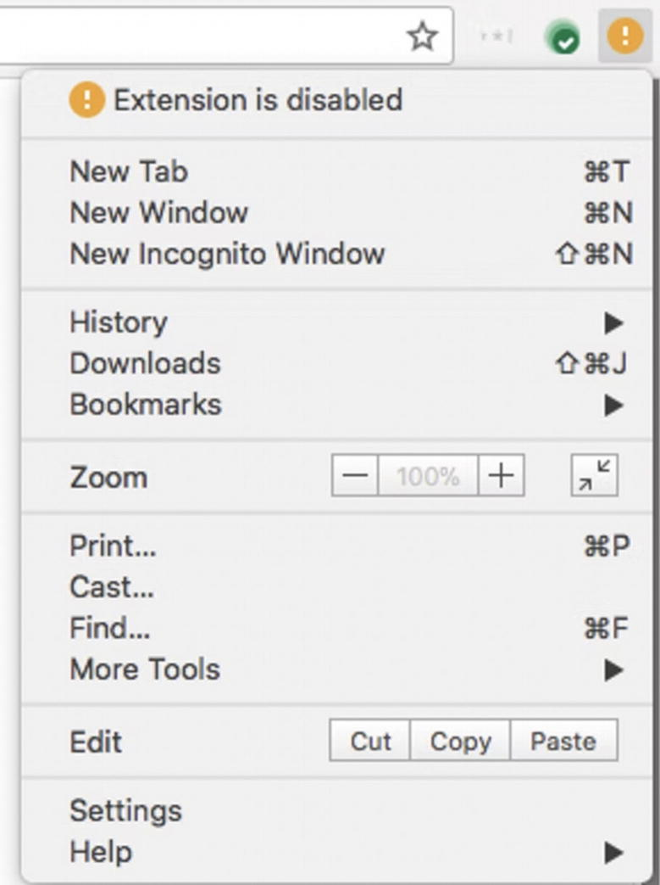
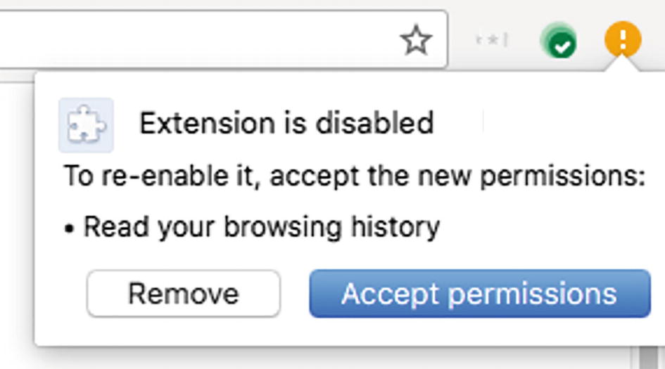

# Chương 12: Quyền hạn (Permissions)

Quyền hạn của tiện ích mở rộng trình duyệt có khái niệm tương đồng với quyền hạn của ứng dụng di động. Cả hai nền tảng phần mềm đều có khả năng truy cập vào các API rất mạnh mẽ, nhưng để bảo vệ người dùng cuối, việc cấp quyền truy cập vào các API này phải được yêu cầu rõ ràng theo từng phần. Đối với cả ứng dụng và tiện ích mở rộng, các quyền được nhà phát triển khai báo trong cơ sở mã – đối với tiện ích mở rộng, đó là tệp manifest. Trong cả hai trường hợp, việc yêu cầu truy cập vào các quyền thông thường sẽ không cần sự cho phép rõ ràng của người dùng, nhưng các quyền rất mạnh mẽ sẽ yêu cầu người dùng phải cấp quyền truy cập một cách rõ ràng. Hơn nữa, việc thêm các quyền bổ sung trong một bản cập nhật sau đó thường sẽ yêu cầu người dùng chấp nhận thay đổi này về phạm vi truy cập.

Khi xây dựng các tiện ích mở rộng trình duyệt, việc lựa chọn quyền hạn một cách cẩn thận là cực kỳ quan trọng. Nó có ảnh hưởng đến cách danh sách tiện ích xuất hiện trên cửa hàng ứng dụng, luồng cài đặt và cập nhật, cũng như cách tiện ích của bạn được cửa hàng ứng dụng xem xét.

## Khái niệm cơ bản về Quyền hạn (Permissions Basics)

Để hiểu các khái niệm cơ bản về việc thêm quyền hạn, hãy xem xét một kịch bản rất cơ bản yêu cầu quyền hạn. Bắt đầu với tiện ích mở rộng sau:

```json
{
  "name": "MVX",
  "version": "0.0.1",
  "manifest_version": 3,
  "options_ui": {
    "open_in_tab": true,
    "page": "options.html"
  }
}
```

**Ví dụ 12-1a:** manifest.json

```html
<!DOCTYPE html>
<html>
  <body>
    <script src="options.js"></script>
  </body>
</html>
```

**Ví dụ 12-1b:** options.html

```javascript
chrome.storage.sync.set({ foo: "bar" });
```

**Ví dụ 12-1c:** options.js

Tiện ích mở rộng rất đơn giản này bao gồm một trang tùy chọn (options page) mà khi mở ra, nó sẽ cố gắng ghi một giá trị giả vào bộ lưu trữ của trình duyệt.

> [!NOTE]
> Ví dụ này sử dụng một trang tùy chọn vì hai lý do: 1) vì nó dễ dàng truy cập vào bảng điều khiển (console) và tải lại kịch bản hơn, và 2) vì khi một lỗi được ném ra trong trang nền (background page) ở lượt đầu tiên của vòng lặp sự kiện (event loop), trình duyệt sẽ đánh dấu service worker là nhàn rỗi vĩnh viễn và từ chối mở các công cụ dành cho nhà phát triển của service worker đó.

Sau khi tải tiện ích mở rộng này và mở trang tùy chọn, bạn sẽ thấy lỗi này trong bảng điều khiển trình duyệt (Hình 12-1).


**Hình 12-1:** Lỗi hiển thị khi cố gắng thiết lập giá trị trong bộ lưu trữ

Lý do cho lỗi này là vì API `chrome.storage` yêu cầu quyền `storage`. Vì quyền này không được yêu cầu, trình duyệt đơn giản là không định nghĩa thuộc tính `storage` trên đối tượng toàn cục `chrome`, và lệnh gọi `sync()` sẽ ném ra lỗi như trên.

Điều này có thể làm bạn ngạc nhiên, vì toàn bộ tiện ích mở rộng đã được tải mà không gặp vấn đề gì. Điều quan trọng cần hiểu là trình duyệt không đưa ra giả định nào về những quyền hạn có thể cần thiết khi tải tiện ích mở rộng, hoặc liệu một quyền được yêu cầu có thực sự cần thiết trong cơ sở mã hay không. Tất cả việc xử lý quyền hạn đều diễn ra tại thời điểm thực thi (runtime).

Để sửa ví dụ này, tất cả những gì bạn phải làm là thêm quyền `storage` như được hiển thị bên dưới:

```json
{
  "name": "MVX",
  "version": "0.0.1",
  "manifest_version": 3,
  "options_ui": {
    "open_in_tab": true,
    "page": "options.html"
  },
  "permissions": ["storage"]
}
```

**Ví dụ 12-2:** manifest.json với quyền storage đã được thêm vào

## Kiểm tra Quyền hạn (Checking Permissions)

Bạn có thể đọc tất cả các quyền mà ngữ cảnh thực thi hiện tại có quyền truy cập theo cách lập trình thông qua phương thức `chrome.permissions.getAll()`. Hãy cập nhật kịch bản `options.js` từ phía trên để ghi lại các quyền của tiện ích mở rộng:

```javascript
chrome.storage.sync.set({ foo: "bar" });
chrome.permissions.getAll().then(console.log);
```

**Ví dụ 12-3:** options.js

Tải lại tiện ích mở rộng và tải lại trang tùy chọn để nhận được kết quả như trong Hình 12-2.


**Hình 12-2:** Ghi nhật ký các quyền hiện tại của tiện ích mở rộng

> [!NOTE]
> Sau khi được cấp, các quyền tùy chọn (được đề cập trong các phần sắp tới) không khác gì các quyền bắt buộc, vì vậy `chrome.permissions.getAll()` sẽ tính toán một danh sách kết hợp của tất cả các quyền bắt buộc *và* tùy chọn.

## Sử dụng Quyền hạn Tùy chọn (Using Optional Permissions)

Như tên gọi cho thấy, quyền hạn tùy chọn là các quyền có thể được yêu cầu tùy ý từ người dùng. Quyền hạn tùy chọn phục vụ hai trường hợp sử dụng chính:

* Các quyền sẽ được yêu cầu ngay khi tiện ích mở rộng tải lần đầu, nhưng không đóng vai trò quan trọng để tiện ích hoạt động bình thường. Điều này tương tự như một ứng dụng di động yêu cầu quyền truy cập vào vị trí của bạn ngay khi bạn mở nó lần đầu tiên.
* Các quyền sẽ chỉ được yêu cầu sau khi người dùng thực hiện một số hành động kích hoạt yêu cầu, chẳng hạn như nhấp vào nút "kết nối với foobar.com". Điều này tương tự như một ứng dụng di động yêu cầu quyền truy cập vào ảnh trên thiết bị của bạn chỉ sau khi bạn nhấp vào nút "chia sẻ hình ảnh".

Một số ví dụ về các tình huống mà quyền hạn tùy chọn hữu ích:

* Bạn muốn cho phép người dùng kiểm soát nhiều hơn đối với tiện ích bằng cách cho phép họ tắt một số quyền, nhưng vẫn sử dụng được một số tính năng của tiện ích.
* Bạn đã ra mắt một tiện ích mở rộng nhưng muốn thêm nhiều quyền hơn mà không buộc người dùng phải kích hoạt lại tiện ích.
* Bạn muốn giảm số lượng cảnh báo tiện ích được hiển thị cho người dùng sau khi cài đặt.

### Cấp quyền theo cách Khai báo so với theo lệnh (Granting Permissions Declaratively vs. Imperatively)

Trong khi các quyền thông thường của trình duyệt web có thể được thu thập theo cách *khai báo* (declaratively), các quyền tùy chọn của tiện ích mở rộng phải được thu thập theo cách *lệnh/thủ công* (imperatively). Hãy xem xét ví dụ sau đây về mã JavaScript thông thường đang chạy trong một trang web:

```javascript
navigator.geolocation.getCurrentPosition(() => {})
```

API định vị địa lý của trình duyệt web không thể truy cập được theo mặc định, người dùng phải cấp quyền truy cập. Tuy nhiên, API được cấu trúc sao cho chỉ cần gọi phương thức này sẽ nhắc người dùng bằng một hộp thoại để cấp quyền; nếu người dùng cấp quyền, kịch bản có thể tiếp tục thực thi như thể quyền đã được cấp ngay từ đầu.

Ngược lại với ví dụ về tiện ích mở rộng ở đầu chương: việc gọi một phương thức mà không có quyền sẽ chỉ ném ra lỗi mà không có cách nào cứu vãn. Khi sử dụng các phương thức API yêu cầu quyền tùy chọn, bạn phải sử dụng API `permissions` để kiểm tra xem tiện ích mở rộng có quyền hay không, yêu cầu quyền nếu chúng chưa được cấp, và chỉ sau đó bạn mới có thể tiếp tục với lệnh gọi API đã được cấp quyền. Điều này được minh họa trong ví dụ sau:

```json
{
  "name": "MVX",
  "version": "0.0.1",
  "manifest_version": 3,
  "options_ui": {
    "open_in_tab": true,
    "page": "options.html"
  },
  "optional_permissions": ["storage"]
}
```

**Ví dụ 12-4a:** manifest.json

```html
<!DOCTYPE html>
<html>
  <body>
    <button id="save">Lưu</button>
    <script src="options.js"></script>
  </body>
</html>
```

**Ví dụ 12-4b:** options.html

```javascript
const permissions = {
  permissions: ["storage"],
};

document.querySelector("#save").addEventListener(
  "click",
  async () => {
    if (!(await chrome.permissions.contains(permissions))) {
      await chrome.permissions.request(permissions);
    }
    chrome.storage.sync.set({ foo: "bar" });
  });
```

**Ví dụ 12-4c:** options.js

### Tính lũy đẳng của yêu cầu cấp quyền (Permission Request Idempotence)

Ví dụ trước có thể được đơn giản hóa hơn nữa. Việc yêu cầu quyền là lũy đẳng (idempotent), vì vậy bạn có thể chỉ cần gọi `request()` mỗi lần mà không gặp bất kỳ trở ngại nào:

```javascript
document.querySelector("#save").addEventListener(
  "click",
  async () => {
    await chrome.permissions.request(permissions);
    chrome.storage.sync.set({ foo: "bar" });
  });
```

**Ví dụ 12-5:** options.js (đơn giản hóa)

## Quyền hạn Máy chủ (Host Permissions)

Bắt đầu từ manifest v3, `permissions` và `host_permissions` đã được tách thành các trường riêng biệt, với sự phân tách tương tự giữa `optional_permissions` và `optional_host_permissions`. Về mặt khái niệm, sự khác biệt rất đơn giản: `permissions` là các API mà bạn cần quyền truy cập, và `host_permissions` là các nguồn (origins) mà bạn cần sử dụng các API đó bên trong. Như đã thảo luận trong chương *Extension Manifest*, danh sách quyền hạn máy chủ thực tế tạo ra một danh sách trắng (whitelist) các tên miền có thêm đặc quyền.

Theo MDN, một nguồn khớp với danh sách trắng sẽ cấp quyền truy cập vào các nội dung sau:

* Truy cập `XMLHttpRequest` và `fetch` vào các nguồn đó mà không bị hạn chế nguồn chéo (ngay cả đối với các yêu cầu được thực hiện từ content scripts).
* Khả năng đọc siêu dữ liệu cụ thể của thẻ mà không cần quyền `tabs`, chẳng hạn như các thuộc tính `url`, `title`, và `favIconUrl` của các đối tượng `Tab`.
* Khả năng đưa các kịch bản vào theo cách lập trình bằng cách sử dụng `scripting.executeScript()` (trong Manifest V3) vào các trang được cung cấp từ các nguồn đó.
* Khả năng truy cập cookie cho máy chủ đó bằng API cookies, miễn là quyền API `cookies` cũng được bao gồm.
* Khả năng vượt qua tính năng bảo vệ theo dõi (tracking protection) for các trang tiện ích nơi máy chủ được chỉ định là một tên miền đầy đủ hoặc có ký tự đại diện. Tuy nhiên, content scripts chỉ có thể vượt qua tính năng bảo vệ theo dõi đối với các máy chủ được chỉ định bằng tên miền đầy đủ.

Sự khác biệt duy nhất giữa việc kiểm tra và yêu cầu `optional_permissions` so với `optional_host_permissions` là việc sử dụng thuộc tính `origins` thay vì thuộc tính `permissions`. Ví dụ, việc kiểm tra các nguồn `google.com` sẽ được thực hiện như sau:

```javascript
chrome.permissions.contains({
  origins: ["*://*.google.com"]
})
```

### Thời hạn của Quyền hạn (Permissions Lifetime)

Một khi quyền được cấp, tiện ích mở rộng có quyền đó trong toàn bộ thời gian tồn tại của tiện ích. Tuy nhiên, người dùng có thể thu hồi quyền đó một cách rõ ràng thông qua trang quản lý tiện ích của trình duyệt. Nếu tiện ích mở rộng bị gỡ cài đặt và sau đó được cài đặt lại, tất cả các quyền tùy chọn đã được cấp trước đó sẽ bị mất.

## Cảnh báo Quyền hạn (Permissions Warnings)

Đối với các quyền như `alarms` và `storage`, các API mà chúng cho phép ít gây ảnh hưởng đến người dùng và do đó chúng có thể được truy cập một cách âm thầm. Ngược lại, một số quyền đủ mạnh và do đó yêu cầu người dùng cấp quyền truy cập vào tiện ích mở rộng một cách rõ ràng. Điều này diễn ra dưới dạng một hộp thoại với mô tả về những gì các quyền đó bao hàm. Ví dụ, sau đây là những gì hiển thị trong Google Chrome khi yêu cầu quyền `tabs` (Hình 12-3).


**Hình 12-3:** Thông báo hiển thị sau khi yêu cầu quyền `tabs`

Đối với danh sách `permissions` và `host_permissions`, hộp thoại cảnh báo sẽ được hiển thị ngay sau khi cài đặt và trước khi tiện ích có cơ hội thực thi bất kỳ mã nào. Nếu quyền bị từ chối, tiện ích mở rộng sẽ không được cài đặt.

Đối với `optional_permissions` và `optional_host_permissions`, cảnh báo sẽ chỉ hiển thị khi tiện ích thực hiện yêu cầu cho các quyền đó. Nếu quyền bị từ chối, tiện ích mở rộng sẽ tiếp tục hoạt động như trước đó mà không có các quyền bổ sung.

> [!NOTE]
> Không giống như các quyền HTML5, tiện ích mở rộng sẽ có thể thực hiện một yêu cầu khác cho quyền tùy chọn nếu ban đầu nó bị từ chối.

### Kiểm tra Cảnh báo Quyền hạn (Testing Permissions Warnings)

Khi phát triển tiện ích mở rộng, bạn sẽ nhận thấy rằng việc tải một tiện ích chưa đóng gói (unpacked) sẽ không hiển thị hộp thoại cảnh báo quyền hạn khi mới cài đặt tiện ích. (Các quyền tùy chọn vẫn sẽ hiển thị hộp thoại cảnh báo.) Tất nhiên, điều này là để tránh làm phiền nhà phát triển khi họ liên tục cài đặt lại tiện ích đang hoàn thiện của mình.

Để thấy hộp thoại cảnh báo quyền hạn tại thời điểm cài đặt, bạn sẽ cần đóng gói tiện ích thành tệp `.crx` và sau đó tải tệp đó vào trình duyệt của bạn.

1. Nhấp vào "Pack extension" từ trang quản lý tiện ích (Hình 12-4).
2. Chọn thư mục tiện ích (cùng thư mục bạn chọn khi tải tiện ích chưa đóng gói) (Hình 12-5).
3. Để trống trường `.pem`.
4. Trình duyệt sẽ tạo ra hai tệp, một tệp `.crx` và một tệp `.pem`.
5. Kéo và thả tệp `.crx` vào trang quản lý tiện ích để cài đặt nó. Nếu bạn làm đúng, trình duyệt sẽ nhắc bạn bằng hộp thoại cảnh báo quyền hạn (Hình 12-6).
6. Xóa hai tệp vừa tạo, chúng không còn giá trị sử dụng nữa.


**Hình 12-4:** Nút “Pack extension” trên trang quản lý tiện ích


**Hình 12-5:** Hộp thoại “Pack extension“


**Hình 12-6:** Hộp thoại cảnh báo quyền hạn khi cài đặt

> [!NOTE]
> Trước đây, bạn có thể cài đặt và sử dụng một tiện ích mở rộng bằng tệp `.crx` – nhưng hiện tại thì không còn như vậy nữa. Nó vẫn có thể được sử dụng để kiểm tra các cảnh báo như được trình bày ở đây, nhưng như bạn sẽ thấy, tiện ích mở rộng sẽ bị Chrome vô hiệu hóa vĩnh viễn (Hình 12-7).


**Hình 12-7:** Tiện ích mở rộng `.crx` bị vô hiệu hóa

## Những lưu ý đối với các Tiện ích đã Xuất bản (Considerations for Published Extensions)

Khi xuất bản tiện ích mở rộng của bạn lên cửa hàng ứng dụng, các quyền bạn chọn có thể gây ra những ảnh hưởng ngoài cơ sở mã của bạn.

### Kích hoạt Hàng đợi xem xét chậm (Triggering the Slow Review Queue)

Khi xây dựng một tiện ích mở rộng, bạn có thể sẽ không có nhiều sự lựa chọn trong việc quyết định quyền nào là cần thiết. Suy cho cùng, các nhu cầu của tiện ích là tuyệt đối, và các quyền cần thiết để làm cho nó hoạt động sẽ bắt nguồn từ đó. Tuy nhiên, nếu tốc độ xem xét tiện ích là quan trọng đối với bạn, thì điều quan trọng là phải hiểu rằng việc yêu cầu một số quyền như `<all_urls>` sẽ khiến tiện ích của bạn bị đưa vào hàng đợi xem xét chậm hơn.

> [!TIP]
> Theo kinh nghiệm của tôi, hàng đợi này sẽ làm tăng thời gian xem xét tiện ích của bạn từ dưới 24 giờ lên vài ngày.

## Tự động Vô hiệu hóa khi Cập nhật (Auto-Disable Updates)

Một lưu ý cực kỳ quan trọng là điều gì sẽ xảy ra khi các quyền bắt buộc (có hiển thị cảnh báo) được thêm vào một tiện ích mở rộng trong một bản cập nhật. Trình duyệt cập nhật các tiện ích mở rộng một cách âm thầm trong nền, vì vậy nó sẽ không hiển thị hộp thoại cảnh báo ngay khi bản cập nhật được cài đặt. Thay vào đó, nó sẽ âm thầm vô hiệu hóa tiện ích mở rộng và thêm một thông báo nhỏ vào thanh công cụ của trình duyệt, cho biết cần phải có hành động. Để kích hoạt lại tiện ích, người dùng phải mở thông báo này và chấp nhận các quyền mới (Hình 12-8 và Hình 12-9). Luồng này được hiển thị dưới đây:


**Hình 12-8:** Thông báo tiện ích mở rộng bị vô hiệu hóa


**Hình 12-9:** Hộp thoại quyền để kích hoạt lại tiện ích mở rộng

## Danh sách Quyền hạn (Permissions List)

Dưới đây là danh sách tất cả các quyền hạn, những gì chúng cho phép và thông báo cảnh báo mà chúng sẽ gây ra (nếu có).

> [!NOTE]
> Danh sách quyền hạn này bao gồm các giá trị từ các nhà cung cấp trình duyệt khác nhau và các phiên bản manifest khác nhau. Một số quyền có thể đã bị lỗi thời.
>
> [!NOTE]
> Để nhất quán, các API được hiển thị bên trong không gian tên `chrome`. Không gian tên này hợp lệ trong tất cả các trình duyệt Chromium và Firefox.

### activeTab

Quyền `activeTab` thường bị hiểu nhầm – phần lớn là do tên gọi của nó. Các nhà phát triển tiện ích mở rộng đã gặp phải các vấn đề sau:

* Tiện ích mở rộng chỉ cần truy cập vào "thẻ đang hoạt động" (active tab), nghĩa là thẻ hiện đang được trình duyệt tập trung (focus).
* Tiện ích mở rộng cần truy cập vào thẻ đang hoạt động bất kể tên miền của nó là gì, nhưng không muốn gây ra thông báo cảnh báo gây khó chịu "Đọc và thay đổi tất cả dữ liệu của bạn trên các trang web bạn truy cập".
* Tiện ích mở rộng chỉ cần truy cập tạm thời vào thẻ đang hoạt động.

Từ đó, quyền `activeTab` đã ra đời. Quyền này không cho phép truy cập vào bất cứ điều gì mới: việc yêu cầu quyền `<all_urls>` sẽ khiến quyền `activeTab` trở nên vô nghĩa. Tuy nhiên, bằng cách yêu cầu `activeTab` thay vì `<all_urls>`, tiện ích mở rộng được cấp thêm các quyền chỉ sau một tập hợp hạn chế các tương tác của người dùng mà không hiển thị bất kỳ cảnh báo nào cho người dùng.

Các tương tác người dùng được cho phép là:

* Thực hiện một hành động (action)
* Thực hiện một mục trong menu ngữ cảnh
* Thực hiện một lệnh phím tắt bàn phím
* Chấp nhận một gợi ý từ API Omnibox

Một khi một trong những tương tác người dùng này xảy ra, tiện ích mở rộng sẽ được cấp tạm thời các quyền bổ sung sau cho thẻ đó:

* Gọi `scripting.executeScript()` hoặc `scripting.insertCSS()` trên thẻ đang hoạt động.
* Lấy URL, tiêu đề và favicon cho thẻ đó thông qua một API trả về đối tượng `tabs.Tab` (về cơ bản giống như quyền `tabs`).
* Chặn các yêu cầu mạng trong thẻ tới nguồn khung chính của thẻ bằng API `webRequest`. Tiện ích mở rộng sẽ tạm thời có quyền hạn máy chủ đối với nguồn khung chính của thẻ.

Các quyền bổ sung này chỉ kéo dài cho đến khi thẻ được điều hướng hoặc bị đóng. Quyền này có sẵn trong các trình duyệt Chromium và Firefox.

### alarms

* Cấp cho tiện ích mở rộng quyền truy cập vào API `chrome.alarms`.
* Có sẵn cho các trình duyệt Chromium và Firefox.

### background

* Làm cho Chrome khởi động sớm và tắt muộn, để các tiện ích mở rộng có thể có thời gian hoạt động lâu hơn.
* Có sẵn cho các trình duyệt Chromium và Firefox.

Khi bất kỳ tiện ích mở rộng nào được cài đặt có quyền `background`, Chrome sẽ chạy như một tiến trình nền ngay khi người dùng đăng nhập vào máy tính của họ và trước khi người dùng khởi chạy Chrome. Quyền `background` cũng làm cho Chrome tiếp tục chạy sau khi cửa sổ cuối cùng của nó được đóng cho đến khi người dùng thoát Chrome một cách rõ ràng.

Mục đích sử dụng của quyền `background` là cho phép các kịch bản nền thực hiện công việc hữu ích mà không bị ràng buộc với thời gian tồn tại của cửa sổ trình duyệt.

### bookmarks

* Cấp cho tiện ích mở rộng quyền truy cập vào API `chrome.bookmarks`.
* Có sẵn cho các trình duyệt Chromium và Firefox.
* Thông báo cảnh báo của Chrome: "Đọc và thay đổi dấu trang của bạn"
* Thông báo cảnh báo của Firefox: "Đọc và sửa đổi dấu trang"

### browserSettings

* Cho phép tiện ích mở rộng sửa đổi một số thiết lập trình duyệt toàn cục. Mỗi thuộc tính của API này là một đối tượng `BrowserSetting`, cung cấp khả năng sửa đổi một thiết lập cụ thể.
* Có sẵn cho Firefox.
* Thông báo cảnh báo của Firefox: "Đọc và sửa đổi các thiết lập trình duyệt"

### browsingData

* Cấp cho tiện ích mở rộng quyền truy cập vào API `chrome.browsingData`.
* Có sẵn cho các trình duyệt Chromium và Firefox.
* Thông báo cảnh báo của Firefox: "Xóa lịch sử duyệt web gần đây, cookie và dữ liệu liên quan"

### captivePortal

* Xác định trạng thái cổng bị chặn (captive portal) của kết nối của người dùng. Một cổng bị chặn là một trang web hiển thị khi người dùng lần đầu kết nối với mạng Wi-Fi.
* Có sẵn cho Firefox.

### certificateProvider

* Cấp cho tiện ích mở rộng quyền truy cập vào API `chrome.certificateProvider`.
* Có sẵn cho các trình duyệt Chromium.

### clipboardRead

* Yêu cầu nếu tiện ích mở rộng sử dụng `document.execCommand('paste')`.
* Có sẵn cho các trình duyệt Chromium và Firefox.
* Thông báo cảnh báo của Chrome: "Đọc dữ liệu bạn sao chép và dán"
* Thông báo cảnh báo của Firefox: "Lấy dữ liệu từ khay nhớ tạm"

### clipboardWrite

* Cho biết tiện ích mở rộng sử dụng `document.execCommand('copy')` hoặc `document.execCommand('cut')`.
* Có sẵn cho các trình duyệt Chromium và Firefox.
* Thông báo cảnh báo của Chrome: "Sửa đổi dữ liệu bạn sao chép và dán"
* Thông báo cảnh báo của Firefox: "Nhập dữ liệu vào khay nhớ tạm"

### contentSettings

* Cấp cho tiện ích mở rộng quyền truy cập vào API `chrome.contentSettings`.
* Có sẵn cho các trình duyệt Chromium và Firefox.
* Thông báo cảnh báo của Chrome: "Thay đổi các thiết lập của bạn để kiểm soát quyền truy cập của các trang web vào các tính năng như cookie, JavaScript, plugin, vị trí, micrô, máy ảnh, v.v."

### contextMenus

* Cấp cho tiện ích mở rộng quyền truy cập vào API `chrome.contextMenus`.
* Có sẵn cho các trình duyệt Chromium và Firefox.

### contextualIdentities

* Liệt kê, tạo, xóa và cập nhật các định danh theo ngữ cảnh (contextual identities), thường được gọi là "containers".
* Có sẵn cho Firefox.

### cookies

* Cấp cho tiện ích mở rộng quyền truy cập vào API `chrome.cookies`.
* Có sẵn cho các trình duyệt Chromium và Firefox.

### debugger

* Cấp cho tiện ích mở rộng quyền truy cập vào API `chrome.debugger`.
* Có sẵn cho các trình duyệt Chromium và Firefox.
* Thông báo cảnh báo của Chrome: "Truy cập API trình gỡ lỗi trang web", "Đọc và thay đổi tất cả dữ liệu của bạn trên các trang web bạn truy cập"
* Thông báo cảnh báo của Firefox: "Truy cập các tính năng gỡ lỗi của trình duyệt"

### declarativeContent

* Cấp cho tiện ích mở rộng quyền truy cập vào API `chrome.declarativeContent`.
* Có sẵn cho các trình duyệt Chromium.

### declarativeNetRequest

* Cấp cho tiện ích mở rộng quyền truy cập vào API `chrome.declarativeNetRequest`.
* Có sẵn cho các trình duyệt Chromium.
* Thông báo cảnh báo của Chrome: "Chặn nội dung trang"

### declarativeNetRequestFeedback

* Cấp cho tiện ích mở rộng quyền truy cập vào các sự kiện và phương thức bên trong API `chrome.declarativeNetRequest` trả về thông tin về các quy tắc khai báo khớp nhau.
* Có sẵn cho các trình duyệt Chromium.

### declarativeWebRequest

* Cấp cho tiện ích mở rộng quyền truy cập vào API `chrome.declarativeWebRequest`.
* Có sẵn cho các trình duyệt Chromium.

### desktopCapture

* Cấp cho tiện ích mở rộng quyền truy cập vào API `chrome.desktopCapture`.
* Có sẵn cho các trình duyệt Chromium.
* Thông báo cảnh báo của Chrome: "Chụp nội dung màn hình của bạn"

### Trang Devtools (Devtools page)

* Về kỹ thuật đây không phải là một quyền hạn, đây là một cảnh báo bổ sung hiển thị trong Firefox khi `devtools_page` được sử dụng trong manifest.
* Thông báo cảnh báo của Firefox: "Mở rộng các công cụ dành cho nhà phát triển để truy cập dữ liệu của bạn trong các thẻ đang mở"

### dns

* Cho phép tiện ích mở rộng phân giải tên miền bằng API `dns`.
* Có sẵn cho Firefox.

### documentScan

* Cấp cho tiện ích mở rộng quyền truy cập vào API `chrome.documentScan`.
* Có sẵn cho các trình duyệt Chromium.

### downloads

* Cấp cho tiện ích mở rộng quyền truy cập vào API `chrome.downloads`.
* Có sẵn cho các trình duyệt Chromium và Firefox.
* Thông báo cảnh báo của Chrome: "Quản lý các bản tải về của bạn"
* Thông báo cảnh báo của Firefox: "Tải xuống các tệp và đọc và sửa đổi lịch sử tải xuống của trình duyệt"

### downloads.open

* Cấp cho tiện ích mở rộng quyền truy cập chỉ vào API `chrome.downloads.open`.
* Thông báo cảnh báo của Chrome: "Mở các tệp đã tải xuống"
* Thông báo cảnh báo của Firefox: "Mở các tệp đã tải xuống máy tính của bạn"

### enterprise.deviceAttributes

* Cấp cho tiện ích mở rộng quyền truy cập vào API `chrome.enterprise.deviceAttributes`.
* Có sẵn cho các trình duyệt Chromium.

### enterprise.hardwarePlatform

* Cấp cho tiện ích mở rộng quyền truy cập vào API `chrome.enterprise.hardwarePlatform`.
* Có sẵn cho các trình duyệt Chromium.

### enterprise.networkingAttributes

* Cấp cho tiện ích mở rộng quyền truy cập vào API `chrome.enterprise.networkingAttributes`.
* Có sẵn cho các trình duyệt Chromium.

### enterprise.platformKeys

* Cấp cho tiện ích mở rộng quyền truy cập vào API `chrome.enterprise.platformKeys`.
* Có sẵn cho các trình duyệt Chromium.

### experimental

* Yêu cầu nếu tiện ích mở rộng sử dụng bất kỳ API `chrome.experimental.*` nào.
* Có sẵn cho các trình duyệt Chromium.

### fileBrowserHandler

* Cấp cho tiện ích mở rộng quyền truy cập vào API `chrome.fileBrowserHandler`.
* Có sẵn cho các trình duyệt Chromium.

### fileSystemProvider

* Cấp cho tiện ích mở rộng quyền truy cập vào API `chrome.fileSystemProvider`.
* Có sẵn cho các trình duyệt Chromium.

### find

* Cho phép tiện ích mở rộng tìm văn bản trong một trang web và làm nổi bật các kết quả khớp bằng API `find`.
* Có sẵn cho Firefox.
* Thông báo cảnh báo của Firefox: "Đọc văn bản của tất cả các thẻ đang mở"

### fontSettings

* Cấp cho tiện ích mở rộng quyền truy cập vào API `chrome.fontSettings`.
* Có sẵn cho các trình duyệt Chromium.

### gcm

* Cấp cho tiện ích mở rộng quyền truy cập vào API `chrome.gcm`.
* Có sẵn cho các trình duyệt Chromium.

### geolocation

* Cho phép tiện ích mở rộng sử dụng API định vị địa lý HTML5 mà không cần nhắc người dùng cấp quyền.
* Có sẵn cho các trình duyệt Chromium và Firefox.
* Thông báo cảnh báo của Chrome: "Phát hiện vị trí thực của bạn"
* Thông báo cảnh báo của Firefox: "Truy cập vị trí của bạn"

### history

* Cấp cho tiện ích mở rộng quyền truy cập vào API `chrome.history`.
* Có sẵn cho các trình duyệt Chromium và Firefox.
* Thông báo cảnh báo của Chrome: "Đọc và thay đổi lịch sử duyệt web của bạn"
* Thông báo cảnh báo của Firefox: "Truy cập lịch sử duyệt web"

### Quyền hạn Máy chủ (Host Permissions) - Vị trí trong manifest

Quyền hạn máy chủ có thể được yêu cầu trên toàn cầu hoặc chỉ cho một tập con các máy chủ. Các quyền này có thể được yêu cầu trên tất cả các trình duyệt, và thông báo cảnh báo hiển thị có thể xuất hiện theo nhiều cách khác nhau.

> [!NOTE]
> Có thể tránh việc khai báo bất kỳ quyền hạn máy chủ nào bằng cách sử dụng quyền `activeTab`.

#### Quyền hạn Máy chủ Toàn cầu (Global Host Permission)

Quyền hạn máy chủ toàn cầu có nghĩa là tiện ích mở rộng có quyền truy cập vào mọi máy chủ với một giao thức được cho phép. Điều này phù hợp cho các tiện ích mở rộng cần quản lý tất cả các trang và lưu lượng của trình duyệt mọi lúc. Có một vài cách khác nhau để yêu cầu điều này, nhưng tất cả đều có tác dụng như nhau:

* `http://*/*`
* `https://*/*`
* `*://*/*`
* `<all_urls>`

Điều này sẽ hiển thị các thông báo cảnh báo sau:

* Thông báo cảnh báo của Chrome: "Đọc và thay đổi tất cả dữ liệu của bạn trên các trang web bạn truy cập"
* Thông báo cảnh báo của Firefox: "Truy cập dữ liệu của bạn cho tất cả các trang web"

> [!TIP]
> Nếu tiện ích mở rộng của bạn sử dụng quyền này, tiện ích của bạn sẽ được đưa vào hàng đợi xem xét thủ công khi gửi lên các cửa hàng tiện ích. Kết quả là, nó sẽ mất nhiều thời gian hơn đáng kể để được phê duyệt.

#### Quyền hạn Máy chủ Một phần (Partial Host Permission)

Quyền hạn máy chủ một phần có nghĩa là tiện ích mở rộng chỉ có quyền truy cập vào các máy chủ khớp với một hoặc nhiều trình khớp (matchers). Điều này phù hợp cho các tiện ích mở rộng biết trước tập hợp các máy chủ mà nó sẽ cần quản lý hoặc giao tiếp.

> [!NOTE]
> Tham khảo chương *Extension Manifest* để biết cách hoạt động của các trình khớp.

Cảnh báo hiển thị sẽ khác nhau dựa trên số lượng máy chủ được bao phủ. Một trình khớp máy chủ đơn giản cho `foobar.com` sẽ hiển thị các cảnh báo sau:

* Thông báo cảnh báo của Chrome: "Đọc và thay đổi dữ liệu của bạn trên `foobar.com`"
* Thông báo cảnh báo của Firefox: "Cấp cho tiện ích mở rộng quyền truy cập vào `https://foobar.com`"

Nếu có nhiều hơn một máy chủ được bao phủ, trình duyệt sẽ điều chỉnh thông báo cảnh báo dựa trên số lượng máy chủ được bao phủ. Ví dụ, Firefox cũng sẽ hiển thị các thông báo sau:

* Truy cập dữ liệu của bạn cho các trang web trong tên miền [named]
* Truy cập dữ liệu của bạn trong # tên miền khác
* Truy cập dữ liệu của bạn cho [named site]
* Truy cập dữ liệu của bạn trên # trang web khác

### identity

* Cấp cho tiện ích mở rộng quyền truy cập vào API `chrome.identity`.
* Có sẵn cho các trình duyệt Chromium và Firefox.

### idle

* Cấp cho tiện ích mở rộng quyền truy cập vào API `chrome.idle`.
* Có sẵn cho các trình duyệt Chromium và Firefox.

### loginState

* Cấp cho tiện ích mở rộng quyền truy cập vào API `chrome.loginState`.
* Có sẵn cho các trình duyệt Chromium.

### management

* Cấp cho tiện ích mở rộng quyền truy cập vào API `chrome.management`.
* Có sẵn cho các trình duyệt Chromium và Firefox.
* Thông báo cảnh báo của Chrome: "Quản lý các ứng dụng, tiện ích mở rộng và giao diện của bạn"
* Thông báo cảnh báo của Firefox: "Theo dõi việc sử dụng tiện ích mở rộng và quản lý các giao diện"

### menus

* Thêm các mục vào hệ thống menu của trình duyệt bằng API `menus`.
* Có sẵn cho Firefox.

> [!NOTE]
> API này được mô phỏng theo API `contextMenus` của Chrome, cho phép các tiện ích mở rộng Chrome thêm các mục vào menu ngữ cảnh của trình duyệt. API `menus` thêm một vài tính năng vào API của Chrome.

### menus.overrideContext

* Ẩn tất cả các mục menu mặc định của Firefox để cung cấp giao diện người dùng menu ngữ cảnh tùy chỉnh.
* Có sẵn cho Firefox.

### nativeMessaging

* Cấp cho tiện ích mở rộng quyền truy cập vào API tin nhắn gốc (native messaging).
* Có sẵn cho các trình duyệt Chromium và Firefox.
* Thông báo cảnh báo của Chrome: "Giao tiếp với các ứng dụng gốc cộng tác"
* Thông báo cảnh báo của Firefox: "Trao đổi tin nhắn với các chương trình khác ngoài Firefox"

### notifications

* Cấp cho tiện ích mở rộng quyền truy cập vào API `chrome.notifications`.
* Có sẵn cho các trình duyệt Chromium và Firefox.
* Thông báo cảnh báo của Chrome: "Hiển thị thông báo"
* Thông báo cảnh báo của Firefox: "Hiển thị thông báo cho bạn"

### pageCapture

* Cấp cho tiện ích mở rộng quyền truy cập vào API `chrome.pageCapture`.
* Có sẵn cho các trình duyệt Chromium và Firefox.
* Thông báo cảnh báo của Chrome: "Đọc và thay đổi tất cả dữ liệu của bạn trên các trang web bạn truy cập"

### pkcs11

* API `pkcs11` cho phép một tiện ích mở rộng liệt kê các mô-đun bảo mật PKCS #11 và làm cho chúng có thể truy cập được bởi trình duyệt như là nguồn của các khóa và chứng chỉ.
* Có sẵn cho Firefox.
* Thông báo cảnh báo của Firefox: "Cung cấp các dịch vụ xác thực mã hóa"

Theo Wikipedia:

> *Hầu hết các phần mềm nhà xác thực chứng chỉ (CA) thương mại sử dụng PKCS #11 để truy cập khóa ký CA hoặc để đăng ký chứng chỉ người dùng. Phần mềm đa nền tảng cần sử dụng thẻ thông minh (smart cards) sử dụng PKCS #11, chẳng hạn như Mozilla Firefox và OpenSSL (sử dụng một phần mở rộng).*

### platformKeys

* Cấp cho tiện ích mở rộng quyền truy cập vào API `chrome.platformKeys`.
* Có sẵn cho các trình duyệt Chromium.

### power

* Cấp cho tiện ích mở rộng quyền truy cập vào API `chrome.power`.
* Có sẵn cho các trình duyệt Chromium.

### printerProvider

* Cấp cho tiện ích mở rộng quyền truy cập vào API `chrome.printerProvider`.
* Có sẵn cho các trình duyệt Chromium.

### printing

* Cấp cho tiện ích mở rộng quyền truy cập vào API `chrome.printing`.
* Có sẵn cho các trình duyệt Chromium.

### printingMetrics

* Cấp cho tiện ích mở rộng quyền truy cập vào API `chrome.printingMetrics`.
* Có sẵn cho các trình duyệt Chromium.

### privacy

* Cấp cho tiện ích mở rộng quyền truy cập vào API `chrome.privacy`.
* Có sẵn cho các trình duyệt Chromium và Firefox.
* Thông báo cảnh báo của Chrome: "Thay đổi các thiết lập liên quan đến quyền riêng tư của bạn"
* Thông báo cảnh báo của Firefox: "Đọc và sửa đổi các thiết lập quyền riêng tư"

### processes

* Cấp cho tiện ích mở rộng quyền truy cập vào API `chrome.processes`.
* Có sẵn cho các trình duyệt Chromium.

### proxy

* Cấp cho tiện ích mở rộng quyền truy cập vào API `chrome.proxy`.
* Có sẵn cho các trình duyệt Chromium và Firefox.
* Thông báo cảnh báo của Chrome: "Đọc và thay đổi tất cả dữ liệu của bạn trên các trang web bạn truy cập"
* Thông báo cảnh báo của Firefox: "Kiểm soát các thiết lập proxy của trình duyệt"

### scripting

* Cấp cho tiện ích mở rộng quyền truy cập vào API `chrome.scripting`.
* Có sẵn cho các trình duyệt Chromium và Firefox.

### search

* Cấp cho tiện ích mở rộng quyền truy cập vào API `chrome.search`.
* Có sẵn cho các trình duyệt Chromium và Firefox.

### sessions

* Cấp cho tiện ích mở rộng quyền truy cập vào API `chrome.sessions`.
* Có sẵn cho các trình duyệt Chromium và Firefox.
* Thông báo cảnh báo của Firefox: "Truy cập các thẻ đã đóng gần đây"

### signedInDevices

* Cấp cho tiện ích mở rộng quyền truy cập vào API `chrome.signedInDevices`.
* Có sẵn cho các trình duyệt Chromium.

### storage

* Cấp cho tiện ích mở rộng quyền truy cập vào API `chrome.storage`.
* Có sẵn cho các trình duyệt Chromium và Firefox.

### system.cpu

* Cấp cho tiện ích mở rộng quyền truy cập vào API `chrome.system.cpu`.
* Có sẵn cho các trình duyệt Chromium.

### system.display

* Cấp cho tiện ích mở rộng quyền truy cập vào API `chrome.system.display`.
* Có sẵn cho các trình duyệt Chromium.

### system.memory

* Cấp cho tiện ích mở rộng quyền truy cập vào API `chrome.system.memory`.
* Có sẵn cho các trình duyệt Chromium.

### system.storage

* Cấp cho tiện ích mở rộng quyền truy cập vào API `chrome.system.storage`.
* Có sẵn cho các trình duyệt Chromium.
* Thông báo cảnh báo của Chrome: "Nhận dạng và ngắt kết nối các thiết bị lưu trữ"

### tabHide

* Cho phép tiện ích mở rộng ẩn các thẻ trình duyệt.
* Có sẵn cho Firefox.
* Thông báo cảnh báo của Firefox: "Ẩn và hiện các thẻ trình duyệt"

### tabs

* Cấp cho tiện ích mở rộng quyền truy cập vào các phần đặc quyền của API `chrome.tabs`.
* Có sẵn cho các trình duyệt Chromium và Firefox.
* Thông báo cảnh báo của Chrome: "Đọc lịch sử duyệt web của bạn"
* Thông báo cảnh báo của Firefox: "Truy cập các thẻ trình duyệt"

### theme

* Cho phép các tiện ích mở rộng thay đổi chủ đề của trình duyệt.
* Có sẵn cho Firefox.

### topSites

* Cấp cho tiện ích mở rộng quyền truy cập vào API `chrome.topSites`.
* Có sẵn cho các trình duyệt Chromium và Firefox.
* Thông báo cảnh báo của Chrome: "Đọc danh sách các trang web được truy cập nhiều nhất của bạn"
* Thông báo cảnh báo của Firefox: "Truy cập lịch sử duyệt web"

### tts

* Cấp cho tiện ích mở rộng quyền truy cập vào API `chrome.tts`.
* Có sẵn cho các trình duyệt Chromium.

### ttsEngine

* Cấp cho tiện ích mở rộng quyền truy cập vào API `chrome.ttsEngine`.
* Có sẵn cho các trình duyệt Chromium.
* Thông báo cảnh báo của Chrome: "Đọc tất cả văn bản được nói bằng giọng nói tổng hợp"

### unlimitedStorage

* Cung cấp một hạn ngạch không giới hạn cho `chrome.storage.local`, `IndexedDB`, và (chỉ dành cho Chrome) `FileSystem` API.
* Có sẵn cho các trình duyệt Chromium và Firefox.

### vpnProvider

* Cấp cho tiện ích mở rộng quyền truy cập vào API `chrome.vpnProvider`.
* Có sẵn cho các trình duyệt Chromium.

### walman

* Quyền này dành cho API `walman` (Web Authentication Lifecycle Manager).
* Có sẵn cho các trình duyệt Chromium.

### webNavigation

* Cấp cho tiện ích mở rộng quyền truy cập vào API `chrome.webNavigation`.
* Có sẵn cho các trình duyệt Chromium và Firefox.
* Thông báo cảnh báo của Chrome: "Đọc lịch sử duyệt web của bạn"
* Thông báo cảnh báo của Firefox: "Truy cập các thẻ trình duyệt"

### webRequest

* Cấp cho tiện ích mở rộng quyền truy cập vào API `chrome.webRequest`.
* Có sẵn cho các trình duyệt Chromium và Firefox.

### webRequestBlocking

* Cấp cho tiện ích mở rộng quyền truy cập để chặn các yêu cầu mạng bằng API `chrome.webRequest`.
* Có sẵn cho các trình duyệt Chromium và Firefox.

## Tổng kết (Summary)

Việc hiểu và sử dụng đúng các quyền hạn là nền tảng để xây dựng các tiện ích mở rộng an toàn và thân thiện với người dùng. Bằng cách tuân theo nguyên tắc quyền tối thiểu và sử dụng các quyền tùy chọn khi có thể, bạn có thể xây dựng niềm tin với người dùng của mình và đảm bảo quá trình xem xét diễn ra suôn sẻ trên các cửa hàng tiện ích.
