# Chương 13: Kết nối mạng (Networking)

Khi bạn đi sâu hơn vào việc phát triển tiện ích mở rộng trình duyệt, bạn sẽ nhanh chóng nhận ra rằng có một số đặc thù thú vị khi gửi các yêu cầu mạng (network requests). Mặc dù các tiện ích mở rộng trình duyệt và trang web sử dụng cùng một API và các tầng mạng để gửi yêu cầu, nhưng có những khác biệt cơ bản mà bạn cần phải vượt qua khi xây dựng một tiện ích mở rộng trình duyệt có cấu trúc tốt. Chương này sẽ bao gồm một số lĩnh vực cốt lõi của việc kết nối mạng trong tiện ích mở rộng: điều phối các yêu cầu mạng, xác thực (authentication) và các API kết nối mạng của tiện ích mở rộng trình duyệt.

## So sánh Trang web và Tiện ích mở rộng (Comparing Websites and Extensions)

Để bắt đầu chương này, hãy đặt bối cảnh bằng cách so sánh một trang web truyền thống và một tiện ích mở rộng trình duyệt.

| Danh mục | Trang web | Tiện ích mở rộng trình duyệt (MV3) |
| :--- | :--- | :--- |
| **Nguồn (Origin)** | Một trang web có một nguồn có thể dự đoán được và một tên miền do người dùng cung cấp. | Các tiện ích mở rộng trình duyệt được tự động gán một nguồn thông qua ID tiện ích (extension ID). |
| **API** | Các trang web có thể sử dụng `XMLHttpRequest` hoặc `fetch()` ở bất cứ đâu. | Các kịch bản nền (background scripts) chỉ có thể sử dụng `fetch()`. |
| **Tài sản từ xa (Remote assets)** | Các tài sản từ xa có thể được cung cấp từ cùng một nguồn mà không cần cấu hình chính sách đa nguồn (cross-origin policy). | Các tài sản từ xa phải được tải với chính sách đa nguồn được cấu hình chính xác. Kịch bản không thể được thực thi từ các nguồn từ xa. |
| **Các loại trang** | Tất cả các trang web trên một website có thể gửi yêu cầu và xác thực theo một cách nhất quán. | Các trang popup/tùy chọn, kịch bản nội dung (content scripts) và kịch bản nền đều có các hạn chế khác nhau khi gửi yêu cầu, ví dụ, kịch bản nội dung phải tuân theo các hạn chế đa nguồn của trang lưu trữ, nhưng popup thì không. |
| **Yêu cầu máy chủ** | Trang web có thể gửi các yêu cầu cùng nguồn (same-origin requests) đến máy chủ (backend). | Nếu một tiện ích mở rộng trình duyệt sử dụng một máy chủ backend, các yêu cầu sẽ *luôn luôn* là đa nguồn. |
| **Xác thực (Authentication)** | Không có hạn chế: trang web có thể sử dụng xác thực bằng cookie, xác thực JWT hoặc OAuth ở bất cứ đâu. | Không phải tất cả các hình thức xác thực đều hoạt động ở mọi nơi, ví dụ, service worker không thể sử dụng xác thực bằng cookie. |
| **Các yêu cầu chạy lâu (Long-running requests)** | Bất kỳ yêu cầu chạy lâu nào cũng sẽ duy trì hoạt động trong khi một thẻ đang mở. | Các yêu cầu chạy lâu trong các background service worker, popup và kịch bản nội dung đều có thể bị chấm dứt bất ngờ, ví dụ, một popup bị đóng hoặc một service worker bị chấm dứt. |
| **Đa trình duyệt (Cross-browser)** | Nguồn của trang web luôn nhất quán giữa các trình duyệt. | Nguồn của tiện ích mở rộng trình duyệt khác nhau giữa các trình duyệt: `chrome-extension://extensionID` so với `moz-extension://uuid`. |

## Kiến trúc Kết nối mạng (Networking Architecture)

Khi nói đến việc gửi các yêu cầu mạng, các thành phần khác nhau của tiện ích mở rộng trình duyệt sẽ tốt hơn những thành phần khác cho một số tác vụ nhất định. Cách bạn điều phối các yêu cầu mạng sẽ phụ thuộc vào bản chất tiện ích mở rộng của bạn. Phần này sẽ bao gồm một số điều cần lưu ý khi thiết kế tiện ích mở rộng của bạn.

### Trang Tùy chọn (Options Pages)

Các trang tùy chọn gần như giống hệt với một trang web truyền thống, và do đó chúng là lựa chọn tự nhiên cho nhiều nhà phát triển khi xây dựng một tiện ích mở rộng trình duyệt. Nếu toàn bộ giao diện người dùng của bạn được xây dựng bên trong các trang tùy chọn, bạn sẽ không gặp bất kỳ vấn đề gì khi sử dụng bất kỳ hình thức xác thực nào, cho dù đó là xác thực bằng cookie, xác thực JSON Web Token (JWT) hay OAuth. Trừ khi trang tùy chọn được hiển thị dưới dạng chế độ (modal) (`open_in_tab=false`), nó sẽ có vòng đời giống như một thẻ trình duyệt, vì vậy các yêu cầu chạy lâu có thể được điều phối một cách an toàn từ một trang tùy chọn mà không có rủi ro bị chấm dứt sớm.

Trang tùy chọn là một lựa chọn tốt để bổ trợ cho các tiện ích mở rộng muốn dựa nhiều vào kịch bản nền, nhưng cũng muốn thực thi các yêu cầu chạy lâu. Kịch bản nền có thể mở một thẻ tùy chọn như một phương tiện cho các yêu cầu chạy lâu.

### Trang Popup và Devtools

Các trang popup và devtools về bản chất gần như giống hệt với các trang tùy chọn, nhưng có một sự khác biệt chính: chúng được mong đợi sẽ bị đóng sớm và thường xuyên. Do đó, chúng không phải là phương tiện tốt cho các yêu cầu mạng chạy lâu. Mặt khác, chúng là những lựa chọn tốt cho việc xác thực và các yêu cầu mạng mục đích chung.

### Kịch bản Nội dung (Content Scripts)

Kịch bản nội dung là một công cụ đặc biệt thú vị để gửi các yêu cầu mạng. Bởi vì chúng đang chạy trên trang lưu trữ (host page), chúng phải tuân theo cùng các hạn chế đa nguồn. Điều này có nghĩa là việc giao tiếp với máy chủ của chính bạn có thể sẽ yêu cầu ủy thác yêu cầu đó cho kịch bản nền. Tuy nhiên, bởi vì các yêu cầu từ kịch bản nội dung được đối xử như các yêu cầu từ trang lưu trữ, chúng có thể sử dụng cookie của trang lưu trữ – nghĩa là bạn có thể gửi các yêu cầu dưới danh nghĩa người dùng đã được xác thực.

Việc xác thực bên trong kịch bản nội dung là một việc khó khăn, vì trang lưu trữ có thể nhìn thấy bất cứ thứ gì được đặt vào DOM hoặc trong một API dùng chung. Hơn nữa, các yêu cầu mạng chạy lâu rõ ràng phụ thuộc vào việc trang lưu trữ vẫn đang mở; nếu thẻ bị đóng hoặc người dùng điều hướng đi nơi khác, yêu cầu hoặc websocket sẽ bị chấm dứt đột ngột.

> [!TIP]
> Khả năng giả mạo (spoofing) xác thực cực kỳ mạnh mẽ! Nó thường yêu cầu một số kỹ thuật đảo ngược (reverse engineering) đối với trang lưu trữ, nhưng nó cho phép bạn tự động hóa các hành động đã được xác thực mà trang lưu trữ được phép thực hiện. Ví dụ, giả sử một trang web nào đó hiển thị giỏ hàng của người dùng đã xác thực với 100 mặt hàng trong đó. Mỗi mặt hàng có một nút "xóa mặt hàng" để kích hoạt một yêu cầu mạng tới `/cart/remove` với một tải trọng JSON như `{"item_id": 123}`, và bạn muốn làm trống giỏ hàng. Thay vì tự động hóa 100 lần nhấp chuột, bạn có thể trích xuất các giá trị `item_id` cần thiết và kịch bản nội dung có thể gửi 100 yêu cầu đã xác thực đó một cách trực tiếp.
>
### Kịch bản Nền (Background Scripts)

Sự chuyển đổi từ manifest v2 sang manifest v3 đặc biệt thách thức đối với các kịch bản nền, vì mô hình yêu cầu mạng đã thay đổi theo những cách đáng kể và gây phá vỡ (breaking ways). Trước đây, kịch bản nền tồn tại như một trang web không đầu (headless web page) bền bỉ, nghĩa là cho phép xác thực bằng cookie, các yêu cầu chạy lâu và các cửa sổ hộp thoại xác thực. Giờ đây, tất cả những điều này đã thay đổi về bản chất:

* Xác thực bằng cookie vẫn có thể thực hiện được về mặt kỹ thuật, nhưng các cookie cần được truyền qua từ một trang HTML được hiển thị và cung cấp thủ công, điều này rất phiền phức và không thực tế – hoặc không thể, trong trường hợp các cookie HttpOnly.
* Trình duyệt không xem xét các yêu cầu đang thực hiện khi xác định xem một service worker có đang nhàn rỗi hay không, vì vậy các yêu cầu chạy lâu có thể bị chấm dứt sớm.
* Các cửa sổ hộp thoại xác thực không thể sử dụng `window.open()`, chúng phải sử dụng API identity.

Kịch bản nền vẫn là một công cụ tuyệt vời và rất có khả năng, nhưng với manifest v3 chúng chắc chắn bị hạn chế hơn. Các tiện ích mở rộng sử dụng xác thực JWT hoặc OAuth và không dựa vào các yêu cầu chạy lâu sẽ có thể sử dụng kết nối mạng của background service worker một cách liền mạch mà không gặp vấn đề gì.

## Ghim ID Tiện ích mở rộng (Pinning an Extension ID)

Trong bối cảnh kết nối mạng của tiện ích mở rộng, việc có thể dự đoán và kiểm soát nguồn của một tiện ích mở rộng trình duyệt là rất hữu ích. Khi phát triển cục bộ, trình duyệt sẽ tự động gán cho tiện ích của bạn một ID; khi tải lên Chrome Web Store, nó sẽ gán cho tiện ích của bạn một ID hoàn toàn khác. Đối với các nhà phát triển muốn có một ID nhất quán, điều này là một vấn đề.

May mắn thay, bạn có thể ghim ID của tiện ích mở rộng trước để làm cho nó nhất quán và có thể dự đoán được. Việc này bao gồm các bước sau:

1. **Tải phiên bản đầu tiên của tiện ích mở rộng của bạn lên Chrome Web Store.** Cửa hàng sẽ tạo một khóa công khai (public key) cho tiện ích của bạn, khóa này lần lượt được sử dụng để tạo ID tiện ích mở rộng. Trình duyệt cục bộ của bạn sẽ tạo cùng một ID tiện ích mở rộng nếu nó được cung cấp khóa công khai đó (Hình 13-1).
2. **Lấy khóa công khai từ cửa hàng trực tuyến (Hình 13-2).**
3. **Thêm khóa công khai vào manifest của bạn dưới thuộc tính “key”**. Loại bỏ các dòng BEGIN/END và tất cả các khoảng trắng, rồi đưa nó vào dưới dạng một chuỗi lớn duy nhất (Hình 13-3).
4. **Tải tiện ích mở rộng cục bộ**. Trình duyệt cục bộ của bạn sẽ tạo một ID tiện ích mở rộng giống hệt với Chrome Web Store (Hình 13-4).

> [!CAUTION]
> Hãy nhớ rằng tiện ích mở rộng chính thức (production) và tiện ích mở rộng cục bộ có cùng một ID có nghĩa là trình duyệt sẽ coi chúng là một. Để tránh xung đột, hãy đảm bảo bạn chỉ cài đặt tiện ích mở rộng chính thức hoặc tiện ích mở rộng cục bộ tại bất kỳ thời điểm nào.

Quá trình này được hiển thị dưới đây:

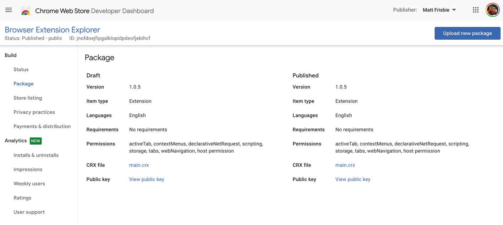
**Hình 13-1:** Trang gói Chrome Web Store bao gồm liên kết khóa công khai. Lưu ý ID bắt đầu bằng “jnof”

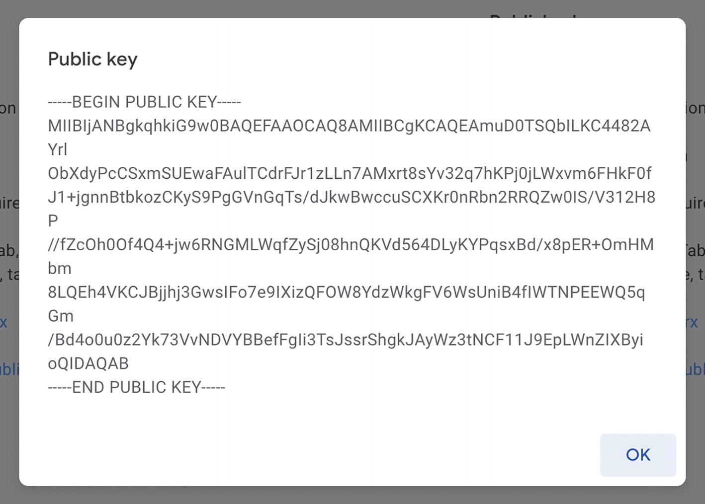
**Hình 13-2:** Khóa công khai được tiết lộ

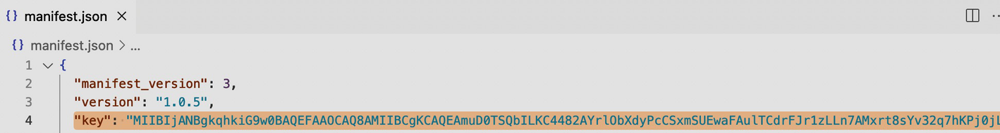
**Hình 13-3:** Khóa công khai được làm phẳng và đưa vào manifest

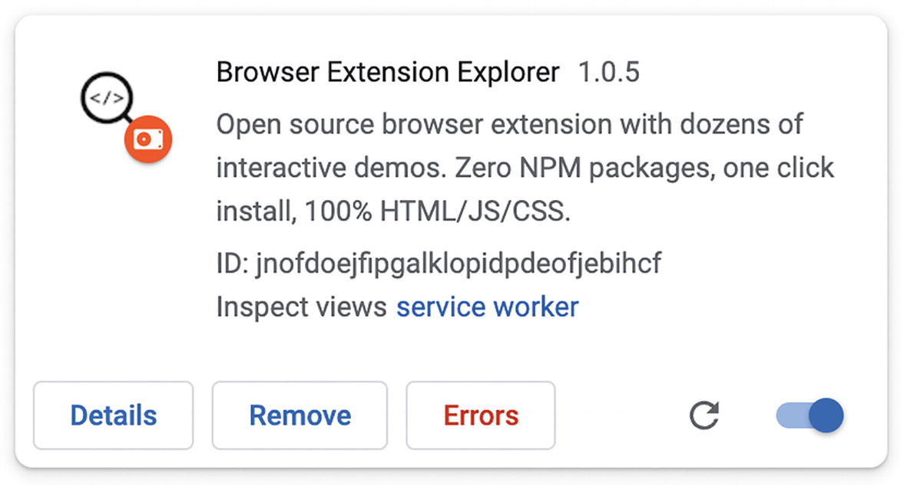
**Hình 13-4:** Tiện ích mở rộng được tải cục bộ. Lưu ý ID bắt đầu bằng “jnof”

### Xác thực bằng Token Web JSON (Json Web Token Authentication)

Xác thực kiểu token hoạt động tốt cho việc xác thực dựa trên ứng dụng (app-based) nơi cookie không thực tế. Đối với các tiện ích mở rộng trình duyệt, các sơ đồ xác thực token như JWT (JSON Web Token) là lý tưởng. Popup, trang tùy chọn, trang devtools và kịch bản nền đều có thể xác thực trực tiếp với một máy chủ và chia sẻ token xác thực giữa các thành phần của tiện ích mở rộng mà không gặp vấn đề gì. Kịch bản nội dung có thể sử dụng JWT, nhưng chính sách đa nguồn của trang lưu trữ có thể sẽ chặn các yêu cầu đến máy chủ, vì vậy việc gửi yêu cầu gián tiếp qua background service worker là giải pháp thay thế được ưu tiên.

### OAuth và OpenID

Với API `chrome.identity`, các tiện ích mở rộng trình duyệt có sự hỗ trợ hàng đầu (first-class support) cho OAuth và OpenID. API này không được hỗ trợ bên trong kịch bản nội dung, nhưng nó có thể được triển khai hiệu quả ở bất kỳ nơi nào khác trong tiện ích mở rộng trình duyệt. Đối với các nhà phát triển không muốn triển khai một máy chủ backend, việc ủy quyền và xác thực thông qua OAuth hoặc OpenID là cực kỳ thực tế.

API `chrome.identity` được khởi xướng bởi Google Chrome, nhưng nó nhận được sự hỗ trợ ít nhất là một phần trong tất cả các trình duyệt Chromium và Firefox. Trong Google Chrome, các tiện ích mở rộng trình duyệt có thêm các phương thức API identity bao gồm luồng ủy quyền OAuth hợp lý (sẽ nói thêm về điều này ở phần sau của chương).

> [!NOTE]
> Safari hiện chưa hỗ trợ API identity.

## OAuth, OpenID và API Identity

> [!NOTE]
> Phần này giả định bạn có kiến thức cơ bản về cách thức hoạt động của giao thức OAuth2. Để biết phần giới thiệu về OAuth2, Auth0 có một bài viết tuyệt vời về nó: [https://auth0.com/intro-to-iam/what-is-oauth-2/](https://auth0.com/intro-to-iam/what-is-oauth-2/).

Khả năng ủy thác xác thực và ủy quyền cho một nền tảng bên thứ ba là cực kỳ hữu ích, nhưng việc triển khai điều này trong các tiện ích mở rộng trình duyệt là một việc khó khăn. Hãy xem xét một số thách thức liên quan:

* Việc ủy thác đăng nhập cho một nền tảng bên thứ ba yêu cầu khả năng mở một giao diện đáng tin cậy để thu thập thông tin xác thực. Các background service worker không thể sử dụng `window.open()`.
* Việc cấu hình một nền tảng để hỗ trợ OAuth yêu cầu biết trước ID của tiện ích mở rộng.
* OAuth và OpenID sử dụng cùng một giao thức nền tảng, bao gồm một URL điều hướng (redirect URL). Các tiện ích mở rộng trình duyệt chỉ có thể hiển thị bên trong các URL riêng tư với một giao thức tiện ích.

May mắn thay, API identity giải quyết tất cả các vấn đề này bằng cách cung cấp một bộ công cụ linh hoạt để triển khai xác thực và ủy quyền được ủy thác.

### Các phương thức API OAuth

Có hai cách sử dụng OAuth trong một tiện ích mở rộng:

* `chrome.identity.getAuthToken()` cho phép bạn xác thực một cách tự nhiên. Phương pháp này cho phép bạn bỏ qua việc cung cấp URL điều hướng và thực hiện yêu cầu token ủy quyền. Thay vào đó, bạn chỉ cần cung cấp các giá trị bắt buộc bên trong thuộc tính `oauth2` của manifest và gọi phương thức này. Trình duyệt sẽ mở hộp thoại OAuth và kết quả trả về của phương thức sẽ được truyền mã token OAuth. Đây là cách đơn giản nhất để triển khai OAuth trong một tiện ích mở rộng, nhưng nó chỉ có sẵn trong Google Chrome. **Điều này yêu cầu một client ID cho "Chrome app".**
* `chrome.identity.launchWebAuthFlow()` là phương thức tổng quát hơn để sử dụng OAuth2. Nó hoạt động đa trình duyệt (Firefox, Edge, v.v.) và đa nền tảng (hỗ trợ OAuth2 với Facebook, Github, v.v.). Nó tốn nhiều công sức hơn, vì yêu cầu bạn phải triển khai thủ công từng bước của OAuth2.

### Các URL điều hướng OAuth (OAuth Redirect URLs)

Để giải quyết vấn đề URL điều hướng OAuth, trình duyệt hỗ trợ một URL đặc biệt sẽ hướng luồng xác thực quay trở lại tiện ích mở rộng. Để truy cập URL này, bạn có thể sử dụng phương thức `chrome.identity.getRedirectURL()`. Tài liệu của Chrome mô tả hành vi của nó:

> *Phương thức này cho phép luồng xác thực với các nhà cung cấp danh tính không phải của Google bằng cách khởi chạy một chế độ xem web (web view) và điều hướng nó đến URL đầu tiên trong luồng xác thực của nhà cung cấp. Khi nhà cung cấp điều hướng đến một URL khớp với mẫu `https://<app-id>.chromiumapp.org/*`, cửa sổ sẽ đóng lại và URL điều hướng cuối cùng sẽ được truyền cho hàm callback.*

Nói cách khác, trình duyệt dành cho URL này sự xử lý đặc biệt để hỗ trợ xác thực trong bối cảnh các tiện ích mở rộng trình duyệt. Tất cả các trình duyệt Chromium và Firefox đều hỗ trợ phương thức này.

> [!TIP]
> Bạn có thể thấy logic xử lý URL đặc biệt này trong mã nguồn của chromium: [https://chromium.googlesource.com/chromium/chromium/+/master/chrome/browser/extensions/api/identity/web_auth_flow.cc](https://chromium.googlesource.com/chromium/chromium/+/master/chrome/browser/extensions/api/identity/web_auth_flow.cc).

### Cấu hình Nền tảng Ủy quyền (Configuring the Authorization Platform)

Bước đầu tiên trong việc thiết lập OAuth cho một tiện ích mở rộng chrome là cấu hình nền tảng ủy quyền để cung cấp quyền truy cập cho tiện ích mở rộng. Việc này bao gồm cấu hình màn hình chấp thuận OAuth (OAuth consent screen) và tạo một client ID (Hình 13-5, 13-6, 13-7, 13-8 và 13-9). Màn hình chấp thuận là những gì sẽ hiển thị trong cửa sổ bật lên khi người dùng bắt đầu luồng xác thực OAuth; client ID là chuỗi xác định duy nhất tiện ích mở rộng và cho phép nó tương tác với nền tảng ủy quyền (Hình 13-10).

> [!NOTE]
> Quá trình này sẽ hơi khác một chút đối với các nền tảng ủy quyền và luồng OAuth khác nhau, nhưng nó sẽ luôn cung cấp cho bạn một client ID.

Các ảnh chụp màn hình sau đây minh họa một số bước này khi cấu hình Google OAuth.

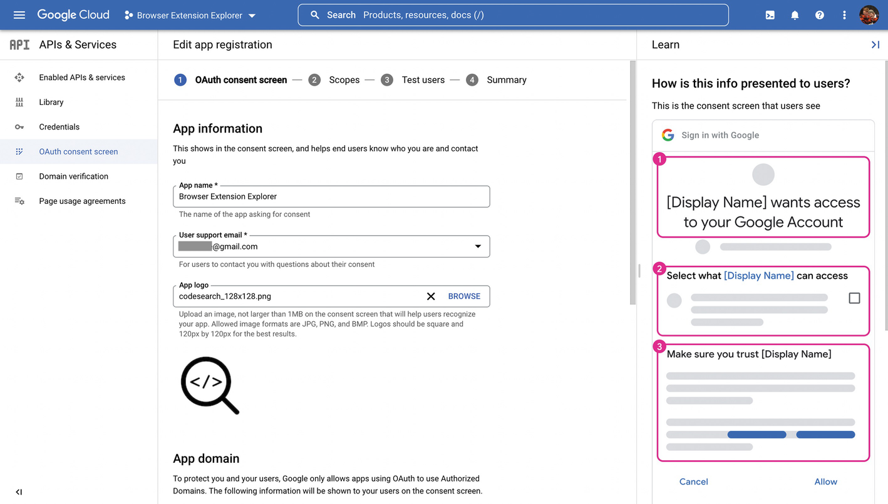
**Hình 13-5:** Cấu hình màn hình chấp thuận OAuth trong bảng điều khiển Google Cloud

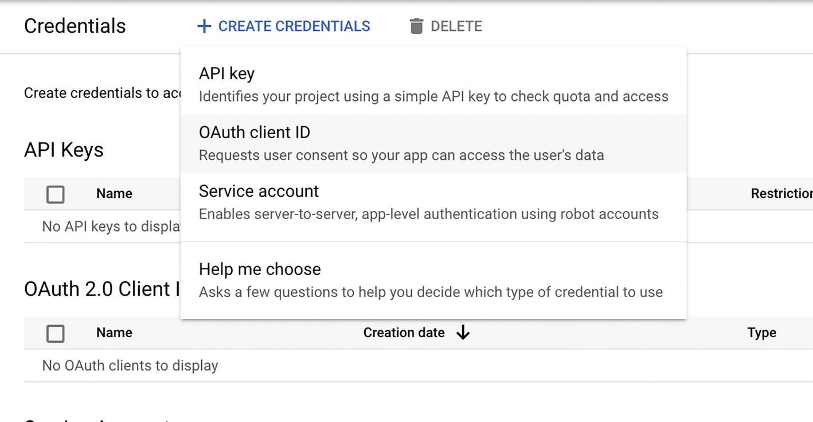
**Hình 13-6:** Tạo thông tin xác thực client ID OAuth cho tiện ích mở rộng trình duyệt trong bảng điều khiển Google Cloud

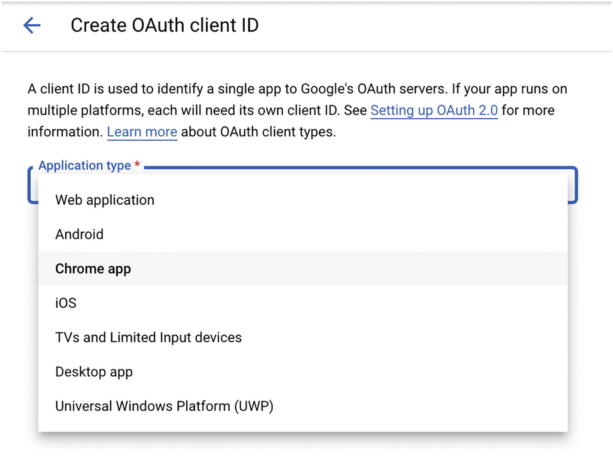
**Hình 13-7:** Các tùy chọn của Google cho client ID OAuth

Không phải tất cả các nền tảng đều hỗ trợ sự phân biệt này. Trong trường hợp của Google OAuth, cả "Chrome app" và "Web application" đều có thể được sử dụng cho các tiện ích mở rộng trình duyệt.

* **Chrome app** có nghĩa là bạn đang sử dụng trường `oauth2` trong manifest và phương thức `getAuthToken()`. Điều này cũng sẽ xác thực người dùng trong hồ sơ trình duyệt Google Chrome đang hoạt động, điều này có thể không mong muốn.
* **Web application** có nghĩa là bạn đang sử dụng phương thức `launchWebAuthFlow()`. Điều này cho phép bạn xác thực tách biệt với hồ sơ trình duyệt Google Chrome.

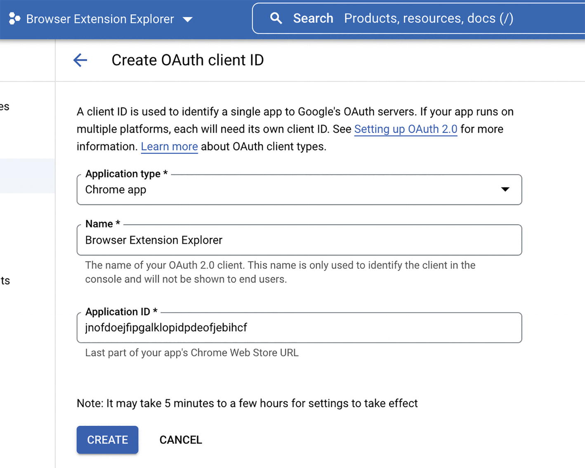
**Hình 13-8:** Cấu hình client ID OAuth cho ứng dụng Chrome

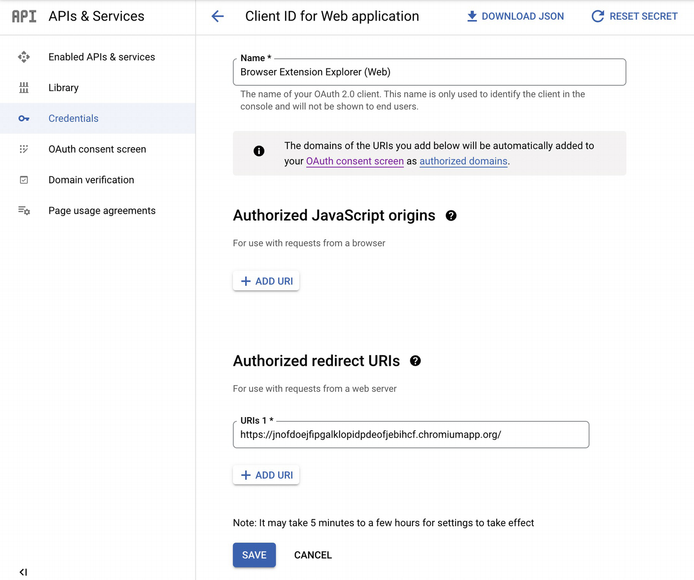
**Hình 13-9:** Cấu hình client ID cho ứng dụng web

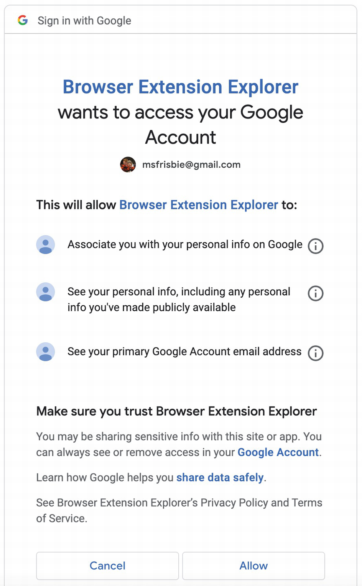
**Hình 13-10:** Màn hình chấp thuận OAuth đang hoạt động

Google cuối cùng sẽ cung cấp cho bạn client ID của mình trong một tệp JSON có thể tải xuống. Một ví dụ giả định được hiển thị ở đây:

Tệp **client_secret.json**:

```json
{
  "installed": {
    "client_id": "<some_id>.apps.googleusercontent.com",
    "project_id": "browser-extension-explorer",
    "auth_uri": "https://accounts.google.com/o/oauth2/auth",
    "token_uri": "https://oauth2.googleapis.com/token",
    "auth_provider_x509_cert_url": "https://www.googleapis.com/oauth2/v1/certs"
  }
}
```

Các nền tảng khác sẽ cung cấp cho bạn client ID theo một cách thức và định dạng khác, nhưng cuối cùng đây là những gì phải được đưa vào tiện ích mở rộng trình duyệt của bạn để kích hoạt xác thực OAuth.

### Trợ giúp Bổ sung (Additional Help)

Việc thiết lập OAuth cực kỳ khó hiểu. Tôi đã chọn lọc một số liên kết hướng dẫn bạn thiết lập nó theo nhiều cách khác nhau:

* [https://developer.chrome.com/docs/extensions/mv3/tut_oauth/](https://developer.chrome.com/docs/extensions/mv3/tut_oauth/)
* [https://blog.plasmo.com/p/firebase-chrome-extension/](https://blog.plasmo.com/p/firebase-chrome-extension/)

## Các ví dụ về OAuth và OpenID

Khi nói đến OAuth cho các tiện ích mở rộng, thực sự không có gì thay thế tốt hơn việc bạn bắt tay vào thực hiện với mã nguồn đang hoạt động. Các ví dụ sau đây minh họa những cách hơi khác nhau để cấu hình và kích hoạt luồng OAuth.

**Các ví dụ này được cung cấp dưới dạng mã nguồn, nhưng chúng sẽ không hoạt động nếu không có một số công đoạn chuẩn bị từ phía bạn. Bạn sẽ cần phải cấu hình thông tin nhà cung cấp OAuth của riêng mình như client ID để giúp chúng hoạt động chính xác.**

> [!TIP]
> Tiện ích mở rộng đi kèm của cuốn sách, *Browser Extension Explorer*, bao gồm ba ví dụ OAuth đang hoạt động. Truy cập `buildingbrowserextensions.com` để cài đặt nó.

### Google OAuth với getAuthToken()

Ví dụ này sử dụng các chức năng OAuth tự nhiên của Google Chrome để xác thực người dùng. Nhấp vào biểu tượng thanh công cụ sẽ kích hoạt luồng OAuth và xác thực thành công sẽ ghi lại một số trường cơ bản. Một số điều cần lưu ý:

* Các quyền được yêu cầu bao gồm `identity`, cho phép truy cập vào API identity và `identity.email`, cho phép tiện ích mở rộng dễ dàng truy cập email và Gaia ID của tài khoản người dùng đã đăng nhập vào hồ sơ hiện tại thông qua `chrome.identity.getProfileUserInfo()`.
* `getAuthToken()` có tính không thay đổi (idempotent). Sau khi người dùng xác thực, nó sẽ lưu mã token OAuth vào bộ nhớ đệm. Nếu được gọi khi người dùng đã xác thực, không có hộp thoại OAuth nào xuất hiện: phương thức sẽ lấy mã token từ bộ nhớ đệm và truyền nó vào hàm callback. Tùy chọn `interactive` kiểm soát việc nó có cố gắng mở hộp thoại OAuth hay không nếu người dùng chưa được xác thực. Nếu là `false`, nó sẽ thoát và báo lỗi nếu chưa được xác thực. Ngược lại, hộp thoại OAuth sẽ mở ra.
* Lưu ý rằng trong luồng này không có bất kỳ URL nào khác ngoài những gì được cung cấp trong manifest. URL điều hướng và các điểm cuối (endpoints) OAuth đều được trình duyệt tự động xử lý!

**Ví dụ 13-1a:** *manifest.json*

```json
{
  "name": "MVX",
  "version": "0.0.1",
  "manifest_version": 3,
  "action": {},
  "background": {
    "service_worker": "background.js",
    "type": "module"
  },
  "permissions": ["identity", "identity.email"],
  "oauth2": {
    "client_id": "YOUR_CLIENT_ID",
    "scopes": [
      "https://www.googleapis.com/auth/userinfo.email",
      "https://www.googleapis.com/auth/userinfo.profile"
    ]
  }
}
```

**Ví dụ 13-1b:** *background.js*

```javascript
chrome.action.onClicked.addListener(() => {
  chrome.identity.getAuthToken(
    {
      interactive: true,
    },
    (token) => {
      if (token) {
        chrome.identity.getProfileUserInfo(
          { accountStatus: "ANY" },
          (info) => console.log(info)
        );
      }
    }
  );
});

// Console output:
// { "email": <google_email>, "id": <google_gaia_id> }
```

### Google OpenID với launchWebAuthFlow()

> [!NOTE]
> Phần này giả định bạn có kiến thức cơ bản về cách thức hoạt động của giao thức OpenID Connect. Để biết phần giới thiệu về OpenID, Auth0 có một bài viết tuyệt vời về nó: [https://auth0.com/intro-to-iam/what-is-openid-connect-oidc/](https://auth0.com/intro-to-iam/what-is-openid-connect-oidc/).

Ví dụ này triển khai luồng Google OpenID Connect để xác thực người dùng bằng `launchWebAuthFlow()`. Nhấp vào biểu tượng thanh công cụ sẽ kích hoạt luồng OpenID và xác thực thành công sẽ ghi lại tải trọng (payload) OpenID. Một số điều cần lưu ý:

* So với ví dụ trước, chúng ta không còn nhu cầu về quyền `identity.email` nữa vì chúng ta không sử dụng phương thức `getProfileUserInfo()`.
* Lưu ý rằng client ID đang được truyền bên trong JavaScript thay vì được cung cấp trong manifest.
* Với `launchWebAuthFlow()`, giờ nay bạn phải cung cấp thủ công URL điều hướng mà trình duyệt sẽ sử dụng để điều hướng quay lại hàm callback tiện ích mở rộng của bạn.
* `launchWebAuthFlow()` có điều khiển `interactive` hoạt động giống hệt như `getAuthToken()`.
* OpenID yêu cầu các tham số chuỗi truy vấn (query string) cụ thể trong URL ban đầu và trả về một token web JSON (JWT). Ví dụ này giải nén JWT để bạn có thể thấy dữ liệu được đóng gói bên trong.

**Ví dụ 13-2a:** *manifest.json*

```json
{
  "name": "MVX",
  "version": "0.0.1",
  "manifest_version": 3,
  "action": {},
  "background": {
    "service_worker": "background.js",
    "type": "module"
  },
  "permissions": ["identity"]
}
```

**Ví dụ 13-2b:** *background.js*

```javascript
chrome.action.onClicked.addListener(() => {
  const clientId = "YOUR_CLIENT_ID";
  const extensionRedirectUri = chrome.identity.getRedirectURL();
  const nonce = Math.random().toString(36).substring(2, 15);

  const authUrl = new URL("https://accounts.google.com/o/oauth2/v2/auth");

  // Define fields for OpenID
  authUrl.searchParams.set("client_id", clientId);
  authUrl.searchParams.set("response_type", "id_token");
  authUrl.searchParams.set("redirect_uri", extensionRedirectUri);
  authUrl.searchParams.set("scope", "openid profile email");
  authUrl.searchParams.set("nonce", nonce);
  authUrl.searchParams.set("prompt", "consent");

  chrome.identity.launchWebAuthFlow(
    {
      url: authUrl.href,
      interactive: true,
    },
    (redirectUrl) => {
      if (redirectUrl) {
        // The ID token is in the URL hash
        const urlHash = redirectUrl.split("#")[1];
        const params = new URLSearchParams(urlHash);
        const jwt = params.get("id_token");

        // Parse the JSON Web Token
        const base64Url = jwt.split(".")[1];
        const base64 = base64Url.replace("-", "+").replace("_", "/");
        const token = JSON.parse(atob(base64));

        console.log(token);
      }
    }
  );
});

// Console output:
// {
//      "iss": "https://accounts.google.com",
//      "azp": "...",
//      "aud": "...",
//      "sub": "...",
//      "email": "XXXXX@gmail.com",
//      "email_verified": true,
//      "nonce": "...",
//      "name": "Matt Frisbie",
//      "picture": "...",
//      "given_name": "Matt",
//      "family_name": "Frisbie",
//      "locale": "en",
//      "iat": ...,
//      "exp": ...,
//      "jti": "..."
// }
```

### Ủy quyền OAuth Github thủ công với launchWebAuthFlow()

Ví dụ này triển khai luồng Github OAuth2 để xác thực người dùng bằng `launchWebAuthFlow()`. Nhấp vào biểu tượng thanh công cụ sẽ kích hoạt luồng Github OAuth2 và xác thực thành công sẽ ghi lại tải trọng hồ sơ Github. Một số điều cần lưu ý:

* Ví dụ này thực hiện tất cả các công đoạn của một luồng OAuth đầy đủ: khởi chạy hộp thoại xác thực, thu thập mã ủy quyền (authorization code), sử dụng mã đó để lấy mã token truy cập (access token) và cuối cùng thực hiện một yêu cầu đã được xác thực mã OAuth.
* Hộp thoại OAuth của Github truyền mã ủy quyền ban đầu bằng cách thêm nó vào URL điều hướng, và mã này được trích xuất bên trong hàm callback ở đây.
* OAuth của Github cung cấp cho bạn một client secret, mã bí mật này phải được đưa vào yêu cầu để lấy mã token truy cập.

**Ví dụ 13-3a:** *manifest.json*

```json
{
  "name": "MVX",
  "version": "0.0.1",
  "manifest_version": 3,
  "action": {},
  "background": {
    "service_worker": "background.js",
    "type": "module"
  },
  "permissions": ["identity"]
}
```

**Ví dụ 13-3b:** *background.js*

```javascript
chrome.action.onClicked.addListener(() => {
  const clientId = "YOUR_CLIENT_ID";
  const extensionRedirectUri = chrome.identity.getRedirectURL();

  const authUrl = new URL("https://github.com/login/oauth/authorize");

  authUrl.searchParams.set("client_id", clientId);
  authUrl.searchParams.set("redirect_uri", extensionRedirectUri);

  chrome.identity.launchWebAuthFlow(
    {
      url: authUrl.href,
      interactive: true,
    },
    async (redirectUrl) => {
      if (redirectUrl) {
        const queryString = new URL(redirectUrl).search;
        const params = new URLSearchParams(queryString);
        const code = params.get("code");

        const authUrl = new URL("https://github.com/login/oauth/access_token");
        authUrl.searchParams.append("client_id", clientId);
        authUrl.searchParams.append("redirect_uri", extensionRedirectUri);
        authUrl.searchParams.append("client_secret", "YOUR_CLIENT_SECRET");
        authUrl.searchParams.append("code", code);

        const response = await fetch(authUrl, {
          method: "POST",
          headers: {
            Accept: "application/json",
          },
        });

        const accessTokenData = await response.json();

        const r = await fetch("https://api.github.com/user", {
          headers: {
            Authorization: "Bearer " + accessTokenData.access_token,
          },
        });

        console.log(await r.json());
      }
    }
  );
});

// Console output:
// {
//      "login": "msfrisbie",
//      "id": ...,
//      "node_id": "...",
//      "avatar_url": "...",
//      "name": " Matt Frisbie",
//      "blog": "https://www.mattfriz.com",
//      "location": "Chicago, IL",
//      "bio": "Software engineer, bestselling author",
//      "twitter_username": "mattfriz",
//      "url": "https://api.github.com/users/msfrisbie",
//      ...
//   }}
```

## Các API Kết nối mạng (Networking APIs)

Các tiện ích mở rộng trình duyệt được cấp quyền truy cập vào một số API mạnh mẽ có thể được sử dụng để kiểm tra và sửa đổi luồng lưu lượng truy cập bên trong trình duyệt. Các phương thức này là lý do tại sao các tiện ích mở rộng chặn quảng cáo lại hiệu quả đến vậy. Phần này sẽ kiểm tra ba API:

* API `webNavigation` cho phép bạn quan sát các sự kiện điều hướng trình duyệt ở cấp cao với độ chi tiết rất cao.
* API `webRequest` cho phép bạn chặn và sửa đổi lưu lượng truy cập theo kiểu chặn (blocking), nghĩa là đối với bất kỳ yêu cầu mạng nào, tiện ích mở rộng có thể chèn một hàm JavaScript có thể sửa đổi hoặc hủy hoàn toàn yêu cầu đó. Định danh "chặn" cho biết rằng yêu cầu mạng sẽ đợi hàm JavaScript trả về trước khi tiếp tục.
* API `declarativeNetRequest` cho phép bạn tạo các bộ quy tắc hướng dẫn trình duyệt cách xử lý các yêu cầu mạng một cách tự nhiên. Các quy tắc này có thể yêu cầu trình duyệt sửa đổi hoặc chặn một yêu cầu. API này là sự kế thừa của API `webRequest` và kém mạnh mẽ hơn đáng kể theo nhiều cách. API này chỉ có sẵn trong manifest v3.

> [!NOTE]
> Trong manifest v3, sự hỗ trợ cho `webRequest` đang bị phân mảnh. Ví dụ, Firefox sẽ tiếp tục hỗ trợ API này, trong khi các trình duyệt Chromium đang loại bỏ sự hỗ trợ.

### API webNavigation

API `webNavigation` cho phép một tiện ích mở rộng xem các sự kiện điều hướng từ trình duyệt. API cho phép một tiện ích mở rộng thêm hàm xử lý sự kiện cho các sự kiện vòng đời điều hướng sau:

* onBeforeNavigate
* onCommitted
* onCompleted
* onCreatedNavigationTarget
* onDOMContentLoaded
* onErrorOccurred
* onHistoryStateUpdated
* onReferenceFragmentUpdated
* onTabReplaced

Hình 13-11 cho thấy luồng của các sự kiện.

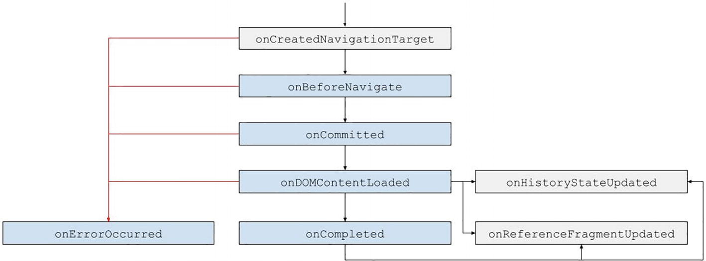
**Hình 13-11:** Luồng sự kiện `webNavigation`

> [!NOTE]
> Thông tin chi tiết về từng sự kiện này có thể được tìm thấy trong tài liệu MDN: [https://developer.mozilla.org/en-US/docs/Mozilla/Add-ons/WebExtensions/API/webNavigation](https://developer.mozilla.org/en-US/docs/Mozilla/Add-ons/WebExtensions/API/webNavigation).

Hầu hết thời gian, các tiện ích mở rộng sẽ chỉ quan tâm đến việc thiết lập các hàm xử lý cho các sự kiện vòng đời chính được kích hoạt bởi điều hướng trình duyệt thông thường:

1. onBeforeNavigate
2. onCommitted
3. onDOMContentLoaded
4. onCompleted

Tiện ích mở rộng đơn giản sau đây sẽ ghi lại vào bảng điều khiển tiện ích bất cứ khi nào một thẻ trong trình duyệt truy cập một URL mới. Tải tiện ích mở rộng, mở một thẻ mới và điều hướng đến bất kỳ trang web nào để xem các sự kiện điều hướng trong thời gian thực.

**Ví dụ 13-4a:** *manifest.json*

```json
{
  "name": "MVX",
  "version": "0.0.1",
  "manifest_version": 3,
  "background": {
    "service_worker": "background.js",
    "type": "module"
  },
  "permissions": ["webNavigation"]
}
```

**Ví dụ 13-4b:** *background.js*

```javascript
chrome.webNavigation.onCompleted.addListener((details) => {
  console.log(details);
});

// Example console log:
// {
//     "documentId": "7D0F7EBBCB0020C74DA89F2D36C461B4",
//     "documentLifecycle": "active",
//     "frameId": 0,
//     "frameType": "outermost_frame",
//     "parentFrameId": -1,
//     "processId": 1040,
//     "tabId": 173953269,
//     "timeStamp": 1661549345594.7412,
//     "url": "https://en.wikipedia.org/wiki/Main_Page"
// }
```

### API webRequest

API `webRequest` cho phép các tiện ích mở rộng trình duyệt kiểm tra và sửa đổi các sự kiện yêu cầu mạng từ một trang web. API cho phép một tiện ích mở rộng thêm hàm xử lý sự kiện cho các sự kiện vòng đời yêu cầu sau:

* onActionIgnored
* onAuthRequired
* onBeforeRedirect
* onBeforeRequest
* onBeforeSendHeaders
* onCompleted
* onErrorOccurred
* onHeadersReceived
* onResponseStarted
* onSendHeaders

Hình 13-12 cho thấy luồng của các sự kiện.

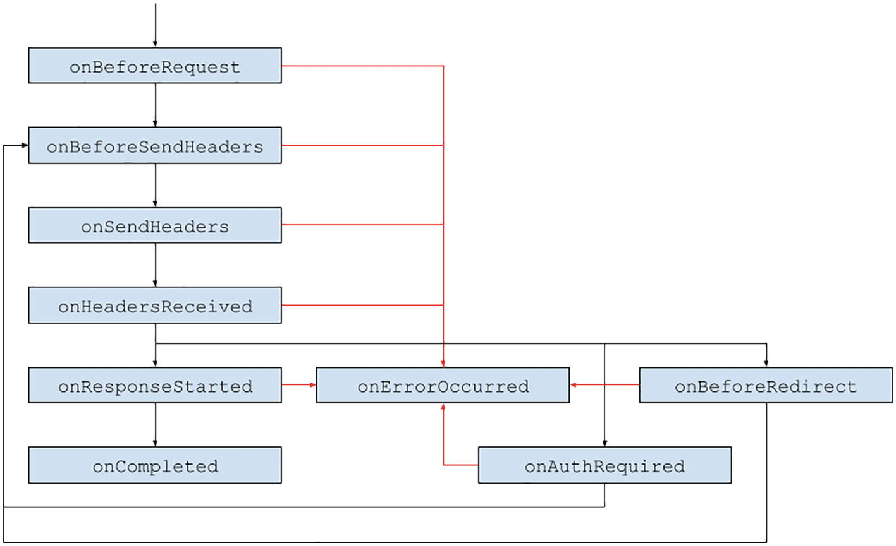
**Hình 13-12:** Luồng sự kiện `webRequest`

> [!NOTE]
> Thông tin chi tiết về từng sự kiện này có thể được tìm thấy trong tài liệu MDN: [https://developer.mozilla.org/en-US/docs/Mozilla/Add-ons/WebExtensions/API/webRequest](https://developer.mozilla.org/en-US/docs/Mozilla/Add-ons/WebExtensions/API/webRequest).

#### Sửa đổi Yêu cầu (Modifying Requests)

Nếu bạn chỉ muốn kiểm tra dữ liệu sự kiện vòng đời yêu cầu, chỉ cần quyền `webRequest`. Tuy nhiên, nếu bạn muốn có khả năng sửa đổi các yêu cầu này, bạn sẽ cần thêm quyền `webRequestBlocking`. Điều này cho phép bạn thực hiện các tác vụ sau:

* Tiện ích mở rộng có thể **hủy một yêu cầu** bên trong hàm xử lý `onBeforeRequest`, `onBeforeSendHeaders` hoặc `onAuthRequired`.
* Tiện ích mở rộng có thể **điều hướng lại yêu cầu** bên trong hàm xử lý `onBeforeRequest` hoặc `onHeadersReceived`.
* Tiện ích mở rộng có thể **sửa đổi các tiêu đề yêu cầu (request headers)** bên trong hàm xử lý `onBeforeSendHeaders`.
* Tiện ích mở rộng có thể **sửa đổi các tiêu đề phản hồi (response headers)** trong hàm xử lý `onHeadersReceived`.
* Tiện ích mở rộng có thể **cung cấp thông tin xác thực** trong hàm xử lý `onAuthRequired`.

Ví dụ đơn giản sau đây sẽ chặn tất cả các yêu cầu hình ảnh trên Wikipedia. Hãy nhớ rằng bạn cũng phải yêu cầu quyền URL nếu muốn kiểm tra hoặc sửa đổi các yêu cầu trên nguồn (origin) đó.

> [!NOTE]
> API `webRequest` và manifest v3 thiếu sự hỗ trợ trong Google Chrome, vì vậy ví dụ này được viết bằng manifest v2. Tôi khuyên bạn nên thử nghiệm nó trong Firefox.

**Ví dụ 13-5a:** *manifest.json*

```json
{
  "name": "MVX",
  "version": "0.0.1",
  "manifest_version": 2,
  "background": {
    "scripts": ["background.js"]
  },
  "permissions": [
    "webRequest",
    "webRequestBlocking",
    "<all_urls>"
  ]
}
```

**Ví dụ 13-5b:** *background.js*

```javascript
chrome.webRequest.onBeforeRequest.addListener(
  () => {
    return {
      cancel: true,
    };
  },
  {
    urls: [
      "*://www.wikipedia.org/portal/wikipedia.org/assets/img/*"
    ],
  },
  ["blocking"]
);
```

#### Sự phân mảnh (Fragmentation)

Không gian tiện ích mở rộng trình duyệt đang hướng tới một hướng kỳ lạ. Tại thời điểm cuốn sách này được viết, có vẻ như các trình duyệt Chromium đã quyết định chấm dứt hỗ trợ cho `webRequest` trong manifest v3, nhưng Firefox có thể tiếp tục hỗ trợ API này trong manifest v3. Hiện chưa rõ không gian này sẽ kết thúc ở đâu, nhưng tại thời điểm này, tôi khuyên bạn không nên xây dựng một tiện ích mở rộng dựa trực tiếp vào API này.

### API declarativeNetRequest

API `declarativeNetRequest` (DNR) được quảng cáo là sự kế thừa của API `webRequest`. Động lực cho sự thay đổi này là loại bỏ các hàm xử lý JavaScript chặn để chuyển sang mô hình khai báo hiệu quả hơn được trình duyệt triển khai. Giờ đây, thay vì thực hiện các sửa đổi bên trong một hàm JavaScript, bạn sẽ cung cấp các "hướng dẫn" cho mỗi yêu cầu khớp dưới dạng một đối tượng cấu hình JSON.

Đối với hầu hết các tiện ích mở rộng, DNR là một sự thay thế hiệu quả cho `webRequest`. Tuy nhiên, chất lượng của các trình chặn quảng cáo sẽ bị ảnh hưởng vì hai lý do chính:

* Các trình duyệt thực thi giới hạn toàn cầu về số lượng quy tắc mà các tiện ích mở rộng có thể xác định cho `declarativeNetRequest`. Các trình chặn quảng cáo hiện đại xác định khoảng 100.000 quy tắc trở lên, và các tiện ích mở rộng chặn quảng cáo chắc chắn sẽ nhanh chóng chạm tới giới hạn này.
* Các trình chặn quảng cáo hiện đại dựa trên logic phức tạp bên trong các hàm xử lý `webRequest` chặn. Không phải tất cả logic này đều có thể được chuyển sang các quy tắc `declarativeNetRequest` tương đối đơn giản, vì vậy các tiện ích mở rộng chặn quảng cáo sẽ không hiệu quả trong việc chống lại quảng cáo.

#### Quyền hạn (Permissions)

API `declarativeNetRequest` có thể được sử dụng với ba quyền khác nhau:

* Quyền `declarativeNetRequest` cho phép tiện ích mở rộng của bạn xác định các quy tắc DNR, nhưng bạn vẫn sẽ cần yêu cầu quyền lưu trữ (host permissions) để áp dụng các quy tắc trên các nguồn cụ thể.
* Quyền `declarativeNetRequestWithHostAccess` có thể được sử dụng thay cho quyền `declarativeNetRequest`. Nó cho phép bạn chặn hoặc nâng cấp các yêu cầu trên bất kỳ nguồn nào mà không cần yêu cầu quyền lưu trữ. Chuyển hướng hoặc sửa đổi tiêu đề vẫn sẽ yêu cầu các quyền lưu trữ cụ thể.
* Quyền `declarativeNetRequestFeedback` có thể được thêm vào như một sự bổ sung cho hai quyền trước đó. Với nó, tiện ích mở rộng của bạn có thể truy cập các hàm và sự kiện trả về thông tin về các quy tắc khớp.

#### Cấu trúc Quy tắc và Bộ quy tắc (Rule and Ruleset Structure)

Tất cả các quy tắc DNR đều dưới dạng một đối tượng JSON. Chỉ một quy tắc duy nhất sẽ được áp dụng cho mỗi yêu cầu, cho mỗi tiện ích mở rộng. Mỗi đối tượng quy tắc được cấu trúc như sau:

* `id` phải là một số nguyên dương duy nhất.
* `priority` là một số nguyên tùy chọn có thể được sử dụng để kiểm soát quy tắc nào được áp dụng trong các trường hợp có nhiều quy tắc khớp với một yêu cầu.
* `condition` là một đối tượng mô tả thời điểm quy tắc này nên được áp dụng. Với nó, bạn có thể bao gồm hoặc loại trừ các tên miền, loại tên miền, ID thẻ và loại tài nguyên.
* `action` là một đối tượng mô tả quy tắc này làm gì. Nó bao gồm một `type`, có thể là `block`, `redirect`, `allow`, `upgradeScheme`, `modifyHeaders` hoặc `allowAllRequests`, và các thuộc tính khác nhau cấu hình cách quy tắc sẽ hoạt động.

Các quy tắc DNR được xác định theo một trong hai cách:

* **Các bộ quy tắc tĩnh (Static rulesets)** là các mảng gồm các đối tượng quy tắc trong các tệp JSON. Các tệp bộ quy tắc có thể được cung cấp trong manifest hoặc được thêm bằng lập trình. Chúng cũng có thể được bật hoặc tắt theo yêu cầu. Các bộ quy tắc tĩnh chỉ có thể tồn tại dưới dạng các tệp không thay đổi được đóng gói cùng với tiện ích mở rộng. Tổng số quy tắc tĩnh bị giới hạn bởi trình duyệt.
* **Các quy tắc động (Dynamic rules)** là các đối tượng quy tắc được tạo hoàn toàn bằng lập trình. Chúng có thể được thêm, xóa, sửa đổi và bật hoặc tắt. Một tập hợp con của các quy tắc động là **quy tắc phiên (session rules)**, là các quy tắc động không được lưu lại giữa các lần khởi động trình duyệt. Tổng số quy tắc động bị giới hạn bởi trình duyệt.

Dù là tĩnh hay động, một quy tắc DNR đều được trình duyệt xử lý như nhau.

> [!NOTE]
> API `declarativeNetRequest` có chiều sâu khá lớn. Hãy tham khảo tài liệu của Google Chrome để biết chi tiết về tất cả các tính năng của nó: [https://developer.chrome.com/docs/extensions/reference/declarativeNetRequest](https://developer.chrome.com/docs/extensions/reference/declarativeNetRequest).

#### Các bộ quy tắc tĩnh (Static Rulesets)

Hãy cùng kiểm tra các bộ quy tắc tĩnh bằng cách xem tiện ích mở rộng đơn giản sau đây có thể chặn hình ảnh trên Wikipedia:

**Ví dụ 13-6a:** *manifest.json*

```json
{
  "name": "MVX",
  "version": "0.0.1",
  "manifest_version": 3,
  "background": {
    "service_worker": "background.js",
    "type": "module"
  },
  "declarative_net_request": {
    "rule_resources": [
      {
        "id": "ruleset_1",
        "enabled": true,
        "path": "rules_1.json"
      }
    ]
  },
  "action": {},
  "permissions": ["declarativeNetRequest"],
  "host_permissions": [
    "*://*.wikipedia.org/*",
    "*://*.wikimedia.org/*"
  ]
}
```

**Ví dụ 13-6b:** *background.js*

```javascript
const RULESET_ID = "ruleset_1";

chrome.action.onClicked.addListener(async () => {
  const enabled_rulesets =
    await chrome.declarativeNetRequest.getEnabledRulesets();

  if (enabled_rulesets.includes(RULESET_ID)) {
    chrome.declarativeNetRequest.updateEnabledRulesets({
      disableRulesetIds: [RULESET_ID],
    });
  } else {
    chrome.declarativeNetRequest.updateEnabledRulesets({
      enableRulesetIds: [RULESET_ID],
    });
  }

  console.log("Toggled ruleset");
});
```

**Ví dụ 13-6c:** *rules_1.json*

```json
[
  {
    "id": 1,
    "priority": 1,
    "action": {
      "type": "block"
    },
    "condition": {
      "domains": ["wikipedia.org", "wikimedia.org"],
      "resourceTypes": ["image"]
    }
  }
]
```

Tải tiện ích mở rộng này và điều hướng đến `wikipedia.org`. Trạng thái tiện ích mở rộng ban đầu sẽ bật bộ quy tắc. Bạn sẽ nhận thấy rằng hình ảnh không tải được. Nhấp vào nút thanh công cụ của tiện ích mở rộng để chuyển đổi bộ quy tắc. Khi bạn tải lại Wikipedia lần nữa, hình ảnh sẽ tải bình thường.

Bạn có thể nhận thấy rằng một thư mục `_metadata` mới đã xuất hiện bên trong thư mục phát triển cục bộ của bạn (Hình 13-13). Đúng như tên gọi, tệp nhị phân bên trong thư mục là cách trình duyệt theo dõi các bộ quy tắc đang hoạt động. Bạn có thể bỏ qua nó nhưng hãy đảm bảo không đưa nó vào hệ thống kiểm soát phiên bản hoặc thêm nó vào bản build chính thức.

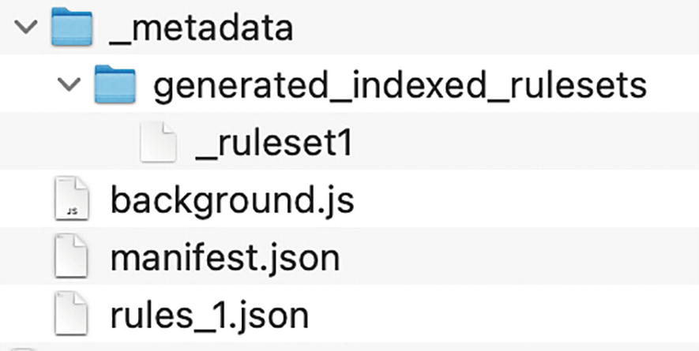
**Hình 13-13:** Tệp nhị phân bộ quy tắc được lập chỉ mục tạo tự động

#### Các quy tắc động (Dynamic Rules)

Các quy tắc động rất giống với các bộ quy tắc tĩnh. Theo cách tương tự, chúng có thể được truy vấn, thêm và xóa theo yêu cầu. Trong ví dụ này, thay vào đó hãy viết một quy tắc chuyển hướng động:

**Ví dụ 13-7a:** *manifest.json*

```json
{
  "name": "MVX",
  "version": "0.0.1",
  "manifest_version": 3,
  "background": {
    "service_worker": "background.js",
    "type": "module"
  },
  "action": {},
  "permissions": ["declarativeNetRequest"],
  "host_permissions": ["*://*.wikipedia.org/*", "*://*.wikimedia.org/*"]
}
```

**Ví dụ 13-7b:** *background.js*

```javascript
const RULE_ID = 1;

const RULE_1 = {
  id: RULE_ID,
  priority: 1,
  action: {
    type: "redirect",
    redirect: {
      url: "https://upload.wikimedia.org/wikipedia/commons/thumb/b/b1/Hot_dog_with_mustard.png/1920px-Hot_dog_with_mustard.png",
    },
  },
  condition: {
    domains: ["wikipedia.org", "wikimedia.org"],
    resourceTypes: ["image"],
  },
};

chrome.action.onClicked.addListener(async () => {
  const dynamic_rules = await
    chrome.declarativeNetRequest.getDynamicRules();

  if (dynamic_rules.find((rule) => rule.id === 1)) {
    chrome.declarativeNetRequest.updateDynamicRules({
      removeRuleIds: [RULE_ID],
    });
  } else {
    chrome.declarativeNetRequest.updateDynamicRules({
      addRules: [RULE_1],
    });
  }

  console.log("Toggled rule");
});
```

Tải tiện ích mở rộng này và điều hướng đến `wikipedia.org`. Bạn sẽ nhận thấy rằng hình ảnh tải bình thường. Nhấp vào nút thanh công cụ của tiện ích mở rộng và tải lại Wikipedia lần nữa. Tất cả hình ảnh trên Wikipedia giờ đây sẽ là một chiếc xúc xích (hot dog).

## Tóm tắt

Trong chương này, chúng ta đã khám phá nhiều phương thức mà các tiện ích mở rộng trình duyệt có thể gửi các yêu cầu mạng. Chúng ta đã xem xét tất cả các thành phần khác nhau và cách chúng có thể và nên gửi các yêu cầu mạng. Tiếp theo, chúng ta thảo luận về các chiến lược xác thực, bao gồm phạm vi chi tiết về cách triển khai OAuth trong các tiện ích mở rộng trình duyệt. Cuối cùng, chúng ta đã thảo luận về cách sử dụng các API WebExtensions chính có thể kiểm tra và thao tác lưu lượng truy cập trong trình duyệt.

Trong chương tiếp theo, chúng ta sẽ đề cập đến cách phát triển một tiện ích mở rộng cục bộ, xuất bản nó trên các cửa hàng tiện ích mở rộng và triển khai các bản cập nhật.
