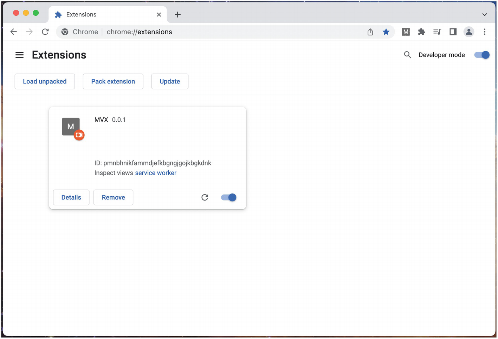
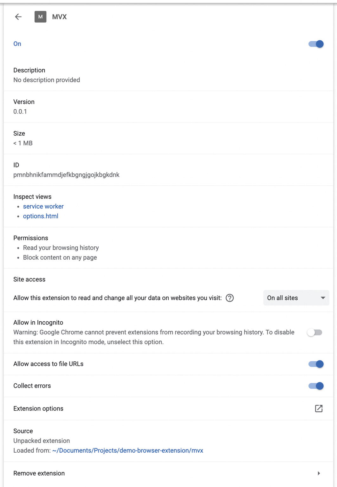
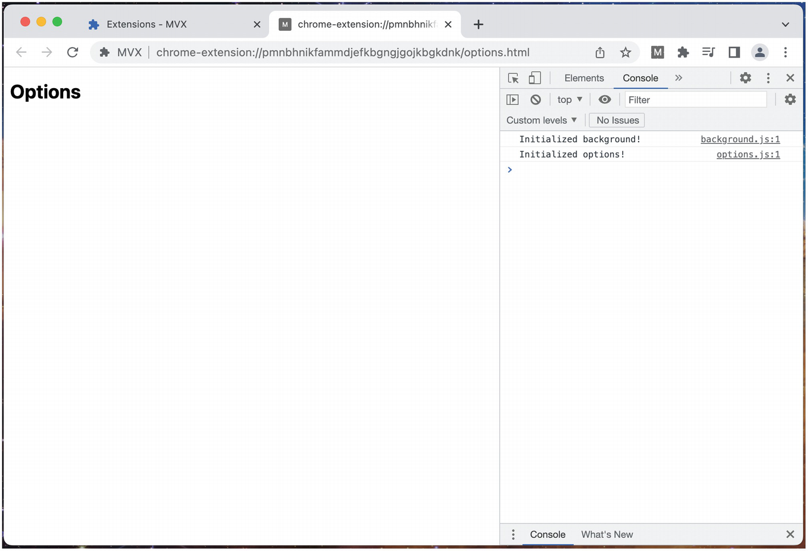
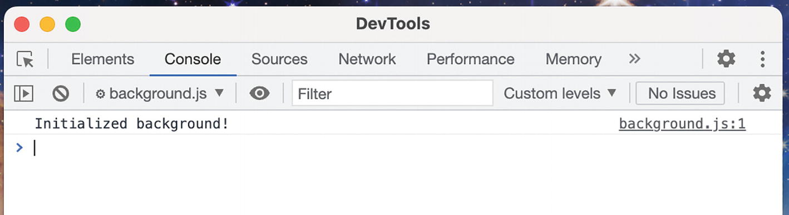
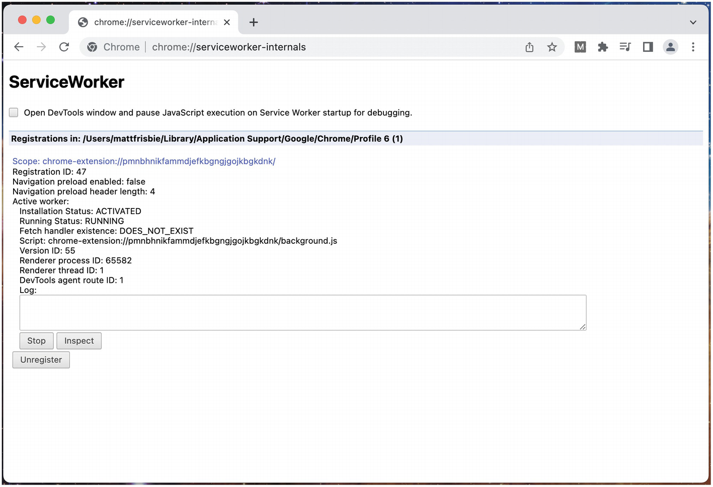
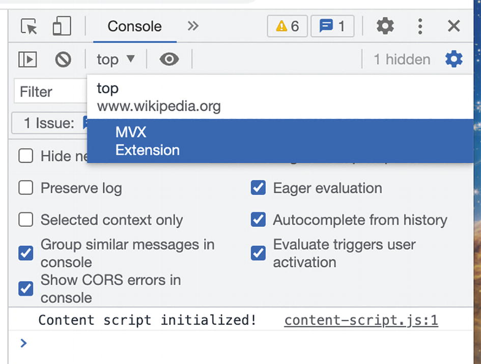
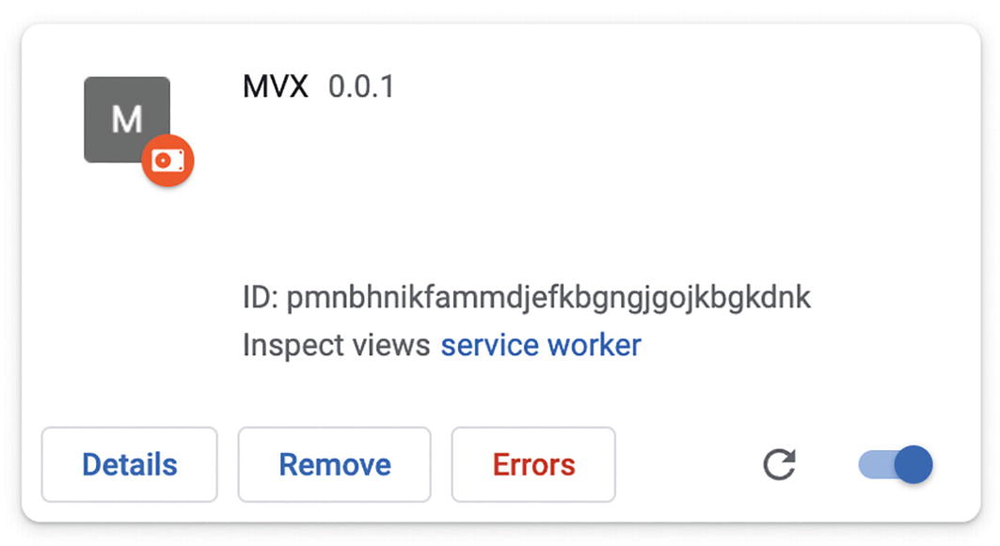
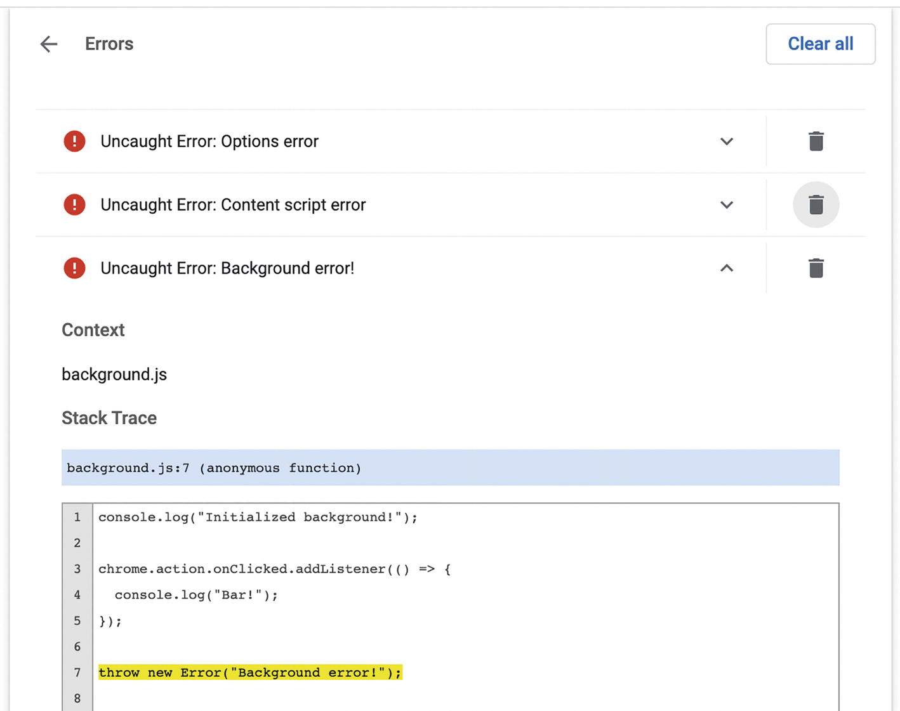
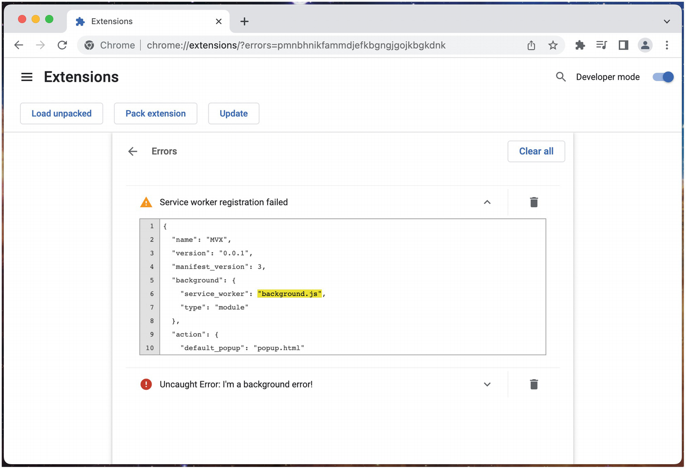
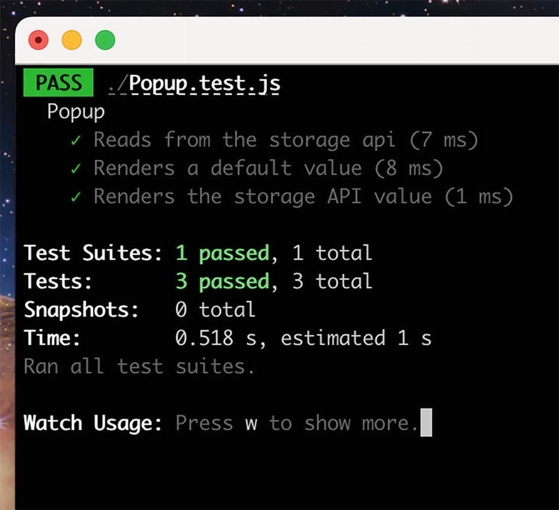

# Chương 14: Phát triển và Triển khai Tiện ích mở rộng

Quá trình phát triển, kiểm thử và xuất bản một tiện ích mở rộng trình duyệt khác biệt đáng kể so với việc phát triển một trang web truyền thống. Các bước liên quan giống với một ứng dụng di động hơn là một công nghệ web. Việc hiểu rõ hơn về cách phát triển, xuất bản và phân phối tiện ích mở rộng của bạn một cách hiệu quả là điều tối quan trọng để làm chủ chủ đề này.

> [!NOTE]
> Chương này sẽ tập trung vào Google Chrome, nhưng tất cả các trình duyệt lớn (ngoại trừ Safari) đều cung cấp các cơ sở gần như giống hệt nhau khi phát triển cục bộ và khi xuất bản lên cửa hàng (marketplace).

## Phát triển Cục bộ (Local Development)

Bạn sẽ dành khá nhiều thời gian để phát triển tiện ích mở rộng của mình ở môi trường cục bộ, vì vậy việc làm quen với cách các thành phần ăn khớp với nhau là rất xứng đáng. Trong phần này, chúng ta sẽ khám phá cách một tiện ích mở rộng được tải cục bộ hoạt động và tất cả các cách khác nhau mà bạn có thể "nhìn dưới nắp ca-pô".

> [!TIP]
> Đối với những người mới phát triển tiện ích mở rộng, chương *Khóa học Cấp tốc về Tiện ích mở rộng Trình duyệt (Browser Extension Crash Course)* trình bày quy trình cơ bản để tải một tiện ích mở rộng cục bộ vào trình duyệt của bạn cho mục đích phát triển.

### Kiểm tra Tiện ích mở rộng của bạn (Inspecting Your Extension)

Bắt đầu bằng cách cài đặt tiện ích mở rộng mẫu này:

Ví dụ 14-1a: **manifest.json**

```json
{
  "name": "MVX",
  "version": "0.0.1",
  "manifest_version": 3,
  "background": {
    "service_worker": "background.js",
    "type": "module"
  },
  "options_ui": {
    "open_in_tab": true,
    "page": "options.html"
  },
  "content_scripts": [
    {
      "matches": ["<all_urls>"],
      "css": [],
      "js": ["content-script.js"]
    }
  ],
  "permissions": [
    "scripting",
    "declarativeNetRequest",
    "tabs"
  ],
  "host_permissions": ["<all_urls>"]
}
```

Ví dụ 14-1b: **options.html**

```html
<!DOCTYPE html>
<html>
  <body>
    <h1>Options</h1>
    <script src="options.js"></script>
  </body>
</html>
```

Ví dụ 14-1c: **options.js**

```javascript
console.log("Initialized options!");
```

Ví dụ 14-1d: **background.js**

```javascript
console.log("Initialized background!");
```

Ví dụ 14-1e: **content-script.js**

```javascript
console.log("Content script initialized!");
```

Khi tiện ích mở rộng này được tải cục bộ, trình duyệt của bạn sẽ thêm một thẻ (card) bên trong chế độ xem quản lý tiện ích mở rộng của trình duyệt. Trong Google Chrome, URL cho trang này là `chrome://extensions`. Một thẻ ví dụ được hiển thị trong Hình 14-1.


**Hình 14-1:** Một thẻ tiện ích mở rộng ví dụ trong chế độ xem trang quản lý tiện ích mở rộng

Từ thẻ này, bạn có thể xem trang chi tiết, gỡ cài đặt hoặc tắt tiện ích mở rộng, xem trang lỗi của tiện ích mở rộng và tải lại tiện ích mở rộng.

> [!NOTE]
> Các chi tiết về việc tải lại một tiện ích mở rộng sẽ được đề cập sau trong chương này.

Việc nhấp để mở trang chi tiết sẽ để lộ thông tin như Hình 14-2.


**Hình 14-2:** Một chế độ xem chi tiết tiện ích mở rộng ví dụ

Có một vài điều cần lưu ý trong chế độ xem này:

* **Chế độ xem này là một ảnh chụp nhanh (snapshot).** Các giá trị được liệt kê bên trong không phải là thời gian thực và sẽ không cập nhật trừ khi trang được tải lại.
* **Kiểm tra các chế độ xem (Inspect views)** chứa danh sách các liên kết đi kèm với mỗi chế độ xem tiện ích mở rộng hiện đang hoạt động. Danh sách này tương tự như các giá trị được trả về từ `chrome.extension.getViews()`. Mỗi liên kết sẽ mở một cửa sổ công cụ dành cho nhà phát triển nhắm vào chế độ xem tiện ích mở rộng cụ thể đó. (Cái tên "views" có thể gây nhầm lẫn, vì công cụ này cũng cho phép bạn kiểm tra background service worker, vốn không có giao diện người dùng.)
* **Quyền hạn (Permissions)** hiển thị danh sách các yêu cầu cấp quyền mà tiện ích mở rộng sẽ phải yêu cầu rõ ràng nếu nó được tải trong môi trường thực tế (production). Vì tiện ích mở rộng này được tải ở chế độ phát triển, hộp thoại quyền sẽ bị tắt đi.
* **Nguồn (Source)** cho biết vị trí trong hệ thống tệp của hệ điều hành hiện tại mà trình duyệt đang tải các tệp tiện ích mở rộng từ đó.

#### Kiểm tra một Chế độ xem Tiện ích mở rộng (Inspecting an Extension View)

Nhấp vào liên kết "options" bên dưới *Inspect Views* sẽ mở các giao diện công cụ dành cho nhà phát triển tương ứng (Hình 14-3).


**Hình 14-3:** Chế độ xem kiểm tra trang tùy chọn

Lưu ý ở đây rằng bảng điều khiển (console) đang hiển thị đầu ra nhật ký cho cả bảng điều khiển của thẻ hiện tại và background service worker. Nếu bạn muốn tách riêng các đầu ra bảng điều khiển, bảng điều khiển dành cho nhà phát triển cho phép bạn chọn các nguồn cụ thể (Hình 14-4).


**Hình 14-4:** Chọn nguồn ghi nhật ký trong công cụ dành cho nhà phát triển

#### Kiểm tra một Background Service Worker (Inspecting a Background Service Worker)

Cũng có thể kiểm tra trực tiếp một background service worker. Nhấp vào liên kết *Inspect view* sẽ để lộ thông tin như sau (Hình 14-5).


**Hình 14-5:** Kiểm tra background service worker

> [!WARNING]
> Một điều *cực kỳ* quan trọng cần ghi nhớ là background service worker này sẽ can thiệp vào vòng đời của chính nó. Nó sẽ ngăn service worker chuyển sang trạng thái nhàn rỗi (idle). Nó cũng sẽ kéo dài tuổi thọ của service worker qua các lần tải lại, gây ra các hành vi kỳ lạ khi gỡ lỗi tiện ích mở rộng. **Khi bạn hoàn thành việc sử dụng cửa sổ công cụ dành cho nhà phát triển service worker, hãy đóng nó ngay lập tức**. Việc để nó mở trong nền sẽ làm thay đổi hành vi của tiện ích mở rộng cục bộ của bạn theo những cách khó dự đoán và khiến việc gỡ lỗi trở nên khó khăn hơn nhiều.

Chrome cung cấp một chế độ xem thời gian thực về trạng thái service worker và đầu ra nhật ký của bạn tại `chrome://serviceworker-internals/` (Hình 14-6). Trang này sẽ không can thiệp vào cách service worker của bạn hoạt động, cho phép chúng chuyển sang trạng thái nhàn rỗi.


**Hình 14-6:** Trang nội bộ service worker của Google Chrome

#### Kiểm tra một Kịch bản Nội dung (Inspecting a Content Script)

Kiểm tra bảng điều khiển (console) cho các trang web có kịch bản nội dung sẽ trộn lẫn đầu ra bảng điều khiển cho trang web và kịch bản nội dung với nhau (Hình 14-7).


**Hình 14-7:** Ví dụ đầu ra bảng điều khiển cho Wikipedia.org

Cũng giống như với background service worker và các trang tùy chọn, bạn có thể lọc để chỉ xem đầu ra bảng điều khiển của kịch bản nội dung.

### Thay đổi Tệp (File Changes)

Trong chế độ xem chi tiết tiện ích mở rộng được hiển thị ở trên, nó cho biết vị trí trong hệ thống tệp mà tiện ích mở rộng được tải từ đó. Điều này là do tiện ích mở rộng đang phục vụ các tệp trực tiếp từ thư mục đó! Bất kỳ thay đổi nào bạn thực hiện đối với các tệp nguồn sẽ được phản ánh ngay lập tức vào lần tiếp theo tiện ích mở rộng tải chúng thông qua yêu cầu mạng. Ví dụ, một sửa đổi đối với `popup.html` sẽ hiển thị ngay lần tiếp theo cửa sổ popup được mở. Điều này *không* áp dụng cho các tệp mà tiện ích mở rộng chỉ sử dụng khi cài đặt như `manifest.json`. Các cập nhật cho những tệp này sẽ chỉ được phản ánh sau khi tiện ích mở rộng được tải lại một cách chính thức.

### Giám sát Lỗi (Error Monitoring)

Giám sát lỗi trong quá trình phát triển có thể khá phức tạp. Đối với các chế độ xem có giao diện HTML, các lỗi được ném ra trong trang có thể được giám sát thông qua bảng điều khiển công cụ dành cho nhà phát triển thông thường. Tất cả các lỗi được ném ra trong một tiện ích mở rộng, bất kể chúng được ném ra ở đâu, sẽ xuất hiện trong chế độ xem lỗi của tiện ích mở rộng (Hình 14-8, 14-9 và 14-10).


**Hình 14-8:** Nút Errors sẽ chỉ xuất hiện khi tiện ích mở rộng ném ra lỗi đầu tiên của nó. Nút này sẽ mở chế độ xem lỗi của tiện ích mở rộng


**Hình 14-9:** Chế độ xem lỗi tiện ích mở rộng hiển thị các lỗi từ nhiều nguồn

> [!WARNING]
> Nếu một service worker ném ra lỗi trong vòng quay đầu tiên của vòng lặp sự kiện, nó sẽ không thể đăng ký. Điều này rất quan trọng, vì bất kỳ trình xử lý sự kiện nào mà nó thiết lập sẽ không bao giờ thực thi.


**Hình 14-10:** Một service worker không thể đăng ký sau khi ném ra lỗi trong quá trình khởi tạo

### Tải lại Tiện ích mở rộng (Extension Reloads)

Có một số thời điểm khác nhau mà các phần của tiện ích mở rộng được tải lại:

* **Tải lại tiện ích mở rộng (extension reload)** lấy một bản sao mới của `manifest.json`, cập nhật background service worker và đóng mọi popup hoặc trang tùy chọn cũ đang mở. Điều này là bắt buộc khi `manifest.json` thay đổi.
* **Tải lại trang tiện ích mở rộng (extension page reload)** là làm mới bất kỳ trang nào sử dụng giao thức tiện ích mở rộng `chrome-extension://`. Điều này là bắt buộc để phản ánh các thay đổi trong HTML, JS, CSS và hình ảnh trong các trang popup và tùy chọn.
* **Tải lại trang web (web page reload)** là làm mới bất kỳ trang web nào có đoạn kịch bản nội dung được chèn vào. Điều này là bắt buộc để phản ánh các thay đổi trong các kịch bản nội dung được chèn.
* **Tải lại devtools (devtools reload)** là đóng và mở lại giao diện công cụ dành cho nhà phát triển của trình duyệt. Điều này là bắt buộc để phản ánh các thay đổi trong các trang devtools.

Có ba cách để buộc tiện ích mở rộng tải lại:

1. Gỡ cài đặt và cài đặt lại tiện ích mở rộng.
2. Nhấp vào biểu tượng tải lại ↺ trong thẻ tương ứng trên trang Chrome Extensions.
3. Tải lại tiện ích mở rộng bằng lập trình bằng cách sử dụng `chrome.runtime.reload()` hoặc `chrome.management.setEnabled()`.

## Kiểm thử Tiện ích mở rộng Tự động (Automated Extension Tests)

Vì các thành phần của tiện ích mở rộng trình duyệt được xây dựng từ các công nghệ web, việc kiểm thử chúng không quá khác biệt so với kiểm thử các trang web. Các công cụ phổ biến như Jest và Puppeteer có thể được cấu hình để thực hiện các bài kiểm thử tự động cho tiện ích mở rộng của bạn. Một số khía cạnh đặc thù của tiện ích mở rộng trình duyệt như popup và kịch bản nội dung không thể được kiểm thử trực tiếp, nhưng với một số giải pháp khéo léo, bạn vẫn có thể xây dựng một bộ kiểm thử mạnh mẽ và hiệu quả.

> [!NOTE]
> Phần này giả định bạn đã quen thuộc với kiểm thử tự động bằng JavaScript. Nếu không, tài liệu của Jest có một bài hướng dẫn tốt dành cho người mới bắt đầu: [https://jestjs.io/docs/tutorial-react](https://jestjs.io/docs/tutorial-react).

### Kiểm thử Đơn vị (Unit Tests)

Vì các bài kiểm thử đơn vị không dựa vào việc kết xuất (rendering) các thành phần tiện ích mở rộng bên trong các khung chứa trình duyệt tự nhiên của chúng, nên các bài kiểm thử này có thể được viết theo cách gần như giống hệt các bài kiểm thử đơn vị trang web thông thường. Để giả lập (stub out) các API tiện ích mở rộng của chrome, gói `sinon-chrome` là một lựa chọn tuyệt vời: [https://github.com/acvetkov/sinon-chrome](https://github.com/acvetkov/sinon-chrome). Gói này cho phép bạn giả lập các giá trị callback cho các API tiện ích mở rộng một cách rất gọn gàng.

Một thiết lập kiểm thử đơn vị phổ biến cho các tiện ích mở rộng là sử dụng Parcel làm công cụ xây dựng chính, React làm framework và Jest làm trình chạy kiểm thử (test runner). Ví dụ sau đây thiết lập một tiện ích mở rộng rất đơn giản với một cửa sổ popup đọc từ API chrome storage. Ví dụ bao gồm một số bài kiểm thử đơn vị để đảm bảo popup hiển thị đúng như mong đợi:

Ví dụ 14-2a: **manifest.json**

```json
{
  "name": "MVX",
  "version": "0.0.1",
  "manifest_version": 3,
  "action": {
    "default_popup": "index.html"
  },
  "permissions": ["storage"]
}
```

Ví dụ 14-2b: **package.json**

```json
{
  "scripts": {
    "start": "parcel watch manifest.json –host localhost",
    "build": "parcel build manifest.json",
    "test": "jest –watch"
  },
  "dependencies": {
    "@types/chrome": "^0.0.196",
    "react": "^18.2.0",
    "react-dom": "^18.2.0"
  },
  "devDependencies": {
    "@babel/preset-env": "^7.18.10",
    "@babel/preset-react": "^7.18.6",
    "@parcel/config-webextension": "^2.7.0",
    "@testing-library/jest-dom": "^5.16.5",
    "@testing-library/react": "^13.4.0",
    "jest": "^29.0.2",
    "jest-environment-jsdom": "^29.0.2",
    "parcel": "^2.7.0",
    "process": "^0.11.10",
    "sinon-chrome": "^3.0.1"
  },
  "jest": {
    "testEnvironment": "jsdom"
  }
}
```

Ví dụ 14-2c: **index.html**

```html
<!DOCTYPE html>
<html>
  <body>
    <div id="app"></div>
    <script type="module" src="index.tsx"></script>
  </body>
</html>
```

Ví dụ 14-2d: **index.tsx**

```tsx
import React from "react";
import { createRoot } from "react-dom/client";
import { Popup } from "./Popup";

const rootElement = document.getElementById("app");
const root = createRoot(rootElement);

root.render(<Popup />);
```

Ví dụ 14-2e: **.parcelrc**

```json
{
  "extends": "@parcel/config-webextension",
  "transformers": {
    "*.{js,mjs,jsx,cjs,ts,tsx}": [
      "@parcel/transformer-js",
      "@parcel/transformer-react-refresh-wrap"
    ]
  }
}
```

Ví dụ 14-2f: **.babelrc**

```json
{
  "presets": [
    ["@babel/preset-env", { "targets": { "node": "current" } }],
    "@babel/preset-react"
  ]
}
```

Ví dụ 14-2g: **Popup.tsx**

```tsx
import React, { useEffect, useState } from "react";

export function Popup() {
  const [count, setCount] = useState(null);

  useEffect(() => {
    chrome.storage.sync.get(["count"], (result) => {
      if (typeof result.count !== "number") {
        result.count = 0;
      }
      setCount(result.count);
    });
  }, []);

  if (count != null) {
    return <h1>Popup count: {count}</h1>;
  }
}
```

Ví dụ 14-2h: **Popup.test.js**

```javascript
import { render, screen } from "@testing-library/react";
import React from "react";
import { Popup } from "./Popup";
import chrome from "sinon-chrome";

describe("Popup", () => {
  beforeAll(() => {
    global.chrome = chrome;
  });

  test("Reads from the storage api", () => {
    render(<Popup />);

    expect(chrome.storage.sync.get.withArgs(["count"]).calledOnce).toBe(true);
  });

  test("Renders a default value", () => {
    chrome.storage.sync.get.withArgs(["count"]).yields({
      count: undefined });

    render(<Popup />);

    expect(screen.queryByText("Popup count: 0")).not.toBeNull();
  });

  test("Renders the storage API value", () => {
    chrome.storage.sync.get.withArgs(["count"]).yields({
      count: 3 });

    render(<Popup />);

    expect(screen.queryByText("Popup count: 3")).not.toBeNull();
  });

  afterAll(() => {
    chrome.flush();
  });
});
```

> [!TIP]
> Nếu bạn đang thiết lập ví dụ này từ đầu, việc chạy `yarn install` sẽ giúp thiết lập này hoạt động.

Đối với các nhà phát triển đã quen thuộc với giao diện kiểm thử đơn vị React điển hình, hầu hết những điều này sẽ không làm bạn ngạc nhiên. Một số lưu ý về cách triển khai này:

* Hầu hết ví dụ này là các đoạn mã soạn sẵn (boilerplate) kiểm thử đơn vị điển hình.
* Parcel không cần Babel để biên dịch, nhưng Jest thì có. Các giá trị bổ sung trong `.parcelrc` là để sử dụng Babel làm trình biên dịch có điều kiện chỉ dành cho các bài kiểm thử đơn vị.
* Gói `sinon-chrome` đang được sử dụng để phát hiện các cuộc gọi đến storage API, nhưng cũng có thể giả lập các giá trị được trả về trong hàm callback của API.

Với tất cả các gói đã được cài đặt, bạn sẽ thấy rằng `npm run start` sẽ khởi động bản xây dựng phát triển của Parcel và `npm test` sẽ chạy bộ kiểm thử đơn vị của bạn (Hình 14-11).


**Hình 14-11:** Một lần chạy kiểm thử đơn vị thành công

### Kiểm thử Tích hợp (Integration Tests)

Việc kiểm thử tích hợp tiện ích mở rộng trình duyệt có thể thực hiện được thông qua Puppeteer ([https://pptr.dev/](https://pptr.dev/)). Nó cho phép bạn điều khiển trình duyệt Chromium bằng lập trình, bao gồm điều hướng đến các URL và gửi các sự kiện của người dùng. Nó không thể sao chép hoàn hảo tất cả các cách khác nhau mà một tiện ích mở rộng trình duyệt sẽ hiển thị các chế độ xem của nó, nhưng cho đến nay nó là công cụ tốt nhất hiện có để cung cấp sức mạnh cho một bộ kiểm thử tích hợp.

Puppeteer có thể được cấu hình để tải một tiện ích mở rộng thông qua cờ `--load-extension`. Cờ này nên được trỏ đến một thư mục cục bộ trên máy của bạn có chứa mã tiện ích mở rộng. Bạn cũng sẽ cần tắt chế độ không đầu (headless mode), vì tiện ích mở rộng không thể được tải trong trình duyệt không đầu:

```javascript
const path = `path/to/your/extension`;

const browser = await puppeteer.launch({
  // Tắt chế độ không đầu
  headless: false,
  args: [
    `--disable-extensions-except=${path}`,
    `--load-extension=${path}`
  ]
});
```

Điều này sẽ khởi động trình duyệt Chromium, nhưng bạn sẽ cần hướng trình duyệt đến URL cho tiện ích mở rộng của mình. Tất nhiên, bạn sẽ cần biết trước ID của tiện ích mở rộng là gì. Một chiến lược tốt cho việc này là kiểm soát ID tiện ích mở rộng thông qua trường `key` của manifest:

```javascript
const page = await browser.newPage();
await page.goto(
  'chrome-extension://<extensionID>/popup.html');
// Bây giờ bạn có thể chạy mã kiểm thử
```

Bởi vì tất cả các chế độ xem tiện ích mở rộng, bao gồm cả các trang popup, đều có thể được tải thông qua URL tiện ích mở rộng trực tiếp, tất cả các trang tiện ích mở rộng của bạn đều có thể được kiểm thử theo cách này. Puppeteer có thể được sử dụng để chạy bất kỳ trình duyệt Chromium nào, vì vậy một bộ kiểm thử tích hợp có thể nhắm mục tiêu đến các trình duyệt như Google Chrome, Microsoft Edge hoặc Opera.

> [!NOTE]
> Việc thiết lập một bài kiểm thử tích hợp đầy đủ hoạt động với puppeteer nằm ngoài phạm vi của cuốn sách này. Một số ví dụ đầy đủ được liệt kê trong phần *Đọc thêm (Additional Reading)* bên dưới.

### Đọc thêm (Additional Reading)

Thiết lập kiểm thử tự động rất phức tạp và nói thẳng ra là khá phiền toái. Sau đây là một số liên kết đến các bài đăng blog và tài liệu về các thiết lập kiểm thử tiện ích mở rộng khác nhau:

* [https://www.streaver.com/blog/posts/testing-web-extensions](https://www.streaver.com/blog/posts/testing-web-extensions)
* [https://github.com/clarkbw/jest-webextension-mock](https://github.com/clarkbw/jest-webextension-mock)
* [https://www.npmjs.com/package/jest-chrome](https://www.npmjs.com/package/jest-chrome)
* [https://medium.com/information-and-technology/unit-testing-browser-extensions-bdd4e60a4f3d](https://medium.com/information-and-technology/unit-testing-browser-extensions-bdd4e60a4f3d)
* [https://medium.com/information-and-technology/integration-testing-browser-extensions-with-jest-676b4e9940ca](https://medium.com/information-and-technology/integration-testing-browser-extensions-with-jest-676b4e9940ca)
* [https://gokatz.me/blog/automate-chrome-extension-testing/](https://gokatz.me/blog/automate-chrome-extension-testing/)
* [https://tweak-extension.com/blog/complete-guide-test-chrome-extension-puppeteer/](https://tweak-extension.com/blog/complete-guide-test-chrome-extension-puppeteer/)
* [https://pptr.dev/#working-with-chrome-extensions](https://pptr.dev/#working-with-chrome-extensions)

## Xuất bản Tiện ích mở rộng (Publishing Extensions)

Để xuất bản một tiện ích mở rộng lên Chrome Web Store, trước tiên bạn cần trả một khoản phí duy nhất là 5 đô la cho tài khoản nhà phát triển. Sau khi tài khoản này được thiết lập, bạn đã sẵn sàng để gửi bài. Các tiện ích mở rộng luôn được tải lên dưới dạng tệp zip chứa các tệp và tài sản (assets) của tiện ích mở rộng.

### Danh sách Cửa hàng (Store Listing)

Để xuất bản một tiện ích mở rộng, bạn sẽ cần chỉ định cách nó sẽ xuất hiện với người dùng trong Chrome Web Store. Một số mục được tự động trích xuất từ manifest:

* Tiêu đề tiện ích mở rộng
* Tóm tắt tiện ích mở rộng
* Biểu tượng (Icon)

Mọi thứ khác, bạn sẽ cần tự cung cấp:

* Mô tả
* Danh mục tiện ích mở rộng
* Tài sản (bao gồm video và ảnh chụp màn hình)
* Các URL (trang web chính, URL hỗ trợ, URL chính sách bảo mật)

> [!NOTE]
> Các trường này có thể được thay đổi sau đó, nhưng mỗi thay đổi sẽ khiến toàn bộ tiện ích mở rộng phải trải qua quá trình đánh giá thủ công chậm chạp – ngay cả khi mã nguồn không thay đổi.

### Thực tiễn Quyền riêng tư (Privacy Practices)

Trong Chrome Web Store, bạn sẽ cần cung cấp mô tả cấp cao về những gì tiện ích mở rộng này đang làm, cũng như giải trình cho từng danh mục quyền được coi là nhạy cảm (identity, scripting, v.v.). Bạn cũng sẽ cần cho biết liệu bạn có đang theo dõi người dùng của mình hay không và theo cách nào.

## Quá trình Đánh giá (Review Process)

Tiện ích mở rộng của bạn sẽ trải qua quá trình đánh giá thủ công lần đầu tiên khi được gửi để đảm bảo nó đáp ứng các tiêu chuẩn của Chrome Web Store. Sau khi được chấp thuận, nó sẽ có sẵn cho bất kỳ ai cài đặt!

## Cập nhật Tiện ích mở rộng (Updating Extensions)

Sau khi tiện ích mở rộng của bạn được xuất bản, quá trình cập nhật nó ít nhiều giống hệt với quá trình xuất bản ban đầu. Bạn sẽ tải lên một tệp zip với số phiên bản được cập nhật trong manifest. Bất kỳ quyền bổ sung nào cũng sẽ yêu cầu giải trình bổ sung.

### Các Lưu ý khi Cập nhật (Update Considerations)

Khi bạn đã có một lượng người dùng hiện tại và muốn tung ra bản cập nhật, có một số điều bạn nên lưu ý.

#### Sự chậm trễ của cập nhật (Update Delays)

Các bản cập nhật không được triển khai ngay lập tức. Sau khi bạn gửi bản cập nhật, nó phải được xem xét và phê duyệt trước khi trình duyệt của người dùng có thể cài đặt nó. Trình duyệt của người dùng sẽ định kỳ gửi các yêu cầu kiểm tra cập nhật sau mỗi vài giờ và tải xuống bản cập nhật nếu có sẵn. Tuy nhiên, trình duyệt sẽ áp dụng bản cập nhật đó một cách lười biếng nếu tiện ích mở rộng đang hoạt động, vì vậy đôi khi có một sự chậm trễ đáng kể giữa thời điểm bản cập nhật được xuất bản và thời điểm nó được cài đặt. Sự chậm trễ này có thể từ vài phút đến hơn một tuần.

#### Tự động vô hiệu hóa (Auto-Disabling)

Giả sử bạn có một nhóm người dùng đã cài đặt tiện ích mở rộng của mình. Nếu một phiên bản mới được xuất bản yêu cầu quyền mới cần có sự chấp thuận rõ ràng của người dùng, tiện ích mở rộng của bạn sẽ bị vô hiệu hóa cho đến khi người dùng cấp quyền đó. Trình duyệt sẽ không hiện ra hộp thoại khi tiện ích mở rộng bị vô hiệu hóa, chỉ có một biểu tượng nhỏ xuất hiện. Điều này có nghĩa là bạn có thể bị mất người dùng một cách không mong muốn khi thêm các quyền bổ sung. Sử dụng các quyền tùy chọn (optional permissions) có thể giải quyết vấn đề này.

> [!NOTE]
> Chi tiết về vấn đề này được đề cập kỹ trong chương *Quyền hạn (Permissions)*.

#### Xuất bản Cập nhật Tự động (Automated Update Publishing)

Thay vì tải tệp zip lên trang web một cách thủ công, bạn có thể tự động gửi bản cập nhật của mình lên Chrome Web Store thông qua một REST API. Để thực hiện việc này, trước tiên bạn cần lấy các thông tin xác thực để xác thực các yêu cầu API của mình. Chi tiết về quy trình này có thể được tìm thấy tại đây: [https://developer.chrome.com/docs/webstore/using_webstore_api/](https://developer.chrome.com/docs/webstore/using_webstore_api/)

Sau khi có các thông tin xác thực cần thiết, bạn có thể quản lý một phần đáng kể tiện ích mở rộng của mình thông qua API, được tài liệu hóa tại đây: [https://developer.chrome.com/docs/webstore/api_index/](https://developer.chrome.com/docs/webstore/api_index/)

Việc tương tác với API thông qua dòng lệnh khá rắc rối. Thay vào đó, hãy sử dụng một gói NPM để đẩy các bản cập nhật của bạn: [https://github.com/simov/chrome-webstore](https://github.com/simov/chrome-webstore)

> [!TIP]
> Nền tảng Plasmo có một công cụ gửi tự động tuyệt vời được gọi là Browser Platform Publisher. Tham khảo chương *Công cụ và Framework (Tooling and Frameworks)* để biết thêm chi tiết.

## Theo dõi Hoạt động của Người dùng (Tracking User Activity)

Khi bạn đã có người cài đặt và sử dụng tiện ích mở rộng của mình, chắc chắn bạn sẽ muốn biết có bao nhiêu người trong số họ và họ đang làm gì.

### Các số liệu trên Bảng điều khiển (Dashboard Metrics)

Bảng điều khiển nhà phát triển Chrome (Chrome Developer Dashboard) cho bạn thấy một số chỉ số quan trọng về tiện ích mở rộng của bạn, bao gồm:

* Số người dùng/ngày
* Số lần hiển thị/ngày (Impressions/day)
* Số lượt cài đặt/ngày
* Số lượt gỡ cài đặt/ngày

> [!NOTE]
> Số lượng người dùng hàng tuần bạn thấy trong Chrome Web Store là số lượng người dùng mà trình duyệt Chrome đã kiểm tra cập nhật cho ứng dụng của bạn trong tuần qua. Đó không phải là số lượng người đã cài đặt mục của bạn.

### Các Thư viện Phân tích (Analytics Libraries)

Việc theo dõi hoạt động của người dùng trong một tiện ích mở rộng trình duyệt hầu như giống với việc theo dõi hoạt động của trang web. Có một vài điểm cần lưu ý:

* **Các sự kiện trong một kịch bản nội dung nên được theo dõi trong một background service worker.** Các yêu cầu mạng gửi đi để truyền dữ liệu phân tích dễ bị ảnh hưởng bởi các trình chặn quảng cáo và các hạn chế đa nguồn (cross-origin).
* **Các sự kiện trong một kịch bản nền (background script) sẽ không có URL trang.**
* **Bạn phải tải trước các kịch bản thư viện phân tích của mình trong manifest v3.** Nhiều thư viện phân tích như Google Analytics cung cấp tùy chọn tải động kịch bản phân tích – điều này không còn được phép nữa.

> [!TIP]
> Các trình chặn quảng cáo sẽ không thể chặn các yêu cầu được gửi từ các trang tiện ích mở rộng hoặc kịch bản nền. Do đó, không giống như các trang web (nơi một phần lớn lưu lượng phân tích bị chặn), bạn có thể hy vọng có được độ chính xác phân tích gần như hoàn hảo với các tiện ích mở rộng trình duyệt.

### Thiết lập Google Analytics (Setting Up Google Analytics)

Nhiều nhà phát triển tiện ích mở rộng muốn sử dụng Google Analytics (GA) cho tiện ích mở rộng trình duyệt của họ. GA4 khiến việc này khó khăn hơn một chút, nhưng với một số cấu hình, điều này chắc chắn là có thể.

#### Thiết lập ga.js

Đối với tiện ích mở rộng manifest v3, bạn sẽ cần tải xuống kịch bản `ga.js` ([https://www.googletagmanager.com/gtag/js?id=GA_TRACKING_ID](https://www.googletagmanager.com/gtag/js?id=GA_TRACKING_ID)) và lưu nó dưới dạng một kịch bản cục bộ bên trong tiện ích mở rộng của bạn.

Google Analytics kiểm tra giao thức URL của trang đang hoạt động trước khi quyết định gửi các tín hiệu phân tích (pings). Nếu nó không phải là `http` hoặc `https`, nó sẽ từ chối gửi. Khi sử dụng kịch bản GA3, có thể ghi đè hành vi này thông qua `checkProtocolTask`:

```javascript
ga('set', 'checkProtocolTask', null);
```

Tuy nhiên, có vẻ như trong GA4, hiện tại không có khả năng ghi đè hành vi này. Nếu bạn muốn sử dụng GA4 với một tiện ích mở rộng, bạn sẽ cần vô hiệu hóa việc kiểm tra giao thức này. Hãy tìm dòng sau trong tệp `ga.js` của bạn và xóa nó hoặc chú thích nó lại:

```javascript
"http:" != c && "https:" != c && (N(29), a.abort());
```

Sau khi thực hiện việc này, bạn sẽ có thể thiết lập Google Analytics như sau:

```javascript
const script = document.createElement("script");
script.async = true;
script.src = "/ga.js";
document.body.appendChild(script);

window.dataLayer = window.dataLayer || [];
function gtag() {
  dataLayer.push(arguments);
}

const GA_ID = "GA_TRACKING_ID";

gtag("js", new Date());
// Tắt báo cáo lượt xem trang tự động
gtag("config", GA_ID, {
  send_page_view: false,
});
// Gửi sự kiện lượt xem trang theo cách thủ công
gtag("event", "page_view", {
  page_path: window.location.path,
});
```

Đây là một chút mẹo (hack), nhưng tại thời điểm cuốn sách này được xuất bản, đây là cách duy nhất được biết đến để khiến kịch bản GA4 hoạt động tốt với các tiện ích mở rộng trình duyệt.

### Các Sự kiện Cài đặt và Gỡ cài đặt (Install and Uninstall Events)

Bạn có thể thực hiện các tác vụ đặc biệt khi người dùng cài đặt và gỡ cài đặt một tiện ích mở rộng. Ví dụ: kịch bản nền có thể thực hiện một tác vụ chỉ khi người dùng mới cài đặt tiện ích mở rộng:

Tệp **background.js**:

```javascript
chrome.runtime.onInstalled.addListener((details) => {
    if (details.reason === chrome.runtime.OnInstalledReason.INSTALL) {
      // Bất cứ thứ gì ở đây sẽ chỉ thực thi trong lần cài đặt đầu tiên
      openWelcomePage();
    }
});
```

Bạn sẽ không thể thực thi mã khi gỡ cài đặt, nhưng bạn có thể hướng người dùng đến một URL do bạn chọn bằng `chrome.runtime.setUninstallURL`:

```javascript
chrome.runtime.setUninstallURL("https://foobar.com/survey");
```

Không có hạn chế nào đối với URL này, tôi khuyên bạn nên sử dụng nó để thu thập dữ liệu phân tích, thực hiện khảo sát, hiển thị thông tin liên hệ để khắc phục sự cố hoặc đưa ra một số mẹo hữu ích có thể khiến họ cài đặt lại.

## Tóm tắt (Summary)

Trong chương này, chúng ta đã thảo luận về một số chủ đề liên quan đến việc xây dựng và xuất bản một tiện ích mở rộng. Chúng ta đã thảo luận về một loạt các chiến thuật có thể được sử dụng để hiểu rõ hơn về những gì đang diễn ra bên trong tiện ích mở rộng cục bộ của bạn. Tiếp theo, chúng ta đã đi qua các định dạng kiểm thử khác nhau hoạt động tốt cho các tiện ích mở rộng trình duyệt. Chúng ta đã xem xét tất cả các phần quan trọng liên quan đến việc xuất bản và cập nhật các tiện ích mở rộng trong Chrome Web Store. Cuối cùng, chúng ta đã thảo luận về cách các công cụ phân tích có thể được áp dụng hiệu quả vào tiện ích mở rộng trình duyệt của bạn.

Trong chương tiếp theo, chúng ta sẽ đề cập đến tất cả các chi tiết liên quan đến việc xây dựng một tiện ích mở rộng trình duyệt nhắm mục tiêu đến nhiều trình duyệt.
