# Chương 15: Tiện ích mở rộng Đa trình duyệt (Cross-Browser Extensions)

Khi nói đến việc hỗ trợ nhiều nền tảng, các tiện ích mở rộng trình duyệt tồn tại ở một vị trí trung gian giữa các trang web và ứng dụng di động. Ở một đầu của dải phổ là trang web, nơi tận hưởng trải nghiệm nhà phát triển "viết một lần, chạy mọi nơi". Ở đầu kia là ứng dụng di động, được viết bằng ngôn ngữ độc quyền và chỉ hoạt động trên một hệ điều hành cụ thể cùng một tập hợp nhỏ các loại thiết bị. Trong chương này, chúng ta sẽ thảo luận về những thách thức và sự đánh đổi liên quan khi hỗ trợ một tiện ích mở rộng trên nhiều trình duyệt.

## Giới thiệu về Hỗ trợ Đa trình duyệt (Introduction to Cross-Browser Support)

Mã nguồn trang web được tận hưởng một môi trường máy chủ (host environment) nhất quán. Bạn có thể viết một trang web một lần, tải nó trên bất kỳ hệ điều hành, thiết bị hoặc trình duyệt nào và hy vọng rằng nó sẽ hoạt động chính xác. Có một số trường hợp ngoại lệ nơi các trình duyệt khác nhau, nhưng chúng tương đối hiếm. Tất cả các nhà cung cấp trình duyệt đều dành nhiều thời gian để đảm bảo rằng sản phẩm của họ tuân thủ các tiêu chuẩn W3C và sẽ hiển thị một trang web ít nhiều giống như bất kỳ trình duyệt nào khác.

Các ứng dụng di động chạy trong một môi trường máy chủ độc quyền. Nếu bạn muốn ứng dụng di động chạy trên nhiều hệ điều hành, mã được viết cho Android gần như vô dụng khi xây dựng cho iOS. Các ứng dụng được phân phối ở những nơi khác nhau, được viết bằng các ngôn ngữ khác nhau, được xây dựng cho các thiết bị khác nhau và sử dụng các bộ SDK hoàn toàn khác nhau.

Các tiện ích mở rộng trình duyệt mượn một chút từ mỗi phương thức này. Các tiện ích mở rộng sử dụng một API được tiêu chuẩn hóa giữa các trình duyệt, nhưng không phải tất cả các trình duyệt đều hỗ trợ toàn bộ API. Tất cả các tiện ích mở rộng đều được xây dựng bằng HTML, JavaScript và CSS, nhưng sự hỗ trợ manifest giữa các trình duyệt có những đặc điểm riêng và sự không tương thích nhất định. Các tiện ích mở rộng được phân phối trong các cửa hàng ứng dụng dành riêng cho từng trình duyệt, nhưng đa số các trình duyệt web đều được xây dựng trên nền tảng Chromium – nghĩa là tất cả chúng đều có thể cài đặt các ứng dụng được phân phối bởi Chrome Web Store.

## Đánh đổi về Độ phủ của Trình duyệt (Browser Coverage Tradeoffs)

Khi chọn xem có hỗ trợ nhiều trình duyệt hay không và hỗ trợ ở mức độ nào, bạn nên bắt đầu bằng cách tự hỏi người dùng mục tiêu của mình là ai. Đối với phần lớn các tiện ích mở rộng, câu trả lời cho câu hỏi này sẽ là: "càng nhiều người càng tốt"! Việc hỗ trợ tất cả các trình duyệt chính chắc chắn là khả thi, nhưng tùy thuộc vào tiện ích mở rộng của bạn, điều này có thể là quá mức cần thiết. Hỗ trợ API thay đổi, nhiều cửa hàng ứng dụng và các trình điều khiển (engine) JS/CSS đặc thù có thể tiêu tốn rất nhiều thời gian của nhà phát triển.

### Thị phần Trình duyệt (Browser Share)

May mắn thay, đối với các tiện ích mở rộng mới bắt đầu, bạn có thể dễ dàng hỗ trợ phần lớn người dùng chỉ với một codebase duy nhất. Hãy xem xét các số liệu thống kê về thị phần trình duyệt máy tính để bàn vào năm 2022 (Hình 15-1).

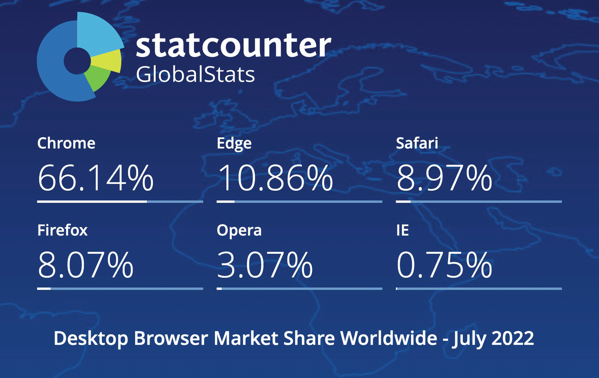
**Hình 15-1:** Thị phần trình duyệt máy tính để bàn năm 2022

Google Chrome thống trị thị trường với 66%. Nếu bạn chỉ triển khai tiện ích mở rộng của mình lên duy nhất Chrome Web Store, bạn đã tự động bao phủ 2/3 thị trường.

### Chia sẻ Tiện ích mở rộng của Trình duyệt Chromium (Chromium Browser Extension Sharing)

May mắn thay, bối cảnh trình duyệt hiện đại đang hoạt động có lợi cho bạn. Nhiều trình duyệt lớn như Edge, Opera, Vivaldi và Brave đều được xây dựng trên trình duyệt Chromium mã nguồn mở. Kết quả là, tất cả các trình duyệt này đều có khả năng tương thích gần như hoàn hảo với các tiện ích mở rộng được xây dựng cho Google Chrome. Mỗi trình duyệt này đều có thể cài đặt trực tiếp từ, hoặc được cấu hình để cài đặt từ Chrome Web Store. Do đó, một tiện ích mở rộng chỉ được xuất bản lên Chrome Web Store trên thực tế có thể được cài đặt bởi Chrome, Edge và Opera: **chiếm hơn 80%** lưu lượng truy cập máy tính để bàn!

> [!NOTE]
> Có những khác biệt nhỏ giữa Google Chrome và các trình duyệt Chromium khác, chẳng hạn như identity API. Tuy nhiên, sự tương đồng về API tổng thể giữa tất cả các trình duyệt Chromium gần như là không có kẽ hở.

## Phỏng tạo Codebase của Bạn (Adapting Your Codebase)

Tùy thuộc vào mức độ rộng rãi của sự hỗ trợ mà bạn mong muốn cho tiện ích mở rộng của mình, việc tổ chức codebase có thể đòi hỏi sự tinh tế. Trong phần này, chúng ta sẽ đề cập đến một vài nguyên tắc đơn giản có thể được sử dụng.

### Thăm dò API (API Probing)

Không phải tất cả các trình duyệt đều hỗ trợ đầy đủ WebExtensions API. Nếu một phương thức cụ thể là quan trọng đối với tiện ích mở rộng của bạn và trình duyệt không hỗ trợ nó, thì bạn không thể làm gì nhiều. Trong những tình huống như thế này, có lẽ tốt nhất là *không* hỗ trợ trình duyệt đó và khuyến khích người dùng sử dụng một trình duyệt được hỗ trợ.

Tuy nhiên, nếu API bạn muốn sử dụng không mang tính sống còn và tiện ích mở rộng vẫn có thể hoạt động mà không có nó (ngay cả ở trạng thái bị giảm tính năng), thì bạn có thể thăm dò (probe) một API hoặc một phương thức một cách an toàn để kiểm tra xem nó có sẵn hay không. Ví dụ:

```javascript
if (chrome.storage.session) {
    // API có sẵn, tiến hành bình thường
} else {
    // API không có sẵn. Các tùy chọn UX:
    // - Chuyển sang sử dụng API tương tự
    // - Vô hiệu hóa hoặc ẩn các nút
    // - Thông báo cho người dùng
    // - Âm thầm giảm tính năng
}
```

### Các Manifest Khác biệt (Differential Manifests)

Khi làm việc ở chế độ phát triển, bạn sẽ thấy rằng hầu hết các trình duyệt tương đối thoải mái khi nói đến cấu trúc manifest. Tuy nhiên, khi triển khai lên một cửa hàng, bạn có thể gặp tình huống có sự không tương thích nghiêm ngặt giữa những gì hai cửa hàng khác nhau cho phép hoặc không cho phép.

Để giải quyết vấn đề này, bạn sẽ cần tạo các manifest khác biệt cho từng bộ (bundle) triển khai. Một mô hình phổ biến là duy trì một manifest "gốc" (master) duy nhất, sau đó thực hiện các sửa đổi đặc thù cho từng cửa hàng khi tạo các bundle triển khai.

> [!TIP]
> Việc tạo manifest khác biệt có thể khá tẻ nhạt. Các nền tảng phát triển tiện ích mở rộng như Plasmo ([https://www.plasmo.com/](https://www.plasmo.com/)) có thể tự động hóa quy trình này cho bạn.

### Manifest v2/v3

Tại thời điểm cuốn sách này được xuất bản, các nhà phát triển tiện ích mở rộng đang rơi vào một tình huống không mong muốn, nơi một số cửa hàng như Chrome Web Store chỉ chấp nhận manifest v3, và những cửa hàng khác như Firefox Add-on chỉ chấp nhận manifest v2. Rất có khả năng hiện trạng này chỉ là tạm thời và sớm muộn gì tất cả các cửa hàng lớn cũng sẽ hội tụ quanh manifest v3. Tôi khuyên bạn không nên chia nhỏ sự hỗ trợ giữa manifest v2 và v3, khoảng cách về hành vi giữa hai phiên bản là không đáng để thu hẹp; bạn nên nhắm mục tiêu hỗ trợ cho manifest v3.

## Cửa hàng Tiện ích mở rộng (Extension Marketplaces)

Cũng giống như ứng dụng di động phải được cài đặt từ một cửa hàng ứng dụng, các tiện ích mở rộng phải được cài đặt từ một cửa hàng tiện ích mở rộng. Tất cả các trình duyệt chính đều duy trì cửa hàng tiện ích mở rộng của riêng họ.

### Điểm tương đồng giữa các Cửa hàng (Marketplace Similarities)

Sau đây là danh sách các tính năng nhất quán giữa các cửa hàng tiện ích mở rộng:

* **Bắt buộc phải có tài khoản nhà phát triển.** Không có cửa hàng nào cho phép bạn xuất bản một tiện ích mở rộng trình duyệt một cách ẩn danh. Bạn luôn có thể tạo một tài khoản nhà phát triển riêng biệt không định danh cá nhân bạn.
* **Tất cả các tiện ích mở rộng mới và các bản cập nhật đều trải qua quá trình đánh giá.** Mỗi phiên bản tiện ích mở rộng được gửi đi sẽ trải qua một số loại quy trình đánh giá trước khi được phê duyệt. Một số quá trình đánh giá sẽ được tự động hóa và một số sẽ là thủ công. Các quyền bạn yêu cầu trong manifest tiện ích mở rộng có thể thay đổi mức độ kiểm tra kỹ lưỡng đối với tiện ích mở rộng của bạn.
* **Tất cả các tiện ích mở rộng đều yêu cầu nội dung và tài sản cho danh sách cửa hàng.** Biểu tượng, tiêu đề, mô tả, hình ảnh quảng cáo và liên kết đến các trang web lưu trữ chỉ là một vài trong số những thứ bạn có thể cung cấp khi xuất bản tiện ích mở rộng. Một số cửa hàng sẽ tự động lấy một phần nội dung này từ manifest. Ngoài ra, các cửa hàng khác nhau sẽ yêu cầu nội dung khác nhau.
* **Tất cả các cửa hàng đều hỗ trợ xuất bản thủ công (ngoại trừ Safari).** Điều này bao gồm việc tải lên một tệp zip chứa tất cả các tài sản và tệp của tiện ích mở rộng. Cửa hàng sẽ thực hiện phân tích tự động tệp zip này để kiểm tra xem nó có hợp lệ hay không và nếu có, sẽ thêm nó vào hàng đợi đánh giá.
* **Tất cả các cửa hàng đều hỗ trợ xuất bản tự động.** Điều này đã được đề cập trong chương *Phát triển và Triển khai Tiện ích mở rộng*.

### Khác biệt giữa các Cửa hàng (Marketplace Differences)

Sau đây là danh sách các tính năng khác biệt giữa các cửa hàng tiện ích mở rộng:

* **Các cửa hàng có các quy trình kiểm tra tệp tự động khác nhau.** Linting, kiểm tra loại tệp, kích thước tệp và xác thực manifest chỉ là một vài trong số các danh mục mà mỗi cửa hàng sẽ triển khai hơi khác nhau.
* **Các cửa hàng sẽ đánh giá các bản gửi với tốc độ khác nhau.** Chrome Web Store thường mất vài ngày để phê duyệt các bản gửi, trong khi cửa hàng Mozilla Add-ons phê duyệt các bản gửi gần như ngay lập tức.

### Chrome Web Store

[https://chrome.google.com/webstore](https://chrome.google.com/webstore)

Chrome Web Store cho đến nay là cửa hàng lớn nhất và phổ biến nhất cho các tiện ích mở rộng trình duyệt (Hình 15-2). Nó có sẵn 180.000 tiện ích mở rộng cho Google Chrome, chiếm khoảng 10% so với 1,8 triệu ứng dụng di động của Apple App Store. Như đã đề cập ở phần trước của chương, tất cả các trình duyệt Chromium đều có khả năng cài đặt các tiện ích mở rộng trực tiếp từ cửa hàng này. Để xuất bản một tiện ích mở rộng, bạn sẽ cần một tài khoản nhà phát triển Chrome Web Store. Nó yêu cầu một khoản phí đăng ký trả một lần là 5 đô la.

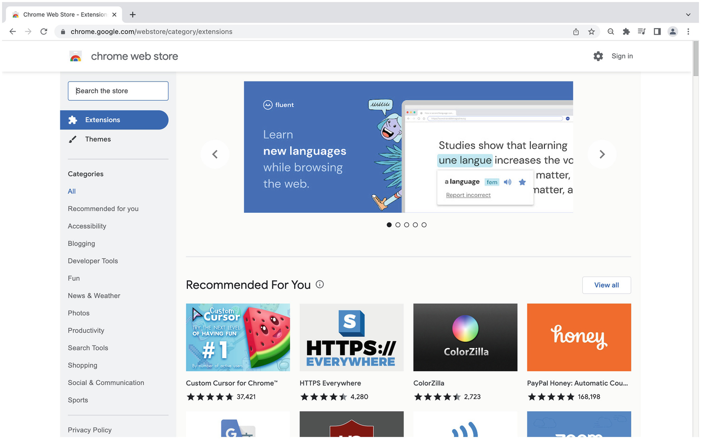
**Hình 15-2:** Trang web Chrome Web Store

### Add-ons for Firefox

[https://addons.mozilla.org/](https://addons.mozilla.org/)

Việc xuất bản các tiện ích mở rộng lên cửa hàng tiện ích mở rộng Firefox là hoàn toàn miễn phí (Hình 15-3).

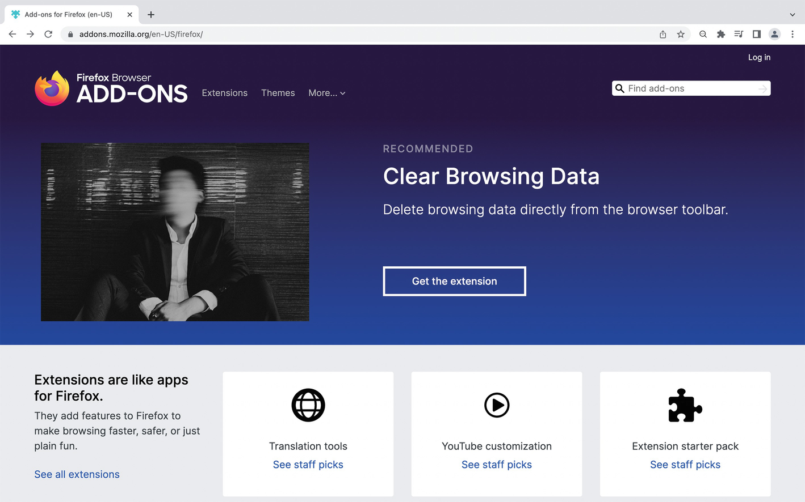
**Hình 15-3:** Trang web Firefox Add-ons

### Microsoft Edge Add-ons

[https://microsoftedge.microsoft.com/addons/Microsoft-Edge-Extensions-Home](https://microsoftedge.microsoft.com/addons/Microsoft-Edge-Extensions-Home)

Việc xuất bản các tiện ích mở rộng lên cửa hàng tiện ích mở rộng Microsoft Edge là hoàn toàn miễn phí (Hình 15-4).

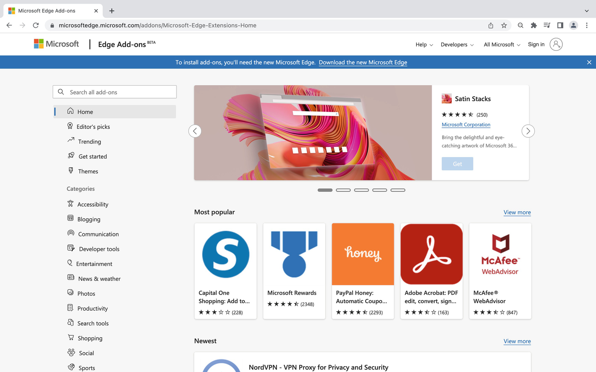
**Hình 15-4:** Trang web Microsoft Edge Add-ons

### Safari Extensions App Store

Cửa hàng Tiện ích mở rộng Safari chỉ có thể truy cập được thông qua trình duyệt Safari (Hình 15-5). Việc xuất bản một tiện ích mở rộng lên App Store yêu cầu Tài khoản Nhà phát triển Apple (Apple Developer Account) với mức phí 99 đô la/năm. Bạn cũng sẽ cần cài đặt Xcode để xây dựng tiện ích mở rộng và triển khai nó lên App Store.

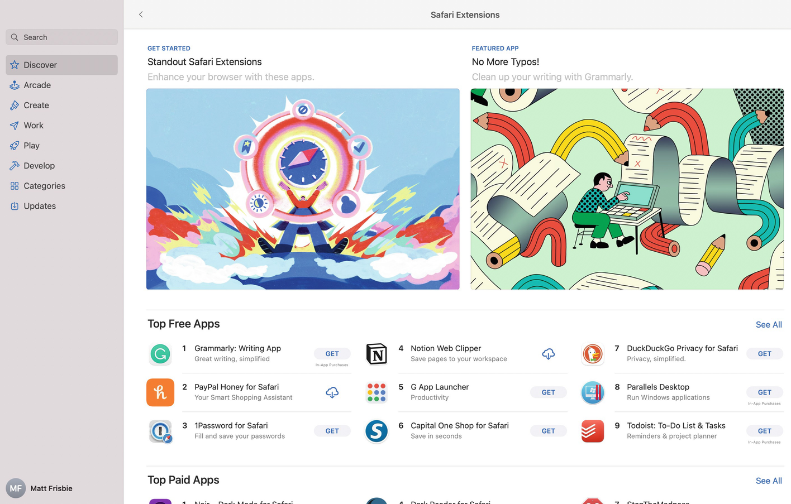
**Hình 15-5:** Cửa hàng Apple Safari Extensions App Store

### Opera Addons

[https://addons.opera.com/](https://addons.opera.com/)

Việc xuất bản các tiện ích mở rộng lên cửa hàng tiện ích mở rộng Opera là hoàn toàn miễn phí (Hình 15-6).

## Tiện ích mở rộng Di động (Mobile Extensions)

Hỗ trợ cho các tiện ích mở rộng bị hạn chế trên các thiết bị di động. Các trình duyệt lớn như Google Chrome không hỗ trợ nó trên bất kỳ hệ điều hành nào, và Apple cấm các trình duyệt không phải Safari cài đặt các tiện ích mở rộng của bên thứ ba trên iOS. Tuy nhiên, trên cả thiết bị Android và iOS, bạn vẫn có thể cài đặt tiện ích mở rộng trình duyệt nếu bạn sử dụng đúng trình duyệt. Hỗ trợ API trên thiết bị di động không đồng nhất.

### Giao diện Người dùng Tiện ích mở rộng Di động (Mobile Extension User Interfaces)

Liên quan đến hỗ trợ WebExtensions API, các trình duyệt di động cho phép tiện ích mở rộng nhìn chung có sự tương đồng với các phiên bản máy tính để bàn tương ứng. Các popup, trang tùy chọn, kịch bản nội dung và các trang nền đều sẽ chạy và hiển thị. Tuy nhiên, do yếu tố hình thức di động, có một số khác biệt về UX cần xem xét:

* Nút hành động trên thanh công cụ dùng để mở popup có thể truy cập thông qua nút menu của trình duyệt.
* Trang tùy chọn thường được truy cập thông qua nút "Cài đặt" trong chế độ xem quản lý của tiện ích mở rộng. Điều này khá khó tìm đối với người dùng, vì vậy đừng mong đợi đây là một điểm vào phổ biến.
* Các tiện ích mở rộng Safari được đóng gói dưới dạng ứng dụng. Do đó, chúng bao gồm một giao diện người dùng ứng dụng gốc bổ sung. Điều này được thảo luận sau trong chương này.
* Trên thiết bị di động, trang popup thường sẽ hiển thị dưới dạng một trang web độc lập (Firefox, Kiwi) hoặc dưới dạng một hộp thoại (modal) gốc (Safari).
* Trang tùy chọn sẽ luôn hiển thị dưới dạng trang web độc lập.

### Trình duyệt Kiwi (Kiwi Browser)

Nếu bạn đang tìm cách cài đặt tiện ích mở rộng Chrome trên thiết bị Android, giải pháp tốt nhất là sử dụng Trình duyệt Kiwi (Hình 15-7). Trình duyệt này dựa trên Webkit và Chromium, và bạn có thể cài đặt trực tiếp các tiện ích mở rộng từ Chrome Web Store. Việc sử dụng các tiện ích mở rộng trong trình duyệt Kiwi chỉ có thể thực hiện được trên Android.

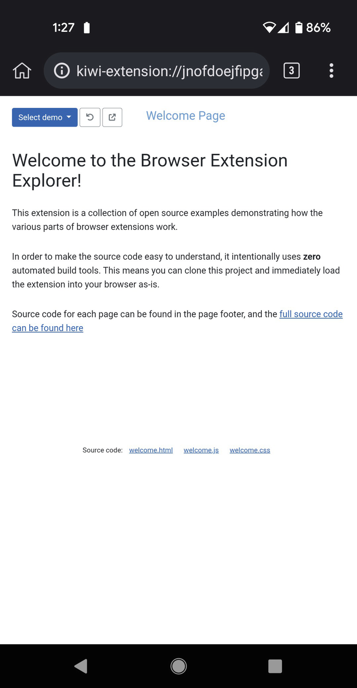
**Hình 15-7:** Trình duyệt Kiwi hiển thị một trang tiện ích mở rộng

### Firefox Mobile

Các tiện ích mở rộng được xuất bản trên cửa hàng Firefox có thể chọn để có thể cài đặt được cho Firefox mobile (Hình 15-8 và 15-9). Bạn có thể cài đặt trực tiếp các tiện ích mở rộng từ cửa hàng Firefox Add-ons. Các tiện ích mở rộng trên trình duyệt Firefox Mobile chỉ có thể thực hiện được trên Android.

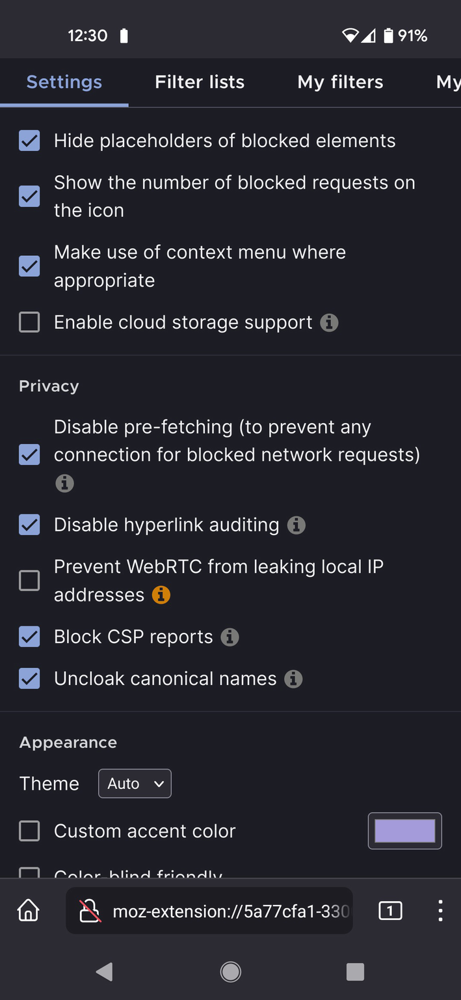
**Hình 15-8:** Trang tùy chọn uBlock Origin trong Firefox Mobile

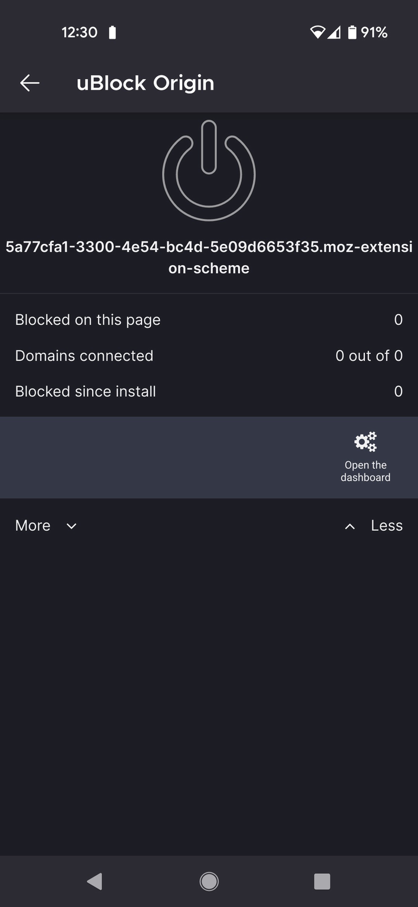
**Hình 15-9:** Trang popup uBlock Origin trong Firefox Mobile

### iOS Safari

Các tiện ích mở rộng Safari có thể được cài đặt trên các thiết bị iOS thông qua App Store. Chúng được cấu trúc khác với các tiện ích mở rộng di động khác. Việc xuất bản một tiện ích mở rộng Safari cho iOS đòi hỏi một nỗ lực đáng kể, nhưng cốt lõi nó vẫn bao gồm cùng một kiến trúc web như các tiện ích mở rộng máy tính để bàn khác (Hình 15-10 và 15-11).

> [!NOTE]
> Việc phát triển ứng dụng Safari được đề cập sâu hơn ở phần sau của chương này.

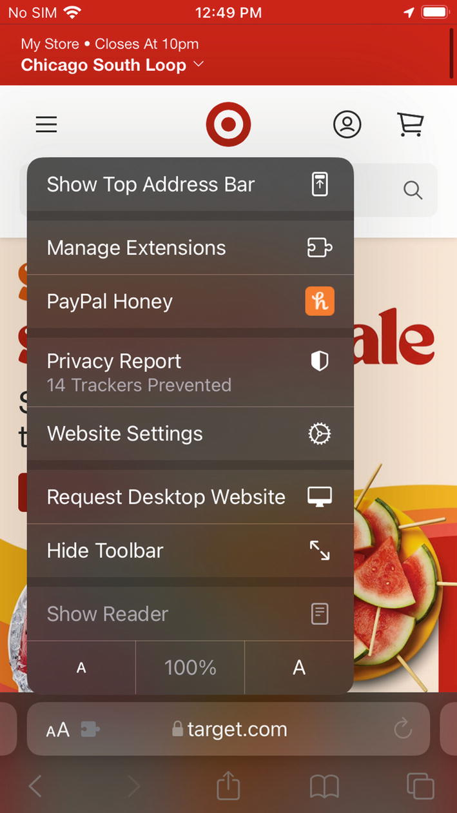
**Hình 15-10:** Menu trình duyệt Safari hiển thị các tùy chọn cho một Tiện ích mở rộng đã cài đặt

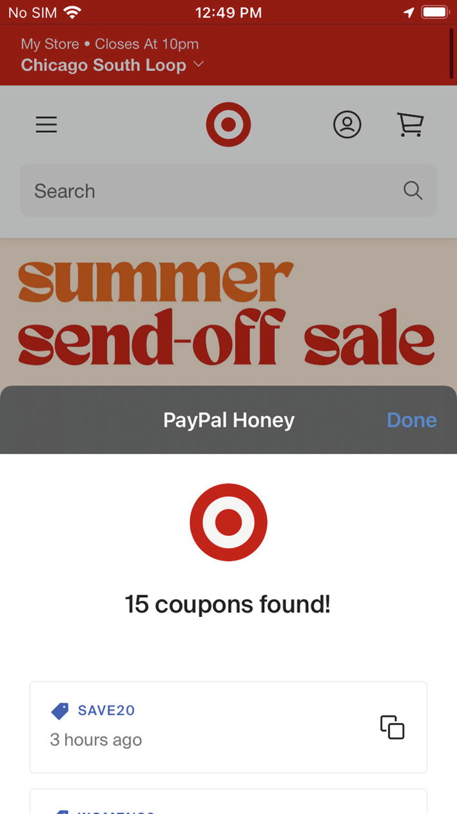
**Hình 15-11:** Một trang popup tiện ích mở rộng hiển thị trong trình duyệt iOS Safari

## Triển khai Tự động (Automated Deployment)

Tính đến năm 2022, tất cả các cửa hàng tiện ích mở rộng lớn đều hỗ trợ triển khai tự động. Chi tiết về việc triển khai đến từng cửa hàng nằm ngoài phạm vi của cuốn sách này, nhưng bạn có thể tìm thấy các liên kết đến tài liệu cho từng cửa hàng:

* **Chrome Web Store:** [https://developer.chrome.com/docs/webstore/api_index/](https://developer.chrome.com/docs/webstore/api_index/)
* **Microsoft Edge Add-ons Marketplace:** [https://docs.microsoft.com/en-us/microsoft-edge/extensions-chromium/publish/api/using-addons-api](https://docs.microsoft.com/en-us/microsoft-edge/extensions-chromium/publish/api/using-addons-api)
* **Firefox Add-ons Marketplace:** [https://addons-server.readthedocs.io/en/latest/topics/api/signing.html](https://addons-server.readthedocs.io/en/latest/topics/api/signing.html)
* **Apple App Store:** [https://developer.apple.com/documentation/appstoreconnectapi](https://developer.apple.com/documentation/appstoreconnectapi)

> [!TIP]
> Một số nền tảng phát triển tiện ích mở rộng như Plasmo ([https://www.plasmo.com/](https://www.plasmo.com/)) có thể tự động hóa việc triển khai tiện ích mở rộng của bạn đến các cửa hàng này.

## Hỗ trợ WebExtensions API (WebExtensions API Support)

Không phải tất cả các trình duyệt đều hỗ trợ đầy đủ WebExtensions API, và một số có hỗ trợ cho các tính năng API không được chuẩn hóa. Những điều này thay đổi liên tục, vì vậy cuốn sách này sẽ chỉ liên kết đến các trang sau liệt kê danh mục hỗ trợ API của từng trình duyệt:

* **Bảng MDN hiển thị hỗ trợ trên tất cả các trình duyệt:** [https://developer.mozilla.org/en-US/docs/Mozilla/Add-ons/WebExtensions/Browser_support_for_JavaScript_APIs](https://developer.mozilla.org/en-US/docs/Mozilla/Add-ons/WebExtensions/Browser_support_for_JavaScript_APIs)
* **Tham chiếu Google Chrome API:** [https://developer.chrome.com/docs/extensions/reference/](https://developer.chrome.com/docs/extensions/reference/)
* **Hỗ trợ Microsoft Edge API:** [https://docs.microsoft.com/en-us/microsoft-edge/extensions-chromium/developer-guide/api-support](https://docs.microsoft.com/en-us/microsoft-edge/extensions-chromium/developer-guide/api-support)
* **Khả năng tương thích Safari WebExtensions API:** [https://developer.apple.com/documentation/safariservices/safari_web_extensions/assessing_your_safari_web_extension_s_browser_compatibility](https://developer.apple.com/documentation/safariservices/safari_web_extensions/assessing_your_safari_web_extension_s_browser_compatibility)
* **Hỗ trợ Opera API:** [https://dev.opera.com/extensions/apis/](https://dev.opera.com/extensions/apis/)

## Phát triển Tiện ích mở rộng Safari (Safari Extension Development)

Các tiện ích mở rộng trình duyệt không phải Safari chỉ là HTML, JS, và CSS thô, và chúng có thể được tải trực tiếp vào trình duyệt. Việc triển khai tiện ích mở rộng trình duyệt của Safari cho phép bạn sử dụng một codebase HTML/JS/CSS, nhưng việc chạy codebase đó bên trong một thiết bị Apple đòi hỏi một lượng công việc bổ sung đáng kể. Phần này sẽ đề cập đến các bước bổ sung cần thiết để xây dựng một tiện ích mở rộng trình duyệt cho Safari.

> [!NOTE]
> Phần này giả định bạn đang xây dựng một tiện ích mở rộng Safari từ đầu, hoặc chuyển một codebase tiện ích mở rộng HTML/JS/CSS không phải Safari sang Safari.

### Điều kiện tiên quyết (Prerequisites)

Các tiện ích mở rộng trình duyệt Safari được phát triển và cài đặt dưới dạng ứng dụng và được xuất bản lên App Store. Do đó, chúng phải được xây dựng trên cơ sở hạ tầng phát triển ứng dụng của Apple. Bạn sẽ cần những thứ sau để phát triển và xuất bản một tiện ích mở rộng Safari:

* Một máy tính Mac có cài đặt Xcode để phát triển
* Một chứng chỉ nhà phát triển để ký mã của bạn (99 đô la/năm)

### Kiến trúc (Architecture)

Theo tài liệu nhà phát triển Safari:

> *Một tiện ích mở rộng web Safari bao gồm ba phần hoạt động độc lập trong môi trường hộp cát (sandboxed) của riêng chúng:*

* > *Một ứng dụng macOS hoặc iOS có thể có giao diện người dùng*

* > *Mã JavaScript và các tệp web hoạt động trong trình duyệt*

* > *Một tiện ích mở rộng ứng dụng gốc làm trung gian giữa ứng dụng macOS hoặc iOS và mã JavaScript*

Điều này nghe có vẻ khó hiểu lúc đầu. Để hiểu rõ hơn về cách từng phần này hoạt động cùng nhau, hãy tạo một dự án tiện ích mở rộng Xcode mới, cài đặt nó trên thiết bị Apple và phân tích từng phần.

### Tạo một Dự án Tiện ích mở rộng (Creating an Extension Project)

Trong Xcode, tạo một dự án mới bằng cách sử dụng mẫu "Safari Extension App". Đối với dự án đầu tiên của bạn, hãy chọn Swift làm ngôn ngữ (Hình 15-12, 15-13 và 15-14).

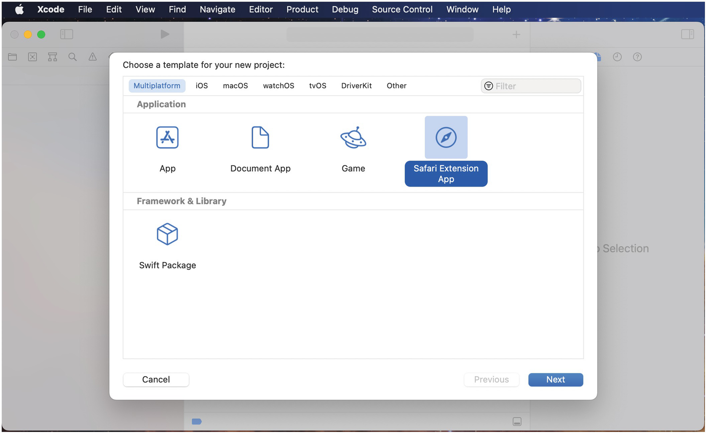
**Hình 15-12:** Mẫu Xcode Safari Extension App


**Hình 15-13:** Thiết lập các tùy chọn cho dự án mới

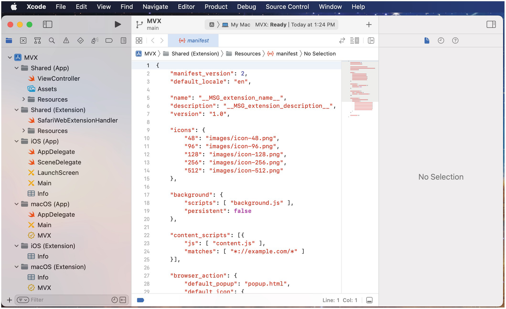
**Hình 15-14:** Mã dự án tiện ích mở rộng mới

> [!NOTE]
> Mẫu Xcode tạo ra một tiện ích mở rộng manifest v2, nhưng Safari cũng hỗ trợ manifest v3. Chúng ta có thể bỏ qua sự khác biệt này ngay bây giờ.

Hãy xem qua từng thư mục được tạo ra là gì:

* **iOS (App)** và **macOS (App)** là các ứng dụng chính thức mà hệ điều hành sẽ cài đặt. Trên iOS, nó sẽ hiển thị dưới dạng một ô ứng dụng trên màn hình chính. Phiên bản được tạo của các ứng dụng này chỉ là một web view đơn giản.
* **Shared (App)** là nội dung web view. Phiên bản được tạo chỉ là biểu tượng mặc định, một số văn bản và một nút.
* **iOS (Extension)** và **macOS (Extension)** là các tiện ích mở rộng ứng dụng gốc làm trung gian giữa JS và ứng dụng gốc.
* **Shared (Extension)** là mã tiện ích mở rộng chính thức: manifest.json và JS/CSS/HTML, tài sản, bản địa hóa (locales), v.v. Thư mục này cũng bao gồm một tệp ExtensionHandler swift được sử dụng để xử lý tin nhắn được gửi giữa JS và ứng dụng gốc.

> [!NOTE]
> Xcode có các mục tiêu xây dựng riêng biệt cho iOS và macOS. Điều này là hợp lý; mặc dù các ứng dụng này chia sẻ mã, nhưng bạn đang phát triển hai ứng dụng hoàn toàn riêng biệt cho hai nền tảng riêng biệt.

### Viết Ứng dụng (Writing the App)

Tiện ích mở rộng được tạo ra không làm được gì nhiều ngay khi xuất xưởng. Hãy sửa đổi nó để thực hiện những việc sau:

* Sử dụng manifest v3
* Trao đổi tin nhắn giữa popup, background, và content script
* Hiển thị một trang tùy chọn
* Gửi tin nhắn đến ứng dụng gốc

Cập nhật các tệp dự án XCode để khớp với mã sau:

Ví dụ 15-1a: **manifest.json**

```json
{
    "manifest_version": 3,
    "default_locale": "en",
    "name": "__MSG_extension_name__",
    "description": "__MSG_extension_description__",
    "version": "1.0",
    "icons": {
        "48": "images/icon-48.png",
        "96": "images/icon-96.png",
        "128": "images/icon-128.png",
        "256": "images/icon-256.png",
        "512": "images/icon-512.png"
    },
    "options_ui": {
      "page": "options.html"
    },
    "background": {
        "service_worker": "background.js"
    },
    "content_scripts": [{
        "js": [ "content.js" ],
        "matches": [ "<all_urls>" ]
    }],
    "action": {
        "default_popup": "popup.html",
        "default_icon": {
            "16": "images/toolbar-icon-16.png",
            "19": "images/toolbar-icon-19.png",
            "32": "images/toolbar-icon-32.png",
            "38": "images/toolbar-icon-38.png",
            "48": "images/toolbar-icon-48.png",
            "72": "images/toolbar-icon-72.png"
        }
    },
    "permissions": ["tabs", "nativeMessaging"],
    "host_permissions": ["<all_urls>"]
}
```

Ví dụ 15-1b: **options.html**

```html
<!DOCTYPE html>
<html>
<head>
    <meta name="viewport" content="width=device-width">
    <meta charset="UTF-8">
</head>
<body>
    <h1>I'm the options page!</h1>
</body>
</html>
```

Ví dụ 15-1c: **popup.html**

```html
<!DOCTYPE html>
<html>
<head>
    <meta charset="UTF-8">
    <link rel="stylesheet" href="popup.css">
    <script type="module" src="popup.js"></script>
</head>
<body>
    <h1>I'm the popup page!</h1>
    <button id="set-bg-color">Change background color</button>
    <button id="send-native-message">Send native message</button>
</body>
</html>
```

Ví dụ 15-1d: **popup.js**

```javascript
document.querySelector("#set-bg-color").addEventListener("click", () => {
  const randomColor = "#" + Math.floor(Math.random()*(2 ** 24 - 1)).toString(16);
  chrome.tabs.query({
    active: true,
    currentWindow: true
  }, (tabs) => {
    chrome.tabs.sendMessage(
      tabs[0].id,
      { backgroundColor: randomColor },
      (response) => console.log(response)
    );
  });
});

document.querySelector("#send-native-message").addEventListener("click", () => {
  chrome.runtime.sendNativeMessage(
    "com.matt-frisbie.MVX",
    {msg: "foobar"},
    (response) => console.log(response)
  );
});
```

Ví dụ 15-1e: **content.js**

```javascript
console.log('Content script initialized!');

chrome.runtime.sendMessage({ greeting: "hello" }).then((response) => {
  console.log("Content script received response: ", response);
});

chrome.runtime.onMessage.addListener((request, sender, sendResponse) => {
  console.log("Content script received request: ", request);
  console.log("Sender: ", sender);
  if (request.backgroundColor) {
    document.body.style.backgroundColor = request.backgroundColor;
  }
});
```

Ví dụ 15-1f: **background.js**

```javascript
chrome.runtime.onMessage.addListener((request, sender, sendResponse) => {
  console.log("Background received request: ", request);
  console.log("Sender: ", sender);

  if (request.greeting === "hello") {
    return sendResponse({ farewell: "goodbye" });
  }
});
```

Example 15-1g: **SafariWebExtensionHandler.swift**

```swift
import SafariServices
import os.log

let SFExtensionMessageKey = "message"

class SafariWebExtensionHandler: NSObject, NSExtensionRequestHandling {

    func beginRequest(with context: NSExtensionContext) {
        let item = context.inputItems[0] as! NSExtensionItem
        let message = item.userInfo?[SFExtensionMessageKey]
        os_log(.info, "MVX App received: %{public}@", message as! CVarArg)

        let response = NSExtensionItem()
        response.userInfo = [ SFExtensionMessageKey: [ "App response to": message ] ]

        context.completeRequest(returningItems: [response], completionHandler: nil)
    }
}
```

Hầu hết mã này khớp với những gì bạn đã thấy ở các phần khác trong cuốn sách này. Phần lớn, đây là thiết lập background/popup/options/content script thông thường cho một tiện ích mở rộng. Được in đậm trong mã (đã được chuyển thành các phần in đậm trong swift) là các phần cần thiết để gửi tin nhắn từ mã JavaScript tiện ích mở rộng đến mã Swift ứng dụng gốc. Một số điều cần lưu ý ở đây:

* Quyền đặc biệt `nativeMessaging` là cần thiết để gửi tin nhắn gốc.
* `chrome.runtime.sendNativeMessage` được sử dụng để gửi một tin nhắn gốc.
* Để nhắm mục tiêu một ứng dụng gốc, bạn phải sử dụng tên của ứng dụng gốc. Đối với các tiện ích mở rộng Safari, đây là App Bundle Identifier. Trong ví dụ này, định danh là `com.matt-frisbie.MVX`.

### Kiểm thử trên macOS (Testing on macOS)

> [!NOTE]
> Nếu bạn muốn phát triển tiện ích mở rộng Safari mà không cần ký ứng dụng, bạn sẽ cần cho phép Safari tải các tiện ích mở rộng chưa được ký. Để làm như vậy, chọn Safari ➤ Preferences, nhấp vào Advanced, sau đó chọn "Show Develop menu in menu bar." Tiếp theo, mở menu Develop và chọn "Allow unsigned extensions."

Đầu tiên chúng ta hãy kiểm tra cái này trên desktop Safari. Trong Xcode, xây dựng ứng dụng cho macOS (Hình 15-15).

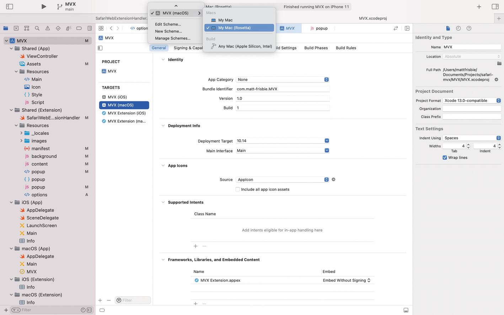
**Hình 15-15:** Xây dựng tiện ích mở rộng cho macOS

Khi bản xây dựng hoàn tất, bạn sẽ thấy ứng dụng tiện ích mở rộng mở ra (Hình 15-16).

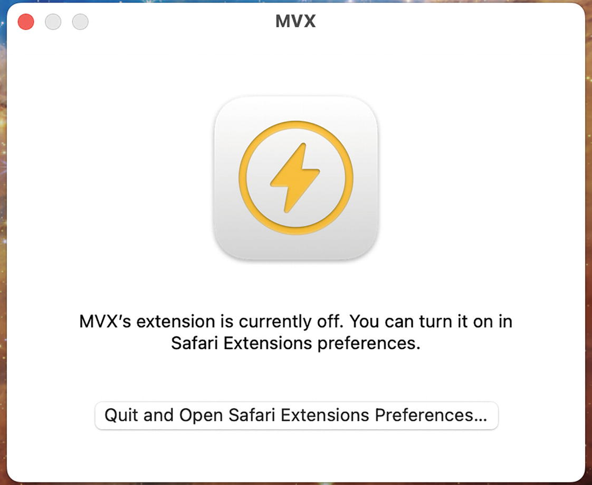
**Hình 15-16:** Ứng dụng tiện ích mở rộng macOS

Chế độ xem bạn đang thấy là ứng dụng OS gốc hiển thị một web view. Xcode sẽ tự động cài đặt tiện ích mở rộng cho Safari, vì vậy hãy nhấp vào nút "Quit and Open…" này để mở các tùy chọn của trình duyệt. Chọn hộp bên cạnh "MVX" để bật tiện ích mở rộng (Hình 15-17).

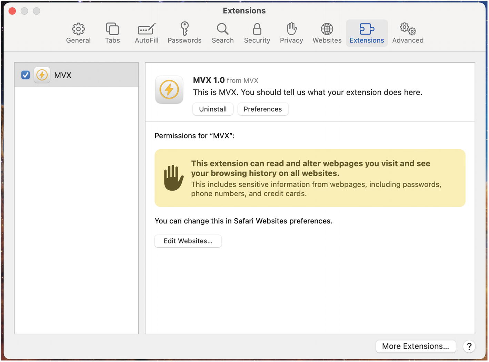
**Hình 15-17:** Tiện ích mở rộng Safari đã được bật

> [!NOTE]
> Ứng dụng này đang yêu cầu quyền máy chủ `<all_urls>`, vì vậy Safari sẽ yêu cầu bạn xác nhận quyền trước khi bật tiện ích mở rộng.

Nhấp vào nút "Preferences", và trang tùy chọn của bạn sẽ mở ra (Hình 15-18).

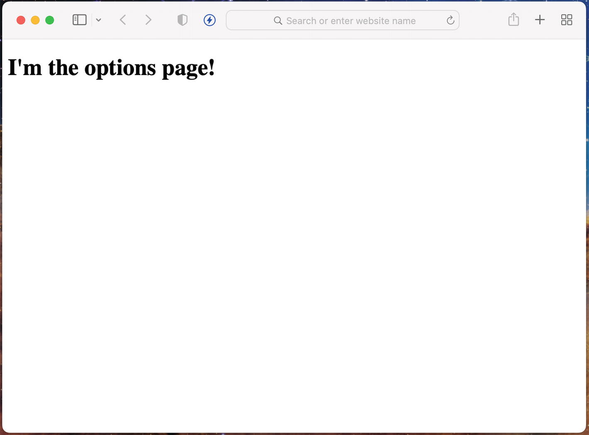
**Hình 15-18:** Trang tùy chọn

Tiếp theo, điều hướng đến một trang web hợp lệ như [wikipedia.org](http://wikipedia.org). Mở bảng điều khiển để xác minh kịch bản nội dung đang hoàn thành bắt tay tin nhắn với kịch bản nền (Hình 15-19).

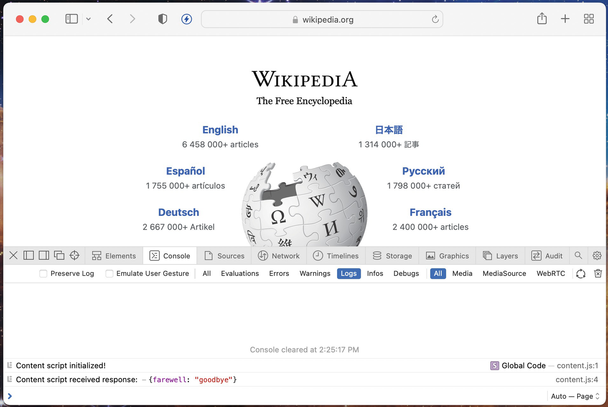
**Hình 15-19:** Nhật ký kịch bản nội dung

Biểu tượng tiện ích mở rộng mặc định là tia chớp được khoanh tròn, nhấp vào nó để mở trang popup. Nhấp vào "Change background color" để đặt nền thành một màu ngẫu nhiên. Bạn sẽ thấy kịch bản nội dung ghi lại tin nhắn nó nhận được (Hình 15-20).

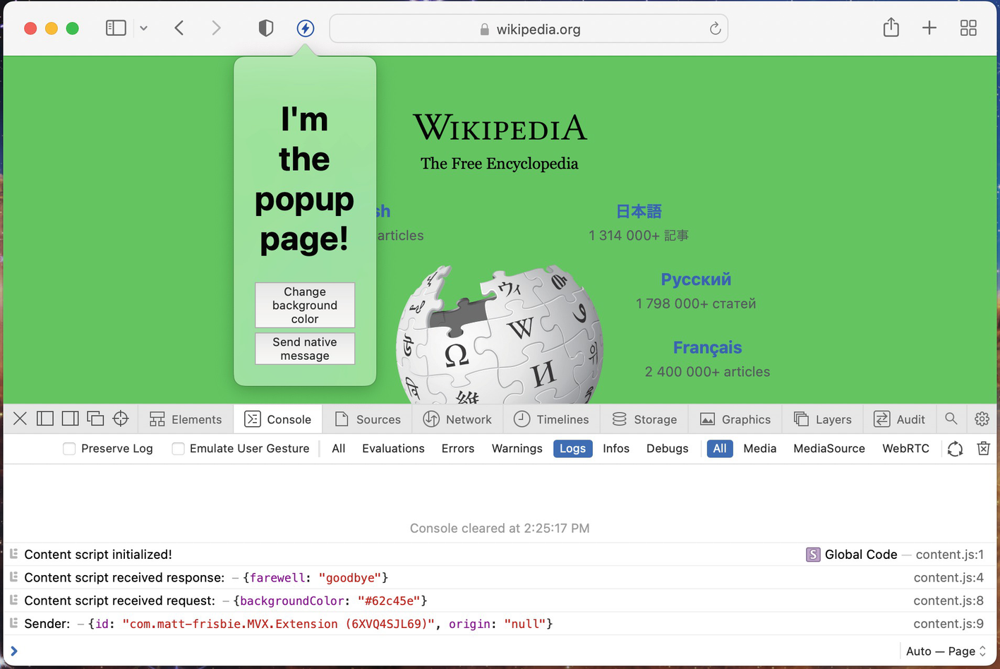
**Hình 15-20:** Trang popup sau khi thay đổi màu nền

Nút popup thứ hai sẽ gửi một tin nhắn đến ứng dụng nền. Để kiểm tra nhật ký cho ứng dụng nền, bạn sẽ cần mở ứng dụng macOS Console và lọc các tin nhắn từ tiện ích mở rộng. Lọc các tin nhắn từ quá trình MVX, và các tin nhắn chứa tin nhắn giả "foobar" của chúng ta. Ảnh chụp màn hình sau đây cho thấy đầu ra nhật ký bạn sẽ mong đợi thấy sau khi nhấp vào "Send native message" (Hình 15-21).

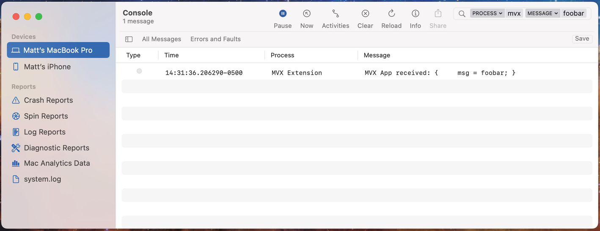
**Hình 15-21:** Đầu ra os_log từ ứng dụng gốc của tiện ích mở rộng macOS

### Kiểm thử trên iOS (Testing on iOS)

Trong Xcode, xây dựng ứng dụng cho iOS và sử dụng trình mô phỏng (Hình 15-22).

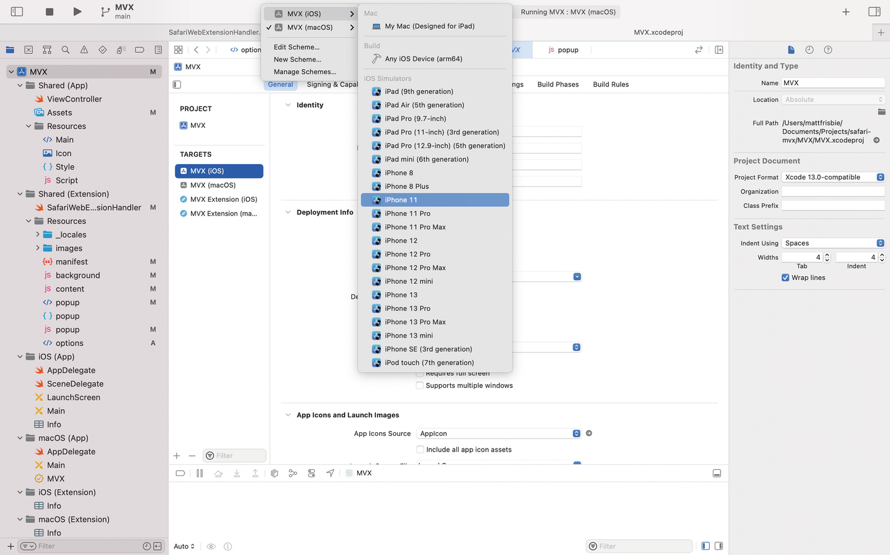
**Hình 15-22:** Xây dựng tiện ích mở rộng cho iOS và iPhone 11

Trình mô phỏng sẽ đưa bạn ngay vào ứng dụng gốc (Hình 15-23). Chế độ xem bạn đang thấy là ứng dụng OS gốc hiển thị một web view.

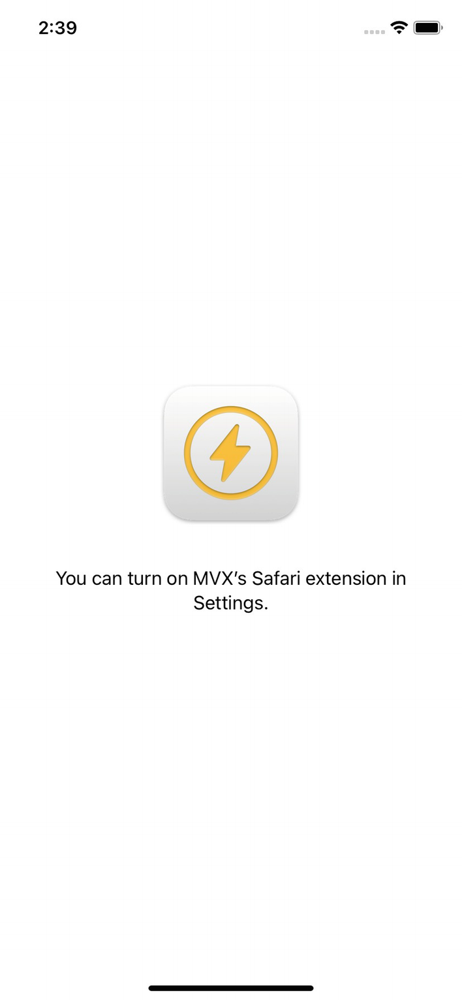
**Hình 15-23:** Ứng dụng iOS gốc

Xcode sẽ tự động cài đặt tiện ích mở rộng. Bạn có thể xem ứng dụng này bằng cách xem màn hình chính (Hình 15-24).


**Hình 15-24:** Ứng dụng tiện ích mở rộng trên màn hình chính

Các ứng dụng tiện ích mở rộng Safari có thể được quản lý bằng cách mở cài đặt Safari và chọn "Extensions" (Hình 15-25 và 15-26).

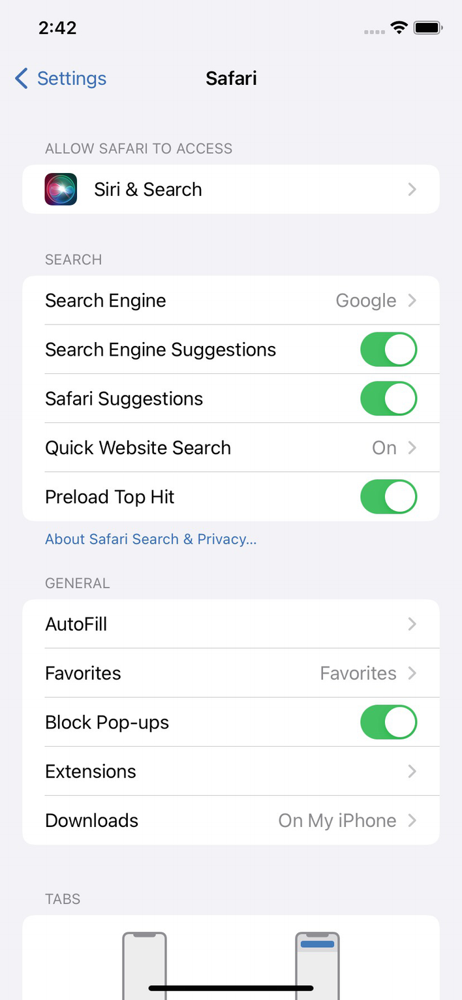
**Hình 15-25:** Cài đặt iOS Safari hiển thị tùy chọn "Extensions"

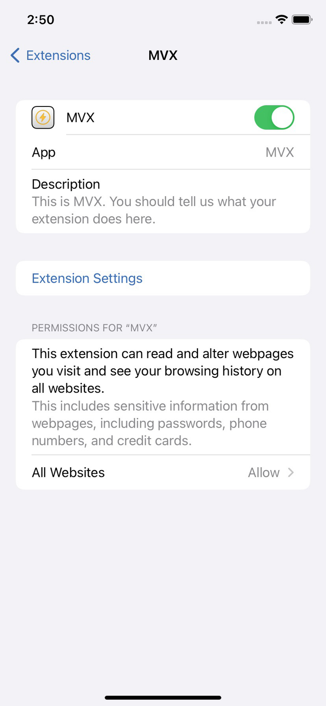
**Hình 15-26:** Trang chi tiết tiện ích mở rộng MVX trên iOS

Nhấp vào "Extension Settings" sẽ mở trang tùy chọn (Hình 15-27).

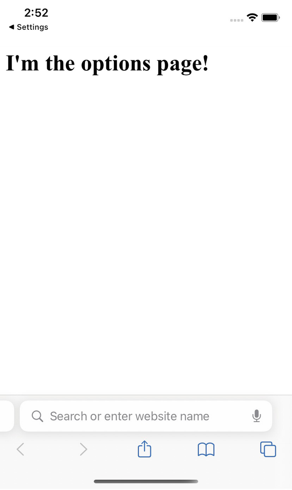
**Hình 15-27:** Trang tùy chọn trên iOS Safari

Tiếp theo, điều hướng đến một trang web hợp lệ như [wikipedia.org](http://wikipedia.org). Khi iOS Safari đã cài đặt các tiện ích mở rộng, thanh URL sẽ hiển thị một mảnh ghép. Nhấp vào đây để hiển thị menu, menu này sẽ chứa tùy chọn tiện ích mở rộng MVX (Hình 15-28).

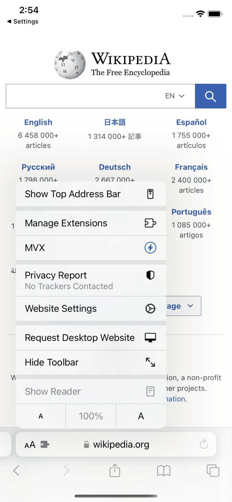
**Hình 15-28:** Các tùy chọn menu tiện ích mở rộng iOS Safari

Tùy chọn MVX này hoạt động như nút thanh công cụ, và việc chọn nó sẽ mở trang popup của tiện ích mở rộng. Nhấp vào nút "Change background color" để kiểm tra xem kịch bản nội dung có hoạt động hay không (Hình 15-29).

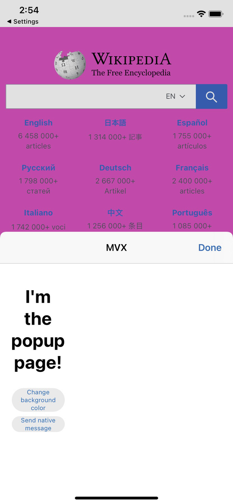
**Hình 15-29:** Trang popup sửa đổi màu nền của trang web

Bạn có thể theo dõi các tin nhắn nhật ký được tạo bằng cách nhấp vào nút "Send native message" thông qua ứng dụng Console theo cách tương tự như macOS Safari (Hình 15-30).

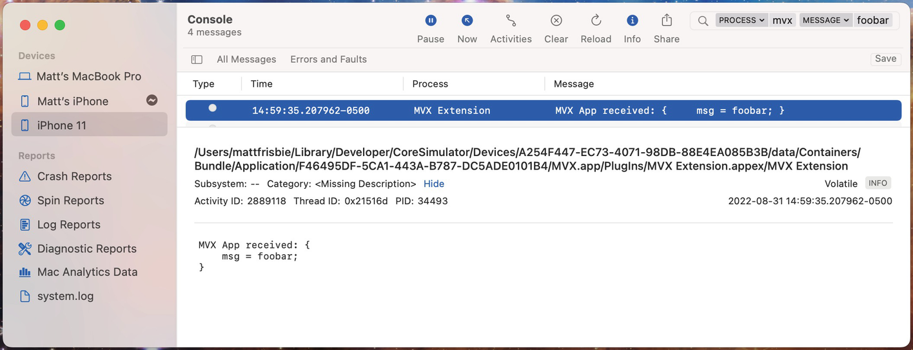
**Hình 15-30:** Đầu ra os_log từ ứng dụng gốc của tiện ích mở rộng iOS

### Triển khai lên App Store (Deploying to the App Store)

Bạn sẽ cần triển khai các ứng dụng riêng biệt cho iOS và macOS. Quá trình triển khai không khác gì so với việc xuất bản các ứng dụng iOS hoặc macOS thông thường. Ở mức độ cấp cao, bạn sẽ cần thực hiện các bước sau:

1. Tạo một bản lưu trữ dự án (project archive)
2. Xây dựng và ký bundle
3. Xác thực bundle
4. Đẩy lên App Store để bắt đầu quá trình phê duyệt

Một luồng triển khai macOS ví dụ được hiển thị trong các Hình 15-31, 15-32 và 15-33.

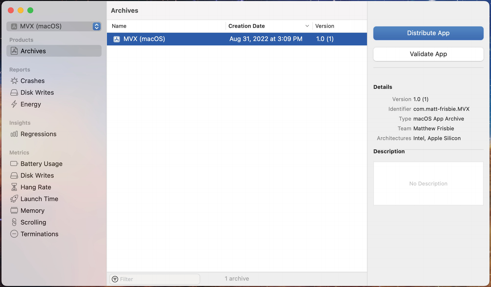
**Hình 15-31:** Bản lưu trữ dự án đã tạo được sử dụng để xuất bản

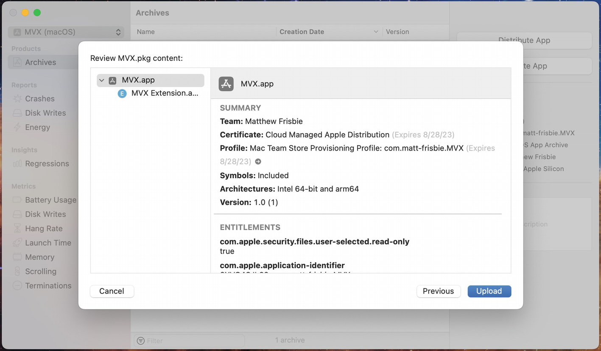
**Hình 15-32:** Dự án đã đóng gói sẵn sàng để xuất bản

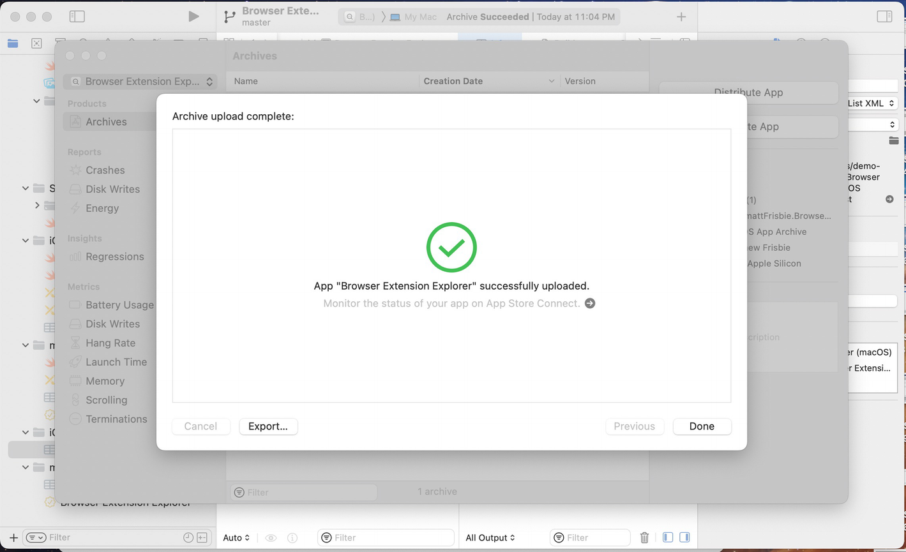
**Hình 15-33:** Một màn hình thành công ví dụ khi dự án của bạn được xuất bản thành công

### Chuyển đổi một Tiện ích mở rộng Hiện có (Converting an Existing Extension)

Xcode có tích hợp sẵn một tiện ích dòng lệnh sẽ tự động chuyển đổi codebase tiện ích mở rộng trình duyệt hiện có thành tiện ích mở rộng Safari. Lệnh sau sẽ tạo ra một dự án tiện ích mở rộng Xcode bao gồm các tệp hiện có của bạn:

```bash
xcrun safari-web-extension-converter /path/to/extension
```

> [!TIP]
> Chi tiết thêm về công cụ CLI này có thể được tìm thấy tại đây: [https://developer.apple.com/documentation/safariservices/safari_web_extensions/converting_a_web_extension_for_safari](https://developer.apple.com/documentation/safariservices/safari_web_extensions/converting_a_web_extension_for_safari).

## Những Đặc tính Riêng của Firefox (Firefox Idiosyncrasies)

Ngoài Safari, vốn đã được đề cập kỹ lưỡng trong phần mở rộng trước, hệ sinh thái addon của Firefox có một số khác biệt đáng chú ý mà bạn nên biết khi phát triển cho nó.

### Các Phiên bản Manifest (Manifest Versions)

Tại thời điểm cuốn sách này được viết, Firefox đang trong giai đoạn chuyển đổi. Tổ chức này đang cố gắng làm dịu quá trình chuyển đổi lộn xộn từ manifest v2 sang v3 bằng cách mở rộng hỗ trợ cho các API như `webRequestBlocking` mà các nhà phát triển mong muốn giữ lại. Tình trạng này có thể sẽ không kéo dài lâu trong tương lai, nhưng trong thời điểm hiện tại, hãy ghi nhớ những điều sau:

* Hiện tại, Firefox là trình duyệt lớn duy nhất không cho phép bạn tải các tiện ích mở rộng manifest v3 theo mặc định. Nó có thể được kích hoạt, nhưng hỗ trợ của nó không ổn định.
* Hiện tại, Firefox là webstore lớn duy nhất không chấp nhận các tiện ích mở rộng manifest v3.
* Firefox đã chỉ ra rằng họ sẽ áp dụng manifest v3, nhưng cũng bảo tồn các tính năng mà các nhà phát triển vẫn cần và sử dụng. Điều này cuối cùng sẽ trông như thế nào vẫn chưa rõ ràng.

Ngoài ra, khi manifest v3 cuối cùng được hỗ trợ, bạn sẽ cần một ID add-on trong manifest của mình. Tài liệu MDN bao gồm những điều sau:

> *Tất cả các tiện ích mở rộng Manifest V3 cần có ID add-on trong manifest.json của chúng khi gửi tới AMO. Ngược lại với các tiện ích mở rộng Manifest V2, AMO sẽ không chấp nhận các tiện ích mở rộng Manifest V3 không có ID và nó sẽ không tự động nhúng ID này vào tiện ích mở rộng đã đóng gói và ký.*

ID add-on được khai báo dưới `browser_specific_settings.gecko.id`. Ví dụ:

Tệp **manifest.json**

```json
{
  ...
  "browser_specific_settings": {
    "gecko": {
      "id": "browserextensionexplorer@buildingbrowserextensions.com"
    }
  },
  ...
}
```

> [!NOTE]
> Đọc thông báo của Mozilla tại đây: [https://blog.mozilla.org/addons/2022/05/18/manifest-v3-in-firefox-recap-next-steps/](https://blog.mozilla.org/addons/2022/05/18/manifest-v3-in-firefox-recap-next-steps/).

### Thanh bên (Sidebars)

Thanh bên Firefox là các vùng chứa do tiện ích mở rộng kiểm soát được định nghĩa tương tự như popup. Chúng được khai báo trong manifest dưới khóa `sidebar_action` và xuất hiện cùng với trang web đang hoạt động ở một trong hai bên (Hình 15-34).

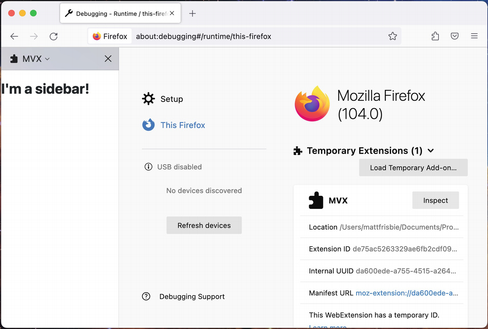
**Hình 15-34:** Một thanh bên Mozilla Firefox

### Các Bổ sung API (API Additions)

Firefox không giống như các trình duyệt khác ở chỗ nó thêm một số lượng đáng kể các API vào không gian tên API của tiện ích mở rộng:

* `captivePortal`
* `contextualIdentites`
* `dns`
* `find`
* `menus`
* `pcks11`
* `sidebarAction`
* `theme`
* `userScripts`

> [!TIP]
> Để có bản tóm tắt về những khác biệt API này, hãy tham khảo liên kết này: [https://developer.mozilla.org/en-US/docs/Mozilla/Add-ons/WebExtensions/Firefox_differentiators](https://developer.mozilla.org/en-US/docs/Mozilla/Add-ons/WebExtensions/Firefox_differentiators).

## Tóm tắt (Summary)

Trong chương này, chúng ta đã đề cập đến tất cả các khía cạnh phức tạp của việc tạo một tiện ích mở rộng hỗ trợ nhiều trình duyệt. Chúng ta đã thảo luận về cách một tiện ích mở rộng được xây dựng trên Chrome Web Store có thể hỗ trợ phần lớn các trình duyệt máy tính để bàn dựa trên dự án Chromium. Chúng ta cũng đã thảo luận về tất cả những nơi khác nhau mà bạn có thể triển khai một tiện ích mở rộng trình duyệt cũng như các cách khác nhau mà các tiện ích mở rộng có thể được sử dụng trên thiết bị di động.

Chương này cũng đề cập đến các đặc điểm riêng của các trình duyệt khác nhau. Nó mô tả chi tiết cách phát triển và xuất bản các tiện ích mở rộng cho Safari trên iOS và macOS, cũng như tất cả các khía cạnh độc đáo của việc phát triển cho Firefox.

Trong chương tiếp theo, chúng ta sẽ đề cập đến tất cả các công cụ, nền tảng và framework khác nhau mà bạn có thể sử dụng để làm cho việc phát triển và triển khai tiện ích mở rộng trở nên dễ dàng hơn.
