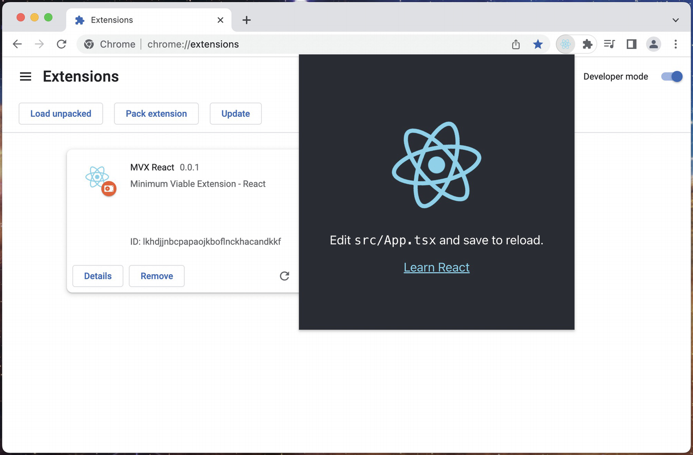
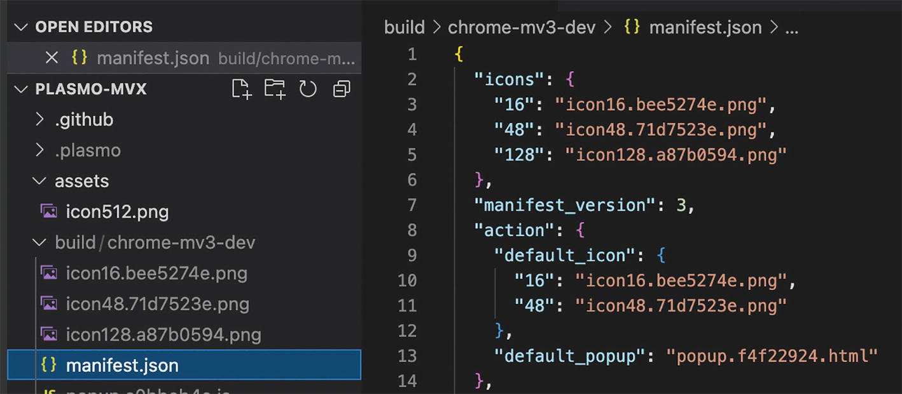
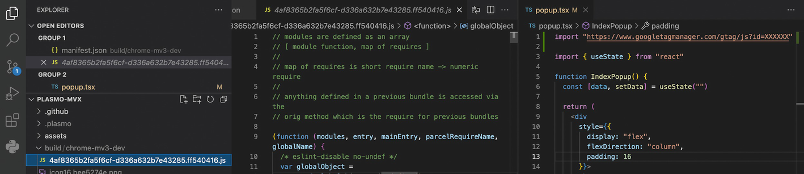
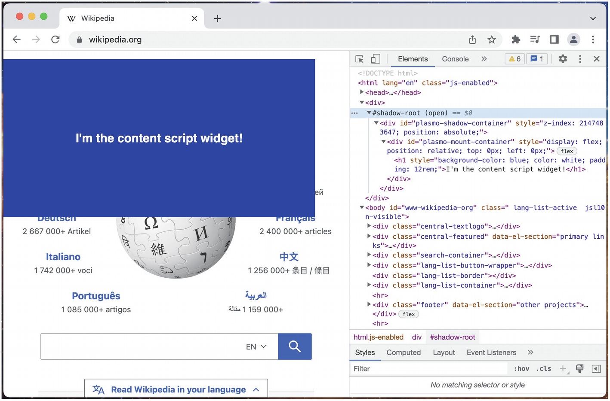

# Chương 16: Công cụ và Framework (Tooling and Frameworks)

Các tiện ích mở rộng trình duyệt hiện đại hiếm khi được viết từ đầu. Có rất nhiều công cụ dành cho nhà phát triển cho phép bạn xây dựng và kiểm thử các tiện ích mở rộng một cách hiệu quả trong framework JavaScript bạn chọn và xuất bản chúng lên nhiều cửa hàng tiện ích mở rộng một cách liền mạch.

## Xây dựng Tiện ích mở rộng với React (Building Extensions with React)

Đối với các nhà phát triển muốn xây dựng một tiện ích mở rộng trình duyệt với một framework JavaScript, sự lựa chọn phổ biến nhất là React. Cách bạn đưa React vào tiện ích mở rộng của mình sẽ phụ thuộc phần lớn vào phạm vi và độ phức tạp của ứng dụng. Một số điều cần xem xét:

* **Tiện ích mở rộng của bạn có một hay nhiều điểm vào (entrypoints)?** Ở đây, "điểm vào" có thể có nghĩa là một tệp HTML sẽ được tải (popup.html hoặc options.html), hoặc một giao diện người dùng được hiển thị thông qua một content script. Một điểm vào HTML duy nhất sẽ đơn giản hóa đáng kể kiến trúc của tiện ích mở rộng của bạn.
* **Giao diện người dùng tiện ích mở rộng của bạn có cần chia sẻ trạng thái giữa các chế độ xem khác nhau không?** Các tiện ích mở rộng chỉ có một cơ chế lưu trữ không đồng bộ được chia sẻ, điều này làm cho việc sử dụng các công cụ như Redux phức tạp hơn.
* **Tiện ích mở rộng của bạn có yêu cầu giao diện người dùng React bên trong một content script không?** Việc gắn (mount) một ứng dụng trang đơn (Single Page Application - SPA) vào trang khác với việc hiển thị nó bên trong một tệp HTML được kiểm soát.
* **Ứng dụng trang đơn của bạn sẽ sử dụng định tuyến (routing) như thế nào?** Content script, trang tùy chọn và trang popup đều có các cân nhắc về định tuyến khác nhau có thể ảnh hưởng đến cách bạn triển khai ứng dụng React của mình.

### Tiện ích mở rộng React Một Điểm vào (Single Entrypoint React Extensions)

Nếu tiện ích mở rộng của bạn chỉ yêu cầu một điểm vào duy nhất (chẳng hạn như popup hoặc options), thì việc sử dụng một ứng dụng được tạo bởi `create-react-app` (CRA) có thể là một lựa chọn tốt. Trong phần này, chúng ta sẽ thảo luận về cách tạo một tiện ích mở rộng rất đơn giản với CRA, và chúng ta cũng sẽ đề cập đến một số hạn chế khi sử dụng chiến lược này. Hãy bắt đầu bằng cách tạo một ứng dụng CRA với TypeScript:

```bash
npx create-react-app mvx-react --template typescript
```

Lệnh này sẽ tạo ra một cấu trúc ứng dụng cơ bản được thiết kế cho web. Chúng ta sẽ cần tùy chỉnh nó để làm cho nó có thể sử dụng được trong một tiện ích mở rộng. Bắt đầu bằng cách thêm các định nghĩa kiểu cho WebExtensions API:

```bash
yarn add @types/chrome -D
```

CRA tạo ra một `manifest.json` dành cho một ứng dụng web lũy tiến (PWA). Nó đã nằm trong thư mục `public`, vì vậy nó hoàn hảo để bạn tái sử dụng cho một manifest tiện ích mở rộng. Cập nhật tệp với nội dung sau:

Tệp **manifest.json**

```json
{
  "name": "MVX React",
  "description": "Minimum Viable Extension - React",
  "version": "0.0.1",
  "manifest_version": 3,
  "action": {
    "default_popup": "index.html"
  },
  "icons": {
    "16": "logo192.png",
    "48": "logo192.png",
    "128": "logo192.png"
  }
}
```

Một thay đổi cuối cùng là một chỉnh sửa CSS nhỏ. Vì cái này đang hiển thị bên trong container popup, chúng ta cần thực thi kích thước tối thiểu – nếu không trình duyệt sẽ thu gọn container theo kích thước của nội dung. Thêm các quy tắc sau vào `index.css`:

Tệp **index.css**

```css
body {
  ...
  width: 400px;
  min-height: 400px;
}
```

Cái này chưa sẵn sàng để chạy. Khi xây dựng ứng dụng của bạn, CRA sẽ cố gắng đặt JavaScript nội tuyến (inline) trong trang. Các tiện ích mở rộng manifest v3 cấm rõ ràng điều này, vì vậy bạn sẽ cần định cấu hình quy trình xây dựng CRA để chỉ tải các tập lệnh từ một URL. Bạn có thể ngăn CRA inlining các tập lệnh bằng cách đặt biến môi trường `INLINE_RUNTIME_CHUNK` thành `false`. Có một số cách để làm điều này, nhưng đơn giản nhất là chỉ cần thêm tiền tố vào các lệnh `package.json`:

Tệp **package.json**

```json
{
  "scripts": {
    "start": "INLINE_RUNTIME_CHUNK=false react-scripts start",
    "build": "INLINE_RUNTIME_CHUNK=false react-scripts build",
    "test": "react-scripts test",
    "eject": "react-scripts eject"
  },
  ...
}
```

Ứng dụng đã sẵn sàng để được cài đặt như một tiện ích mở rộng. Nếu chúng ta chạy nó như một trang web, chúng ta sẽ thực thi `npm run start` để khởi động một máy chủ phát triển. Tuy nhiên, vì manifest v3 cấm tải mã từ các nguồn từ xa – cụ thể là một máy chủ chạy trên `localhost:3000` – điều này sẽ không hoạt động. Thay vào đó, bạn sẽ cần thực thi `npm run build` và tải thư mục `build` vào trình duyệt. Khi quá trình xây dựng thành công, hãy tải tiện ích mở rộng vào trình duyệt và mở popup. Bạn sẽ thấy trang mặc định của CRA (Hình 16-1).


**Hình 16-1:** `create-react-app index.html` được hiển thị trong một popup

> [!TIP]
> Sử dụng `npm run build` là một giải pháp thay thế phù hợp cho các dự án nhỏ hơn, nhưng nó không phải là một giải pháp có thể mở rộng. Hãy đọc tiếp trong chương để biết các công cụ xây dựng tốt hơn.

### Tiện ích mở rộng React Nhiều Điểm vào (Multiple Entrypoint React Extensions)

Nếu ứng dụng của bạn có nhiều hơn một điểm vào, thì `create-react-app` có lẽ không phải là một giải pháp tốt cho bạn. Bạn sẽ cần một cấu hình phát triển hỗ trợ nhiều điểm vào độc lập, bao gồm các gói (bundle) JS và CSS độc lập. Hãy đọc tiếp trong chương để biết một số giải pháp tuyệt vời.

### Quản lý Trạng thái Phản ứng (Reactive State Management)

Khi quản lý trạng thái cho một ứng dụng trang đơn phức tạp, hầu hết các nhà phát triển sẽ tìm đến một container quản lý trạng thái phản ứng như Redux. Thường có lợi khi duy trì (persist) và khôi phục (rehydrate) trạng thái, cho phép ứng dụng duy trì sự nhất quán qua các lần tải lại. Có hai thách thức chính trong bối cảnh của các tiện ích mở rộng trình duyệt:

* Các API lưu trữ điển hình mà chúng ta thường sử dụng như `localStorage` hoặc `IndexedDB` không được chia sẻ giữa các phần của tiện ích mở rộng. Ví dụ, một popup ghi vào `localStorage` sẽ bị cô lập với một content script ghi vào `localStorage` vì các tập lệnh của chúng đang chạy trên các nguồn (origin) khác nhau!
* Cơ chế lưu trữ được chia sẻ duy nhất, `chrome.storage`, là không đồng bộ.

Thường thì bạn có thể chỉ cần chia sẻ một phần nhỏ trạng thái, chẳng hạn như dữ liệu xác thực, giữa nhiều chế độ xem tiện ích mở rộng. Những thứ như trạng thái định tuyến, dữ liệu được tải từ máy chủ và thông tin tập trung vào chế độ xem khác có khả năng bị ràng buộc với một chế độ xem tiện ích mở rộng cụ thể, và do đó việc duy trì nó trong một cái gì đó như `localStorage` có thể chấp nhận được. Ví dụ, một popup tải tùy chọn của người dùng từ máy chủ là an toàn để lưu trữ dữ liệu đó cục bộ nếu nó sẽ không được hiển thị ở bất kỳ nơi nào khác.

Trong các tình huống mà trạng thái phải được chia sẻ giữa các thành phần, có thể định cấu hình Redux để sử dụng `chrome.storage` làm kho lưu trữ không đồng bộ. Sự kiện `chrome.storage.onChanged` có nghĩa là mỗi chế độ xem có thể phản ứng với các chế độ xem khác đang thay đổi kho lưu trữ. Có hai kho lưu trữ GitHub phổ biến triển khai điều này:

* [https://github.com/ssorallen/redux-persist-webextension-storage](https://github.com/ssorallen/redux-persist-webextension-storage)
* [https://github.com/robinmalburn/redux-persist-chrome-storage](https://github.com/robinmalburn/redux-persist-chrome-storage)

> [!TIP]
> Nếu bạn không quen thuộc với Redux, hãy đọc về thư viện React Redux tại đây: [https://react-redux.js.org/](https://react-redux.js.org/).

### Định tuyến (Routing)

Khi quản lý trạng thái chế độ xem cho một ứng dụng trang đơn phức tạp, hầu hết các nhà phát triển sẽ tìm đến một giải pháp định tuyến như React Router. Có hai thách thức chính trong bối cảnh của các tiện ích mở rộng trình duyệt:

* Trong các chế độ xem như popup và trang tùy chọn, trình duyệt đang tải trực tiếp một tệp HTML, vì vậy việc sử dụng giải pháp định tuyến có sẵn sẽ dẫn đến các đường dẫn không hợp lệ như `index.html/foo/bar` sẽ bị lỗi khi tải lại.
* Trong các chế độ xem được hiển thị thông qua content script, bạn không nên sửa đổi thanh URL của trang máy chủ (host page). Giả sử trang máy chủ sẽ sử dụng hoàn toàn URL hash hoặc query string, điều này có thể phá vỡ mọi giá trị định tuyến mà bạn thêm vào nó.

May mắn thay, cả hai vấn đề này đều có các giải pháp đơn giản.

#### Các Chế độ xem Tiện ích mở rộng và HashRouter

Trên tất cả các trình duyệt, các chế độ xem tiện ích mở rộng có cấu trúc URL tương tự như sau:

```text
extension-protocol://path/to/file.html
```

Tất cả các bộ định tuyến ứng dụng trang đơn chính đều hỗ trợ một số dạng định tuyến URL hash, sẽ không can thiệp vào đường dẫn tiện ích mở rộng và có thể tồn tại qua các lần tải lại trang:

```text
extension-protocol://path/to/file.html#/your/app/route
```

Ví dụ, React Router có thể triển khai chiến lược định tuyến này bằng cách sử dụng `HashRouter`.

> [!TIP]
> Tài liệu về `HashRouter` có thể được tìm thấy tại đây: [https://v5.reactrouter.com/web/api/HashRouter](https://v5.reactrouter.com/web/api/HashRouter).

Nếu bạn muốn popup luôn mở URL gần đây nhất, bạn có thể cập nhật động URL popup của mình thông qua `chrome.action.setPopup()` và bao gồm tuyến hash.

#### Content Script và MemoryRouter

Đối với các chế độ xem hiển thị thông qua một content script, bạn có thể có một giao diện người dùng phức tạp có thể hưởng lợi từ việc định tuyến, nhưng việc sửa đổi thanh URL trang không phải là một tùy chọn. Tất cả các bộ định tuyến ứng dụng trang đơn chính đều hỗ trợ một số dạng định tuyến trong bộ nhớ (in-memory routing). Các bộ định tuyến này thường dành cho các ứng dụng gốc không có URL, nhưng chúng hoạt động tốt như nhau cho các chế độ xem content script của tiện ích mở rộng. React Router có thể triển khai chiến lược định tuyến này bằng cách sử dụng `MemoryRouter`.

Nếu bạn cần trạng thái bộ định tuyến của mình tồn tại qua các lần tải lại trang, bạn có thể duy trì trạng thái bộ định tuyến của mình trong trạng thái ứng dụng. Hãy lưu ý rằng bạn có thể cần tính đến nhiều trạng thái tuyến đường trên các tab khác nhau.

> [!TIP]
> Tài liệu về `MemoryRouter` có thể được tìm thấy tại đây: [https://v5.reactrouter.com/web/api/MemoryRouter](https://v5.reactrouter.com/web/api/MemoryRouter).

## Các Công cụ của Mozilla (Mozilla Tools)

Mozilla duy trì một bộ công cụ hướng tới việc phát triển các tiện ích mở rộng trình duyệt. Ở một mức độ nhất định, chúng hướng tới việc phát triển cho Firefox, nhưng nhìn chung chúng có thể được sử dụng hiệu quả để phát triển cho bất kỳ trình duyệt nào.

### web-ext

[https://github.com/mozilla/web-ext](https://github.com/mozilla/web-ext)

Dự án `web-ext` là một bộ công cụ CLI để phát triển và xuất bản các tiện ích mở rộng trình duyệt. Nó có các lệnh sau:

* `web-ext build` tạo gói tiện ích mở rộng từ mã nguồn
* `web-ext sign` ký tiện ích mở rộng để nó có thể được cài đặt trong Firefox
* `web-ext run` chạy tiện ích mở rộng
* `web-ext lint` xác thực mã nguồn tiện ích mở rộng
* `web-ext docs` mở tài liệu web-ext trong trình duyệt

Ngoài ra còn có một plugin Webpack bao bọc `web-ext` (không được duy trì bởi Mozilla):

[https://github.com/hiikezoe/web-ext-webpack-plugin](https://github.com/hiikezoe/web-ext-webpack-plugin)

Chạy riêng `webpack` sẽ xây dựng tiện ích mở rộng, thực chất là chạy `web-ext` build trên đầu ra của bản xây dựng Webpack của bạn.

### webextension-polyfill

[https://github.com/mozilla/webextension-polyfill](https://github.com/mozilla/webextension-polyfill)

Các trình duyệt đang dần chuyển WebExtensions API sang định dạng thân thiện với async/await, nhưng quá trình chuyển đổi vẫn chưa hoàn tất. Mozilla duy trì thư viện polyfill này để làm cho toàn bộ API trả về các promise, loại bỏ nhu cầu về callback.

## Các Công cụ Đóng gói và CLI (Bundlers and CLI Tools)

Khi phát triển các tiện ích mở rộng trình duyệt, tôi thực sự khuyên bạn nên sử dụng một số dạng phần mềm để hỗ trợ xây dựng và đóng gói tiện ích mở rộng – đặc biệt nếu bạn đang sử dụng một framework JavaScript như React, hoặc có một tiện ích mở rộng với nhiều điểm vào. Vì không gian tiện ích mở rộng và framework hiện đang trải qua một sự thay đổi lớn, có rất nhiều công cụ và kho lưu trữ ngoài kia đã lỗi thời: hoặc chúng chỉ nhắm mục tiêu manifest v2, hoặc không hỗ trợ các phiên bản mới hơn của các framework. Trong phần chọn lọc này, tôi đã chọn thủ công một số dự án đang được duy trì tích cực và có thể hỗ trợ phát triển các tiện ích mở rộng trình duyệt.

> [!WARNING]
> Một tính năng chính của các công cụ đóng gói (bundler) là Hot Module Replacement (HMR), khả năng hoán đổi nóng các phần của một ứng dụng khi nhà phát triển cập nhật các tệp nguồn. Đối với phát triển tiện ích mở rộng manifest v3, do các hạn chế về tập lệnh, điều này hoàn toàn không tương thích; bạn sẽ cần vô hiệu hóa HMR thông thường. Một số công cụ đóng gói làm lại HMR bằng cách thay đổi nó để tải lại tiện ích mở rộng theo lập trình.

### Parcel

[https://parceljs.org/](https://parceljs.org/)

Nếu bạn đang chọn một công cụ mã nguồn mở cho việc phát triển tiện ích mở rộng trình duyệt, Parcel cho đến nay là lựa chọn hàng đầu của tôi. Nó có hỗ trợ tuyệt vời cho manifest v3, nhiều điểm vào, TypeScript, React, Vue, và Sass.

Đối với các nhà phát triển đến từ thế giới của Webpack, Parcel có thể hơi gây hoang mang lúc đầu. Trong khi Webpack sử dụng một tệp cấu hình dày đặc để tổ chức cách nó sẽ xây dựng một ứng dụng, Parcel không có cấu hình (configuration-free). Thay vì một tệp cấu hình dài dòng, nó sử dụng các gói NPM được cấu hình sẵn cho phép Parcel hiểu ngầm cách xây dựng và đóng gói một ứng dụng.

công thức này, Parcel có thể phân tích tệp `manifest.json` của bạn để tìm các điểm vào. Sau đó, nó sẽ phân tích các tệp HTML đó để hiểu cách xây dựng các gói JS và CSS cho từng điểm vào riêng biệt.

Việc dịch từ các tiện ích mở rộng tệp chưa được biên dịch như TypeScript (.ts), React (.jsx/.tsx), Vue (.vue), và Sass (.scss) là tự động, nghĩa là bạn có thể trực tiếp sử dụng các tệp này trong manifest và các điểm vào HTML, và Parcel sẽ xử lý việc biên dịch và thay thế đường dẫn tệp cho bạn. Một số ví dụ:

Tệp **manifest.json**

```json
{
  ...
  "content_scripts": [
    {
      "matches": ["<all_urls>"],
      "js": ["content-script.tsx"],
      "css": ["content-script.scss"]
    }
  ],
  ...
}
```

Tệp **popup.html**

```html
<!DOCTYPE html>
<html lang="en">
  <head>
    <meta charset="UTF-8" />
    <meta name="viewport" content="width=device-width, initial-scale=1.0" />
    <link href="popup.scss" rel="stylesheet" />
  </head>
  <body>
    <div id="app"></div>
    <script type="module" src="popup.tsx"></script>
  </body>
</html>
```

> [!NOTE]
> Tham khảo tài liệu Parcel để biết hướng dẫn về cách thiết lập một dự án tiện ích mở rộng trình duyệt mới, cũng như phạm vi bao phủ của các tính năng khác: [https://parceljs.org/recipes/web-extension/](https://parceljs.org/recipes/web-extension/).

### Webpack

[https://webpack.js.org/](https://webpack.js.org/)

Webpack thường là lựa chọn hàng đầu cho phát triển trang web, và nó chắc chắn tiếp tục là một lựa chọn hợp lý cho phát triển tiện ích mở rộng trình duyệt. Không giống như Parcel, Webpack ưu tiên xác định hành vi một cách rõ ràng bên trong tệp cấu hình. Đối với các tiện ích mở rộng đặc biệt phức tạp, có thể có lợi cho bạn khi có khả năng quy định rõ ràng cách Webpack biên dịch và đóng gói các tệp tiện ích mở rộng của bạn. Webpack cũng có một cộng đồng lớn hơn đáng kể đằng sau nó, đây có thể là một cân nhắc quan trọng cho sự hỗ trợ lâu dài.

Đối với các nhà phát triển muốn bắt đầu với tệp cấu hình Webpack hướng tới việc xây dựng các tiện ích mở rộng trình duyệt manifest v3, tôi khuyên dùng một trong hai kho lưu trữ sau:

* [https://github.com/lxieyang/chrome-extension-boilerplate-react](https://github.com/lxieyang/chrome-extension-boilerplate-react)
* [https://github.com/sszczep/chrome-extension-webpack](https://github.com/sszczep/chrome-extension-webpack)

> [!WARNING]
> Có một số lượng tương đối lớn các kho lưu trữ GitHub chứa các mẫu tiện ích mở rộng Webpack đã lỗi thời. Các mẫu này nhắm mục tiêu các phiên bản Webpack cũ hơn hoặc bị giới hạn nghiêm ngặt ở manifest v2. Hãy cẩn thận khi chọn một kho lưu trữ khởi đầu, việc chuyển khỏi nó thường rất đau đớn.

## Plasmo

[https://www.plasmo.com/](https://www.plasmo.com/)

Trang web của Plasmo nói điều đó tốt nhất:

> *Plasmo là một nền tảng để phát triển các tiện ích mở rộng trình duyệt. Gửi các tiện ích mở rộng giống như gửi các trang web – NHANH CHÓNG.*

Có nhiều khía cạnh của quy trình phát triển và triển khai tiện ích mở rộng trình duyệt gây đau đớn, và Plasmo được thiết kế để ẩn tất cả những điều khó chịu đó dưới nắp capo. Như bạn sẽ thấy trong phần này, nó có một bộ tính năng mạnh mẽ giúp ẩn tất cả sự khó chịu của việc tạo nhiều phiên bản manifest, hỗ trợ các trình duyệt khác nhau và triển khai đến tất cả các cửa hàng tiện ích mở rộng.

> [!TIP]
> Vì tính dễ sử dụng, những người bảo trì tham gia tích cực, cộng đồng nhà phát triển năng động và bộ tính năng mạnh mẽ, tôi khuyên bạn nên sử dụng Plasmo hơn bất kỳ thứ gì khác để phát triển tiện ích mở rộng trình duyệt.

### Tổng quan Cấp cao (High-level Overview)

Framework Plasmo xây dựng các khái niệm trừu tượng có quan điểm (opinionated abstractions) dựa trên Parcel giúp cải thiện đáng kể trải nghiệm phát triển tiện ích mở rộng. Giống như Parcel, Plasmo có triết lý thiết kế tuân theo quy ước hơn là cấu hình (convention-over-configuration). Ví dụ, nếu bạn muốn thêm một trang tùy chọn vào tiện ích mở rộng của mình, bạn chỉ cần tạo một thành phần React `options.tsx` trong thư mục gốc của dự án, và Plasmo sẽ làm phần còn lại: tự động biên dịch tệp đó thành các tài sản JS/CSS/HTML, tạo ra một `manifest.json` mới với tệp HTML mới làm trang tùy chọn và tải lại tiện ích mở rộng.

> [!TIP]
> Plasmo cực kỳ dễ bắt đầu sử dụng ngay lập tức. Hãy xem hướng dẫn *Get Started* của họ tại đây: [https://docs.plasmo.com/#getting-started](https://docs.plasmo.com/#getting-started).

### Các Framework JavaScript (JavaScript Frameworks)

Plasmo không có quan điểm khi nói đến các framework JavaScript. Nó hỗ trợ React, Vue và Svelte. Theo mặc định, lệnh CLI `init` sẽ tạo ra một ứng dụng React, nhưng việc chuyển đổi sang một framework khác là chuyện nhỏ:

* Để sử dụng Vue, hãy cài đặt gói `vue` và thay đổi các tệp của bạn để sử dụng phần mở rộng `.vue` (ví dụ: `popup.vue`).
* Để sử dụng Svelte, hãy cài đặt `svelte` và `svelte-preprocess`, khởi tạo tệp `svelte.config.js` của bạn và thay đổi các tệp của bạn để sử dụng phần mở rộng `.svelte` (ví dụ: `popup.svelte`).

### Tài liệu và Ví dụ (Documentation and Examples)

Tài liệu tồi từ lâu đã là một cái gai trong mắt việc phát triển tiện ích mở rộng. Các phiên bản manifest không nhất quán, phạm vi bao phủ API lốm đốm hoặc không rõ ràng, và các ví dụ không nhất quán. Plasmo có tài liệu *rất* mạnh mẽ và đầy đủ:

[https://docs.plasmo.com/](https://docs.plasmo.com/)

Tài liệu của Plasmo cũng bao gồm một bộ sưu tập "quickstarts", là các hướng dẫn chi tiết về cách kết hợp các thư viện phổ biến. Điều này đặc biệt hữu ích cho các nhà phát triển như tôi, vì hai điều đầu tiên tôi làm trong một dự án mới là cài đặt và thiết lập Tailwind và Redux.

[https://docs.plasmo.com/quickstarts](https://docs.plasmo.com/quickstarts)

Đối với các nhà phát triển thích học bằng ví dụ, tài khoản GitHub của Plasmo có một bộ sưu tập lớn các ví dụ giải thích cách hoàn thành các tác vụ phổ biến:

[https://github.com/PlasmoHQ/examples](https://github.com/PlasmoHQ/examples)

### Đầu ra Xây dựng Khác biệt (Differential Build Outputs)

Plasmo có một số tính năng CLI rất hữu ích để tạo các bản xây dựng ứng dụng. Nó có khả năng tạo cả đầu ra manifest v2 và manifest v3 bằng cờ dòng lệnh, như sau:

```bash
# Tạo thư mục build/chrome-dev-mv3/
pnpm dev --target=chrome-mv3

# Tạo thư mục build/firefox-dev-mv2/
pnpm dev --target=firefox-mv2

# Tạo thư mục build/chrome-prod-mv3/
pnpm build --target=chrome-mv3

# Tạo thư mục build/firefox-prod-mv2/
pnpm build --target=firefox-mv2
```

> [!NOTE]
> `chrome-mv3` là mục tiêu mặc định

Hơn nữa, Plasmo có thể tạo một tệp zip của các bản xây dựng này có thể được chuyển trực tiếp cho các cửa hàng tiện ích mở rộng. Điều này được thực hiện với cờ `--zip`:

```bash
# Tạo tệp build/chrome-prod-mv3.zip
pnpm build --zip

# Tạo tệp build/firefox-prod-mv2.zip
pnpm build --target=firefox-mv2 --zip
```

### Tạo Manifest Tự động (Automatic Manifest Generation)

Thay vì tự viết tệp `manifest.json`, Plasmo tạo manifest dựa trên các tệp nguồn và cấu hình bạn xuất từ mã của mình – tương tự như cách Next.js trừu tượng hóa định tuyến trang và SSG với hệ thống tệp và các thành phần trang.

Các giá trị trong `package.json` của dự án của bạn thường sẽ dư thừa với các giá trị tương ứng trong manifest tiện ích mở rộng của bạn. Plasmo sẽ tự động sao chép các giá trị từ `package.json` vào `manifest.json`:

* `packageJson.version -> manifest.version`
* `packageJson.displayName -> manifest.name`
* `packageJson.description -> manifest.description`
* `packageJson.author -> manifest.author`
* `packageJson.homepage -> manifest.homepage_url`

### Tạo Biểu tượng (Icon Generation)

Các tiện ích mở rộng trình duyệt hiển thị biểu tượng của nó trên khắp trình duyệt và các biểu tượng phải được liệt kê một cách tẻ nhạt ở nhiều nơi bên trong manifest. Như được hiển thị bên dưới, Plasmo sẽ lấy một biểu tượng nguồn 512x512 duy nhất trong thư mục `assets/`, tạo nhiều biểu tượng đã thay đổi kích thước và tự động đưa chúng vào manifest ở bất kỳ đâu cần thiết (Hình 16-2).


**Hình 16-2:** Tạo biểu tượng động từ một hình ảnh tài sản duy nhất

### Đóng gói Mã Từ xa (Bundling Remote Code)

Trong manifest v3, việc tải và thực thi mã từ xa bị nghiêm cấm. Để giải quyết vấn đề này, Plasmo sẽ phân tích các câu lệnh `import` của bạn cho các tài sản được lưu trữ từ xa, tìm nạp chúng và đóng gói chúng bên trong tiện ích mở rộng. Trong ảnh chụp màn hình sau, chúng ta có thể thấy rằng `popup.tsx` đang nhập JavaScript Google Tag Manager từ xa và tệp được tự động đưa vào thư mục `build/chrome-mv3-dev/` (Hình 16-3).


**Hình 16-3:** Plasmo tự động đóng gói `gtag.js` vào tiện ích mở rộng

### Biến Môi trường (Environment Variables)

Plasmo có một giải pháp trực quan cho các biến môi trường dựa trên gói NPM `dotenv`. Các biến môi trường có thể được đặt trong tệp `.env` trong thư mục gốc của dự án và chúng sẽ trở nên khả dụng:

* Trong JavaScript thông qua không gian tên `process.env`
* Trong các URL `import`
* Trong các ghi đè manifest `package.json`

Các đoạn mã sau đây minh họa từng điều này:

Tệp **.env**

```env
PLASMO_PUBLIC_FOO=foo
PLASMO_PUBLIC_GTAG_ID=123456789
PLASMO_PUBLIC_CRX_PUBLIC_KEY=asdf-1234-asdf-1234
```

Tệp **popup.tsx**

```tsx
import "https://www.googletagmanager.com/gtag/js?id=$PLASMO_PUBLIC_GTAG_ID"

function IndexPopup() {
  return <div>{process.env.PLASMO_PUBLIC_FOO}</div>;
}
export default IndexPopup
```

Tệp **package.json** (đang lẽ là manifest.json nhưng Plasmo dùng package.json để override) -> *Correction: The source says manifest.json override via package.json usually or direct usage inside manifest.json if Plasmo generates it. The listing showed manifest.json syntax but with variable substitution.*

Tệp **manifest.json** (được override)

```json
{
  "key": "$CRX_PUBLIC_KEY"
}
```

> [!NOTE]
> Plasmo phản ánh quy ước tệp `.env` của Next.js với các quy tắc hậu tố `.local`, `.production`, và `.development`. Đọc thêm tại đây: [https://docs.plasmo.com/workflows/env](https://docs.plasmo.com/workflows/env).

### Gắn Content Script (Content Script Mounting)

Việc đưa (inject) một giao diện người dùng vào một content script thường yêu cầu một số bước khởi động (bootstrapping), và Plasmo thực hiện tất cả điều này cho bạn dưới dạng *Content Script UI*. Bạn có thể xác định thành phần của mình trong tệp `content.*` với định nghĩa `PlasmoContentScript`. Plasmo sẽ tự động thêm mục `content_scripts` tương ứng vào manifest của bạn. Sau đây là một ví dụ về điều này:

Tệp **content.tsx**

```tsx
import type { PlasmoContentScript } from "plasmo"

export const config: PlasmoContentScript = {
  matches: ["<all_urls>"]
}

function IndexContentUI() {
  return (
    <h1
      style={{
        backgroundColor: "blue",
        color: "white",
        padding: "12rem"
      }}>
      I'm the content script widget!
    </h1>
  )
}

export default IndexContentUI
```

Widget này sẽ được tiêm vào mọi trang web. Lưu ý bên dưới rằng Plasmo đang tiêm thành phần bên trong một container Shadow DOM để ngăn chặn sự can thiệp của CSS (Hình 16-4).


**Hình 16-4:** Widget content script đã tiêm bên trong Shadow DOM

### Thay thế Mô-đun Nóng thân thiện với Tiện ích mở rộng (Extension-friendly Hot Module Replacement)

Manifest v3 không cho phép HMR truyền thống, nhưng Plasmo cung cấp một cái gì đó tương tự. Khi phát triển tiện ích mở rộng của bạn, Plasmo tiêm một trình lắng nghe web socket vào bản xây dựng phát triển của tiện ích mở rộng. Bất cứ khi nào thay đổi gói xảy ra, Plasmo sẽ gửi thông báo làm mới và nó sẽ thực thi `chrome.runtime.reload()` hoặc `location.reload()` tùy thuộc vào ngữ cảnh. Mặc dù điều này không hoàn toàn giống với HMR, nhưng nó vẫn cho phép bạn xem các cập nhật mã trong thời gian thực.

### Triển khai Tự động với Browser Platform Publish

Plasmo đi kèm với một GitHub action được gọi là Browser Platform Publish (BPP) sẽ tự động xuất bản các bản cập nhật tiện ích mở rộng của bạn lên tất cả các cửa hàng tiện ích mở rộng trình duyệt được hỗ trợ. Việc thiết lập BPP bao gồm các bước sau:

1. **Thực hiện xuất bản ban đầu tiện ích mở rộng của bạn lên từng cửa hàng.** Bạn sẽ cần một tiện ích mở rộng hiện có trên mỗi cửa hàng trước khi bạn có thể sử dụng BPP để xuất bản các bản cập nhật.
2. **Tạo thông tin xác thực cho từng cửa hàng.** Các cửa hàng tiện ích mở rộng cho phép bạn tạo mã thông báo xác thực để tự động ký và xuất bản các bản cập nhật. Bạn sẽ cần làm điều này cho từng cửa hàng.
3. **Cung cấp thông tin xác thực cho BPP.** Khi bạn đã có được thông tin xác thực cho từng cửa hàng, bạn sẽ cung cấp nó cho hành động GitHub BPP dưới dạng khóa bí mật kho lưu trữ (repository secret) được mã hóa.

Khi thiết lập một lần này được thực hiện, bạn sẽ có thể đẩy các bản cập nhật lên tất cả các cửa hàng tiện ích mở rộng một cách liền mạch cùng một lúc. Các liên kết sau cung cấp thêm chi tiết về ngữ cảnh về cách thiết lập và sử dụng BPP:

* Chi tiết về việc lấy thông tin xác thực: [https://github.com/PlasmoHQ/bms/blob/main/tokens.md](https://github.com/PlasmoHQ/bms/blob/main/tokens.md)
* Trang GitHub action cho BPP: [https://github.com/marketplace/actions/browser-platform-publisher](https://github.com/marketplace/actions/browser-platform-publisher)
* Kho lưu trữ GitHub BPP: [https://github.com/PlasmoHQ/bpp](https://github.com/PlasmoHQ/bpp)
* Giới thiệu về việc sử dụng BPP: [https://docs.plasmo.com/workflows/submit](https://docs.plasmo.com/workflows/submit)

## Các Trang web Hữu ích (Useful Sites)

* [https://buildingbrowserextensions.com](https://buildingbrowserextensions.com) là trang web đồng hành của cuốn sách này. Nó bao gồm một liên kết đến Browser Extension Explorer, một tiện ích mở rộng Chrome bao gồm các bản demo mã nguồn mở cho mỗi API tiện ích mở rộng.
* [https://developer.chrome.com/](https://developer.chrome.com/) là trang web chính thức của Chrome để giúp bạn xây dựng Tiện ích mở rộng, xuất bản trên Chrome Web Store, tối ưu hóa trang web của bạn, v.v.
* [https://extensionworkshop.com/](https://extensionworkshop.com/) giúp tạo và xuất bản các add-on Firefox giúp duyệt web thông minh hơn, an toàn hơn và nhanh hơn. Bạn sẽ tìm thấy các tài nguyên mình cần, cho dù bạn mới bắt đầu phát triển tiện ích mở rộng, chuẩn bị ra mắt sự đổi mới của mình hay phát triển giải pháp doanh nghiệp tùy chỉnh.
* [https://webext.eu/](https://webext.eu/) nhanh chóng tạo các mẫu tiện ích mở rộng trình duyệt chỉ với vài cú nhấp chuột. Nó được duy trì bởi Mozilla. Nó rất tiện dụng để tạo mẫu nhanh các tiện ích mở rộng.

## Tóm tắt (Summary)

Trong chương này, chúng ta đã thảo luận về nhiều công cụ tự động hóa mà bạn có thể sử dụng để tăng tốc và đơn giản hóa việc phát triển tiện ích mở rộng. Đầu tiên, chúng ta đã thảo luận về cách React có thể được định cấu hình để phù hợp gọn gàng vào một dự án tiện ích mở rộng, cũng như cách tích hợp một số thư viện React phổ biến. Tiếp theo, chúng ta đã đề cập đến nhiều công cụ xây dựng mã nguồn mở phổ biến có thể được sử dụng để quản lý sự phức tạp vốn có của các tiện ích mở rộng trình duyệt. Cuối cùng, chúng ta đã đề cập đến tất cả các tính năng khác nhau mà nền tảng Plasmo cung cấp.
